# 第六章：Docker 与 Kubernetes 知识体系可视化

> 本章通过多种图表和可视化方式，全面呈现 Docker 和 Kubernetes 的技术体系，帮助读者建立系统性的知识框架。

---

## 目录

- [第六章：Docker 与 Kubernetes 知识体系可视化](#第六章docker-与-kubernetes-知识体系可视化)
  - [目录](#目录)
  - [1. 思维导图](#1-思维导图)
    - [1.1 Docker/K8s 知识体系全景图](#11-dockerk8s-知识体系全景图)
    - [1.2 K8s 学习路径图（从入门到专家）](#12-k8s-学习路径图从入门到专家)
    - [1.3 云原生技术栈全景](#13-云原生技术栈全景)
  - [2. 决策树](#2-决策树)
    - [2.1 容器运行时选型决策树](#21-容器运行时选型决策树)
    - [2.2 CNI 插件选型决策树](#22-cni-插件选型决策树)
    - [2.3 存储方案选型决策树](#23-存储方案选型决策树)
    - [2.4 服务网格选型决策树](#24-服务网格选型决策树)
    - [2.5 故障排查决策树](#25-故障排查决策树)
      - [Pod 启动失败排查](#pod-启动失败排查)
      - [网络不通排查](#网络不通排查)
  - [3. 语法语义树](#3-语法语义树)
    - [3.1 YAML 配置结构树](#31-yaml-配置结构树)
      - [Pod 配置结构](#pod-配置结构)
      - [Deployment 配置结构](#deployment-配置结构)
      - [Service 配置结构](#service-配置结构)
    - [3.2 API 对象层次关系树](#32-api-对象层次关系树)
    - [3.3 Label 与 Selector 匹配树](#33-label-与-selector-匹配树)
  - [4. UML 图](#4-uml-图)
    - [4.1 类图：核心 API 对象关系](#41-类图核心-api-对象关系)
    - [4.2 时序图](#42-时序图)
      - [Pod 创建完整流程](#pod-创建完整流程)
      - [Service 请求处理流程](#service-请求处理流程)
      - [ConfigMap 更新传播流程](#configmap-更新传播流程)
    - [4.3 状态图](#43-状态图)
      - [Pod 生命周期状态转换](#pod-生命周期状态转换)
      - [Deployment 滚动更新状态](#deployment-滚动更新状态)
    - [4.4 组件图：K8s 系统组件关系](#44-组件图k8s-系统组件关系)
    - [4.5 部署图：多环境部署架构](#45-部署图多环境部署架构)
  - [5. 场景应用图](#5-场景应用图)
    - [5.1 微服务架构图：典型电商系统](#51-微服务架构图典型电商系统)
    - [5.2 CI/CD 流水线图：GitOps 工作流](#52-cicd-流水线图gitops-工作流)
    - [5.3 可观测性架构图](#53-可观测性架构图)
    - [5.4 多集群架构图](#54-多集群架构图)
    - [5.5 边缘计算架构图](#55-边缘计算架构图)
  - [6. 谱系图](#6-谱系图)
    - [6.1 技术演进时间线](#61-技术演进时间线)
    - [6.2 CNCF 项目全景](#62-cncf-项目全景)
    - [6.3 K8s 版本演进重要特性](#63-k8s-版本演进重要特性)
  - [7. 对比分析图](#7-对比分析图)
    - [7.1 容器 vs 虚拟机 vs Wasm 对比矩阵](#71-容器-vs-虚拟机-vs-wasm-对比矩阵)
    - [7.2 各类 CNI 插件性能对比](#72-各类-cni-插件性能对比)
    - [7.3 服务网格功能对比](#73-服务网格功能对比)
  - [8. 数据流图](#8-数据流图)
    - [8.1 请求在 K8s 集群中的完整流转](#81-请求在-k8s-集群中的完整流转)
    - [8.2 配置更新传播路径](#82-配置更新传播路径)
    - [8.3 事件驱动数据流](#83-事件驱动数据流)
  - [附录：图表速查表](#附录图表速查表)
    - [Mermaid 图表类型速查](#mermaid-图表类型速查)
    - [常用 K8s 资源关系速查](#常用-k8s-资源关系速查)

---

## 1. 思维导图

### 1.1 Docker/K8s 知识体系全景图

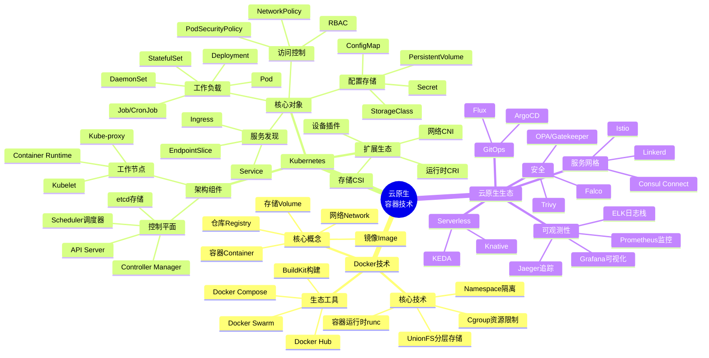

**图表解释**：

这张思维导图呈现了云原生容器技术的完整知识体系，分为三大主干：

- **Docker 技术**：从核心概念（镜像、容器、仓库）到底层技术（Namespace、Cgroup、UnionFS），再到生态工具链
- **Kubernetes**：详细展示了控制平面和工作节点的组件，以及各类核心 API 对象
- **云原生生态**：涵盖可观测性、服务网格、GitOps、Serverless 和安全等关键领域

---

### 1.2 K8s 学习路径图（从入门到专家）

```mermaid
graph TD
    subgraph 入门阶段[入门阶段 - 1-2周]
        A1[容器基础] --> A2[Docker操作]
        A2 --> A3[Dockerfile编写]
        A3 --> A4[多容器应用]
        A4 --> A5[Docker Compose]
    end

    subgraph 基础阶段[基础阶段 - 2-3周]
        B1[K8s架构理解] --> B2[kubectl命令]
        B2 --> B3[Pod生命周期]
        B3 --> B4[Deployment管理]
        B4 --> B5[Service暴露]
        B5 --> B6[ConfigMap/Secret]
    end

    subgraph 进阶阶段[进阶阶段 - 3-4周]
        C1[StatefulSet有状态] --> C2[DaemonSet守护]
        C2 --> C3[Job批处理]
        C3 --> C4[存储管理PV/PVC]
        C4 --> C5[网络策略]
        C5 --> C6[RBAC权限]
    end

    subgraph 高级阶段[高级阶段 - 4-6周]
        D1[Helm包管理] --> D2[Operator开发]
        D2 --> D3[CRD自定义资源]
        D3 --> D4[调度器定制]
        D4 --> D5[准入控制器]
        D5 --> D6[API聚合]
    end

    subgraph 专家阶段[专家阶段 - 持续]
        E1[集群性能调优] --> E2[大规模集群设计]
        E2 --> E3[多集群联邦]
        E3 --> E4[服务网格集成]
        E4 --> E5[安全加固]
        E5 --> E6[源码贡献]
    end

    A5 --> B1
    B6 --> C1
    C6 --> D1
    D6 --> E1

    style 入门阶段 fill:#e1f5fe
    style 基础阶段 fill:#fff3e0
    style 进阶阶段 fill:#e8f5e9
    style 高级阶段 fill:#fce4ec
    style 专家阶段 fill:#f3e5f5
```

**学习路径说明**：

| 阶段 | 时长 | 核心目标 | 关键技能 |
|------|------|----------|----------|
| 入门阶段 | 1-2周 | 掌握容器基础 | Dockerfile、Compose、镜像管理 |
| 基础阶段 | 2-3周 | 理解K8s核心 | Pod、Deployment、Service |
| 进阶阶段 | 3-4周 | 掌握高级资源 | StatefulSet、存储、网络、RBAC |
| 高级阶段 | 4-6周 | 深入扩展机制 | Helm、Operator、CRD、调度器 |
| 专家阶段 | 持续 | 系统架构能力 | 性能调优、多集群、安全、源码 |

---

### 1.3 云原生技术栈全景

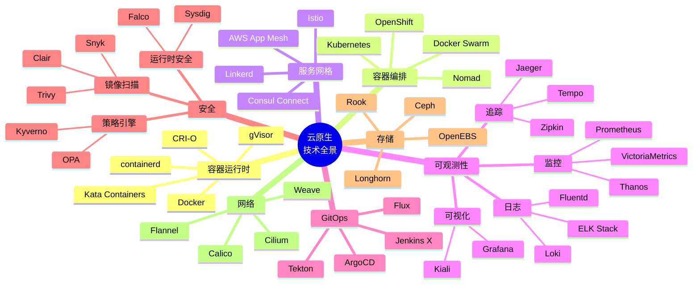

---

## 2. 决策树

### 2.1 容器运行时选型决策树

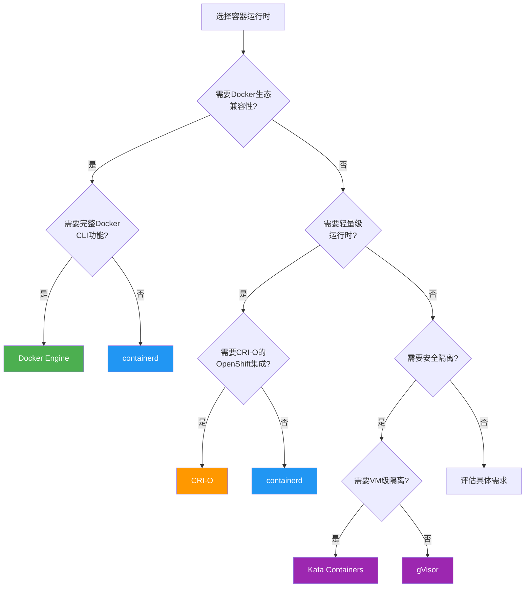

**选型对比表**：

| 运行时 | 适用场景 | 资源占用 | 安全隔离 | 启动速度 | K8s支持 |
|--------|----------|----------|----------|----------|---------|
| Docker | 开发测试、传统应用 | 中等 | 进程级 | 快 | 优秀 |
| containerd | 生产环境、云原生 | 低 | 进程级 | 快 | 优秀 |
| CRI-O | OpenShift、红帽生态 | 低 | 进程级 | 快 | 优秀 |
| Kata | 多租户、高安全要求 | 高 | VM级 | 较慢 | 良好 |
| gVisor | 不可信代码运行 | 中等 | 沙箱级 | 中等 | 良好 |

---

### 2.2 CNI 插件选型决策树

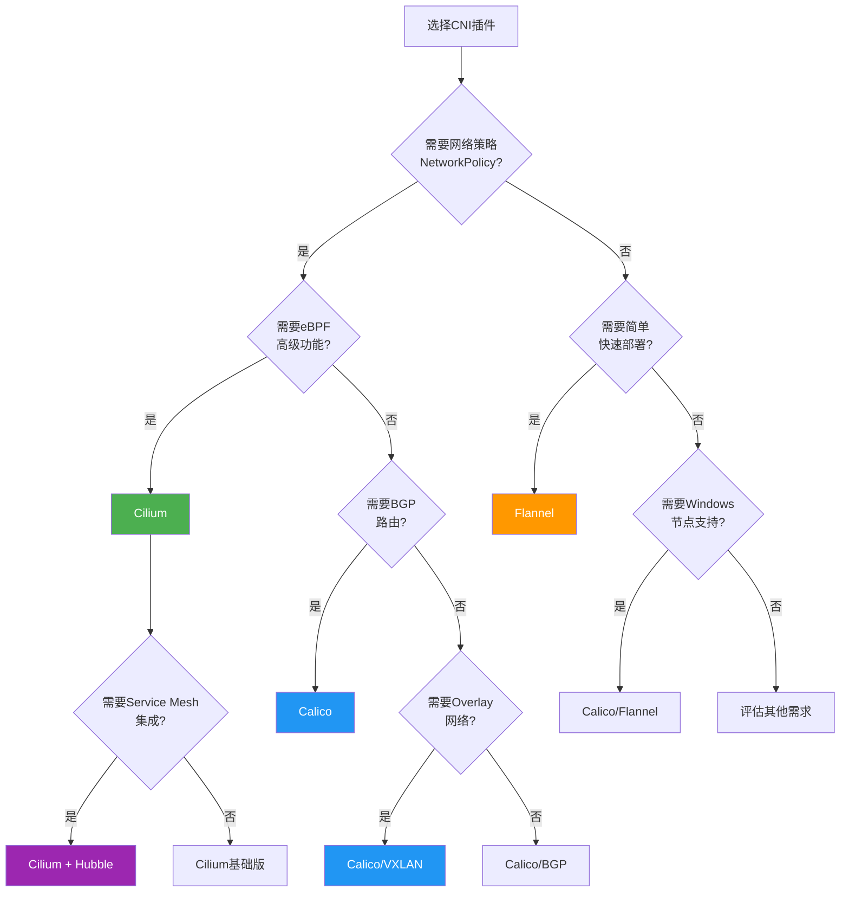

**CNI 插件对比**：

| 插件 | 网络模式 | 策略支持 | 性能 | 复杂度 | 最佳场景 |
|------|----------|----------|------|--------|----------|
| Calico | BGP/VXLAN | 优秀 | 高 | 中 | 大规模生产 |
| Cilium | eBPF/XDP | 优秀 | 极高 | 高 | 云原生高级场景 |
| Flannel | VXLAN/UDP | 无 | 中 | 低 | 小型集群、测试 |
| Weave | Overlay | 良好 | 中 | 低 | 多主机Docker |
| Antrea | OVS | 优秀 | 高 | 中 | VMware生态 |

---

### 2.3 存储方案选型决策树

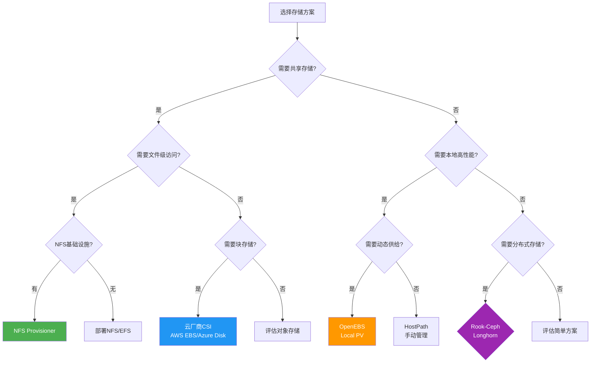

---

### 2.4 服务网格选型决策树

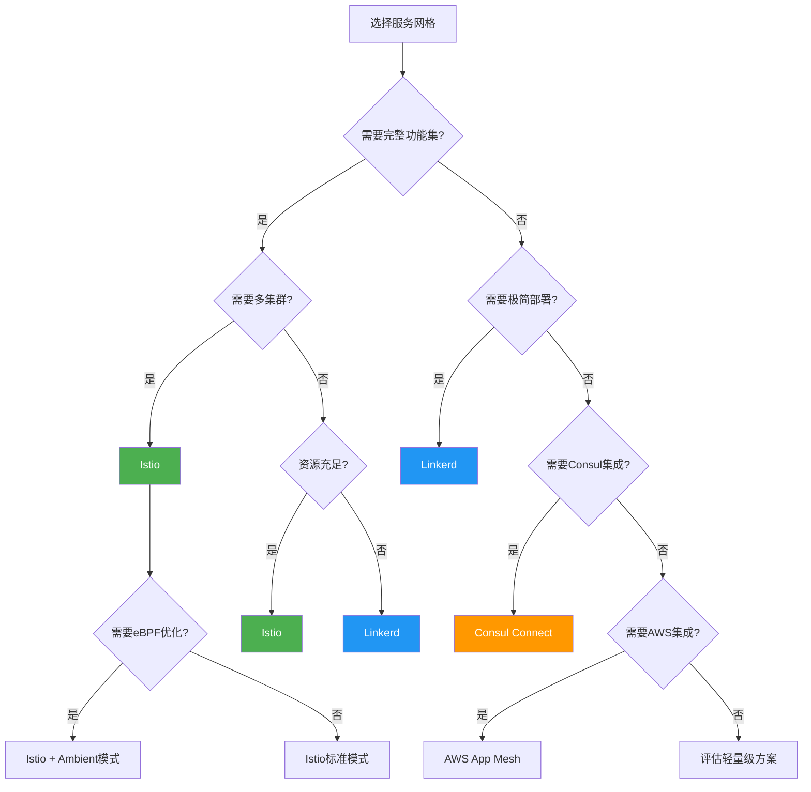

---

### 2.5 故障排查决策树

#### Pod 启动失败排查

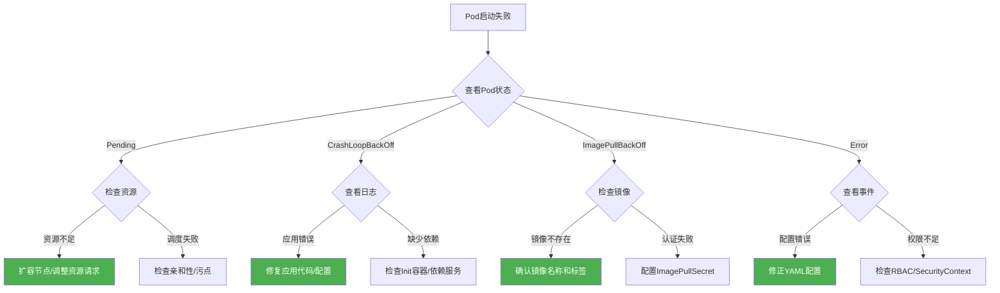

#### 网络不通排查

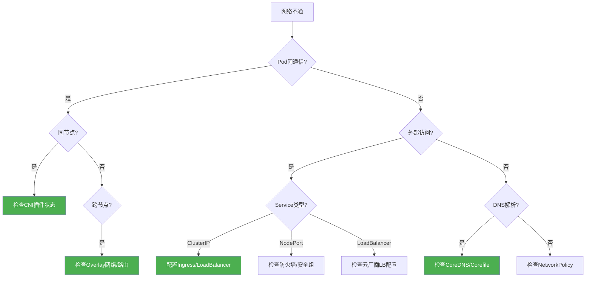

---

## 3. 语法语义树

### 3.1 YAML 配置结构树

#### Pod 配置结构

```mermaid
graph TD
    Pod[Pod] --> Metadata[metadata]
    Pod --> Spec[spec]
    Pod --> Status[status]

    Metadata --> Name[name]
    Metadata --> Namespace[namespace]
    Metadata --> Labels[labels]
    Metadata --> Annotations[annotations]

    Spec --> Containers[containers[]]
    Spec --> InitContainers[initContainers[]]
    Spec --> Volumes[volumes[]]
    Spec --> NodeSelector[nodeSelector]
    Spec --> Affinity[affinity]
    Spec --> Tolerations[tolerations[]]
    Spec --> SecurityContext[securityContext]

    Containers --> ContainerName[name]
    Containers --> Image[image]
    Containers --> Command[command]
    Containers --> Args[args]
    Containers --> Ports[ports[]]
    Containers --> Env[env[]]
    Containers --> Resources[resources]
    Containers --> VolumeMounts[volumeMounts[]]
    Containers --> LivenessProbe[livenessProbe]
    Containers --> ReadinessProbe[readinessProbe]
    Containers --> StartupProbe[startupProbe]

    Resources --> Limits[limits]
    Resources --> Requests[requests]
    Limits --> CPULimit[cpu]
    Limits --> MemoryLimit[memory]

    Status --> Phase[phase]
    Status --> Conditions[conditions[]]
    Status --> PodIP[podIP]
    Status --> ContainerStatuses[containerStatuses[]]

    style Pod fill:#e3f2fd
    style Metadata fill:#fff3e0
    style Spec fill:#e8f5e9
    style Status fill:#fce4ec
```

#### Deployment 配置结构

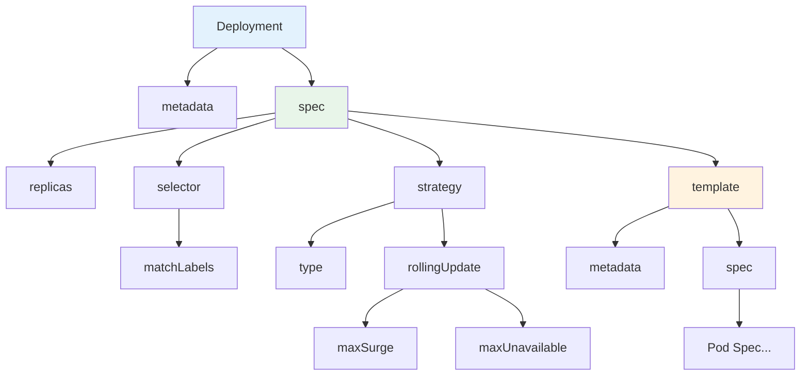

#### Service 配置结构

```mermaid
graph TD
    Svc[Service] --> SMetadata[metadata]
    Svc --> SSpec[spec]
    Svc --> SStatus[status]

    SSpec --> SType[type]
    SSpec --> Ports[ports[]]
    SSpec --> Selector[selector]
    SSpec --> ClusterIP[clusterIP]
    SSpec --> ExternalIPs[externalIPs]
    SSpec --> LoadBalancerIP[loadBalancerIP]

    Ports --> Port[port]
    Ports --> TargetPort[targetPort]
    Ports --> NodePort[nodePort]
    Ports --> Protocol[protocol]

    SType --> ClusterIPType[ClusterIP]
    SType --> NodePortType[NodePort]
    SType --> LoadBalancerType[LoadBalancer]
    SType --> ExternalNameType[ExternalName]

    style Svc fill:#e3f2fd
    style SSpec fill:#e8f5e9
    style SType fill:#fff3e0
```

---

### 3.2 API 对象层次关系树

```mermaid
graph TD
    Root[Kubernetes API] --> Core[Core API Group]
    Root --> Apps[Apps API Group]
    Root --> Batch[Batch API Group]
    Root --> Networking[Networking API Group]
    Root --> RBAC[RBAC API Group]
    Root --> Storage[Storage API Group]
    Root --> Autoscaling[Autoscaling API Group]

    Core --> Pod[Pod v1]
    Core --> Service[Service v1]
    Core --> ConfigMap[ConfigMap v1]
    Core --> Secret[Secret v1]
    Core --> Node[Node v1]
    Core --> Namespace[Namespace v1]
    Core --> PersistentVolume[PersistentVolume v1]
    Core --> PersistentVolumeClaim[PVC v1]

    Apps --> Deployment[Deployment v1]
    Apps --> StatefulSet[StatefulSet v1]
    Apps --> DaemonSet[DaemonSet v1]
    Apps --> ReplicaSet[ReplicaSet v1]

    Batch --> Job[Job v1]
    Batch --> CronJob[CronJob v1]

    Networking --> Ingress[Ingress v1]
    Networking --> NetworkPolicy[NetworkPolicy v1]
    Networking --> IngressClass[IngressClass v1]

    RBAC --> Role[Role v1]
    RBAC --> ClusterRole[ClusterRole v1]
    RBAC --> RoleBinding[RoleBinding v1]
    RBAC --> ClusterRoleBinding[ClusterRoleBinding v1]

    Storage --> StorageClass[StorageClass v1]
    Storage --> VolumeAttachment[VolumeAttachment v1]
    Storage --> CSIDriver[CSIDriver v1]
    Storage --> CSINode[CSINode v1]

    Autoscaling --> HPA[HorizontalPodAutoscaler v2]
    Autoscaling --> VPA[VerticalPodAutoscaler v1]

    Deployment --> RS[ReplicaSet]
    RS --> Pod
    StatefulSet --> Pod
    DaemonSet --> Pod
    Job --> Pod

    Service --> EndpointSlice[EndpointSlice]
    EndpointSlice --> Pod

    style Root fill:#e3f2fd
    style Core fill:#fff3e0
    style Apps fill:#e8f5e9
    style Networking fill:#fce4ec
    style RBAC fill:#f3e5f5
```

---

### 3.3 Label 与 Selector 匹配树

```mermaid
graph TD
    LabelSystem[Label系统] --> Label[Label标签]
    LabelSystem --> Selector[Selector选择器]

    Label --> KV[键值对]
    KV --> Key[键: 规范命名]
    KV --> Value[值: 63字符限制]
    KV --> Syntax[语法规则]

    Syntax --> Prefix[前缀: dns.io/name]
    Syntax --> Name[名称: 63字符]
    Syntax --> ValidChars[合法字符: alphanumeric, -, _, .]

    Selector --> Equality[等值选择器]
    Selector --> Set[集合选择器]

    Equality --> Equal[app=nginx]
    Equality --> NotEqual[tier!=frontend]

    Set --> In[app in (nginx, apache)]
    Set --> NotIn[env notin (dev, test)]
    Set --> Exists[app]
    Set --> NotExists[!deprecated]

    Selector --> Match[匹配逻辑]
    Match --> And[AND: 所有条件满足]
    Match --> MultiSelector[多选择器组合]

    style LabelSystem fill:#e3f2fd
    style Label fill:#fff3e0
    style Selector fill:#e8f5e9
```

**Label 匹配示例**：

```yaml
# Pod 标签
metadata:
  labels:
    app: nginx
    tier: frontend
    env: production

# Service 选择器
selector:
  app: nginx        # 匹配 app=nginx
  tier: frontend    # 同时匹配 tier=frontend

# Deployment 选择器
selector:
  matchLabels:
    app: nginx
  matchExpressions:
    - key: tier
      operator: In
      values: [frontend, backend]
```

---

## 4. UML 图

### 4.1 类图：核心 API 对象关系

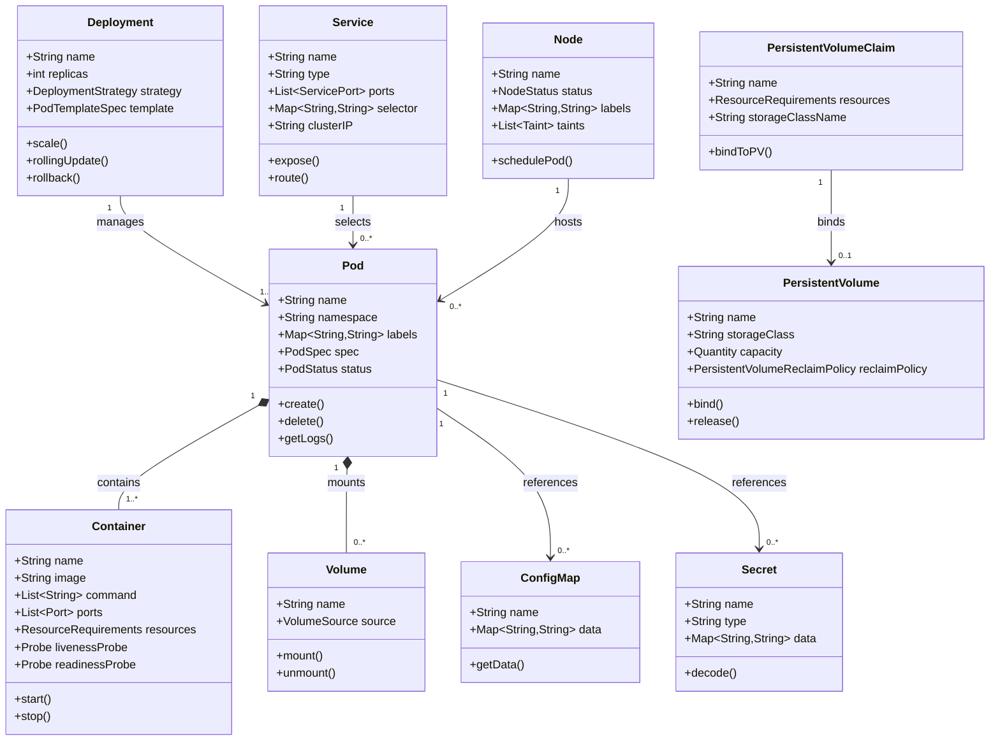

---

### 4.2 时序图

#### Pod 创建完整流程

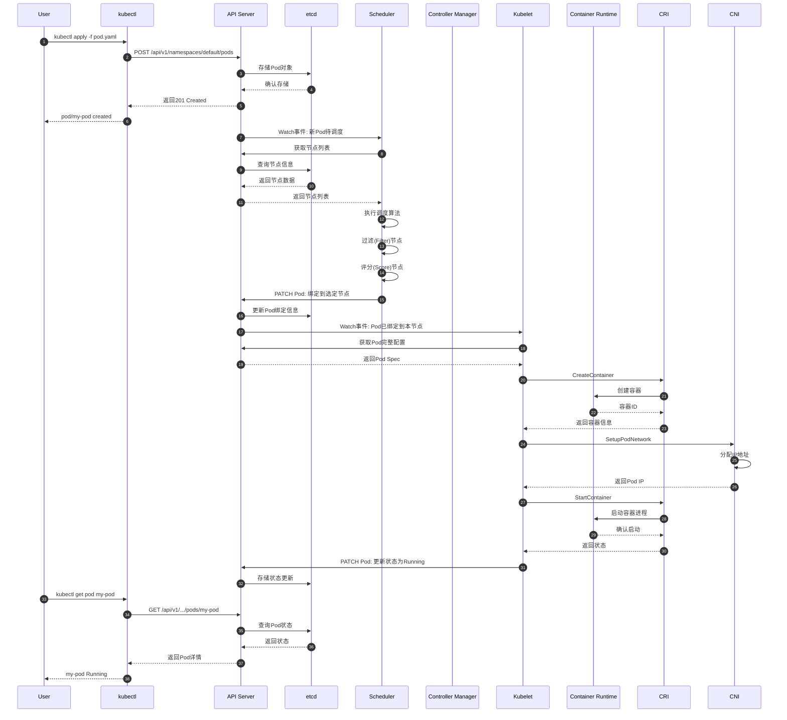

#### Service 请求处理流程

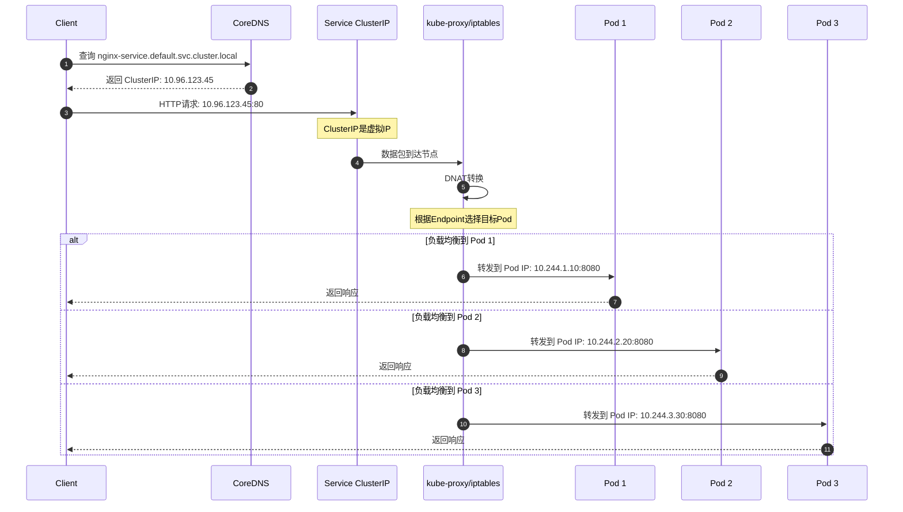

#### ConfigMap 更新传播流程

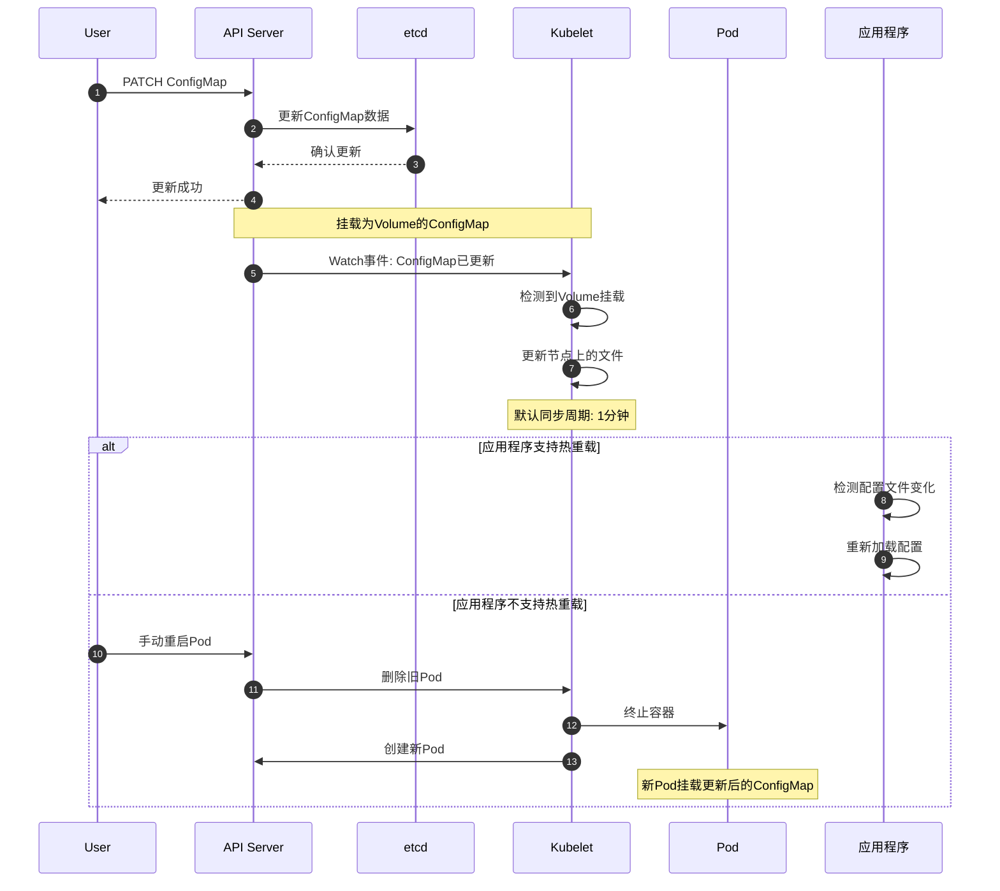

---

### 4.3 状态图

#### Pod 生命周期状态转换

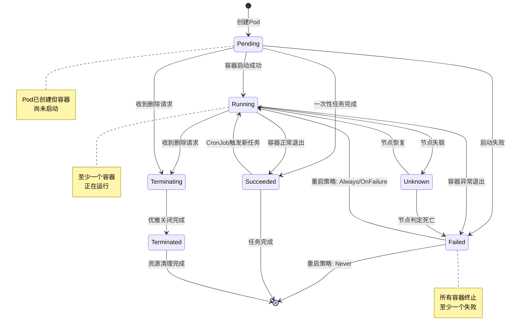

**Pod 状态详解**：

| 状态 | 含义 | 常见原因 |
|------|------|----------|
| Pending | 等待调度或容器创建 | 资源不足、镜像拉取中 |
| Running | 至少一个容器运行中 | 正常状态 |
| Succeeded | 所有容器成功退出 | Job完成 |
| Failed | 至少一个容器失败退出 | 应用错误、OOM |
| Unknown | 无法获取Pod状态 | 节点失联 |
| Terminating | 正在删除中 | 正常删除流程 |

#### Deployment 滚动更新状态

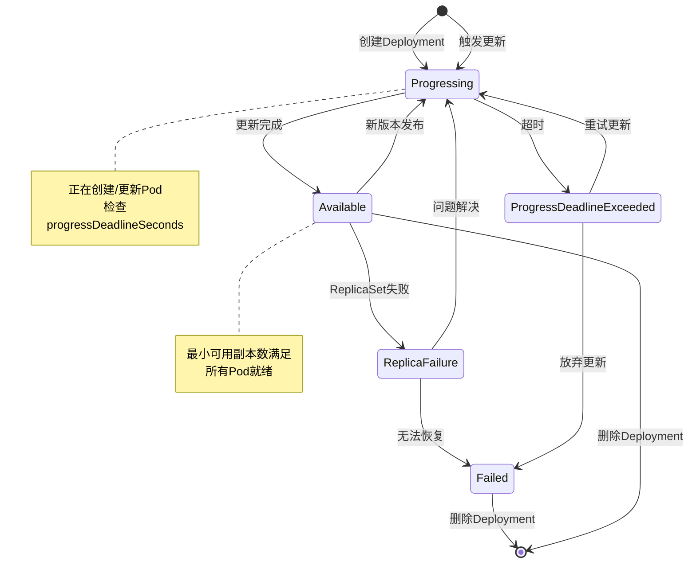

---

### 4.4 组件图：K8s 系统组件关系

```mermaid
graph TB
    subgraph ControlPlane[控制平面 Control Plane]
        APIServer[API Server]
        etcd[(etcd)]
        Scheduler[Scheduler]
        CM[Controller Manager]
        CCM[Cloud Controller Manager]

        APIServer <-->|读写| etcd
        Scheduler -->|监听| APIServer
        CM -->|监听| APIServer
        CCM -->|监听| APIServer
    end

    subgraph WorkerNode1[工作节点 1]
        Kubelet1[Kubelet]
        KProxy1[kube-proxy]
        Runtime1[Container Runtime]

        Kubelet1 -->|CRI| Runtime1
    end

    subgraph WorkerNode2[工作节点 2]
        Kubelet2[Kubelet]
        KProxy2[kube-proxy]
        Runtime2[Container Runtime]

        Kubelet2 -->|CRI| Runtime2
    end

    subgraph WorkerNodeN[工作节点 N]
        KubeletN[Kubelet]
        KProxyN[kube-proxy]
        RuntimeN[Container Runtime]

        KubeletN -->|CRI| RuntimeN
    end

    Kubelet1 -->|注册/汇报| APIServer
    Kubelet2 -->|注册/汇报| APIServer
    KubeletN -->|注册/汇报| APIServer

    KProxy1 -->|监听| APIServer
    KProxy2 -->|监听| APIServer
    KProxyN -->|监听| APIServer

    subgraph Addons[集群插件]
        DNS[CoreDNS]
        Dashboard[Dashboard]
        Ingress[Ingress Controller]
        Network[CNI Plugin]
    end

    DNS -->|查询| APIServer
    Dashboard -->|API调用| APIServer
    Ingress -->|监听| APIServer

    style ControlPlane fill:#e3f2fd
    style WorkerNode1 fill:#e8f5e9
    style WorkerNode2 fill:#e8f5e9
    style WorkerNodeN fill:#e8f5e9
    style Addons fill:#fff3e0
```

---

### 4.5 部署图：多环境部署架构

```mermaid
graph TB
    subgraph Dev[开发环境]
        DevCP[单节点控制平面]
        DevNode1[工作节点]
        DevApps[开发应用]

        DevCP --> DevNode1
        DevNode1 --> DevApps
    end

    subgraph Test[测试环境]
        TestCP[高可用控制平面]
        TestNode1[工作节点]
        TestNode2[工作节点]
        TestApps[测试应用]

        TestCP --> TestNode1
        TestCP --> TestNode2
        TestNode1 --> TestApps
        TestNode2 --> TestApps
    end

    subgraph Staging[预发布环境]
        StageCP[高可用控制平面]
        StageNode1[工作节点]
        StageNode2[工作节点]
        StageNode3[工作节点]
        StageApps[预发布应用]

        StageCP --> StageNode1
        StageCP --> StageNode2
        StageCP --> StageNode3
        StageNode1 --> StageApps
        StageNode2 --> StageApps
        StageNode3 --> StageApps
    end

    subgraph Prod[生产环境]
        ProdCP[多区域控制平面]
        ProdNode1[区域A节点]
        ProdNode2[区域A节点]
        ProdNode3[区域B节点]
        ProdNode4[区域B节点]
        ProdApps[生产应用]

        ProdCP --> ProdNode1
        ProdCP --> ProdNode2
        ProdCP --> ProdNode3
        ProdCP --> ProdNode4
        ProdNode1 --> ProdApps
        ProdNode2 --> ProdApps
        ProdNode3 --> ProdApps
        ProdNode4 --> ProdApps
    end

    Dev -->|镜像晋升| Test
    Test -->|镜像晋升| Staging
    Staging -->|镜像晋升| Prod

    style Dev fill:#e8f5e9
    style Test fill:#fff3e0
    style Staging fill:#e1f5fe
    style Prod fill:#ffebee
```

---

## 5. 场景应用图

### 5.1 微服务架构图：典型电商系统

```mermaid
graph TB
    subgraph UserLayer[用户接入层]
        CDN[CDN静态资源]
        WAF[WAF防火墙]
        LB[负载均衡器]
    end

    subgraph GatewayLayer[网关层]
        Ingress[Ingress Controller]
        APIGateway[API Gateway]
        Auth[认证服务]
    end

    subgraph ServiceLayer[微服务层]
        subgraph Frontend[前端服务]
            WebApp[Web应用]
            MobileApp[移动应用]
            AdminApp[管理后台]
        end

        subgraph CoreServices[核心服务]
            UserService[用户服务]
            ProductService[商品服务]
            OrderService[订单服务]
            PaymentService[支付服务]
            InventoryService[库存服务]
        end

        subgraph SupportServices[支撑服务]
            SearchService[搜索服务]
            RecommendService[推荐服务]
            MessageService[消息服务]
            FileService[文件服务]
        end
    end

    subgraph DataLayer[数据层]
        subgraph Database[数据库]
            UserDB[(用户数据库)]
            ProductDB[(商品数据库)]
            OrderDB[(订单数据库)]
            Cache[(Redis缓存)]
        end

        subgraph MessageQueue[消息队列]
            Kafka[Kafka集群]
            RabbitMQ[RabbitMQ]
        end

        subgraph SearchEngine[搜索引擎]
            ES[Elasticsearch]
        end
    end

    subgraph Observability[可观测性]
        Prometheus[Prometheus监控]
        Grafana[Grafana可视化]
        ELK[ELK日志栈]
        Jaeger[Jaeger追踪]
    end

    CDN --> Ingress
    WAF --> Ingress
    LB --> Ingress
    Ingress --> APIGateway
    APIGateway --> Auth

    APIGateway --> WebApp
    APIGateway --> MobileApp
    APIGateway --> AdminApp

    WebApp --> UserService
    WebApp --> ProductService
    WebApp --> OrderService

    OrderService --> PaymentService
    OrderService --> InventoryService
    OrderService --> MessageService

    ProductService --> SearchService
    ProductService --> RecommendService

    UserService --> UserDB
    ProductService --> ProductDB
    OrderService --> OrderDB

    UserService --> Cache
    ProductService --> Cache

    SearchService --> ES
    MessageService --> Kafka
    MessageService --> RabbitMQ

    style UserLayer fill:#e3f2fd
    style GatewayLayer fill:#fff3e0
    style ServiceLayer fill:#e8f5e9
    style DataLayer fill:#fce4ec
```

---

### 5.2 CI/CD 流水线图：GitOps 工作流

```mermaid
graph LR
    subgraph Source[源码管理]
        GitRepo[Git仓库]
        AppCode[应用代码]
        K8sManifests[K8s配置]
        PipelineConfig[流水线配置]
    end

    subgraph CI[持续集成]
        Trigger[Webhook触发]
        Build[构建镜像]
        Test[运行测试]
        Scan[安全扫描]
        Push[推送镜像]
        UpdateManifest[更新配置]
    end

    subgraph Registry[镜像仓库]
        Harbor[Harbor镜像库]
        ImageTag[镜像标签]
    end

    subgraph GitOps[GitOps引擎]
        ArgoCD[ArgoCD]
        Flux[Flux]
    end

    subgraph K8s[Kubernetes集群]
        App[应用工作负载]
        Config[配置文件]
    end

    GitRepo --> Trigger
    AppCode --> Build
    Build --> Test
    Test --> Scan
    Scan --> Push
    Push --> Harbor
    Push --> UpdateManifest
    K8sManifests --> UpdateManifest

    UpdateManifest --> GitRepo
    GitRepo --> ArgoCD
    GitRepo --> Flux

    ArgoCD --> App
    Flux --> App
    Harbor --> App

    style Source fill:#e3f2fd
    style CI fill:#e8f5e9
    style GitOps fill:#fff3e0
    style K8s fill:#fce4ec
```

**GitOps 工作流详解**：

| 阶段 | 工具 | 职责 |
|------|------|------|
| 源码管理 | GitLab/GitHub | 代码版本控制、协作 |
| CI构建 | Jenkins/Tekton | 镜像构建、测试、扫描 |
| 镜像仓库 | Harbor/ACR | 镜像存储、安全扫描 |
| GitOps引擎 | ArgoCD/Flux | 配置同步、自动部署 |
| K8s集群 | Kubernetes | 应用运行、生命周期管理 |

---

### 5.3 可观测性架构图

```mermaid
graph TB
    subgraph DataSources[数据源]
        AppMetrics[应用指标]
        SystemMetrics[系统指标]
        Logs[应用日志]
        Traces[调用链路]
        Events[K8s事件]
    end

    subgraph Collection[数据采集]
        PrometheusAgent[Prometheus Agent]
        FluentBit[Fluent Bit]
        OTelCollector[OpenTelemetry Collector]
        NodeExporter[Node Exporter]
        Cadvisor[cAdvisor]
    end

    subgraph Storage[数据存储]
        PrometheusTSDB[(Prometheus TSDB)]
        Thanos[(Thanos)]
        Loki[(Loki)]
        Tempo[(Tempo)]
        Elasticsearch[(Elasticsearch)]
    end

    subgraph Analysis[数据分析]
        AlertManager[Alert Manager]
        RecordingRules[Recording Rules]
        LogQL[LogQL查询]
        TraceQL[TraceQL查询]
    end

    subgraph Visualization[可视化]
        Grafana[Grafana Dashboard]
        AlertChannel[告警通道]
        Kiali[Kiali服务网格]
        JaegerUI[Jaeger UI]
    end

    AppMetrics --> OTelCollector
    SystemMetrics --> NodeExporter
    SystemMetrics --> Cadvisor
    Logs --> FluentBit
    Traces --> OTelCollector
    Events --> PrometheusAgent

    PrometheusAgent --> PrometheusTSDB
    NodeExporter --> PrometheusTSDB
    Cadvisor --> PrometheusTSDB
    FluentBit --> Loki
    FluentBit --> Elasticsearch
    OTelCollector --> Tempo

    PrometheusTSDB --> Thanos
    PrometheusTSDB --> AlertManager
    PrometheusTSDB --> RecordingRules

    Thanos --> Grafana
    Loki --> Grafana
    Tempo --> Grafana
    Elasticsearch --> Grafana

    AlertManager --> AlertChannel
    AlertChannel --> Slack
    AlertChannel --> PagerDuty
    AlertChannel --> Email

    style DataSources fill:#e3f2fd
    style Collection fill:#e8f5e9
    style Storage fill:#fff3e0
    style Visualization fill:#fce4ec
```

---

### 5.4 多集群架构图

```mermaid
graph TB
    subgraph GlobalControl[全局控制层]
        Karmada[Karmada控制平面]
        Federation[Federation v2]
        GlobalLB[全局负载均衡]
        GlobalDNS[全局DNS]
    end

    subgraph ClusterA[集群A - 北京]
        CP1[控制平面]
        NodeA1[工作节点]
        NodeA2[工作节点]
        AppA[应用副本]
    end

    subgraph ClusterB[集群B - 上海]
        CP2[控制平面]
        NodeB1[工作节点]
        NodeB2[工作节点]
        AppB[应用副本]
    end

    subgraph ClusterC[集群C - 新加坡]
        CP3[控制平面]
        NodeC1[工作节点]
        NodeC2[工作节点]
        AppC[应用副本]
    end

    subgraph DRCluster[灾备集群 - 香港]
        CP4[控制平面]
        NodeDR[工作节点]
        AppDR[灾备应用]
    end

    Karmada --> CP1
    Karmada --> CP2
    Karmada --> CP3
    Karmada --> CP4

    GlobalLB --> ClusterA
    GlobalLB --> ClusterB
    GlobalLB --> ClusterC

    ClusterA -.->|数据复制| ClusterB
    ClusterB -.->|数据复制| ClusterC
    ClusterA -.->|灾备复制| DRCluster
    ClusterB -.->|灾备复制| DRCluster

    style GlobalControl fill:#e3f2fd
    style ClusterA fill:#e8f5e9
    style ClusterB fill:#fff3e0
    style ClusterC fill:#fce4ec
    style DRCluster fill:#ffebee
```

---

### 5.5 边缘计算架构图

```mermaid
graph TB
    subgraph Cloud[云端 - 中心云]
        CloudK8s[云原生K8s集群]
        CloudApps[云端应用]
        DataCenter[数据中心]
        AI[AI训练平台]
    end

    subgraph Edge[边缘层]
        subgraph EdgeSite1[边缘站点1]
            EdgeK8s1[K3s/Edge K8s]
            EdgeApp1[边缘应用]
            IoTDevice1[IoT设备]
            Gateway1[边缘网关]
        end

        subgraph EdgeSite2[边缘站点2]
            EdgeK8s2[K3s/Edge K8s]
            EdgeApp2[边缘应用]
            IoTDevice2[IoT设备]
            Gateway2[边缘网关]
        end

        subgraph EdgeSiteN[边缘站点N]
            EdgeK8sN[K3s/Edge K8s]
            EdgeAppN[边缘应用]
            IoTDeviceN[IoT设备]
            GatewayN[边缘网关]
        end
    end

    subgraph DeviceLayer[设备层]
        Sensors[传感器]
        Cameras[摄像头]
        Actuators[执行器]
        Vehicles[车联网设备]
    end

    CloudK8s <-->|KubeEdge/SuperEdge| EdgeK8s1
    CloudK8s <-->|KubeEdge/SuperEdge| EdgeK8s2
    CloudK8s <-->|KubeEdge/SuperEdge| EdgeK8sN

    EdgeK8s1 --> Gateway1
    EdgeK8s2 --> Gateway2
    EdgeK8sN --> GatewayN

    Gateway1 --> Sensors
    Gateway1 --> Cameras
    Gateway2 --> Actuators
    GatewayN --> Vehicles

    EdgeApp1 -.->|数据上报| DataCenter
    EdgeApp2 -.->|数据上报| DataCenter
    EdgeAppN -.->|数据上报| DataCenter

    AI -.->|模型下发| EdgeApp1
    AI -.->|模型下发| EdgeApp2
    AI -.->|模型下发| EdgeAppN

    style Cloud fill:#e3f2fd
    style Edge fill:#e8f5e9
    style DeviceLayer fill:#fff3e0
```

---

## 6. 谱系图

### 6.1 技术演进时间线

```mermaid
timeline
    title 容器技术发展历程

    section 2000s
        2000 : FreeBSD Jails
             : 操作系统级虚拟化雏形
        2004 : Solaris Zones
             : 资源隔离和配额管理
        2006 : Linux VServer
             : Linux内核虚拟化
        2008 : LXC (Linux Containers)
             : 完整的容器运行时

    section 2010-2013
        2013 : Docker发布
             : 容器技术大众化
             : 镜像分层存储
        2014 : Kubernetes发布
             : Google Borg开源
             : 容器编排标准

    section 2015-2016
        2015 : CNCF成立
             : OCI标准发布
             : runC运行时
        2016 : CRI标准
             : containerd捐赠
             : CNI规范

    section 2017-2018
        2017 : Kubernetes胜利
             : 所有云厂商支持
             : 1.0版本发布
        2018 : Service Mesh兴起
             : Istio发布
             : Knative发布

    section 2019-2020
        2019 : Kubernetes 1.14
             : Windows容器GA
             : CRD成为主流
        2020 : Kubernetes 1.19
             : Ingress v1 GA
             : 存储快照GA

    section 2021-2022
        2021 : Kubernetes 1.22
             : PodSecurity废弃
             : CSI迁移完成
        2022 : Kubernetes 1.24
             : Dockershim移除
             : 容器运行时接口

    section 2023-2024
        2023 : Kubernetes 1.28
             : Sidecar容器
             : 混合节点支持
        2024 : Kubernetes 1.29+
             : 原地升级
             : 多集群管理
```

---

### 6.2 CNCF 项目全景

```mermaid
mindmap
  root((CNCF<br/>项目全景))
    已毕业项目
      编排
        Kubernetes
      服务代理
        Envoy
      服务网格
        Istio
      监控
        Prometheus
      日志
        Fluentd
      追踪
        Jaeger
      容器运行时
        containerd
      存储
        Rook
      网络
        CoreDNS
      镜像仓库
        Harbor
      构建
        Buildpacks
      GitOps
        Argo
    孵化项目
      网络
        Cilium
        Contour
      存储
        Longhorn
        OpenEBS
      安全
        Falco
        Trivy
      可观测性
        Thanos
        Cortex
      GitOps
        Flux
      Serverless
        Knative
        KEDA
    沙箱项目
      新兴技术
        Cluster API
        KubeEdge
        Litmus
        Keptn
        Backstage
      实验项目
        持续增加中
```

**CNCF 项目成熟度说明**：

| 级别 | 要求 | 代表项目 |
|------|------|----------|
| 沙箱 | 创新项目、早期阶段 | 100+ 项目 |
| 孵化 | 生产使用、活跃社区 | 30+ 项目 |
| 毕业 | 广泛采用、成熟稳定 | 20+ 项目 |

---

### 6.3 K8s 版本演进重要特性

```mermaid
timeline
    title Kubernetes 重要特性演进

    section 1.0-1.5
        1.0 : 首个GA版本
        1.2 : DaemonSet/Deployment/Jobs
        1.3 : PetSets(后改名StatefulSet)
        1.4 : Cluster Federation
        1.5 : StatefulSets GA
            : Windows容器支持

    section 1.6-1.10
        1.6 : RBAC GA
        1.7 : NetworkPolicy GA
        1.8 : Workloads API GA
        1.9 : Apps Workloads GA
        1.10 : CSI存储插件
             : CoreDNS默认

    section 1.11-1.15
        1.11 : 动态Kubelet配置
        1.12 : Kubelet TLS Bootstrap
        1.13 : CSI GA
        1.14 : Windows容器GA
        1.15 : CRD GA
             : 自定义资源

    section 1.16-1.20
        1.16 : 废弃API清理
        1.17 : CSI拓扑GA
        1.18 : IngressClass
        1.19 : Ingress GA
             : 存储快照GA
        1.20 : CronJob GA
             : 优雅节点关闭

    section 1.21-1.25
        1.21 : CronJob v2
             : 不可变Secrets
        1.22 : PodSecurity标准
             : 移除PodSecurityPolicy
        1.23 : IPv4/IPv6双栈GA
        1.24 : 移除Dockershim
             : 容器运行时接口
        1.25 : PodSecurity GA
             : cgroup v2支持

    section 1.26-1.30
        1.26 : 动态资源分配
        1.27 : 原地升级Alpha
        1.28 : Sidecar容器
             : 混合节点支持
        1.29 : 原地升级Beta
             : NFTables代理
        1.30 : Sidecar容器GA
             : 结构化授权
```

---

## 7. 对比分析图

### 7.1 容器 vs 虚拟机 vs Wasm 对比矩阵

```mermaid
graph LR
    subgraph Comparison[技术对比]
        direction TB

        subgraph Container[容器技术]
            Docker[Docker]
            Containerd[containerd]
        end

        subgraph VM[虚拟机技术]
            KVM[KVM]
            VMware[VMware]
            HyperV[Hyper-V]
        end

        subgraph Wasm[WebAssembly]
            WasmRuntime[Wasm Runtime]
            WASI[WASI接口]
        end
    end

    subgraph Metrics[评估维度]
        Startup[启动速度]
        Overhead[资源开销]
        Isolation[隔离级别]
        Portability[可移植性]
        Security[安全性]
        Ecosystem[生态系统]
    end

    Container -.->|快| Startup
    VM -.->|慢| Startup
    Wasm -.->|极快| Startup

    Container -.->|低| Overhead
    VM -.->|高| Overhead
    Wasm -.->|极低| Overhead

    Container -.->|进程级| Isolation
    VM -.->|硬件级| Isolation
    Wasm -.->|沙箱级| Isolation
```

**详细对比表**：

| 维度 | 容器 | 虚拟机 | WebAssembly |
|------|------|--------|-------------|
| 启动时间 | 秒级 | 分钟级 | 毫秒级 |
| 内存开销 | MB级 | GB级 | KB级 |
| 隔离级别 | 进程级 | 硬件级 | 沙箱级 |
| 镜像大小 | MB-GB | GB-TB | KB-MB |
| 可移植性 | 良好 | 差 | 优秀 |
| 安全性 | 中 | 高 | 高 |
| 生态系统 | 成熟 | 成熟 | 发展中 |
| 适用场景 | 微服务、云原生 | 传统应用、强隔离 | 边缘计算、Serverless |

---

### 7.2 各类 CNI 插件性能对比

```mermaid
xychart-beta
    title "CNI插件性能对比 (Pod-to-Pod延迟 - 越低越好)"
    x-axis [Calico-BGP, Calico-VXLAN, Cilium, Flannel, Weave]
    y-axis "延迟 (微秒)" 0 --> 100
    bar [15, 35, 12, 40, 45]

    title "吞吐量对比 (Gbps - 越高越好)"
    x-axis [Calico-BGP, Calico-VXLAN, Cilium, Flannel, Weave]
    y-axis "吞吐量 (Gbps)" 0 --> 25
    bar [22, 18, 24, 15, 14]
```

**CNI 插件详细对比**：

| 特性 | Calico | Cilium | Flannel | Weave | Antrea |
|------|--------|--------|---------|-------|--------|
| 网络模式 | BGP/VXLAN | eBPF/XDP | VXLAN/UDP | Overlay | OVS |
| 性能 | 高 | 极高 | 中 | 中 | 高 |
| 策略支持 | 优秀 | 优秀 | 无 | 良好 | 优秀 |
| 加密支持 | IPsec/WireGuard | WireGuard | 无 | 内置 | IPsec |
| 可观测性 | 良好 | 优秀(Hubble) | 基础 | 基础 | 良好 |
| 复杂度 | 中 | 高 | 低 | 低 | 中 |
| 适用规模 | 大规模 | 大规模 | 中小规模 | 中小规模 | 大规模 |

---

### 7.3 服务网格功能对比

```mermaid
graph TB
    subgraph ServiceMeshComparison[服务网格功能对比]
        direction LR

        subgraph Istio[Istio]
            I1[完整流量管理]
            I2[安全策略]
            I3[可观测性]
            I4[多集群]
            I5[高资源消耗]
        end

        subgraph Linkerd[Linkerd]
            L1[轻量级]
            L2[易部署]
            L3[自动mTLS]
            L4[基础流量管理]
            L5[低资源消耗]
        end

        subgraph Consul[Consul Connect]
            C1[服务发现集成]
            C2[多数据中心]
            C3[健康检查]
            C4[K/V存储]
            C5[HashiCorp生态]
        end

        subgraph AWSAppMesh[AWS App Mesh]
            A1[AWS原生集成]
            A2[托管服务]
            A3[Envoy代理]
            A4[CloudWatch集成]
            A5[AWS锁定]
        end
    end
```

**服务网格详细对比**：

| 功能 | Istio | Linkerd | Consul Connect | AWS App Mesh |
|------|-------|---------|----------------|--------------|
| 控制平面 | 复杂 | 简单 | 中等 | 托管 |
| 数据平面 | Envoy | Linkerd-proxy | Envoy | Envoy |
| 流量管理 | 完整 | 基础 | 中等 | 中等 |
| mTLS | 支持 | 自动 | 支持 | 支持 |
| 多集群 | 支持 | 有限 | 支持 | 有限 |
| 资源消耗 | 高 | 低 | 中 | 托管 |
| 学习曲线 | 陡峭 | 平缓 | 中等 | 平缓 |
| 社区活跃度 | 高 | 高 | 中 | AWS支持 |

---

## 8. 数据流图

### 8.1 请求在 K8s 集群中的完整流转

```mermaid
flowchart LR
    subgraph External[外部用户]
        User[用户请求]
    end

    subgraph IngressLayer[入口层]
        DNS[DNS解析]
        CDN[CDN加速]
        WAF[WAF防护]
        LB[负载均衡器]
    end

    subgraph K8sCluster[K8s集群]
        Ingress[Ingress Controller]

        subgraph ServiceMesh[服务网格层]
            Sidecar1[Envoy Sidecar]
            Sidecar2[Envoy Sidecar]
            Sidecar3[Envoy Sidecar]
        end

        subgraph Microservices[微服务层]
            Gateway[API Gateway]
            ServiceA[服务A]
            ServiceB[服务B]
            ServiceC[服务C]
        end

        subgraph DataLayer[数据层]
            Cache[Redis缓存]
            DB[(数据库)]
            MQ[消息队列]
        end
    end

    User --> DNS
    DNS --> CDN
    CDN --> WAF
    WAF --> LB
    LB --> Ingress

    Ingress --> Sidecar1
    Sidecar1 --> Gateway
    Gateway --> Sidecar2
    Sidecar2 --> ServiceA

    ServiceA --> Sidecar3
    Sidecar3 --> ServiceB
    ServiceA --> Cache
    ServiceB --> DB
    ServiceB --> MQ
    ServiceC --> MQ

    style External fill:#e3f2fd
    style IngressLayer fill:#fff3e0
    style K8sCluster fill:#e8f5e9
    style ServiceMesh fill:#fce4ec
```

**请求流转详解**：

| 阶段 | 组件 | 处理内容 |
|------|------|----------|
| 1. DNS解析 | CoreDNS/外部DNS | 域名解析为IP |
| 2. CDN加速 | CloudFlare等 | 静态资源缓存 |
| 3. WAF防护 | ModSecurity等 | 安全检测过滤 |
| 4. 负载均衡 | 云LB/Nginx | 流量分发 |
| 5. Ingress路由 | Ingress Controller | 路由规则匹配 |
| 6. 服务网格 | Istio/Linkerd | 流量管理、安全 |
| 7. 微服务调用 | 业务服务 | 业务逻辑处理 |
| 8. 数据访问 | 缓存/数据库 | 数据持久化 |

---

### 8.2 配置更新传播路径

```mermaid
flowchart TD
    subgraph Source[配置源]
        Git[Git仓库]
        ConfigFile[配置文件]
    end

    subgraph GitOps[GitOps引擎]
        ArgoCD[ArgoCD]
        Flux[FluxCD]
    end

    subgraph K8sControl[K8s控制平面]
        APIServer[API Server]
        etcd[(etcd)]
        Controller[Controller Manager]
    end

    subgraph Propagation[配置传播]
        Kubelet[Kubelet]
        KProxy[kube-proxy]
        Sidecar[Sidecar容器]
        App[应用程序]
    end

    Git --> ArgoCD
    ConfigFile --> Flux

    ArgoCD --> APIServer
    Flux --> APIServer

    APIServer --> etcd
    etcd --> APIServer

    APIServer --> Controller
    APIServer --> Kubelet
    APIServer --> KProxy

    Kubelet --> Sidecar
    Kubelet --> App

    style Source fill:#e3f2fd
    style GitOps fill:#e8f5e9
    style K8sControl fill:#fff3e0
    style Propagation fill:#fce4ec
```

**配置传播时序**：

| 步骤 | 组件 | 延迟 | 说明 |
|------|------|------|------|
| 1. 提交配置 | Git | 即时 | 开发者提交 |
| 2. 检测变更 | GitOps | 1-5分钟 | 轮询或Webhook |
| 3. 应用配置 | API Server | 秒级 | 资源创建/更新 |
| 4. 持久化 | etcd | 毫秒级 | 数据存储 |
| 5. 事件分发 | Watch机制 | 毫秒级 | 实时通知 |
| 6. 节点同步 | Kubelet | 1-60秒 | 配置同步周期 |
| 7. 应用重载 | 应用程序 | 依赖应用 | 热重载或重启 |

---

### 8.3 事件驱动数据流

```mermaid
flowchart TB
    subgraph EventSources[事件源]
        K8sEvents[K8s原生事件]
        AppEvents[应用事件]
        MetricsEvents[指标事件]
        LogEvents[日志事件]
    end

    subgraph EventBus[事件总线]
        Kafka[Kafka]
        RabbitMQ[RabbitMQ]
        NATS[NATS]
        EventBridge[EventBridge]
    end

    subgraph EventProcessing[事件处理]
        Streaming[流处理]
        Filtering[过滤路由]
        Enrichment[数据增强]
        Aggregation[聚合分析]
    end

    subgraph EventConsumers[事件消费者]
        Alerting[告警系统]
        Autoscaling[自动扩缩容]
        Notifications[通知系统]
        Analytics[分析平台]
    end

    K8sEvents --> Kafka
    AppEvents --> Kafka
    MetricsEvents --> NATS
    LogEvents --> RabbitMQ

    Kafka --> Streaming
    NATS --> Filtering
    RabbitMQ --> Enrichment

    Streaming --> Aggregation
    Filtering --> Alerting
    Enrichment --> Autoscaling
    Aggregation --> Analytics

    Alerting --> Notifications
    Autoscaling --> K8sEvents

    style EventSources fill:#e3f2fd
    style EventBus fill:#e8f5e9
    style EventProcessing fill:#fff3e0
    style EventConsumers fill:#fce4ec
```

**事件驱动场景**：

| 场景 | 事件源 | 处理逻辑 | 响应动作 |
|------|--------|----------|----------|
| Pod异常 | K8s Events | 检测CrashLoopBackOff | 告警通知 |
| 高CPU | Metrics | 阈值判断 | HPA扩容 |
| 错误日志 | Logs | 模式匹配 | 触发回滚 |
| 配置变更 | Git Events | 验证合规性 | 自动部署 |

---

## 附录：图表速查表

### Mermaid 图表类型速查

| 图表类型 | 用途 | 语法关键词 |
|----------|------|------------|
| 流程图 | 流程、决策 | flowchart |
| 时序图 | 交互过程 | sequenceDiagram |
| 类图 | 对象关系 | classDiagram |
| 状态图 | 状态转换 | stateDiagram-v2 |
| 思维导图 | 知识树 | mindmap |
| 时间线 | 演进历程 | timeline |
| 饼图 | 比例分布 | pie |
| 甘特图 | 项目计划 | gantt |

### 常用 K8s 资源关系速查

```
Deployment → ReplicaSet → Pod
StatefulSet → Pod
DaemonSet → Pod
Job → Pod
CronJob → Job → Pod

Service → EndpointSlice → Pod
Ingress → Service

PVC → PV
ConfigMap/Secret → Pod (Volume/Env)
```

---

*本章完*
