# Docker 与 Kubernetes 体系结构权威指南

> **版本**: 1.0
> **最后更新**: 2026年3月17日
> **性质**: 云原生技术权威文档
> **关键词**: Docker, Kubernetes, 容器化, 云原生, WebAssembly, 分布式系统

---

## 目录

- [前言](#前言)
- [第1章 体系结构全景](#第1章-体系结构全景)
  - Docker 核心架构
  - Kubernetes 核心架构
  - CRI/CNI/CSI 接口标准
  - 网络与存储系统
  - 安全体系
  - 生态工具链
  - WebAssembly 融合
  - Go 代码实战
- [第2章 理论基础与形式化分析](#第2章-理论基础与形式化分析)
  - 范畴论分析
  - 类型系统
  - 形式语言与语义
  - 可计算性与复杂性
  - 控制理论应用
  - 形式化验证
- [第3章 设计模式与最佳实践](#第3章-设计模式与最佳实践)
  - GoF 设计模式
  - 分布式系统设计模式
  - 并发与并行模式
  - 同步与异步模式
  - 工作流设计模式
  - K8s 特有模式
- [第4章 行业应用案例](#第4章-行业应用案例)
  - 互联网行业
  - 金融行业
  - 电信行业
  - 制造业与 IoT
  - 医疗行业
  - 游戏行业
  - 零售与电商
- [第5章 系统工程与可靠性](#第5章-系统工程与可靠性)
  - 控制理论分析
  - 可靠性工程
  - 性能工程
  - 可观测性工程
  - 安全工程
  - 工程谱系分析
- [第6章 可视化表征与工具](#第6章-可视化表征与工具)
  - 思维导图
  - 决策树
  - UML 图
  - 场景应用图
  - 谱系图
  - 对比分析图
- [第7章 全生态分析与未来展望](#第7章-全生态分析与未来展望)
  - 容器化与 WebAssembly 生态
  - 技术发展趋势
  - 学习资源推荐
- [附录](#附录)
- [总结](#总结)

---

## 前言

### 文档概述

本文档是 Docker 与 Kubernetes 容器技术的**权威指南**，整合了体系结构分析、理论基础、设计模式、行业案例、系统工程和可视化表征等多个维度的深度内容。通过对 Google、Netflix、阿里巴巴、蚂蚁金服等全球领先企业的实践案例分析，结合**范畴论**、**类型系统**、**控制理论**等数学基础，为读者提供全面、深入的技术视角。

本文档对标 **2026年3月** 最新的技术发展趋势，涵盖：

- Docker 和 Kubernetes 的完整技术栈
- WebAssembly 与容器化的融合
- 云原生生态系统的全链路分析
- 国际权威标准与最佳实践

### 目标读者

| 读者类型 | 关注重点 | 建议阅读章节 |
|---------|---------|-------------|
| **云原生架构师** | 系统设计、技术选型 | 第1、3、5、6章 |
| **DevOps 工程师** | CI/CD、运维、监控 | 第1、5、6章 |
| **后端开发工程师** | 应用开发、模式实践 | 第1、3章 |
| **技术管理者** | 决策依据、行业趋势 | 第4、7章 |
| **研究人员** | 理论基础、形式化分析 | 第2、5章 |

### 文档特点

1. **全面性**: 覆盖从 Linux 内核到云原生应用的全栈知识
2. **权威性**: 引用 Google、CNCF、Linux 基金会、OCI 等官方规范
3. **理论性**: 使用范畴论、类型系统、控制理论等数学工具进行形式化分析
4. **实践性**: 包含 30+ 企业级案例、50+ Go 代码示例
5. **可视化**: 36+ Mermaid 图表、100+ 技术对比表格

### 核心内容矩阵

```
                    理论深度
                      高
                       |
    第2章 理论基础      |      第5章 系统工程
    (范畴论/类型系统)   |      (控制理论/可靠性)
                       |
    -------------------+-------------------
    第4章 行业案例      |      第3章 设计模式
    (Google/阿里)      |      (GoF/分布式)
                       |
    第6章 可视化        |      第1章 体系结构
    (UML/决策树)       |      (Docker/K8s)
                       |
                      低
    <-----------------+----------------->
    实践导向                           系统导向
```

---

# 第一章：Docker 与 Kubernetes 体系结构深度解析

> 本章作为容器技术权威文档的核心章节，全面剖析 Docker 和 Kubernetes 的底层架构设计、核心组件交互机制以及生态体系。

---

## 目录

1. [Docker 核心架构](#1-docker-核心架构)
2. [Kubernetes 核心架构](#2-kubernetes-核心架构)
3. [接口标准：CRI/CNI/CSI](#3-接口标准cricnicsi)
4. [网络与存储体系](#4-网络与存储体系)
5. [安全体系](#5-安全体系)
6. [生态工具链](#6-生态工具链)
7. [WebAssembly 与容器融合](#7-webassembly-与容器融合)
8. [Go 代码实战](#8-go-代码实战)

---

## 1. Docker 核心架构

### 1.1 Docker Engine 分层架构

Docker Engine 采用分层架构设计，将容器生命周期管理职责分离到不同组件：

```
┌─────────────────────────────────────────────────────────────┐
│                    Docker CLI / API                          │
│              (docker run, docker build, etc.)               │
└──────────────────────┬──────────────────────────────────────┘
                       │ REST API / Unix Socket
┌──────────────────────▼──────────────────────────────────────┐
│                  Docker Daemon (dockerd)                     │
│         ┌─────────────────────────────────────┐              │
│         │   Image Management                  │              │
│         │   - Build (BuildKit)                │              │
│         │   - Pull/Push (Registry)            │              │
│         │   - Layer Caching                   │              │
│         └─────────────────────────────────────┘              │
└──────────────────────┬──────────────────────────────────────┘
                       │ containerd.sock (gRPC)
┌──────────────────────▼──────────────────────────────────────┐
│                    containerd                                │
│  ┌─────────────┐  ┌─────────────┐  ┌─────────────────────┐  │
│  │  Metadata   │  │  Content    │  │      Snapshot       │  │
│  │  (BoltDB)   │  │  (Images)   │  │     (Layers)        │  │
│  └─────────────┘  └─────────────┘  └─────────────────────┘  │
│  ┌─────────────┐  ┌─────────────┐  ┌─────────────────────┐  │
│  │   Task      │  │   Runtime   │  │      Diff           │  │
│  │ (Lifecycle) │  │  (Shim v2)  │  │   (Layer Ops)       │  │
│  └─────────────┘  └─────────────┘  └─────────────────────┘  │
└──────────────────────┬──────────────────────────────────────┘
                       │ OCI Runtime (runc/crun)
┌──────────────────────▼──────────────────────────────────────┐
│                      runc                                    │
│         ┌─────────────────────────────┐                     │
│         │   OCI Runtime Spec          │                     │
│         │   - Namespace Setup         │                     │
│         │   - Cgroup Configuration    │                     │
│         │   - Capabilities            │                     │
│         │   - Seccomp/AppArmor        │                     │
│         └─────────────────────────────┘                     │
└─────────────────────────────────────────────────────────────┘
                              │
┌──────────────────────▼──────────────────────────────────────┐
│              Linux Kernel (Namespace/Cgroup)                 │
└─────────────────────────────────────────────────────────────┘
```

#### 核心组件职责

| 组件 | 职责 | 通信方式 |
|------|------|----------|
| **dockerd** | 处理 Docker API 请求、镜像构建、网络管理 | REST API / Unix Socket |
| **containerd** | 容器生命周期管理、镜像存储、执行器管理 | gRPC (containerd.sock) |
| **containerd-shim** | 隔离容器进程与 containerd，支持 daemon 重启 | stdio / ttrpc |
| **runc** | 根据 OCI 规范创建和运行容器 | CLI / libcontainer |

### 1.2 OCI 开放容器倡议规范

OCI（Open Container Initiative）定义了容器运行时的标准化规范：

#### OCI Runtime Spec

```json
{
  "ociVersion": "1.0.2",
  "process": {
    "terminal": false,
    "user": {"uid": 0, "gid": 0},
    "args": ["sh", "-c", "echo hello"],
    "env": ["PATH=/usr/local/sbin:/usr/local/bin:/usr/sbin:/usr/bin:/sbin:/bin"],
    "cwd": "/",
    "capabilities": {
      "bounding": ["CAP_CHOWN", "CAP_DAC_OVERRIDE"],
      "effective": ["CAP_CHOWN", "CAP_DAC_OVERRIDE"],
      "permitted": ["CAP_CHOWN", "CAP_DAC_OVERRIDE"]
    }
  },
  "root": {
    "path": "rootfs",
    "readonly": true
  },
  "hostname": "mycontainer",
  "mounts": [
    {
      "destination": "/proc",
      "type": "proc",
      "source": "proc"
    },
    {
      "destination": "/sys",
      "type": "sysfs",
      "source": "sysfs",
      "options": ["nosuid", "noexec", "nodev", "ro"]
    }
  ],
  "linux": {
    "namespaces": [
      {"type": "pid"},
      {"type": "network"},
      {"type": "ipc"},
      {"type": "uts"},
      {"type": "mount"},
      {"type": "cgroup"}
    ],
    "cgroupsPath": "/docker/mycontainer",
    "resources": {
      "cpu": {
        "shares": 1024,
        "quota": 100000,
        "period": 100000
      },
      "memory": {
        "limit": 536870912,
        "swap": 536870912
      }
    }
  }
}
```

#### OCI Image Spec

```json
{
  "schemaVersion": 2,
  "mediaType": "application/vnd.docker.distribution.manifest.v2+json",
  "config": {
    "mediaType": "application/vnd.docker.container.image.v1+json",
    "size": 7023,
    "digest": "sha256:e3b0c44298fc1c149afbf4c8996fb92427ae41e4649b934ca495991b7852b855"
  },
  "layers": [
    {
      "mediaType": "application/vnd.docker.image.rootfs.diff.tar.gzip",
      "size": 32654,
      "digest": "sha256:e3b0c44298fc1c149afbf4c8996fb92427ae41e4649b934ca495991b7852b855"
    }
  ]
}
```

### 1.3 Linux 内核容器技术

#### Namespace 隔离机制

| Namespace | 系统调用参数 | 隔离内容 | Go 常量 |
|-----------|-------------|----------|---------|
| **PID** | `CLONE_NEWPID` | 进程 ID | `syscall.CLONE_NEWPID` |
| **Network** | `CLONE_NEWNET` | 网络设备、端口、路由 | `syscall.CLONE_NEWNET` |
| **IPC** | `CLONE_NEWIPC` | 信号量、消息队列、共享内存 | `syscall.CLONE_NEWIPC` |
| **Mount** | `CLONE_NEWNS` | 挂载点 | `syscall.CLONE_NEWNS` |
| **UTS** | `CLONE_NEWUTS` | 主机名、域名 | `syscall.CLONE_NEWUTS` |
| **User** | `CLONE_NEWUSER` | 用户/组 ID | `syscall.CLONE_NEWUSER` |
| **Cgroup** | `CLONE_NEWCGROUP` | Cgroup 根目录 | `syscall.CLONE_NEWCGROUP` |
| **Time** | `CLONE_NEWTIME` | 系统时间（Linux 5.6+） | `syscall.CLONE_NEWTIME` |

#### Cgroup v2 资源控制

```
/sys/fs/cgroup/
├── cgroup.controllers          # 可用的控制器
├── cgroup.subtree_control      # 启用的子控制器
├── cgroup.procs                # 根 cgroup 的进程
├── cgroup.max.depth            # 最大嵌套深度
├── memory.max                  # 内存硬限制
├── memory.high                 # 内存软限制
├── memory.current              # 当前内存使用
├── cpu.max                     # CPU 配额 (quota period)
├── cpu.weight                  # CPU 权重 (1-10000)
├── io.max                      # IO 限速
├── pids.max                    # 最大进程数
└── [container_id]/
    ├── cgroup.procs
    ├── memory.max
    ├── cpu.max
    └── ...
```

#### Union Filesystem 对比

| 特性 | AUFS | OverlayFS | OverlayFS2 | Btrfs | ZFS |
|------|------|-----------|------------|-------|-----|
| **内核要求** | 需补丁 | 3.18+ | 4.0+ | 内置 | 需模块 |
| **层数限制** | 127 | 2 (lower+upper) | 500+ | 无限制 | 无限制 |
| **性能** | 中等 | 好 | 优秀 | 优秀 | 优秀 |
| **Docker 默认** | 旧版本 | 是 | 推荐 | 可选 | 可选 |
| **Copy-on-Write** | 是 | 是 | 是 | 是 | 是 |

### 1.4 容器镜像结构

```
┌─────────────────────────────────────────────────────────────┐
│                    Image Manifest                            │
│  ┌─────────────────────────────────────────────────────┐   │
│  │  config: {digest, size, mediaType}                  │   │
│  │  layers: [{digest, size, mediaType}, ...]           │   │
│  └─────────────────────────────────────────────────────┘   │
└─────────────────────────────────────────────────────────────┘
                              │
        ┌─────────────────────┼─────────────────────┐
        ▼                     ▼                     ▼
┌───────────────┐    ┌───────────────┐    ┌───────────────┐
│  Config JSON  │    │   Layer 1     │    │   Layer N     │
│  (metadata)   │    │  (base image) │    │  (app layer)  │
│               │    │               │    │               │
│ - architecture│    │ - filesystem  │    │ - filesystem  │
│ - os          │    │   changes     │    │   changes     │
│ - config.env  │    │               │    │               │
│ - config.cmd  │    │               │    │               │
│ - rootfs      │    │               │    │               │
│ - history     │    │               │    │               │
└───────────────┘    └───────────────┘    └───────────────┘
```

### 1.5 Docker 网络模型

```
┌─────────────────────────────────────────────────────────────┐
│                     Docker Network Types                     │
├─────────────────────────────────────────────────────────────┤
│                                                             │
│  ┌──────────────┐  ┌──────────────┐  ┌──────────────┐      │
│  │    bridge    │  │     host     │  │     none     │      │
│  │   (默认)      │  │              │  │              │      │
│  └──────────────┘  └──────────────┘  └──────────────┘      │
│                                                             │
│  ┌──────────────┐  ┌──────────────┐  ┌──────────────┐      │
│  │   overlay    │  │   macvlan    │  │    ipvlan    │      │
│  │  (Swarm/K8s) │  │  (物理网络)   │  │  (L2/L3)     │      │
│  └──────────────┘  └──────────────┘  └──────────────┘      │
│                                                             │
└─────────────────────────────────────────────────────────────┘
```

#### Bridge 网络数据包流程

```
Container A (172.17.0.2)          Container B (172.17.0.3)
        │                                  │
        │ veth0                    veth0   │
        └────┬────────────────────────┬────┘
             │      docker0 bridge   │
             │     (172.17.0.1/16)   │
             └──────────┬────────────┘
                        │
              ┌─────────▼──────────┐
              │   iptables NAT     │
              │  (MASQUERADE)      │
              └─────────┬──────────┘
                        │
              ┌─────────▼──────────┐
              │   Host eth0        │
              │  (外部网络)         │
              └────────────────────┘
```

---

## 2. Kubernetes 核心架构

### 2.1 整体架构概览

```
┌─────────────────────────────────────────────────────────────────────────┐
│                           Kubernetes Cluster                             │
│                                                                          │
│  ┌─────────────────────────────────────────────────────────────────┐    │
│  │                        Control Plane                             │    │
│  │  ┌─────────────┐  ┌─────────────┐  ┌─────────────────────────┐  │    │
│  │  │  API Server │  │    etcd     │  │      Scheduler          │  │    │
│  │  │  (kube-apiserver) │  │  (Key-Value)│  │  (kube-scheduler)       │  │    │
│  │  │             │  │             │  │                         │  │    │
│  │  │ • REST API  │  │ • Cluster   │  │ • Predicates            │  │    │
│  │  │ • AuthN/Z   │  │   State     │  │ • Priorities            │  │    │
│  │  │ • Admission │  │ • Watch API │  │ • Binding               │  │    │
│  │  │   Webhooks  │  │             │  │                         │  │    │
│  │  └─────────────┘  └─────────────┘  └─────────────────────────┘  │    │
│  │                                                                  │    │
│  │  ┌─────────────────────────────────────────────────────────┐    │    │
│  │  │              Controller Manager                          │    │    │
│  │  │  (kube-controller-manager)                               │    │    │
│  │  │  • Node Controller    • Deployment Controller            │    │    │
│  │  │  • ReplicaSet         • StatefulSet Controller           │    │    │
│  │  │  • EndpointSlice      • Job/CronJob Controller           │    │    │
│  │  │  • Service Account    • Namespace Controller             │    │    │
│  │  └─────────────────────────────────────────────────────────┘    │    │
│  │                                                                  │    │
│  │  ┌─────────────────────────────────────────────────────────┐    │    │
│  │  │              Cloud Controller Manager                    │    │    │
│  │  │  • Node Lifecycle     • Route Controller                 │    │    │
│  │  │  • Service Controller • Volume Controller                │    │    │
│  │  └─────────────────────────────────────────────────────────┘    │    │
│  └─────────────────────────────────────────────────────────────────┘    │
│                                                                          │
│  ┌─────────────────────────────────────────────────────────────────┐    │
│  │                         Worker Nodes                             │    │
│  │                                                                  │    │
│  │  ┌─────────────────┐    ┌─────────────────┐    ┌─────────────┐ │    │
│  │  │    Kubelet      │    │   Kube-proxy    │    │   Runtime   │ │    │
│  │  │                 │    │                 │    │             │ │    │
│  │  │ • Pod Lifecycle │    │ • Service Proxy │    │ • containerd│ │    │
│  │  │ • CRI Client    │    │ • iptables/IPVS │    │ • CRI-O     │ │    │
│  │  │ • CNI Client    │    │ • eBPF (可选)   │    │ • gVisor    │ │    │
│  │  │ • CSI Client    │    │                 │    │ • Kata      │ │    │
│  │  │ • Health Check  │    │                 │    │             │ │    │
│  │  └─────────────────┘    └─────────────────┘    └─────────────┘ │    │
│  │                                                                  │    │
│  │  ┌─────────────────────────────────────────────────────────┐    │    │
│  │  │                      Pod(s)                              │    │    │
│  │  │  ┌─────────┐  ┌─────────┐  ┌─────────┐  ┌─────────┐    │    │    │
│  │  │  │Container│  │Container│  │Container│  │Container│    │    │    │
│  │  │  │   1     │  │   2     │  │   3     │  │   N     │    │    │    │
│  │  │  └─────────┘  └─────────┘  └─────────┘  └─────────┘    │    │    │
│  │  │  • Shared Network Namespace                              │    │    │
│  │  │  • Shared Storage Volumes                                │    │    │
│  │  │  • Shared IPC Namespace                                  │    │    │
│  │  └─────────────────────────────────────────────────────────┘    │    │
│  └─────────────────────────────────────────────────────────────────┘    │
│                                                                          │
│  ┌─────────────────────────────────────────────────────────────────┐    │
│  │                      Add-ons                                     │    │
│  │  • DNS (CoreDNS)  • Ingress Controller  • CNI Plugin            │    │
│  │  • Metrics Server • Dashboard           • CSI Driver            │    │
│  └─────────────────────────────────────────────────────────────────┘    │
└─────────────────────────────────────────────────────────────────────────┘
```

### 2.2 核心组件详解

#### API Server (kube-apiserver)

```go
// API Server 核心功能
// 1. 暴露 RESTful API
// 2. 认证与授权
// 3. 准入控制
// 4. 数据验证
// 5. etcd 数据交互

type APIServer struct {
    // 认证链
    Authenticator authenticator.Request

    // 授权器
    Authorizer authorizer.Authorizer

    // 准入控制器
    AdmissionChain admission.Interface

    // REST 存储
    RESTStorageProvider RESTStorageProvider

    // etcd 客户端
    EtcdClient *etcdclient.Client
}

// 请求处理流程
// 1. HTTP Request -> Authentication -> Authorization -> Admission -> Validation -> etcd
// 2. Watch 机制: Long-polling / WebSocket / HTTP/2 Server Push
```

#### etcd - 集群状态存储

```
etcd 数据存储结构:
/registry/
├── apiextensions.k8s.io/
│   └── customresourcedefinitions/
├── apps/
│   ├── daemonsets/
│   ├── deployments/
│   ├── replicasets/
│   └── statefulsets/
├── batch/
│   ├── cronjobs/
│   └── jobs/
├── core/
│   ├── configmaps/
│   ├── endpoints/
│   ├── namespaces/
│   ├── nodes/
│   ├── persistentvolumeclaims/
│   ├── persistentvolumes/
│   ├── pods/
│   ├── secrets/
│   ├── serviceaccounts/
│   └── services/
├── networking.k8s.io/
│   ├── ingresses/
│   ├── ingressclasses/
│   └── networkpolicies/
├── rbac.authorization.k8s.io/
│   ├── clusterrolebindings/
│   ├── clusterroles/
│   ├── rolebindings/
│   └── roles/
└── storage.k8s.io/
    ├── csidrivers/
    ├── csinodes/
    ├── storageclasses/
    └── volumeattachments/
```

#### Scheduler 调度器

```
调度流程:
┌─────────────────────────────────────────────────────────────┐
│  1. Predicates (预选) - 排除不符合条件的节点                  │
├─────────────────────────────────────────────────────────────┤
│  • PodFitsResources      - 资源充足性检查                    │
│  • PodFitsHost           - 节点名称匹配                      │
│  • PodFitsHostPorts      - 端口冲突检查                      │
│  • PodMatchNodeSelector  - 节点选择器匹配                    │
│  • NoDiskConflict        - 磁盘冲突检查                      │
│  • NoVolumeZoneConflict  - 存储区域匹配                      │
│  • CheckNodeMemoryPressure - 内存压力检查                    │
│  • CheckNodeDiskPressure   - 磁盘压力检查                    │
│  • CheckNodeCondition    - 节点状态检查                      │
└─────────────────────────────────────────────────────────────┘
                              │
                              ▼
┌─────────────────────────────────────────────────────────────┐
│  2. Priorities (优选) - 为节点打分                           │
├─────────────────────────────────────────────────────────────┤
│  • LeastRequested        - 资源利用率低优先 (权重 1)          │
│  • BalancedResourceAllocation - 资源均衡分配 (权重 1)         │
│  • SelectorSpreadPriority - 选择器分散 (权重 1)              │
│  • InterPodAffinityPriority - Pod 亲和性 (权重 1)            │
│  • NodeAffinityPriority  - 节点亲和性 (权重 1)               │
│  • TaintTolerationPriority - 容忍度匹配 (权重 1)             │
│  • ImageLocalityPriority - 镜像本地存在 (权重 1)             │
│  • ServiceSpreadingPriority - Service 分散 (权重 1)          │
└─────────────────────────────────────────────────────────────┘
                              │
                              ▼
┌─────────────────────────────────────────────────────────────┐
│  3. Binding - 绑定 Pod 到选定节点                            │
│     创建 Binding 对象，由 API Server 写入 etcd               │
└─────────────────────────────────────────────────────────────┘
```

### 2.3 核心对象关系

```
┌─────────────────────────────────────────────────────────────────────┐
│                     Kubernetes Object Hierarchy                      │
├─────────────────────────────────────────────────────────────────────┤
│                                                                      │
│  Deployment (声明式应用管理)                                          │
│      │                                                               │
│      ├── manages ──► ReplicaSet (副本控制)                           │
│      │                  │                                            │
│      │                  ├── creates ──► Pod (最小调度单元)            │
│      │                  │                  │                         │
│      │                  │                  ├── contains ──► Container│
│      │                  │                  │                         │
│      │                  │                  ├── mounts ──► Volume     │
│      │                  │                  │                         │
│      │                  │                  └── uses ──► ConfigMap/Secret
│      │                  │                                            │
│      └── exposes ──► Service (服务发现)                              │
│                          │                                           │
│                          ├── routes ──► EndpointSlice (端点列表)     │
│                          │                                           │
│                          └── exposed ──► Ingress (外部访问)          │
│                                                                      │
└─────────────────────────────────────────────────────────────────────┘
```

### 2.4 控制器模式详解

| 控制器 | 用途 | 关键特性 |
|--------|------|----------|
| **Deployment** | 无状态应用 | 滚动更新、回滚、扩缩容 |
| **StatefulSet** | 有状态应用 | 稳定网络标识、有序部署、持久存储 |
| **DaemonSet** | 节点级服务 | 每节点一个 Pod、自动扩缩 |
| **Job** | 一次性任务 | 完成指定次数后停止 |
| **CronJob** | 定时任务 | 基于 cron 表达式调度 |
| **ReplicaSet** | 副本控制 | 维护指定数量的 Pod 副本 |

---

## 3. 接口标准：CRI/CNI/CSI

### 3.1 CRI (Container Runtime Interface)

```protobuf
// CRI Protocol Buffer 定义 (cri-api)
syntax = "proto3";

service RuntimeService {
    // Pod Sandbox 管理
    rpc RunPodSandbox(RunPodSandboxRequest) returns (RunPodSandboxResponse);
    rpc StopPodSandbox(StopPodSandboxRequest) returns (StopPodSandboxResponse);
    rpc RemovePodSandbox(RemovePodSandboxRequest) returns (RemovePodSandboxResponse);
    rpc PodSandboxStatus(PodSandboxStatusRequest) returns (PodSandboxStatusResponse);
    rpc ListPodSandbox(ListPodSandboxRequest) returns (ListPodSandboxResponse);

    // Container 管理
    rpc CreateContainer(CreateContainerRequest) returns (CreateContainerResponse);
    rpc StartContainer(StartContainerRequest) returns (StartContainerResponse);
    rpc StopContainer(StopContainerRequest) returns (StopContainerResponse);
    rpc RemoveContainer(RemoveContainerRequest) returns (RemoveContainerResponse);
    rpc ListContainers(ListContainersRequest) returns (ListContainersResponse);
    rpc ContainerStatus(ContainerStatusRequest) returns (ContainerStatusResponse);

    // 其他接口...
    rpc ExecSync(ExecSyncRequest) returns (ExecSyncResponse);
    rpc Exec(ExecRequest) returns (ExecResponse);
    rpc Attach(AttachRequest) returns (AttachResponse);
    rpc PortForward(PortForwardRequest) returns (PortForwardResponse);
}

service ImageService {
    rpc ListImages(ListImagesRequest) returns (ListImagesResponse);
    rpc ImageStatus(ImageStatusRequest) returns (ImageStatusResponse);
    rpc PullImage(PullImageRequest) returns (PullImageResponse);
    rpc RemoveImage(RemoveImageRequest) returns (RemoveImageResponse);
    rpc ImageFsInfo(ImageFsInfoRequest) returns (ImageFsInfoResponse);
}
```

#### CRI 运行时对比

| 特性 | containerd | CRI-O | Docker (已弃用) |
|------|-----------|-------|-----------------|
| **设计目标** | 通用容器运行时 | 专为 K8s 设计 | 通用容器平台 |
| **架构** | daemon + shim | 轻量级 daemon | 完整平台 |
| **镜像格式** | OCI + Docker | OCI | Docker |
| **性能** | 优秀 | 优秀 | 较好 |
| **资源占用** | 低 | 最低 | 较高 |
| **安全特性** | 完整 | 完整 | 完整 |
| **维护状态** | 活跃 | 活跃 | K8s 1.24+ 移除 |

### 3.2 CNI (Container Network Interface)

```go
// CNI 接口规范
type CNI interface {
    // 添加网络接口到容器
    AddNetwork(ctx context.Context, net *NetworkConfig,
               rt *RuntimeConf) (types.Result, error)

    // 从容器删除网络接口
    DelNetwork(ctx context.Context, net *NetworkConfig,
               rt *RuntimeConf) error

    // 检查网络配置
    CheckNetwork(ctx context.Context, net *NetworkConfig,
                 rt *RuntimeConf) error

    // 获取网络状态
    GetNetworkCachedResult(net *NetworkConfig,
                          rt *RuntimeConf) (types.Result, error)
}

// CNI 配置文件格式
{
    "cniVersion": "1.0.0",
    "name": "mynet",
    "type": "bridge",
    "bridge": "cni0",
    "isGateway": true,
    "ipMasq": true,
    "ipam": {
        "type": "host-local",
        "subnet": "10.22.0.0/16",
        "routes": [
            { "dst": "0.0.0.0/0" }
        ]
    }
}
```

#### CNI 插件对比

| 特性 | Calico | Cilium | Flannel | Weave Net |
|------|--------|--------|---------|-----------|
| **数据平面** | eBPF/iptables | eBPF | VXLAN/UDP | VXLAN |
| **网络策略** | 完整支持 | 完整支持 | 需配合 | 完整支持 |
| **性能** | 高 | 极高 | 中等 | 中等 |
| **可观测性** | 好 | 优秀 | 基础 | 好 |
| **服务网格集成** | 部分 | 原生 | 无 | 部分 |
| **加密** | WireGuard | WireGuard/IPsec | 无 | NaCl |
| **多集群** | 支持 | 支持 | 需配置 | 支持 |
| **学习曲线** | 中等 | 较陡 | 简单 | 简单 |

### 3.3 CSI (Container Storage Interface)

```protobuf
// CSI Protocol Buffer 定义
syntax = "proto3";

service Identity {
    rpc GetPluginInfo(GetPluginInfoRequest) returns (GetPluginInfoResponse);
    rpc GetPluginCapabilities(GetPluginCapabilitiesRequest) returns (GetPluginCapabilitiesResponse);
    rpc Probe(ProbeRequest) returns (ProbeResponse);
}

service Controller {
    rpc CreateVolume(CreateVolumeRequest) returns (CreateVolumeResponse);
    rpc DeleteVolume(DeleteVolumeRequest) returns (DeleteVolumeResponse);
    rpc ControllerPublishVolume(ControllerPublishVolumeRequest) returns (ControllerPublishVolumeResponse);
    rpc ControllerUnpublishVolume(ControllerUnpublishVolumeRequest) returns (ControllerUnpublishVolumeResponse);
    rpc ValidateVolumeCapabilities(ValidateVolumeCapabilitiesRequest) returns (ValidateVolumeCapabilitiesResponse);
    rpc ListVolumes(ListVolumesRequest) returns (ListVolumesResponse);
    rpc GetCapacity(GetCapacityRequest) returns (GetCapacityResponse);
    rpc ControllerGetCapabilities(ControllerGetCapabilitiesRequest) returns (ControllerGetCapabilitiesResponse);
    rpc CreateSnapshot(CreateSnapshotRequest) returns (CreateSnapshotResponse);
    rpc DeleteSnapshot(DeleteSnapshotRequest) returns (DeleteSnapshotResponse);
    rpc ListSnapshots(ListSnapshotsRequest) returns (ListSnapshotsResponse);
    rpc ControllerExpandVolume(ControllerExpandVolumeRequest) returns (ControllerExpandVolumeResponse);
}

service Node {
    rpc NodeStageVolume(NodeStageVolumeRequest) returns (NodeStageVolumeResponse);
    rpc NodeUnstageVolume(NodeUnstageVolumeRequest) returns (NodeUnstageVolumeResponse);
    rpc NodePublishVolume(NodePublishVolumeRequest) returns (NodePublishVolumeResponse);
    rpc NodeUnpublishVolume(NodeUnpublishVolumeRequest) returns (NodeUnpublishVolumeResponse);
    rpc NodeGetVolumeStats(NodeGetVolumeStatsRequest) returns (NodeGetVolumeStatsResponse);
    rpc NodeExpandVolume(NodeExpandVolumeRequest) returns (NodeExpandVolumeResponse);
    rpc NodeGetCapabilities(NodeGetCapabilitiesRequest) returns (NodeGetCapabilitiesResponse);
    rpc NodeGetInfo(NodeGetInfoRequest) returns (NodeGetInfoResponse);
}
```

---

## 4. 网络与存储体系

### 4.1 Service 实现机制

```
┌─────────────────────────────────────────────────────────────────────┐
│                      Service 实现演进                                │
├─────────────────────────────────────────────────────────────────────┤
│                                                                      │
│  ┌─────────────────────────────────────────────────────────────┐   │
│  │  userspace 模式 (已弃用)                                      │   │
│  │  kube-proxy ──► 用户空间代理 ──► iptables                    │   │
│  │  缺点: 性能差、用户态/内核态切换开销                           │   │
│  └─────────────────────────────────────────────────────────────┘   │
│                              │                                       │
│                              ▼                                       │
│  ┌─────────────────────────────────────────────────────────────┐   │
│  │  iptables 模式 (默认)                                         │   │
│  │  kube-proxy ──► iptables rules ──► DNAT                     │   │
│  │  缺点: 规则数量 O(n²)，大规模集群性能下降                      │   │
│  └─────────────────────────────────────────────────────────────┘   │
│                              │                                       │
│                              ▼                                       │
│  ┌─────────────────────────────────────────────────────────────┐   │
│  │  IPVS 模式 (推荐用于大规模)                                    │   │
│  │  kube-proxy ──► IPVS rules ──► 内核负载均衡                  │   │
│  │  优点: O(1) 查找，支持多种调度算法                            │   │
│  └─────────────────────────────────────────────────────────────┘   │
│                              │                                       │
│                              ▼                                       │
│  ┌─────────────────────────────────────────────────────────────┐   │
│  │  eBPF 模式 (未来趋势)                                         │   │
│  │  Cilium/kube-proxy-replacement ──► eBPF programs            │   │
│  │  优点: 绕过 iptables，直接内核处理，性能最优                   │   │
│  └─────────────────────────────────────────────────────────────┘   │
│                                                                      │
└─────────────────────────────────────────────────────────────────────┘
```

### 4.2 Ingress 控制器对比

| 特性 | NGINX Ingress | Traefik | HAProxy | Kong | Istio Gateway |
|------|---------------|---------|---------|------|---------------|
| **配置方式** | Ingress/CRD | Ingress/CRD | ConfigMap | CRD/Admin API | Gateway API |
| **动态重载** | 需 reload | 完全动态 | 需 reload | 完全动态 | 完全动态 |
| **性能** | 高 | 高 | 极高 | 高 | 高 |
| **SSL 终止** | 支持 | 支持 | 支持 | 支持 | 支持 |
| **mTLS** | 支持 | 支持 | 支持 | 支持 | 原生支持 |
| **金丝雀发布** | 需注解 | 原生支持 | 需配置 | 插件 | 原生支持 |
| **服务网格** | 需集成 | 需集成 | 需集成 | 需集成 | 原生 |
| **学习曲线** | 低 | 低 | 中等 | 中等 | 较陡 |

### 4.3 存储类型详解

```
┌─────────────────────────────────────────────────────────────────────┐
│                       Kubernetes Storage Types                       │
├─────────────────────────────────────────────────────────────────────┤
│                                                                      │
│  临时存储 (Ephemeral)                                                 │
│  ├── emptyDir        - Pod 生命周期，节点本地存储                     │
│  ├── configMap       - 配置数据挂载                                   │
│  ├── secret          - 敏感数据挂载                                   │
│  └── downwardAPI     - Pod 元数据挂载                                 │
│                                                                      │
│  节点存储 (Node-local)                                                │
│  ├── hostPath        - 节点文件系统路径                               │
│  └── local           - 本地持久卷 (需调度约束)                         │
│                                                                      │
│  网络存储 (Network)                                                   │
│  ├── NFS             - 网络文件系统                                   │
│  ├── iSCSI           - 块存储协议                                     │
│  ├── Ceph/RBD        - 分布式块存储                                   │
│  ├── CephFS          - 分布式文件系统                                 │
│  ├── GlusterFS       - 分布式文件系统                                 │
│  └── AWS EBS/GCE PD  - 云提供商块存储                                 │
│                                                                      │
│  对象存储 (Object)                                                    │
│  └── S3/MinIO/GCS    - 通过 CSI 驱动或应用层访问                       │
│                                                                      │
└─────────────────────────────────────────────────────────────────────┘
```

### 4.4 PV/PVC 生命周期

```
┌─────────────────────────────────────────────────────────────────────┐
│                    PV/PVC Lifecycle                                  │
├─────────────────────────────────────────────────────────────────────┤
│                                                                      │
│  ┌─────────┐     ┌─────────┐     ┌─────────┐     ┌─────────┐       │
│  │  Admin  │────►│  Create │────►│   PV    │────►│ Available│      │
│  │         │     │   PV    │     │ (静态)   │     │          │      │
│  └─────────┘     └─────────┘     └─────────┘     └────┬────┘       │
│                                                       │              │
│  ┌─────────┐     ┌─────────┐     ┌─────────┐         │              │
│  │  User   │────►│  Create │────►│   PVC   │─────────┘              │
│  │         │     │   PVC   │     │         │                        │
│  └─────────┘     └─────────┘     └─────────┘                        │
│                                         │                            │
│                                         ▼                            │
│                              ┌─────────────────────┐                 │
│                              │   Dynamic Provisioning │               │
│                              │   (StorageClass)      │               │
│                              │   • Provisioner       │               │
│                              │   • Parameters        │               │
│                              │   • ReclaimPolicy     │               │
│                              │   • VolumeBindingMode │               │
│                              └─────────────────────┘                 │
│                                         │                            │
│                                         ▼                            │
│  ┌─────────┐     ┌─────────┐     ┌─────────┐     ┌─────────┐       │
│  │  Pod    │────►│  Mount  │────►│  Bound  │◄────│   PV    │       │
│  │         │     │  Volume │     │  PVC    │     │ (动态)   │       │
│  └─────────┘     └─────────┘     └─────────┘     └─────────┘       │
│                                         │                            │
│                                         ▼                            │
│                              ┌─────────────────────┐                 │
│                              │   Reclaim Policy     │                 │
│                              │   • Retain (保留)    │                 │
│                              │   • Delete (删除)    │                 │
│                              │   • Recycle (回收)   │                 │
│                              └─────────────────────┘                 │
│                                                                      │
└─────────────────────────────────────────────────────────────────────┘
```

---

## 5. 安全体系

### 5.1 认证机制

```
┌─────────────────────────────────────────────────────────────────────┐
│                    Authentication Methods                            │
├─────────────────────────────────────────────────────────────────────┤
│                                                                      │
│  ┌─────────────────┐  ┌─────────────────┐  ┌─────────────────┐     │
│  │   X.509 certs   │  │  ServiceAccount │  │    Webhook      │     │
│  │                 │  │                 │  │                 │     │
│  │ • Client certs  │  │ • JWT tokens    │  │ • External IdP  │     │
│  │ • CA signed     │  │ • Auto-mounted  │  │ • LDAP/OIDC     │     │
│  │ • kubeconfig    │  │ • In-cluster    │  │ • Custom auth   │     │
│  └─────────────────┘  └─────────────────┘  └─────────────────┘     │
│                                                                      │
│  ┌─────────────────┐  ┌─────────────────┐  ┌─────────────────┐     │
│  │   Token File    │  │    Bootstrap    │  │   Anonymous     │     │
│  │                 │  │    Tokens       │  │                 │     │
│  │ • Static tokens │  │ • kubeadm       │  │ • Disabled by   │     │
│  │ • CSV format    │  │ • Node join     │  │   default       │     │
│  └─────────────────┘  └─────────────────┘  └─────────────────┘     │
│                                                                      │
└─────────────────────────────────────────────────────────────────────┘
```

### 5.2 RBAC 授权模型

```yaml
# Role 定义 - 命名空间级别
apiVersion: rbac.authorization.k8s.io/v1
kind: Role
metadata:
  namespace: production
  name: pod-reader
rules:
- apiGroups: [""]  # "" 表示 core API group
  resources: ["pods"]
  verbs: ["get", "list", "watch"]
- apiGroups: ["apps"]
  resources: ["deployments"]
  verbs: ["get", "list", "watch", "create", "update", "patch", "delete"]
  resourceNames: ["my-deployment"]  # 可选: 限定特定资源

---
# ClusterRole 定义 - 集群级别
apiVersion: rbac.authorization.k8s.io/v1
kind: ClusterRole
metadata:
  name: cluster-admin
rules:
- apiGroups: ["*"]
  resources: ["*"]
  verbs: ["*"]
- nonResourceURLs: ["/healthz", "/version"]
  verbs: ["get"]

---
# RoleBinding - 绑定 Role 到用户/组/ServiceAccount
apiVersion: rbac.authorization.k8s.io/v1
kind: RoleBinding
metadata:
  name: read-pods
  namespace: production
subjects:
- kind: User
  name: alice
  apiGroup: rbac.authorization.k8s.io
- kind: ServiceAccount
  name: default
  namespace: production
- kind: Group
  name: developers
  apiGroup: rbac.authorization.k8s.io
roleRef:
  kind: Role
  name: pod-reader
  apiGroup: rbac.authorization.k8s.io
```

### 5.3 准入控制器

```
┌─────────────────────────────────────────────────────────────────────┐
│                    Admission Controller Flow                         │
├─────────────────────────────────────────────────────────────────────┤
│                                                                      │
│  Request ──► Authentication ──► Authorization ──► Admission ──► etcd │
│                                                        │             │
│                                                        ▼             │
│                                           ┌─────────────────────┐    │
│                                           │   Mutating Webhooks  │    │
│                                           │   (修改请求)          │    │
│                                           │   • Defaulting       │    │
│                                           │   • Sidecar Injection│    │
│                                           └─────────────────────┘    │
│                                                        │             │
│                                                        ▼             │
│                                           ┌─────────────────────┐    │
│                                           │   Object Schema      │    │
│                                           │   Validation         │    │
│                                           └─────────────────────┘    │
│                                                        │             │
│                                                        ▼             │
│                                           ┌─────────────────────┐    │
│                                           │   Validating Webhooks│    │
│                                           │   (验证请求)          │    │
│                                           │   • Policy Check     │    │
│                                           │   • Custom Logic     │    │
│                                           └─────────────────────┘    │
│                                                                      │
└─────────────────────────────────────────────────────────────────────┘
```

### 5.4 Pod 安全标准

| 级别 | 描述 | 主要限制 |
|------|------|----------|
| **Privileged** | 无限制 | 允许所有配置 |
| **Baseline** | 最小限制 | 禁止特权容器、hostNetwork、hostPID 等 |
| **Restricted** | 严格限制 | 非 root、只读根文件系统、禁止特权升级等 |

```yaml
# Pod Security Standards - Restricted
apiVersion: v1
kind: Pod
metadata:
  name: restricted-pod
spec:
  securityContext:
    runAsNonRoot: true
    seccompProfile:
      type: RuntimeDefault
  containers:
  - name: app
    image: myapp:latest
    securityContext:
      allowPrivilegeEscalation: false
      readOnlyRootFilesystem: true
      capabilities:
        drop: ["ALL"]
      runAsUser: 1000
      runAsGroup: 1000
    resources:
      limits:
        memory: "128Mi"
        cpu: "500m"
      requests:
        memory: "64Mi"
        cpu: "250m"
```

---

## 6. 生态工具链

### 6.1 包管理工具对比

| 特性 | Helm | Kustomize | Operator SDK |
|------|------|-----------|--------------|
| **设计哲学** | 模板化包管理 | 配置覆盖 | 自定义控制器 |
| **学习曲线** | 中等 | 低 | 较陡 |
| **模板引擎** | Go template | 无 (原生 YAML) | Go/Kubebuilder |
| **版本管理** | Chart 版本 | Git 版本 | Operator 版本 |
| **依赖管理** | 支持 | 不支持 | 不支持 |
| **适用场景** | 复杂应用部署 | 环境差异化配置 | 有状态应用管理 |

### 6.2 GitOps 工具对比

| 特性 | ArgoCD | Flux | Rancher Fleet |
|------|--------|------|---------------|
| **UI** | 丰富 Web UI | CLI 为主 | Rancher 集成 |
| **多集群** | 原生支持 | 支持 | 原生支持 |
| **应用类型** | 多种 | GitOps 原生 | 多种 |
| **同步策略** | 自动/手动 | 自动 | 自动 |
| **回滚** | 支持 | 支持 | 支持 |
| **通知** | 丰富 | 基础 | 基础 |
| **社区活跃度** | 高 | 高 | 中等 |

### 6.3 可观测性栈

```
┌─────────────────────────────────────────────────────────────────────┐
│                    Observability Stack                               │
├─────────────────────────────────────────────────────────────────────┤
│                                                                      │
│  ┌─────────────────────────────────────────────────────────────┐   │
│  │                      Metrics (指标)                          │   │
│  │  ┌───────────┐    ┌───────────┐    ┌───────────┐           │   │
│  │  │ Prometheus│───►│  Grafana  │    │ Alertmanager│          │   │
│  │  │           │    │           │    │            │           │   │
│  │  │ • Pull    │    │ • Dashboard│   │ • Routing  │           │   │
│  │  │ • TSDB    │    │ • Alerts  │    │ • Silencing│           │   │
│  │  │ • PromQL  │    │ • Explore │    │ • Inhibit  │           │   │
│  │  └───────────┘    └───────────┘    └───────────┘           │   │
│  └─────────────────────────────────────────────────────────────┘   │
│                                                                      │
│  ┌─────────────────────────────────────────────────────────────┐   │
│  │                      Logs (日志)                             │   │
│  │  ┌───────────┐    ┌───────────┐    ┌───────────┐           │   │
│  │  │ Fluentd/  │───►│Elasticsearch│──►│   Kibana  │           │   │
│  │  │ Fluent Bit│    │           │    │           │           │   │
│  │  │           │    │ • Search  │    │ • Visualize│          │   │
│  │  │ • Collect │    │ • Index   │    │ • Discover │          │   │
│  │  │ • Filter  │    │ • Scale   │    │ • Dashboard│          │   │
│  │  └───────────┘    └───────────┘    └───────────┘           │   │
│  └─────────────────────────────────────────────────────────────┘   │
│                                                                      │
│  ┌─────────────────────────────────────────────────────────────┐   │
│  │                      Traces (链路追踪)                       │   │
│  │  ┌───────────┐    ┌───────────┐    ┌───────────┐           │   │
│  │  │ OpenTelemetry│──►│   Jaeger  │    │   Tempo   │           │   │
│  │  │             │    │           │    │           │           │   │
│  │  │ • SDK     │    │ • UI      │    │ • Grafana │           │   │
│  │  │ • Collector│   │ • Storage │    │   Native  │           │   │
│  │  │ • OTLP    │    │ • Query   │    │           │           │   │
│  │  └───────────┘    └───────────┘    └───────────┘           │   │
│  └─────────────────────────────────────────────────────────────┘   │
│                                                                      │
└─────────────────────────────────────────────────────────────────────┘
```

### 6.4 服务网格对比

| 特性 | Istio | Linkerd | Consul Connect | AWS App Mesh |
|------|-------|---------|----------------|--------------|
| **数据平面** | Envoy | Linkerd-proxy | Envoy | Envoy |
| **控制平面** | istiod | linkerd-control-plane | Consul | AWS 托管 |
| **性能开销** | 中等 | 低 | 中等 | 中等 |
| **mTLS** | 支持 | 支持 | 支持 | 支持 |
| **流量管理** | 丰富 | 基础 | 中等 | 中等 |
| **可观测性** | 优秀 | 好 | 好 | 基础 |
| **多集群** | 支持 | 支持 | 支持 | 部分支持 |
| **VM 支持** | 支持 | 支持 | 原生 | AWS 原生 |
| **学习曲线** | 较陡 | 低 | 中等 | 低 |

### 6.5 Serverless 平台对比

| 特性 | Knative | OpenFaaS | Kubeless | Fission |
|------|---------|----------|----------|---------|
| **构建** | 内置 (Buildpacks) | 多种方式 | 内置 | 内置 |
| **自动扩缩** | 优秀 (KPA/HPA) | 基础 | 基础 | 基础 |
| **冷启动** | 低 (支持预热) | 中等 | 中等 | 低 |
| **事件驱动** | 原生支持 | 支持 | 支持 | 支持 |
| **服务网格** | 可选集成 | 可选 | 无 | 无 |
| **社区** | 活跃 (Google/Red Hat) | 活跃 | 较低 | 中等 |

---

## 7. WebAssembly 与容器融合

### 7.1 WebAssembly 运行时对比

| 特性 | WasmEdge | Wasmtime | WAMR | Wasmer |
|------|----------|----------|------|--------|
| **语言** | C++/Rust | Rust | C | Rust |
| **性能** | 高 | 高 | 中等 | 高 |
| **AOT 编译** | 支持 | 支持 | 支持 | 支持 |
| **WASI** | 完整 | 完整 | 完整 | 完整 |
| **扩展插件** | 丰富 | 中等 | 基础 | 中等 |
| **云原生集成** | 优秀 | 好 | 基础 | 好 |
| **容器支持** | containerd-shim | 实验性 | 无 | 实验性 |

### 7.2 Wasm 与容器对比

```
┌─────────────────────────────────────────────────────────────────────┐
│                  Wasm vs Container Comparison                        │
├─────────────────────────────────────────────────────────────────────┤
│                                                                      │
│  ┌─────────────────────┐        ┌─────────────────────┐            │
│  │      Container      │        │    WebAssembly      │            │
│  │                     │        │                     │            │
│  │  ┌───────────────┐  │        │  ┌───────────────┐  │            │
│  │  │   App Code    │  │        │  │   Wasm Module │  │            │
│  │  │   + Runtime   │  │        │  │   (.wasm)     │  │            │
│  │  └───────┬───────┘  │        │  └───────┬───────┘  │            │
│  │          │          │        │          │          │            │
│  │  ┌───────▼───────┐  │        │  ┌───────▼───────┐  │            │
│  │  │  Guest OS     │  │        │  │  Wasm Runtime │  │            │
│  │  │  (Libraries)  │  │        │  │  (沙箱)        │  │            │
│  │  └───────┬───────┘  │        │  └───────┬───────┘  │            │
│  │          │          │        │          │          │            │
│  │  ┌───────▼───────┐  │        │  ┌───────▼───────┐  │            │
│  │  │  Host OS      │  │        │  │  Host OS      │  │            │
│  │  │  (Kernel)     │  │        │  │  (Kernel)     │  │            │
│  │  └───────────────┘  │        │  └───────────────┘  │            │
│  └─────────────────────┘        └─────────────────────┘            │
│                                                                      │
│  特性对比:                                                            │
│  ┌──────────────┬─────────────────┬─────────────────┐               │
│  │    特性      │     容器        │    WebAssembly  │               │
│  ├──────────────┼─────────────────┼─────────────────┤               │
│  │ 启动时间     │ 秒级            │ 毫秒级          │               │
│  │ 镜像大小     │ MB-GB           │ KB-MB           │               │
│  │ 隔离级别     │ OS 级           │ 沙箱级          │               │
│  │ 安全边界     │ Namespace/Cgroup│ Capability-based│               │
│  │ 可移植性     │ 架构相关        │ 架构无关        │               │
│  │ 语言支持     │ 任意            │ 编译到 Wasm     │               │
│  │ 生态成熟度   │ 成熟            │ 快速发展        │               │
│  └──────────────┴─────────────────┴─────────────────┘               │
│                                                                      │
└─────────────────────────────────────────────────────────────────────┘
```

### 7.3 containerd-wasm-shim 架构

```
┌─────────────────────────────────────────────────────────────────────┐
│              containerd + WebAssembly Integration                      │
├─────────────────────────────────────────────────────────────────────┤
│                                                                      │
│  ┌─────────────────────────────────────────────────────────────┐   │
│  │                     containerd                               │   │
│  │  ┌─────────────────────────────────────────────────────┐    │   │
│  │  │              containerd-shim-v2                      │    │   │
│  │  │  (RuntimeClass: wasm)                                │    │   │
│  │  └────────────────────┬────────────────────────────────┘    │   │
│  │                       │                                      │   │
│  │  ┌────────────────────▼────────────────────────────────┐    │   │
│  │  │              containerd-wasm-shim                    │    │   │
│  │  │  • Spin (Fermyon)                                    │    │   │
│  │  │  • Slight (Deis Labs)                                │    │   │
│  │  │  • WasmEdge (CNCF)                                   │    │   │
│  │  │  • Wasmtime (Bytecode Alliance)                      │    │   │
│  │  └────────────────────┬────────────────────────────────┘    │   │
│  └───────────────────────┼──────────────────────────────────────┘   │
│                          │                                           │
│  ┌───────────────────────▼──────────────────────────────────────┐   │
│  │                    Wasm Runtime                               │   │
│  │  ┌─────────────┐  ┌─────────────┐  ┌─────────────────────┐  │   │
│  │  │  WasmEdge   │  │  Wasmtime   │  │  WAMR               │  │   │
│  │  │             │  │             │  │                     │  │   │
│  │  │ • WASI      │  │ • WASI      │  │ • WASI              │  │   │
│  │  │ • AOT/JIT   │  │ • Cranelift │  │ • Interpreter       │  │   │
│  │  │ • Plugins   │  │ • Wasmtime  │  │ • AoT               │  │   │
│  │  └─────────────┘  └─────────────┘  └─────────────────────┘  │   │
│  └─────────────────────────────────────────────────────────────┘   │
│                                                                      │
└─────────────────────────────────────────────────────────────────────┘
```

---

## 8. Go 代码实战

### 8.1 使用 client-go 操作 K8s 资源

```go
package main

import (
 "context"
 "fmt"
 "path/filepath"

 corev1 "k8s.io/api/core/v1"
 metav1 "k8s.io/apimachinery/pkg/apis/meta/v1"
 "k8s.io/client-go/kubernetes"
 "k8s.io/client-go/tools/clientcmd"
 "k8s.io/client-go/util/homedir"
)

// K8sClient 封装 Kubernetes 客户端操作
type K8sClient struct {
 clientset *kubernetes.Clientset
}

// NewK8sClient 创建新的 K8s 客户端
func NewK8sClient(kubeconfigPath string) (*K8sClient, error) {
 // 如果没有提供 kubeconfig 路径，使用默认路径
 if kubeconfigPath == "" {
  if home := homedir.HomeDir(); home != "" {
   kubeconfigPath = filepath.Join(home, ".kube", "config")
  }
 }

 // 构建配置
 config, err := clientcmd.BuildConfigFromFlags("", kubeconfigPath)
 if err != nil {
  // 尝试使用 in-cluster 配置
  config, err = rest.InClusterConfig()
  if err != nil {
   return nil, fmt.Errorf("failed to create config: %w", err)
  }
 }

 // 创建 clientset
 clientset, err := kubernetes.NewForConfig(config)
 if err != nil {
  return nil, fmt.Errorf("failed to create clientset: %w", err)
 }

 return &K8sClient{clientset: clientset}, nil
}

// CreateNamespace 创建命名空间
func (c *K8sClient) CreateNamespace(ctx context.Context, name string) (*corev1.Namespace, error) {
 ns := &corev1.Namespace{
  ObjectMeta: metav1.ObjectMeta{
   Name: name,
   Labels: map[string]string{
    "managed-by": "go-client",
   },
  },
 }
 return c.clientset.CoreV1().Namespaces().Create(ctx, ns, metav1.CreateOptions{})
}

// CreateDeployment 创建 Deployment
func (c *K8sClient) CreateDeployment(ctx context.Context, namespace, name string, replicas int32) error {
 deployment := &appsv1.Deployment{
  ObjectMeta: metav1.ObjectMeta{
   Name:      name,
   Namespace: namespace,
   Labels: map[string]string{
    "app": name,
   },
  },
  Spec: appsv1.DeploymentSpec{
   Replicas: &replicas,
   Selector: &metav1.LabelSelector{
    MatchLabels: map[string]string{
     "app": name,
    },
   },
   Template: corev1.PodTemplateSpec{
    ObjectMeta: metav1.ObjectMeta{
     Labels: map[string]string{
      "app": name,
     },
    },
    Spec: corev1.PodSpec{
     Containers: []corev1.Container{
      {
       Name:  "app",
       Image: "nginx:latest",
       Ports: []corev1.ContainerPort{
        {
         ContainerPort: 80,
        },
       },
       Resources: corev1.ResourceRequirements{
        Requests: corev1.ResourceList{
         corev1.ResourceCPU:    resource.MustParse("100m"),
         corev1.ResourceMemory: resource.MustParse("128Mi"),
        },
        Limits: corev1.ResourceList{
         corev1.ResourceCPU:    resource.MustParse("500m"),
         corev1.ResourceMemory: resource.MustParse("512Mi"),
        },
       },
      },
     },
    },
   },
  },
 }

 _, err := c.clientset.AppsV1().Deployments(namespace).Create(ctx, deployment, metav1.CreateOptions{})
 return err
}

// WatchPods 监视 Pod 变化
func (c *K8sClient) WatchPods(ctx context.Context, namespace string) error {
 watchInterface, err := c.clientset.CoreV1().Pods(namespace).Watch(ctx, metav1.ListOptions{})
 if err != nil {
  return err
 }
 defer watchInterface.Stop()

 fmt.Printf("Watching pods in namespace: %s\n", namespace)
 for event := range watchInterface.ResultChan() {
  pod, ok := event.Object.(*corev1.Pod)
  if !ok {
   continue
  }
  fmt.Printf("Event: %s, Pod: %s/%s, Phase: %s\n",
   event.Type, pod.Namespace, pod.Name, pod.Status.Phase)
 }
 return nil
}

// ListPodsWithFieldSelector 使用字段选择器列出 Pod
func (c *K8sClient) ListPodsWithFieldSelector(ctx context.Context, namespace, fieldSelector string) (*corev1.PodList, error) {
 return c.clientset.CoreV1().Pods(namespace).List(ctx, metav1.ListOptions{
  FieldSelector: fieldSelector,
 })
}

// PatchDeployment 使用 Strategic Merge Patch 更新 Deployment
func (c *K8sClient) PatchDeployment(ctx context.Context, namespace, name string, replicas int32) error {
 patchData := fmt.Sprintf(`{"spec":{"replicas":%d}}`, replicas)
 _, err := c.clientset.AppsV1().Deployments(namespace).Patch(
  ctx, name, types.StrategicMergePatchType, []byte(patchData), metav1.PatchOptions{})
 return err
}

func main() {
 client, err := NewK8sClient("")
 if err != nil {
  panic(err)
 }

 ctx := context.Background()

 // 创建命名空间
 ns, err := client.CreateNamespace(ctx, "demo-namespace")
 if err != nil {
  fmt.Printf("Error creating namespace: %v\n", err)
 } else {
  fmt.Printf("Created namespace: %s\n", ns.Name)
 }

 // 创建 Deployment
 if err := client.CreateDeployment(ctx, "demo-namespace", "nginx-deployment", 3); err != nil {
  fmt.Printf("Error creating deployment: %v\n", err)
 } else {
  fmt.Println("Created deployment: nginx-deployment")
 }
}
```

### 8.2 自定义 Controller 实现

```go
package main

import (
 "context"
 "fmt"
 "time"

 "k8s.io/apimachinery/pkg/api/errors"
 "k8s.io/apimachinery/pkg/runtime"
 "k8s.io/client-go/tools/cache"
 "k8s.io/client-go/util/workqueue"
 "sigs.k8s.io/controller-runtime/pkg/controller"
 "sigs.k8s.io/controller-runtime/pkg/handler"
 "sigs.k8s.io/controller-runtime/pkg/manager"
 "sigs.k8s.io/controller-runtime/pkg/reconcile"
 "sigs.k8s.io/controller-runtime/pkg/source"
)

// Reconciler 实现 reconcile.Reconciler 接口
type PodReconciler struct {
 client client.Client
 scheme *runtime.Scheme
}

// Reconcile 处理资源调和
func (r *PodReconciler) Reconcile(ctx context.Context, req reconcile.Request) (reconcile.Result, error) {
 // 获取 Pod
 pod := &corev1.Pod{}
 err := r.client.Get(ctx, req.NamespacedName, pod)
 if err != nil {
  if errors.IsNotFound(err) {
   // Pod 已被删除
   fmt.Printf("Pod %s/%s not found, may be deleted\n", req.Namespace, req.Name)
   return reconcile.Result{}, nil
  }
  return reconcile.Result{}, err
 }

 // 业务逻辑：例如添加标签
 if pod.Labels == nil {
  pod.Labels = make(map[string]string)
 }

 if _, exists := pod.Labels["managed-by"]; !exists {
  pod.Labels["managed-by"] = "custom-controller"
  if err := r.client.Update(ctx, pod); err != nil {
   return reconcile.Result{}, err
  }
  fmt.Printf("Updated pod %s/%s with label\n", req.Namespace, req.Name)
 }

 return reconcile.Result{}, nil
}

// 使用 client-go informer 实现的自定义控制器
type CustomController struct {
 informer  cache.SharedIndexInformer
 queue     workqueue.RateLimitingInterface
 workercnt int
}

// NewCustomController 创建自定义控制器
func NewCustomController(informer cache.SharedIndexInformer, workercnt int) *CustomController {
 queue := workqueue.NewRateLimitingQueue(workqueue.DefaultControllerRateLimiter())

 // 添加事件处理器
 informer.AddEventHandler(cache.ResourceEventHandlerFuncs{
  AddFunc: func(obj interface{}) {
   key, err := cache.MetaNamespaceKeyFunc(obj)
   if err == nil {
    queue.Add(key)
   }
  },
  UpdateFunc: func(oldObj, newObj interface{}) {
   key, err := cache.MetaNamespaceKeyFunc(newObj)
   if err == nil {
    queue.Add(key)
   }
  },
  DeleteFunc: func(obj interface{}) {
   key, err := cache.DeletionHandlingMetaNamespaceKeyFunc(obj)
   if err == nil {
    queue.Add(key)
   }
  },
 })

 return &CustomController{
  informer:  informer,
  queue:     queue,
  workercnt: workercnt,
 }
}

// Run 启动控制器
func (c *CustomController) Run(stopCh <-chan struct{}) {
 defer c.queue.ShutDown()

 // 启动 informer
 go c.informer.Run(stopCh)

 // 等待缓存同步
 if !cache.WaitForCacheSync(stopCh, c.informer.HasSynced) {
  fmt.Println("Failed to sync cache")
  return
 }

 // 启动工作协程
 for i := 0; i < c.workercnt; i++ {
  go c.worker()
 }

 <-stopCh
}

// worker 处理队列中的项目
func (c *CustomController) worker() {
 for c.processNextItem() {
 }
}

// processNextItem 处理队列中的下一个项目
func (c *CustomController) processNextItem() bool {
 key, quit := c.queue.Get()
 if quit {
  return false
 }
 defer c.queue.Done(key)

 err := c.syncHandler(key.(string))
 if err != nil {
  c.queue.AddRateLimited(key)
  fmt.Printf("Error syncing %s: %v\n", key, err)
 } else {
  c.queue.Forget(key)
 }

 return true
}

// syncHandler 实际的业务逻辑
func (c *CustomController) syncHandler(key string) error {
 namespace, name, err := cache.SplitMetaNamespaceKey(key)
 if err != nil {
  return err
 }

 obj, exists, err := c.informer.GetIndexer().GetByKey(key)
 if err != nil {
  return err
 }

 if !exists {
  fmt.Printf("Resource %s/%s deleted\n", namespace, name)
  return nil
 }

 pod, ok := obj.(*corev1.Pod)
 if !ok {
  return fmt.Errorf("unexpected type")
 }

 fmt.Printf("Processing pod: %s/%s, Phase: %s\n",
  pod.Namespace, pod.Name, pod.Status.Phase)

 // 在这里添加自定义业务逻辑
 return nil
}

// 使用 controller-runtime 的高级实现
func setupManager() (manager.Manager, error) {
 // 创建 manager
 mgr, err := manager.New(config.GetConfigOrDie(), manager.Options{
  MetricsBindAddress: ":8080",
  LeaderElection:     true,
  LeaderElectionID:   "custom-controller.example.com",
 })
 if err != nil {
  return nil, err
 }

 // 创建 reconciler
 reconciler := &PodReconciler{
  client: mgr.GetClient(),
  scheme: mgr.GetScheme(),
 }

 // 创建控制器
 ctrl, err := controller.New("pod-controller", mgr, controller.Options{
  Reconciler: reconciler,
 })
 if err != nil {
  return nil, err
 }

 // 设置监听器
 if err := ctrl.Watch(&source.Kind{Type: &corev1.Pod{}}, &handler.EnqueueRequestForObject{}); err != nil {
  return nil, err
 }

 return mgr, nil
}
```

### 8.3 CRI 客户端调用

```go
package main

import (
 "context"
 "fmt"
 "time"

 "google.golang.org/grpc"
 "google.golang.org/grpc/credentials/insecure"

 runtimeapi "k8s.io/cri-api/pkg/apis/runtime/v1"
)

// CRIClient CRI 客户端封装
type CRIClient struct {
 runtimeClient runtimeapi.RuntimeServiceClient
 imageClient   runtimeapi.ImageServiceClient
 conn          *grpc.ClientConn
}

// NewCRIClient 创建 CRI 客户端
func NewCRIClient(endpoint string) (*CRIClient, error) {
 conn, err := grpc.Dial(endpoint, grpc.WithTransportCredentials(insecure.NewCredentials()))
 if err != nil {
  return nil, fmt.Errorf("failed to connect to CRI endpoint: %w", err)
 }

 return &CRIClient{
  runtimeClient: runtimeapi.NewRuntimeServiceClient(conn),
  imageClient:   runtimeapi.NewImageServiceClient(conn),
  conn:          conn,
 }, nil
}

// Close 关闭连接
func (c *CRIClient) Close() error {
 return c.conn.Close()
}

// GetRuntimeVersion 获取运行时版本
func (c *CRIClient) GetRuntimeVersion(ctx context.Context) (*runtimeapi.VersionResponse, error) {
 return c.runtimeClient.Version(ctx, &runtimeapi.VersionRequest{})
}

// ListContainers 列出容器
func (c *CRIClient) ListContainers(ctx context.Context, filter *runtimeapi.ContainerFilter) ([]*runtimeapi.Container, error) {
 resp, err := c.runtimeClient.ListContainers(ctx, &runtimeapi.ListContainersRequest{
  Filter: filter,
 })
 if err != nil {
  return nil, err
 }
 return resp.Containers, nil
}

// ListPods 列出 Pod Sandbox
func (c *CRIClient) ListPods(ctx context.Context, filter *runtimeapi.PodSandboxFilter) ([]*runtimeapi.PodSandbox, error) {
 resp, err := c.runtimeClient.ListPodSandbox(ctx, &runtimeapi.ListPodSandboxRequest{
  Filter: filter,
 })
 if err != nil {
  return nil, err
 }
 return resp.Items, nil
}

// RunPod 创建并运行 Pod Sandbox
func (c *CRIClient) RunPod(ctx context.Context, config *runtimeapi.PodSandboxConfig) (string, error) {
 resp, err := c.runtimeClient.RunPodSandbox(ctx, &runtimeapi.RunPodSandboxRequest{
  Config: config,
 })
 if err != nil {
  return "", err
 }
 return resp.PodSandboxId, nil
}

// CreateContainer 在 Pod 中创建容器
func (c *CRIClient) CreateContainer(ctx context.Context, podID string, config *runtimeapi.ContainerConfig, sandboxConfig *runtimeapi.PodSandboxConfig) (string, error) {
 resp, err := c.runtimeClient.CreateContainer(ctx, &runtimeapi.CreateContainerRequest{
  PodSandboxId:  podID,
  Config:        config,
  SandboxConfig: sandboxConfig,
 })
 if err != nil {
  return "", err
 }
 return resp.ContainerId, nil
}

// StartContainer 启动容器
func (c *CRIClient) StartContainer(ctx context.Context, containerID string) error {
 _, err := c.runtimeClient.StartContainer(ctx, &runtimeapi.StartContainerRequest{
  ContainerId: containerID,
 })
 return err
}

// StopContainer 停止容器
func (c *CRIClient) StopContainer(ctx context.Context, containerID string, timeout int64) error {
 _, err := c.runtimeClient.StopContainer(ctx, &runtimeapi.StopContainerRequest{
  ContainerId: containerID,
  Timeout:     timeout,
 })
 return err
}

// RemoveContainer 删除容器
func (c *CRIClient) RemoveContainer(ctx context.Context, containerID string) error {
 _, err := c.runtimeClient.RemoveContainer(ctx, &runtimeapi.RemoveContainerRequest{
  ContainerId: containerID,
 })
 return err
}

// PullImage 拉取镜像
func (c *CRIClient) PullImage(ctx context.Context, imageRef string, auth *runtimeapi.AuthConfig) (string, error) {
 resp, err := c.imageClient.PullImage(ctx, &runtimeapi.PullImageRequest{
  Image: &runtimeapi.ImageSpec{
   Image: imageRef,
  },
  Auth: auth,
 })
 if err != nil {
  return "", err
 }
 return resp.ImageRef, nil
}

// ListImages 列出镜像
func (c *CRIClient) ListImages(ctx context.Context, filter *runtimeapi.ImageFilter) ([]*runtimeapi.Image, error) {
 resp, err := c.imageClient.ListImages(ctx, &runtimeapi.ListImagesRequest{
  Filter: filter,
 })
 if err != nil {
  return nil, err
 }
 return resp.Images, nil
}

// ExecSync 在容器中同步执行命令
func (c *CRIClient) ExecSync(ctx context.Context, containerID string, cmd []string, timeout time.Duration) (*runtimeapi.ExecSyncResponse, error) {
 return c.runtimeClient.ExecSync(ctx, &runtimeapi.ExecSyncRequest{
  ContainerId: containerID,
  Cmd:         cmd,
  Timeout:     int64(timeout.Seconds()),
 })
}

// GetContainerStats 获取容器统计信息
func (c *CRIClient) GetContainerStats(ctx context.Context, containerID string) (*runtimeapi.ContainerStats, error) {
 resp, err := c.runtimeClient.ContainerStats(ctx, &runtimeapi.ContainerStatsRequest{
  ContainerId: containerID,
 })
 if err != nil {
  return nil, err
 }
 return resp.Stats, nil
}

// 使用示例
func main() {
 // 默认 containerd CRI 端点
 client, err := NewCRIClient("unix:///run/containerd/containerd.sock")
 if err != nil {
  panic(err)
 }
 defer client.Close()

 ctx := context.Background()

 // 获取运行时版本
 version, err := client.GetRuntimeVersion(ctx)
 if err != nil {
  panic(err)
 }
 fmt.Printf("Runtime: %s, Version: %s, Runtime API: %s\n",
  version.RuntimeName, version.RuntimeVersion, version.RuntimeApiVersion)

 // 列出所有容器
 containers, err := client.ListContainers(ctx, nil)
 if err != nil {
  panic(err)
 }
 fmt.Printf("Found %d containers\n", len(containers))
 for _, c := range containers {
  fmt.Printf("  - %s: %s (%s)\n", c.Id[:12], c.Metadata.Name, c.State)
 }

 // 列出所有 Pod
 pods, err := client.ListPods(ctx, nil)
 if err != nil {
  panic(err)
 }
 fmt.Printf("Found %d pods\n", len(pods))
 for _, p := range pods {
  fmt.Printf("  - %s: %s (%s)\n", p.Id[:12], p.Metadata.Name, p.State)
 }

 // 列出镜像
 images, err := client.ListImages(ctx, nil)
 if err != nil {
  panic(err)
 }
 fmt.Printf("Found %d images\n", len(images))
}
```

### 8.4 自定义 CNI 插件框架

```go
package main

import (
 "encoding/json"
 "fmt"
 "net"
 "os"

 "github.com/containernetworking/cni/pkg/skel"
 "github.com/containernetworking/cni/pkg/types"
 current "github.com/containernetworking/cni/pkg/types/100"
 "github.com/containernetworking/cni/pkg/version"
 "github.com/vishvananda/netlink"
)

// PluginConf CNI 插件配置结构
type PluginConf struct {
 types.NetConf
 Bridge     string   `json:"bridge"`
 Gateway    string   `json:"gateway"`
 Subnet     string   `json:"subnet"`
 MTU        int      `json:"mtu"`
 IsGateway  bool     `json:"isGateway"`
 IPMasq     bool     `json:"ipMasq"`
}

// 主入口函数
func main() {
 skel.PluginMain(cmdAdd, cmdCheck, cmdDel, version.All, "Custom CNI Plugin")
}

// cmdAdd 处理 ADD 命令
func cmdAdd(args *skel.CmdArgs) error {
 // 解析配置
 conf, err := parseConfig(args.StdinData)
 if err != nil {
  return fmt.Errorf("failed to parse config: %v", err)
 }

 // 创建或获取网桥
 br, err := setupBridge(conf.Bridge, conf.MTU, conf.IsGateway, conf.Gateway)
 if err != nil {
  return fmt.Errorf("failed to setup bridge: %v", err)
 }

 // 创建 veth pair
 hostVeth, containerVeth, err := setupVeth(args.Netns, args.IfName, conf.MTU, br)
 if err != nil {
  return fmt.Errorf("failed to setup veth: %v", err)
 }

 // 分配 IP 地址
 ipConfig, err := allocateIP(conf.Subnet, containerVeth)
 if err != nil {
  return fmt.Errorf("failed to allocate IP: %v", err)
 }

 // 设置路由
 if err := setupRoutes(args.Netns, conf.Gateway); err != nil {
  return fmt.Errorf("failed to setup routes: %v", err)
 }

 // 设置 IP Masquerade
 if conf.IPMasq {
  if err := setupIPMasq(conf.Subnet); err != nil {
   return fmt.Errorf("failed to setup IP masq: %v", err)
  }
 }

 // 构建结果
 result := &current.Result{
  CNIVersion: current.ImplementedSpecVersion,
  Interfaces: []*current.Interface{
   {
    Name: br.Attrs().Name,
    Mac:  br.Attrs().HardwareAddr.String(),
   },
   {
    Name:    hostVeth.Attrs().Name,
    Mac:     hostVeth.Attrs().HardwareAddr.String(),
    Sandbox: "", // 主机端
   },
   {
    Name:    args.IfName,
    Mac:     containerVeth.Attrs().HardwareAddr.String(),
    Sandbox: args.Netns,
   },
  },
  IPs: []*current.IPConfig{ipConfig},
 }

 return types.PrintResult(result, conf.CNIVersion)
}

// cmdDel 处理 DEL 命令
func cmdDel(args *skel.CmdArgs) error {
 conf, err := parseConfig(args.StdinData)
 if err != nil {
  return err
 }

 // 删除 veth 接口
 if err := deleteVeth(args.Netns, args.IfName); err != nil {
  return fmt.Errorf("failed to delete veth: %v", err)
 }

 // 清理 IP Masquerade 规则
 if conf.IPMasq {
  if err := teardownIPMasq(conf.Subnet); err != nil {
   return fmt.Errorf("failed to teardown IP masq: %v", err)
  }
 }

 return nil
}

// cmdCheck 处理 CHECK 命令
func cmdCheck(args *skel.CmdArgs) error {
 conf, err := parseConfig(args.StdinData)
 if err != nil {
  return err
 }

 // 检查网桥是否存在
 _, err = netlink.LinkByName(conf.Bridge)
 if err != nil {
  return fmt.Errorf("bridge %s not found: %v", conf.Bridge, err)
 }

 // 检查容器接口是否存在
 // ...

 return nil
}

// parseConfig 解析 CNI 配置
func parseConfig(stdin []byte) (*PluginConf, error) {
 conf := &PluginConf{}
 if err := json.Unmarshal(stdin, conf); err != nil {
  return nil, fmt.Errorf("failed to parse config: %v", err)
 }

 // 设置默认值
 if conf.Bridge == "" {
  conf.Bridge = "cni0"
 }
 if conf.MTU == 0 {
  conf.MTU = 1500
 }

 return conf, nil
}

// setupBridge 创建或获取网桥
func setupBridge(name string, mtu int, isGateway bool, gateway string) (*netlink.Bridge, error) {
 // 尝试获取现有网桥
 br, err := netlink.LinkByName(name)
 if err == nil {
  return br.(*netlink.Bridge), nil
 }

 // 创建新网桥
 bridge := &netlink.Bridge{
  LinkAttrs: netlink.LinkAttrs{
   Name: name,
   MTU:  mtu,
  },
 }

 if err := netlink.LinkAdd(bridge); err != nil {
  return nil, fmt.Errorf("failed to create bridge: %v", err)
 }

 // 设置网桥 IP
 if isGateway && gateway != "" {
  gwIP, ipNet, err := net.ParseCIDR(gateway)
  if err != nil {
   return nil, fmt.Errorf("invalid gateway: %v", err)
  }
  addr := &netlink.Addr{
   IPNet: &net.IPNet{
    IP:   gwIP,
    Mask: ipNet.Mask,
   },
  }
  if err := netlink.AddrAdd(bridge, addr); err != nil {
   return nil, fmt.Errorf("failed to add address to bridge: %v", err)
  }
 }

 // 启动网桥
 if err := netlink.LinkSetUp(bridge); err != nil {
  return nil, fmt.Errorf("failed to set bridge up: %v", err)
 }

 return bridge, nil
}

// setupVeth 创建 veth pair
func setupVeth(netnsPath, ifName string, mtu int, bridge *netlink.Bridge) (*netlink.Veth, *netlink.Veth, error) {
 // 生成唯一名称
 hostName := fmt.Sprintf("veth%s", generateID(8))

 // 创建 veth pair
 veth := &netlink.Veth{
  LinkAttrs: netlink.LinkAttrs{
   Name: hostName,
   MTU:  mtu,
  },
  PeerName: ifName,
 }

 if err := netlink.LinkAdd(veth); err != nil {
  return nil, nil, fmt.Errorf("failed to create veth: %v", err)
 }

 // 获取 veth 接口
 hostVeth, err := netlink.LinkByName(hostName)
 if err != nil {
  return nil, nil, err
 }

 containerVeth, err := netlink.LinkByName(ifName)
 if err != nil {
  return nil, nil, err
 }

 // 将主机端 veth 连接到网桥
 if err := netlink.LinkSetMaster(hostVeth, bridge); err != nil {
  return nil, nil, fmt.Errorf("failed to attach veth to bridge: %v", err)
 }

 // 启动主机端 veth
 if err := netlink.LinkSetUp(hostVeth); err != nil {
  return nil, nil, err
 }

 // 将容器端 veth 移动到目标命名空间
 // 这里需要调用 setns 系统调用
 // 简化实现，实际需要使用 github.com/containernetworking/plugins/pkg/ns

 return hostVeth.(*netlink.Veth), containerVeth.(*netlink.Veth), nil
}

// allocateIP 分配 IP 地址
func allocateIP(subnet string, containerVeth netlink.Link) (*current.IPConfig, error) {
 _, ipNet, err := net.ParseCIDR(subnet)
 if err != nil {
  return nil, err
 }

 // 简单的 IP 分配逻辑（实际应使用 IPAM 插件）
 // 这里使用固定 IP 作为示例
 ip := make(net.IP, len(ipNet.IP))
 copy(ip, ipNet.IP)
 ip[3] = 100 // 示例: x.x.x.100

 ipConfig := &current.IPConfig{
  Address: net.IPNet{
   IP:   ip,
   Mask: ipNet.Mask,
  },
  Gateway: ipNet.IP,
  Interface: current.Int(2), // 指向容器接口
 }

 return ipConfig, nil
}

// setupRoutes 设置路由
func setupRoutes(netnsPath, gateway string) error {
 // 添加默认路由
 // 实际实现需要在目标命名空间中执行
 return nil
}

// setupIPMasq 设置 IP Masquerade
func setupIPMasq(subnet string) error {
 // 使用 iptables 设置 MASQUERADE
 // 简化实现
 return nil
}

// teardownIPMasq 清理 IP Masquerade
func teardownIPMasq(subnet string) error {
 return nil
}

// deleteVeth 删除 veth 接口
func deleteVeth(netnsPath, ifName string) error {
 // 在目标命名空间中查找并删除接口
 return nil
}

// generateID 生成随机 ID
func generateID(length int) string {
 const charset = "abcdefghijklmnopqrstuvwxyz0123456789"
 b := make([]byte, length)
 for i := range b {
  b[i] = charset[time.Now().UnixNano()%int64(len(charset))]
 }
 return string(b)
}
```

### 8.5 高级 client-go 操作

```go
package main

import (
 "context"
 "fmt"
 "time"

 "k8s.io/apimachinery/pkg/api/meta"
 "k8s.io/apimachinery/pkg/runtime/schema"
 "k8s.io/client-go/discovery"
 "k8s.io/client-go/dynamic"
 "k8s.io/client-go/informers"
 "k8s.io/client-go/metadata"
 "k8s.io/client-go/tools/cache"
 "k8s.io/client-go/tools/leaderelection"
 "k8s.io/client-go/tools/leaderelection/resourcelock"
)

// DynamicClient 动态客户端操作
type DynamicClient struct {
 client dynamic.Interface
}

// GetResource 使用动态客户端获取任意资源
func (d *DynamicClient) GetResource(ctx context.Context, gvr schema.GroupVersionResource,
 namespace, name string) (*unstructured.Unstructured, error) {
 return d.client.Resource(gvr).Namespace(namespace).Get(ctx, name, metav1.GetOptions{})
}

// ListResources 使用动态客户端列出资源
func (d *DynamicClient) ListResources(ctx context.Context, gvr schema.GroupVersionResource,
 namespace string, opts metav1.ListOptions) (*unstructured.UnstructuredList, error) {
 if namespace == "" {
  return d.client.Resource(gvr).List(ctx, opts)
 }
 return d.client.Resource(gvr).Namespace(namespace).List(ctx, opts)
}

// CreateOrUpdateResource 创建或更新资源
func (d *DynamicClient) CreateOrUpdateResource(ctx context.Context, gvr schema.GroupVersionResource,
 namespace string, obj *unstructured.Unstructured) (*unstructured.Unstructured, error) {

 existing, err := d.client.Resource(gvr).Namespace(namespace).Get(
  ctx, obj.GetName(), metav1.GetOptions{})

 if err != nil {
  if errors.IsNotFound(err) {
   return d.client.Resource(gvr).Namespace(namespace).Create(ctx, obj, metav1.CreateOptions{})
  }
  return nil, err
 }

 // 更新资源版本
 obj.SetResourceVersion(existing.GetResourceVersion())
 return d.client.Resource(gvr).Namespace(namespace).Update(ctx, obj, metav1.UpdateOptions{})
}

// DiscoveryClient API 发现和元数据操作
type DiscoveryClient struct {
 discoveryClient discovery.DiscoveryInterface
 mapper          meta.RESTMapper
}

// GetAPIResources 获取所有 API 资源
func (d *DiscoveryClient) GetAPIResources() ([]*metav1.APIResourceList, error) {
 return d.discoveryClient.ServerPreferredResources()
}

// GetGVKForResource 获取资源的 GVK
func (d *DiscoveryClient) GetGVKForResource(gvr schema.GroupVersionResource) (schema.GroupVersionKind, error) {
 mappings, err := d.mapper.RESTMappings(gvr.GroupResource())
 if err != nil {
  return schema.GroupVersionKind{}, err
 }
 if len(mappings) == 0 {
  return schema.GroupVersionKind{}, fmt.Errorf("no mappings found")
 }
 return mappings[0].GroupVersionKind, nil
}

// LeaderElection 领导者选举示例
func runWithLeaderElection(ctx context.Context, client kubernetes.Interface, runFunc func(ctx context.Context)) {
 // 创建锁
 lock := &resourcelock.LeaseLock{
  LeaseMeta: metav1.ObjectMeta{
   Name:      "my-controller-lock",
   Namespace: "kube-system",
  },
  Client: client.CoordinationV1(),
  LockConfig: resourcelock.ResourceLockConfig{
   Identity: "my-controller-1",
  },
 }

 // 配置领导者选举
 lec := leaderelection.LeaderElectionConfig{
  Lock:            lock,
  LeaseDuration:   15 * time.Second,
  RenewDeadline:   10 * time.Second,
  RetryPeriod:     2 * time.Second,
  ReleaseOnCancel: true,
  Callbacks: leaderelection.LeaderCallbacks{
   OnStartedLeading: func(ctx context.Context) {
    fmt.Println("Started leading")
    runFunc(ctx)
   },
   OnStoppedLeading: func() {
    fmt.Println("Stopped leading")
   },
   OnNewLeader: func(identity string) {
    fmt.Printf("New leader elected: %s\n", identity)
   },
  },
 }

 // 启动领导者选举
 le, err := leaderelection.NewLeaderElector(lec)
 if err != nil {
  panic(err)
 }

 le.Run(ctx)
}

// SharedInformerFactory 共享 Informer 工厂
type InformerFactory struct {
 factory informers.SharedInformerFactory
}

// NewInformerFactory 创建共享 Informer 工厂
func NewInformerFactory(client kubernetes.Interface, defaultResync time.Duration) *InformerFactory {
 return &InformerFactory{
  factory: informers.NewSharedInformerFactory(client, defaultResync),
 }
}

// AddPodHandler 添加 Pod 事件处理器
func (f *InformerFactory) AddPodHandler(handler cache.ResourceEventHandler) {
 podInformer := f.factory.Core().V1().Pods().Informer()
 podInformer.AddEventHandler(handler)
}

// Start 启动所有 Informer
func (f *InformerFactory) Start(stopCh <-chan struct{}) {
 f.factory.Start(stopCh)
}

// WaitForCacheSync 等待缓存同步
func (f *InformerFactory) WaitForCacheSync(stopCh <-chan struct{}) map[reflect.Type]bool {
 return f.factory.WaitForCacheSync(stopCh)
}

// MetadataClient 元数据客户端（轻量级）
type MetadataClient struct {
 client metadata.Interface
}

// ListPodsMetadata 列出 Pod 元数据（无 spec/status）
func (m *MetadataClient) ListPodsMetadata(ctx context.Context, namespace string) (*metav1.PartialObjectMetadataList, error) {
 return m.client.CoreV1().Pods(namespace).List(ctx, metav1.ListOptions{})
}

// Indexer 自定义索引器示例
func createIndexer(informer cache.SharedIndexInformer) {
 // 添加自定义索引器
 informer.AddIndexers(cache.Indexers{
  "nodeName": func(obj interface{}) ([]string, error) {
   pod, ok := obj.(*corev1.Pod)
   if !ok {
    return nil, fmt.Errorf("not a pod")
   }
   return []string{pod.Spec.NodeName}, nil
  },
 })
}

// 使用索引器查询
func queryByNodeName(informer cache.SharedIndexInformer, nodeName string) ([]interface{}, error) {
 return informer.GetIndexer().ByIndex("nodeName", nodeName)
}
```

---

## 9. 总结与最佳实践

### 9.1 架构设计原则

1. **单一职责原则**：每个组件只负责一个明确的职责
2. **可扩展性**：通过接口标准（CRI/CNI/CSI）支持多种实现
3. **声明式 API**：用户描述期望状态，系统负责调和
4. **最终一致性**：允许短暂不一致，保证最终状态正确
5. **松耦合**：组件间通过标准接口通信，降低依赖

### 9.2 生产环境建议

| 场景 | 推荐方案 |
|------|----------|
| **容器运行时** | containerd (默认) 或 CRI-O |
| **CNI 插件** | Calico (通用) / Cilium (高性能) |
| **Ingress** | NGINX (通用) / Traefik (云原生) |
| **存储** | CSI 驱动 + StorageClass |
| **监控** | Prometheus + Grafana |
| **日志** | Fluent Bit + Elasticsearch + Kibana |
| **GitOps** | ArgoCD |
| **服务网格** | Istio (功能丰富) / Linkerd (轻量) |

### 9.3 性能优化要点

1. **API Server**: 启用缓存、增加副本数、使用优先/公平队列
2. **etcd**: 使用 SSD、定期压缩、合理配置配额
3. **调度器**: 自定义调度策略、使用 Pod 亲和性/反亲和性
4. **Kubelet**: 调整并行镜像拉取数、优化 PLEG 轮询间隔
5. **网络**: 使用 IPVS/eBPF 模式、优化 CNI 插件配置

---

## 参考资源

- [Kubernetes 官方文档](https://kubernetes.io/docs/)
- [containerd 文档](https://containerd.io/docs/)
- [OCI 规范](https://opencontainers.org/)
- [CNI 规范](https://www.cni.dev/)
- [CSI 规范](https://github.com/container-storage-interface/spec)
- [client-go 文档](https://github.com/kubernetes/client-go)
- [Kubebuilder 文档](https://book.kubebuilder.io/)

---

*文档版本: 1.0*
*最后更新: 2024*
-e
---

# 第二章：Docker 与 Kubernetes 的数学理论基础

## 概述

本章从数学理论视角深入分析 Docker 和 Kubernetes 容器编排系统，建立形式化的理论框架。通过范畴论、类型理论、形式语言、可计算性理论、控制理论和形式化验证等多个数学分支，为容器技术提供严格的数学基础。

---

## 2.1 范畴论分析

### 2.1.1 容器生态的范畴定义

**定义 2.1.1** (容器范畴 $\mathbf{Container}$)

容器范畴 $\mathbf{Container}$ 定义为一个四元组 $(\mathcal{O}, \mathcal{M}, \circ, \mathrm{id})$，其中：

- **对象集合** $\mathcal{O}$：包含所有可能的容器状态
  $$\mathcal{O} = \{C = (I, F, P, N) \mid I \in \text{Images}, F \in \text{Filesystem}, P \in 2^{\text{Process}}, N \in \text{Network}\}$$

- **态射集合** $\mathcal{M}$：容器间的转换操作
  $$\mathcal{M} = \{f: C_1 \to C_2 \mid f \in \{\text{create}, \text{start}, \text{stop}, \text{pause}, \text{unpause}, \text{kill}, \text{rm}\}\}$$

- **复合运算** $\circ$：操作的顺序组合
- **恒等态射** $\mathrm{id}_C: C \to C$：保持容器状态不变

**定义 2.1.2** (镜像范畴 $\mathbf{Image}$)

镜像范畴以 Docker 镜像为对象，层(layer)操作为态射：

$$\text{Layer} = \{l \mid l: \text{Filesystem} \to \text{Filesystem}\}$$

镜像 $I$ 可表示为层的复合：
$$I = l_n \circ l_{n-1} \circ \cdots \circ l_1 \circ l_{\text{base}}$$

**定理 2.1.1** (层叠加的结合律)

对于任意层 $l_1, l_2, l_3$，有：
$$(l_3 \circ l_2) \circ l_1 = l_3 \circ (l_2 \circ l_1)$$

*证明*：层操作本质上是文件系统变换的函数复合，函数复合天然满足结合律。$\square$

### 2.1.2 Kubernetes 资源范畴

**定义 2.1.3** (K8s 资源范畴 $\mathbf{K8sResource}$)

$$\mathbf{K8sResource} = (\mathcal{R}, \mathcal{T}, \circ, \mathrm{id})$$

其中对象集合 $\mathcal{R}$ 包含所有 Kubernetes 资源类型：

$$\mathcal{R} = \{\text{Pod}, \text{Service}, \text{Deployment}, \text{ReplicaSet}, \text{StatefulSet}, \text{DaemonSet}, \text{Job}, \text{CronJob}, \text{ConfigMap}, \text{Secret}, \ldots\}$$

**定义 2.1.4** (资源态射)

资源间的态射表示控制关系或依赖关系：

$$\mathcal{T} = \{\tau: R_1 \to R_2 \mid \tau \text{ 表示 } R_1 \text{ 控制或创建 } R_2\}$$

例如，Deployment 到 ReplicaSet 的态射：
$$\tau_{\text{deploy}}: \text{Deployment} \to \text{ReplicaSet}$$

### 2.1.3 函子关系

**定义 2.1.5** (Docker 到 Kubernetes 的函子)

函子 $F: \mathbf{Container} \to \mathbf{K8sResource}$ 将 Docker 概念映射到 Kubernetes：

$$F(C) = \text{Pod}(C) \quad \text{(容器映射为 Pod)}$$

函子需满足：

1. $F(\mathrm{id}_C) = \mathrm{id}_{F(C)}$
2. $F(g \circ f) = F(g) \circ F(f)$

**定理 2.1.2** (Pod 函子的保持性)

设 $f: C_1 \to C_2$ 为容器操作，则：
$$F(f): \text{Pod}(C_1) \to \text{Pod}(C_2)$$

保持容器状态转换的语义。

*证明*：通过构造性证明，验证每种容器操作在 Pod 层面的对应行为。$\square$

**定义 2.1.6** (控制链函子)

定义函子链表示 Kubernetes 的控制层次：

$$\text{Deployment} \xrightarrow{F_1} \text{ReplicaSet} \xrightarrow{F_2} \text{Pod} \xrightarrow{F_3} \text{Container}$$

其中每个 $F_i$ 都是遗忘函子(forgetful functor)，遗忘更高层次的控制信息。

### 2.1.4 自然变换

**定义 2.1.7** (控制器协调的自然变换)

设 $F, G: \mathbf{K8sResource} \to \mathbf{K8sResource}$ 为两个控制函子，自然变换 $\alpha: F \Rightarrow G$ 为：

$$\alpha_R: F(R) \to G(R), \quad \forall R \in \mathcal{R}$$

满足交换图：

$$
\begin{array}{ccc}
F(R_1) & \xrightarrow{F(f)} & F(R_2) \\
\downarrow{\alpha_{R_1}} & & \downarrow{\alpha_{R_2}} \\
G(R_1) & \xrightarrow{G(f)} & G(R_2)
\end{array}
$$

**示例**：Deployment 控制器和 ReplicaSet 控制器之间的协调可通过自然变换描述。

### 2.1.5 极限与余极限

**定义 2.1.8** (Pod 选择的极限)

给定 Service 的选择器 $S = \{l_1 = v_1, l_2 = v_2, \ldots, l_n = v_n\}$，匹配的 Pod 集合为：

$$\lim_{\leftarrow} S = \{p \in \text{Pods} \mid \forall i, \text{labels}(p)[l_i] = v_i\}$$

这是范畴论中拉回(pullback)的实例。

**定义 2.1.9** (资源聚合的余极限)

多个 Pod 通过 Service 聚合为统一端点：

$$\lim_{\rightarrow} \{p_1, p_2, \ldots, p_n\} = \text{Service}(\{p_i\})$$

这是余积(coproduct)的实例。

**定理 2.1.3** (Service-Pod 的伴随关系)

存在伴随函子对：
$$F \dashv G$$

其中 $F: \mathbf{Pod} \to \mathbf{Service}$ 为聚合函子，$G: \mathbf{Service} \to \mathbf{Pod}$ 为选择函子。

*证明*：需证明存在自然同构：
$$\mathrm{Hom}_{\mathbf{Service}}(F(P), S) \cong \mathrm{Hom}_{\mathbf{Pod}}(P, G(S))$$

即 Pod 到 Service 的映射与 Service 选择 Pod 之间存在一一对应。$\square$

### 2.1.6 伴随函子：声明式与命令式

**定义 2.1.10** (声明式-命令式伴随)

设 $\mathbf{Declarative}$ 为声明式配置范畴，$\mathbf{Imperative}$ 为命令式操作范畴。

存在伴随：
$$D: \mathbf{Declarative} \rightleftarrows \mathbf{Imperative}: C$$

其中：

- $D$ 将声明式配置展开为命令式操作序列
- $C$ 将命令式操作序列压缩为声明式状态描述

满足：
$$\mathrm{Hom}_{\mathbf{Imperative}}(D(d), i) \cong \mathrm{Hom}_{\mathbf{Declarative}}(d, C(i))$$

**定理 2.1.4** (声明式幂等性)

对于声明式配置 $d$，多次应用 $D(d)$ 等价于单次应用：
$$D(d) \circ D(d) = D(d)$$

*证明*：声明式配置定义了期望状态，当系统已达期望状态时，再次应用不产生变化。$\square$

---

## 2.2 类型系统分析

### 2.2.1 Kubernetes API 的类型层次

**定义 2.2.1** (API 对象类型)

Kubernetes API 对象类型可表示为递归代数数据类型：

$$\begin{aligned}
\text{APIObject} &::= \text{Metadata} \times \text{Spec} \times \text{Status} \\
\text{Metadata} &::= \{\text{name}: \text{String}, \text{namespace}: \text{String}, \text{labels}: \text{Map}, \text{annotations}: \text{Map}, \ldots\} \\
\text{Spec} &::= \text{ResourceSpecific} \\
\text{Status} &::= \text{ResourceStatus}
\end{aligned}$$

**定义 2.2.2** (类型层次结构)

K8s 类型系统形成层次结构：

$$
\begin{array}{c}
\text{ObjectMeta} \\
\downarrow \\
\text{TypeMeta} \to \text{APIObject} \\
\downarrow \\
\text{Pod} \quad \text{Service} \quad \text{Deployment} \quad \cdots
\end{array}
$$

形式化为子类型关系：
$$\text{Pod} <: \text{APIObject}, \quad \text{Service} <: \text{APIObject}, \quad \ldots$$

### 2.2.2 结构化类型的代数表示

**定义 2.2.3** (Metadata 的代数类型)

$$\begin{aligned}
\text{ObjectMeta} = \mu X.\{ &\text{name}: \text{String}, \\
&\text{namespace}: \text{String}, \\
&\text{uid}: \text{UUID}, \\
&\text{resourceVersion}: \text{String}, \\
&\text{creationTimestamp}: \text{Time}, \\
&\text{labels}: \text{Map}\langle\text{String}, \text{String}\rangle, \\
&\text{annotations}: \text{Map}\langle\text{String}, \text{String}\rangle, \\
&\text{ownerReferences}: \text{List}\langle\text{OwnerReference}\rangle\}
\end{aligned}$$

**定义 2.2.4** (Spec 的依赖类型)

Spec 类型依赖于资源类型 $R$：

$$\text{Spec}(R) = \begin{cases}
\text{PodSpec} & \text{if } R = \text{Pod} \\
\text{ServiceSpec} & \text{if } R = \text{Service} \\
\text{DeploymentSpec} & \text{if } R = \text{Deployment} \\
\vdots & \vdots
\end{cases}$$

**定义 2.2.5** (Status 的积类型)

$$\text{Status}(R) = \text{Phase} \times \text{Conditions} \times \text{Details}$$

其中：
$$\text{Phase} \in \{\text{Pending}, \text{Running}, \text{Succeeded}, \text{Failed}, \text{Unknown}\}$$

### 2.2.3 CRD 的类型扩展机制

**定义 2.2.6** (自定义资源定义)

CRD 扩展了 K8s 类型系统：

$$\text{CRD} = (G, V, K, S, O)$$

其中：
- $G$：API 组 (Group)
- $V$：版本 (Version)
- $K$：资源种类 (Kind)
- $S$：OpenAPI Schema（类型定义）
- $O$：其他元数据

**定义 2.2.7** (类型扩展的函子)

CRD 定义类型扩展函子：

$$\text{Ext}_{\text{CRD}}: \mathbf{Type} \to \mathbf{Type}$$

使得：
$$\text{Ext}_{\text{CRD}}(\mathcal{T}) = \mathcal{T} \cup \{\text{CustomResource}\}$$

**定理 2.2.1** (CRD 类型安全性)

若 CRD 的 Schema $S$ 是良类型的，则所有该 CR 的实例都满足类型约束。

*证明思路*：通过 API Server 的验证 webhook，确保每个实例都符合 Schema 定义的类型约束。$\square$

### 2.2.4 类型安全与验证

**定义 2.2.8** (API 验证的判定问题)

给定对象 $o$ 和 Schema $S$，验证问题定义为：

$$\text{Validate}(o, S) = \begin{cases} \text{true} & \text{if } o \models S \\ \text{false} & \text{otherwise} \end{cases}$$

**定义 2.2.9** (类型推导)

对于未完全指定的对象 $o'$，类型推导 $\Gamma \vdash o': T$ 满足：

$$\forall o \supseteq o', \text{Validate}(o, S_T) = \text{true} \Rightarrow o' \text{ 可扩展为有效对象}$$

**定理 2.2.2** (验证的完备性)

API Server 的验证机制是完备的：

$$\text{Validate}(o, S) = \text{true} \iff o \text{ 满足 Schema } S \text{ 的所有约束}$$

### 2.2.5 泛型与多态：Label Selector

**定义 2.2.10** (Label Selector 的多态类型)

Label Selector 可视为资源集合上的谓词：

$$\text{Selector}: \forall \alpha. (\alpha \to \text{Labels}) \to 2^{\alpha}$$

其中 $\alpha$ 为任意带标签的资源类型。

**定义 2.2.11** (选择器语义)

给定选择器 $\phi$ 和资源集合 $R$：

$$\llbracket \phi \rrbracket(R) = \{r \in R \mid \text{labels}(r) \models \phi\}$$

选择器类型包括：
- 等值选择：$l = v$
- 集合选择：$l \in \{v_1, v_2, \ldots\}$
- 存在选择：$l \text{ exists}$
- 非选择：$\neg \phi$
- 合取：$\phi_1 \land \phi_2$

**定理 2.2.3** (选择器闭包性)

Label Selector 在交、并、补运算下封闭。

*证明*：通过构造性证明，展示每种运算对应的复合选择器。$\square$

---

## 2.3 形式语言与语义

### 2.3.1 YAML/JSON 的上下文无关文法

**定义 2.3.1** (JSON 的文法)

JSON 的上下文无关文法 $G_{\text{JSON}} = (V, \Sigma, R, S)$：

$$
\begin{aligned}
S &\to \text{Object} \mid \text{Array} \\
\text{Object} &\to \{\} \mid \{\text{Members}\} \\
\text{Members} &\to \text{Pair} \mid \text{Pair}, \text{Members} \\
\text{Pair} &\to \text{String} : \text{Value} \\
\text{Array} &\to [\,] \mid [\text{Elements}] \\
\text{Elements} &\to \text{Value} \mid \text{Value}, \text{Elements} \\
\text{Value} &\to \text{String} \mid \text{Number} \mid \text{Object} \mid \text{Array} \mid \text{true} \mid \text{false} \mid \text{null}
\end{aligned}
$$

**定义 2.3.2** (YAML 的文法扩展)

YAML 扩展了 JSON 文法，增加锚点、引用等特性：

$$
\begin{aligned}
\text{Node} &\to \text{Scalar} \mid \text{Mapping} \mid \text{Sequence} \\
\text{Scalar} &\to \text{Plain} \mid \text{Quoted} \mid \text{Block} \\
\text{Anchor} &\to \&\text{Identifier} \\
\text{Alias} &\to \*\text{Identifier} \\
\text{Tagged} &\to \!\text{Tag} \text{Node}
\end{aligned}
$$

**定理 2.3.1** (YAML 到 JSON 的可计算性)

存在有效算法将任意 YAML 文档转换为等价的 JSON 文档。

*证明*：通过结构归纳，将 YAML 的每个构造映射为 JSON 的对应构造。锚点和引用通过展开消除。$\square$

### 2.3.2 声明式配置的指称语义

**定义 2.3.3** (配置域)

配置域 $\mathcal{C}$ 定义为所有有效 K8s 配置的集合：

$$\mathcal{C} = \{c \mid c \text{ 是有效的 K8s 资源配置}\}$$

**定义 2.3.4** (指称语义函数)

指称语义函数将配置映射到其数学含义：

$$\llbracket \cdot \rrbracket: \mathcal{C} \to \mathcal{D}$$

其中 $\mathcal{D}$ 为语义域。

**定义 2.3.5** (Pod 配置的语义)

$$\llbracket \text{Pod} \rrbracket = \lambda \sigma. \{(c, s) \mid c \in \text{Containers}, s \in \text{States}\}$$

其中 $\sigma$ 为执行环境。

**定义 2.3.6** (Service 配置的语义)

$$\llbracket \text{Service} \rrbracket = \lambda P. \{(ip, port) \mid ip \in \text{ClusterIP}, port \in \text{Ports}, P \subseteq \text{Pods}\}$$

### 2.3.3 状态转换的操作语义

**定义 2.3.7** (Pod 状态转换系统)

Pod 生命周期定义为一个标记转移系统 (LTS)：

$$\mathcal{P} = (S, A, \to, s_0)$$

其中：
- $S = \{\text{Pending}, \text{Running}, \text{Succeeded}, \text{Failed}, \text{Unknown}\}$
- $A = \{\text{schedule}, \text{start}, \text{terminate}, \text{fail}, \text{cleanup}\}$
- $\to \subseteq S \times A \times S$
- $s_0 = \text{Pending}$

**定义 2.3.8** (转换规则)

$$
\begin{aligned}
&\text{(Schedule)} \quad \frac{\text{node available}}{\text{Pending} \xrightarrow{\text{schedule}} \text{Running}} \\[10pt]
&\text{(Start)} \quad \frac{\text{containers ready}}{\text{Pending} \xrightarrow{\text{start}} \text{Running}} \\[10pt]
&\text{(Complete)} \quad \frac{\text{containers exit 0}}{\text{Running} \xrightarrow{\text{terminate}} \text{Succeeded}} \\[10pt]
&\text{(Fail)} \quad \frac{\text{containers exit non-0}}{\text{Running} \xrightarrow{\text{fail}} \text{Failed}}
\end{aligned}
$$

**定理 2.3.2** (状态转换的确定性)

对于给定的状态和事件，状态转换是确定的：

$$s \xrightarrow{a} s_1 \land s \xrightarrow{a} s_2 \Rightarrow s_1 = s_2$$

*证明*：通过检查所有可能的转换规则，验证每个状态-事件对只有一个适用的规则。$\square$

### 2.3.4 配置漂移的形式化定义

**定义 2.3.9** (期望状态)

期望状态 $S_{\text{desired}}$ 是声明式配置定义的数学对象：

$$S_{\text{desired}} = \llbracket c \rrbracket, \quad c \in \mathcal{C}$$

**定义 2.3.10** (实际状态)

实际状态 $S_{\text{actual}}$ 是系统当前的真实状态：

$$S_{\text{actual}} = \{(r, \text{state}(r)) \mid r \in \text{Resources}\}$$

**定义 2.3.11** (配置漂移)

配置漂移定义为期望状态与实际状态之间的差异：

$$\text{Drift} = S_{\text{desired}} \Delta S_{\text{actual}} = (S_{\text{desired}} \setminus S_{\text{actual}}) \cup (S_{\text{actual}} \setminus S_{\text{desired}})$$

**定义 2.3.12** (漂移度量)

漂移的量化度量：

$$d(S_{\text{desired}}, S_{\text{actual}}) = |S_{\text{desired}} \Delta S_{\text{actual}}|$$

### 2.3.5 一致性证明

**定义 2.3.13** (一致性)

系统处于一致状态当且仅当：

$$\text{Consistent} \iff S_{\text{desired}} = S_{\text{actual}}$$

**定理 2.3.3** (控制器收敛性)

在理想条件下（无外部干扰、无限时间），控制器将系统带到一致状态：

$$\lim_{t \to \infty} S_{\text{actual}}(t) = S_{\text{desired}}$$

*证明思路*：
1. 控制器持续监控 $S_{\text{actual}}$
2. 当检测到 $S_{\text{actual}} \neq S_{\text{desired}}$ 时，执行调和操作
3. 每次调和减少漂移度量 $d$
4. 由良基归纳，最终达到 $d = 0$ $\square$

**定理 2.3.4** (一致性的保持)

若系统处于一致状态且无外部变更，则系统保持一致。

*证明*：控制器仅在检测到漂移时采取行动，无漂移则无行动，状态保持不变。$\square$


---

## 2.4 可计算性与复杂性

### 2.4.1 调度问题的计算复杂性

**定义 2.4.1** (Pod 调度问题)

给定：
- Pod 集合 $P = \{p_1, p_2, \ldots, p_n\}$
- 节点集合 $N = \{n_1, n_2, \ldots, n_m\}$
- 资源需求 $r: P \to \mathbb{R}^k$（CPU、内存等）
- 资源容量 $c: N \to \mathbb{R}^k$
- 约束集合 $C$（节点亲和性、污点容忍等）

调度问题：找到分配函数 $f: P \to N$ 满足所有约束。

**定理 2.4.1** (Pod 调度是 NP-hard)

Pod 调度问题是 NP-hard 的。

*证明*：通过从装箱问题(Bin Packing)归约。

装箱问题：给定物品大小 $s_1, \ldots, s_n$ 和箱子容量 $C$，最小化使用的箱子数。

归约：将每个物品映射为 Pod，箱子映射为节点，Pod 调度等价于装箱问题。

由于装箱问题是 NP-hard，Pod 调度也是 NP-hard。$\square$

**定义 2.4.2** (调度决策问题)

$$\text{Schedule}(P, N, r, c, C) = \begin{cases} \text{true} & \text{if } \exists f: P \to N \text{ 满足约束} \\ \text{false} & \text{otherwise} \end{cases}$$

**定理 2.4.2** (调度决策问题是 NP-complete)

调度决策问题是 NP-complete 的。

*证明*：
1. NP-hard：由定理 2.4.1
2. NP：给定分配 $f$，可在多项式时间内验证是否满足所有约束 $\square$

### 2.4.2 资源分配的最优化问题

**定义 2.4.3** (资源分配优化)

目标函数：

$$\min_{f} \sum_{n \in N} \text{cost}(f, n)$$

约束：
$$\begin{aligned}
&\forall p \in P: \sum_{n \in N} f(p, n) = 1 \quad \text{(每个 Pod 分配到一个节点)} \\
&\forall n \in N: \sum_{p \in P} f(p, n) \cdot r(p) \leq c(n) \quad \text{(资源容量)} \\
&\forall c \in C: c \text{ 被满足} \quad \text{(约束满足)}
\end{aligned}$$

**定义 2.4.4** (多目标优化)

K8s 调度涉及多个目标：

$$\min_{f} (\alpha_1 \cdot \text{load}(f) + \alpha_2 \cdot \text{affinity}(f) + \alpha_3 \cdot \text{spread}(f) + \cdots)$$

**定理 2.4.3** (多目标优化的帕累托前沿)

多目标资源分配问题的帕累托前沿是指数级大小的。

*证明*：每个目标函数增加一个维度，帕累托最优解的数量随目标数指数增长。$\square$

### 2.4.3 一致性模型的复杂度

**定义 2.4.5** (一致性模型)

- **强一致性**：所有读取返回最近的写入
  $$\forall r: \text{read}(r) = \text{last_write}$$

- **最终一致性**：若无新写入，最终所有读取返回相同值
  $$\Diamond \square (\neg \text{write} \Rightarrow \forall r_1, r_2: \text{read}(r_1) = \text{read}(r_2))$$

**定理 2.4.4** (强一致性的复杂度)

在 $n$ 个节点的分布式系统中，实现强一致性需要 $\Omega(n)$ 消息。

*证明*：基于 CAP 定理，强一致性需要协调所有节点，至少 $n$ 个确认消息。$\square$

**定理 2.4.5** (最终一致性的复杂度)

最终一致性可在 $O(\log n)$ 消息复杂度下实现。

*证明*：使用 gossip 协议，每个节点只需与 $O(\log n)$ 个邻居通信即可传播更新。$\square$

### 2.4.4 etcd Raft 算法的复杂性分析

**定义 2.4.6** (Raft 共识问题)

在 $n$ 个节点的系统中， Raft 算法保证：
- 安全性：所有节点对 committed 日志达成一致
- 可用性：当多数节点存活时，系统可用

**定理 2.4.6** (Raft 的消息复杂度)

每次日志提交需要 $O(n)$ 消息。

*证明*：
1. Leader 向所有 follower 发送 AppendEntries：$n-1$ 消息
2. 每个 follower 回复：$n-1$ 消息
3. Leader 提交后通知 follower：$n-1$ 消息

总计：$O(n)$ 消息 $\square$

**定理 2.4.7** (Raft 的时间复杂度)

在无故障情况下，日志提交延迟为 $O(1)$ 轮网络往返。

*证明*：日志提交需要 Leader 接收多数确认，即 1 轮往返。$\square$

**定理 2.4.8** (Raft 的容错性)

Raft 可容忍最多 $f = \lfloor (n-1)/2 \rfloor$ 个故障节点。

*证明*：需要多数节点 ($n/2 + 1$) 存活才能形成 quorum，因此可容忍 $n - (n/2 + 1) = \lfloor (n-1)/2 \rfloor$ 个故障。$\square$

### 2.4.5 网络策略验证的复杂度

**定义 2.4.7** (网络策略)

网络策略 $P$ 定义为防火墙规则集合：

$$P = \{(s, d, p, a) \mid s \in \text{Sources}, d \in \text{Dests}, p \in \text{Ports}, a \in \{\text{allow}, \text{deny}\}\}$$

**定义 2.4.8** (可达性问题)

给定网络策略 $P$，源 Pod $s$，目标 Pod $d$，端口 $p$，判断 $s$ 是否能访问 $d:p$。

**定理 2.4.9** (网络策略验证是 PSPACE-complete)

网络策略可达性验证是 PSPACE-complete 的。

*证明*：
1. PSPACE-hard：从有限状态机可达性问题归约
2. PSPACE：策略可编码为多项式大小的状态空间，可用多项式空间遍历 $\square$

**定理 2.4.10** (策略冲突检测)

检测两个网络策略是否存在冲突是 NP-complete 的。

*证明*：从集合覆盖问题归约，策略规则对应集合元素。$\square$

---

## 2.5 控制理论应用

### 2.5.1 反馈控制系统：Controller 的 PID 模型

**定义 2.5.1** (控制系统的基本结构)

Kubernetes 控制器可建模为反馈控制系统：

$$
\begin{array}{ccc}
\text{Desired State} & \longrightarrow & \boxed{+} \longrightarrow \boxed{\text{Controller}} \longrightarrow \text{Control Input} \\
& & \uparrow - \\
& & \text{Actual State} \longleftarrow \boxed{\text{System}} \longleftarrow
\end{array}
$$

**定义 2.5.2** (PID 控制器)

控制器输出 $u(t)$ 定义为：

$$u(t) = K_p \cdot e(t) + K_i \cdot \int_0^t e(\tau) d\tau + K_d \cdot \frac{de(t)}{dt}$$

其中：
- $e(t) = r(t) - y(t)$：误差（期望 - 实际）
- $K_p$：比例增益
- $K_i$：积分增益
- $K_d$：微分增益

**定义 2.5.3** (K8s 控制器的 PID 映射)

| PID 组件 | K8s 实现 |
|---------|---------|
| 比例 $K_p$ | 直接调和：根据当前差异采取行动 |
| 积分 $K_i$ | 累积调和：处理持续存在的差异 |
| 微分 $K_d$ | 预测性调和：基于趋势调整 |

**定理 2.5.1** (PID 控制器的稳态误差)

若 $K_i > 0$，则稳态误差 $e_{ss} = 0$。

*证明*：积分项累积误差，只要存在误差就会持续调整，直到误差为零。$\square$

### 2.5.2 状态空间表示

**定义 2.5.4** (状态空间模型)

K8s 系统可表示为离散时间状态空间模型：

$$\begin{aligned}
x_{k+1} &= A x_k + B u_k \\
y_k &= C x_k + D u_k
\end{aligned}$$

其中：
- $x_k \in \mathbb{R}^n$：系统状态（Pod 数量、资源使用等）
- $u_k \in \mathbb{R}^m$：控制输入（创建/删除 Pod、调整资源）
- $y_k \in \mathbb{R}^p$：输出（观测到的指标）
- $A, B, C, D$：系统矩阵

**定义 2.5.5** (期望状态与实际状态)

$$\begin{aligned}
x_{\text{desired}} &= \text{spec.replicas} \quad \text{(Deployment 的期望副本数)} \\
x_{\text{actual}} &= \text{status.readyReplicas} \quad \text{(实际就绪副本数)} \\
e &= x_{\text{desired}} - x_{\text{actual}} \quad \text{(状态误差)}
\end{aligned}$$

**定理 2.5.2** (状态空间的可控性)

系统可控当且仅当可控性矩阵满秩：

$$\text{rank}([B \quad AB \quad A^2B \quad \cdots \quad A^{n-1}B]) = n$$

*证明*：这是线性系统理论的标准结果。$\square$

**定理 2.5.3** (状态空间的可观测性)

系统可观测当且仅当可观测性矩阵满秩：

$$\text{rank}([C^T \quad A^TC^T \quad (A^2)^TC^T \quad \cdots \quad (A^{n-1})^TC^T]) = n$$

### 2.5.3 稳定性分析：Lyapunov 稳定性

**定义 2.5.6** (Lyapunov 稳定性)

系统平衡点 $x^*$ 是 Lyapunov 稳定的，如果：

$$\forall \epsilon > 0, \exists \delta > 0: \|x_0 - x^*\| < \delta \Rightarrow \forall t \geq 0, \|x(t) - x^*\| < \epsilon$$

**定义 2.5.7** (渐近稳定性)

平衡点 $x^*$ 是渐近稳定的，如果它是 Lyapunov 稳定的且：

$$\lim_{t \to \infty} \|x(t) - x^*\| = 0$$

**定理 2.5.4** (K8s 控制器的稳定性)

在理想条件下，K8s 控制器是渐近稳定的。

*证明*：
1. 定义 Lyapunov 函数 $V(e) = e^2$，其中 $e = x_{\text{desired}} - x_{\text{actual}}$
2. 控制器行动减少 $|e|$，因此 $\dot{V} \leq 0$
3. 当 $e = 0$ 时，$\dot{V} = 0$
4. 由 LaSalle 不变原理，系统收敛到 $e = 0$ $\square$

**定义 2.5.8** (Lyapunov 函数)

对于 K8s 系统，候选 Lyapunov 函数：

$$V(x) = \sum_{r \in \text{Resources}} w_r \cdot d(S_{\text{desired}}(r), S_{\text{actual}}(r))^2$$

其中 $w_r$ 为资源权重，$d$ 为漂移度量。

### 2.5.4 自适应控制：HPA/VPA 的自适应机制

**定义 2.5.9** (水平 Pod 自动伸缩 HPA)

HPA 根据指标动态调整副本数：

$$\text{replicas} = \left\lceil \frac{\text{currentMetric}}{\text{targetMetric}} \times \text{currentReplicas} \right\rceil$$

**定义 2.5.10** (自适应控制律)

HPA 的自适应控制律：

$$u_k = K(x_k, \theta_k) \cdot e_k$$

其中 $\theta_k$ 为自适应参数（如目标利用率）。

**定理 2.5.5** (HPA 的收敛性)

在稳定负载下，HPA 收敛到目标利用率。

*证明*：设目标利用率为 $T$，当前为 $U$，则：

$$\text{replicas}_{new} = \frac{U}{T} \times \text{replicas}_{current}$$

新利用率：
$$U_{new} = \frac{\text{load}}{\text{replicas}_{new}} = \frac{U \times \text{replicas}_{current}}{\frac{U}{T} \times \text{replicas}_{current}} = T$$

因此一次调整后达到目标。$\square$

**定义 2.5.11** (垂直 Pod 自动伸缩 VPA)

VPA 调整 Pod 的资源请求：

$$\text{resources}_{new} = f(\text{historical_usage}, \text{safety_margin})$$

### 2.5.5 最优控制：资源分配的最优化

**定义 2.5.12** (最优控制问题)

寻找控制序列 $u^*$ 最小化成本函数：

$$J = \sum_{k=0}^{N-1} (x_k^T Q x_k + u_k^T R u_k) + x_N^T P x_N$$

约束：
$$x_{k+1} = A x_k + B u_k$$

**定理 2.5.6** (LQR 最优解)

线性二次调节器的最优控制律为：

$$u_k^* = -K x_k$$

其中 $K = (R + B^T P B)^{-1} B^T P A$，$P$ 满足 Riccati 方程：

$$P = Q + A^T P A - A^T P B (R + B^T P B)^{-1} B^T P A$$

**定义 2.5.13** (K8s 资源分配的最优化)

将 Pod 调度建模为最优控制问题：

$$\min_{f} \sum_{n \in N} \left( \alpha \cdot \text{utilization}(n)^2 + \beta \cdot \text{imbalance}(n)^2 \right)$$

**定理 2.5.7** (最优调度的存在性)

在满足约束的条件下，最优调度方案存在。

*证明*：可行解集合是紧集（有限分配方案），目标函数连续，由极值定理，最优解存在。$\square$

---

## 2.6 形式化验证

### 2.6.1 状态机模型：Pod 生命周期的形式化

**定义 2.6.1** (Pod 状态机)

Pod 生命周期定义为一个确定性有限自动机 (DFA)：

$$\mathcal{M}_{\text{Pod}} = (Q, \Sigma, \delta, q_0, F)$$

其中：
- $Q = \{\text{Pending}, \text{Running}, \text{Succeeded}, \text{Failed}, \text{Unknown}\}$
- $\Sigma = \{\text{create}, \text{schedule}, \text{start}, \text{kill}, \text{complete}, \text{fail}, \text{cleanup}\}$
- $\delta: Q \times \Sigma \to Q$
- $q_0 = \text{Pending}$
- $F = \{\text{Succeeded}, \text{Failed}\}$

**定义 2.6.2** (状态转换函数)

$$
\delta(q, a) = \begin{cases}
\text{Running} & \text{if } q = \text{Pending} \land a \in \{\text{schedule}, \text{start}\} \\
\text{Succeeded} & \text{if } q = \text{Running} \land a = \text{complete} \\
\text{Failed} & \text{if } q = \text{Running} \land a = \text{fail} \\
\text{Unknown} & \text{if } a = \text{kill} \\
q & \text{otherwise (自环)}
\end{cases}
$$

**定理 2.6.1** (Pod 状态机的终止性)

从任何状态出发，Pod 最终到达终止状态。

*证明*：状态图无环（除自环外），从任何状态都存在到终止状态的路径。$\square$

**定义 2.6.3** (复合状态机)

Deployment 的状态机是多个 Pod 状态机的并行组合：

$$\mathcal{M}_{\text{Deployment}} = \mathcal{M}_{\text{Pod}}^1 \parallel \mathcal{M}_{\text{Pod}}^2 \parallel \cdots \parallel \mathcal{M}_{\text{Pod}}^n$$

### 2.6.2 时序逻辑：LTL/CTL 在 K8s 中的应用

**定义 2.6.4** (线性时序逻辑 LTL)

LTL 公式：

$$\phi ::= p \mid \neg \phi \mid \phi_1 \land \phi_2 \mid \bigcirc \phi \mid \phi_1 \mathcal{U} \phi_2 \mid \Diamond \phi \mid \square \phi$$

其中：
- $\bigcirc \phi$：下一状态满足 $\phi$
- $\phi_1 \mathcal{U} \phi_2$：$\phi_1$ 一直成立直到 $\phi_2$ 成立
- $\Diamond \phi$：最终满足 $\phi$
- $\square \phi$：始终满足 $\phi$

**定义 2.6.5** (计算树逻辑 CTL)

CTL 公式：

$$\phi ::= p \mid \neg \phi \mid \phi_1 \land \phi_2 \mid \mathbf{A}\psi \mid \mathbf{E}\psi$$

其中 $\psi$ 为路径公式：
$$\psi ::= \bigcirc \phi \mid \phi_1 \mathcal{U} \phi_2$$

**定义 2.6.6** (K8s 性质的 LTL 表达)

| 性质 | LTL 公式 |
|-----|---------|
| Pod 最终运行 | $\Diamond \text{Running}$ |
| 一旦运行，保持运行直到完成 | $\square(\text{Running} \Rightarrow (\text{Running} \mathcal{U} \text{Completed}))$ |
| 副本数始终等于期望值 | $\square(\text{replicas} = \text{desired})$ |
| 服务始终可用 | $\square(\text{available} > 0)$ |

**定理 2.6.2** (LTL 模型检测的复杂度)

LTL 模型检测的复杂度为 $O(|\mathcal{M}| \cdot 2^{|\phi|})$。

*证明*：构造 B\"uchi 自动机，状态空间为乘积自动机的大小。$\square$

### 2.6.3 不变量：系统不变性质的证明

**定义 2.6.7** (不变量)

系统不变量 $I$ 是在所有可达状态下都成立的性质：

$$\forall s \in \text{Reachable}: s \models I$$

**定义 2.6.8** (K8s 系统不变量)

| 不变量 | 描述 |
|-------|------|
| $I_1$ | 副本数非负：$\text{replicas} \geq 0$ |
| $I_2$ | 就绪数不超过副本数：$\text{ready} \leq \text{replicas}$ |
| $I_3$ | 资源使用不超过请求：$\text{usage} \leq \text{request}$ |
| $I_4$ | UID 唯一性：$\forall r_1, r_2: \text{uid}(r_1) = \text{uid}(r_2) \Rightarrow r_1 = r_2$ |

**定理 2.6.3** (不变量的归纳证明)

要证明 $I$ 是不变量，需证明：
1. **初始条件**：$q_0 \models I$
2. **保持条件**：$\forall q, a: q \models I \land q \xrightarrow{a} q' \Rightarrow q' \models I$

*证明*：由归纳法，所有可达状态都满足 $I$。$\square$

**定理 2.6.4** (副本数不变量)

$I_2: \text{ready} \leq \text{replicas}$ 是系统不变量。

*证明*：
1. 初始：$\text{ready} = 0 \leq \text{replicas}$
2. 保持：
   - 增加副本：$\text{replicas}$ 增加，不等式保持
   - Pod 就绪：$\text{ready}$ 增加但不超过新副本数
   - Pod 终止：两者同时减少 $\square$

### 2.6.4 模型检测：TLA+ 在 K8s 中的应用案例

**定义 2.6.9** (TLA+ 规格)

TLA+ 用于形式化描述并发系统：

```tla
MODULE Kubernetes

VARIABLES replicas, ready, desired

Init ==
    /\ replicas = 0
    /\ ready = 0
    /\ desired \in Nat

ScaleUp ==
    /\ replicas < desired
    /\ replicas' = replicas + 1
    /\ UNCHANGED <<ready, desired>>

PodReady ==
    /\ ready < replicas
    /\ ready' = ready + 1
    /\ UNCHANGED <<replicas, desired>>

Next == ScaleUp \/ PodReady

Spec == Init /\ [][Next]_<<replicas, ready, desired>>
```

**定义 2.6.10** (TLA+ 性质)

```tla
Safety == ready <= replicas
Liveness == <>(ready = desired)
```

**定理 2.6.5** (TLA+ 规格的正确性)

上述 TLA+ 规格满足安全性和活性性质。

*证明*：使用 TLC 模型检测器验证所有可达状态满足性质。$\square$

**定义 2.6.11** (etcd 的 Raft TLA+ 规格)

etcd 的 Raft 实现有完整的 TLA+ 规格，验证了：
- 日志一致性
- 领导人唯一性
- 安全性保证

**定理 2.6.6** (Raft 的安全性)

TLA+ 证明 Raft 算法满足：

$$\text{StateMachineSafety} = \square(\forall i, j: \text{committed}[i] = \text{committed}[j] \Rightarrow \text{log}[i] = \text{log}[j])$$

---

## 2.7 综合定理与证明

### 2.7.1 系统正确性定理

**定理 2.7.1** (Kubernetes 控制器的正确性)

在以下假设下：
1. API Server 可靠
2. etcd 一致性保证
3. 控制器无故障
4. 网络分区可恢复

控制器最终将所有资源带到期望状态：

$$\Diamond \square (S_{\text{actual}} = S_{\text{desired}})$$

*证明*：
1. etcd 保证配置持久性（Raft 安全性）
2. 控制器持续监控实际状态
3. 当检测到差异时，执行调和操作
4. 每次调和减少漂移度量
5. 由良基归纳，最终达到一致 $\square$

### 2.7.2 系统安全性定理

**定理 2.7.2** (资源隔离的安全性)

在 K8s 中，不同命名空间的资源相互隔离：

$$\forall r_1 \in \text{ns}_1, r_2 \in \text{ns}_2, \text{ns}_1 \neq \text{ns}_2: \text{no_direct_access}(r_1, r_2)$$

*证明*：
1. API Server 在访问控制时检查命名空间
2. 网络策略默认拒绝跨命名空间流量
3. RBAC 规则按命名空间限定 $\square$

### 2.7.3 系统活性定理

**定理 2.7.3** (调度器的活性)

若存在满足约束的调度方案，调度器最终会为 Pod 找到节点：

$$\exists f: \text{feasible}(f) \Rightarrow \Diamond \text{scheduled}$$

*证明*：
1. 调度器使用过滤+评分算法
2. 过滤阶段保留所有可行节点
3. 评分阶段选择最优节点
4. 若可行节点存在，调度成功 $\square$

---

## 2.8 数学符号汇总

### 2.8.1 范畴论语法

| 符号 | 含义 |
|-----|------|
|$\mathbf{C}$ | 范畴 |
|$\mathcal{O}, \mathrm{Obj}$ | 对象集合 |
|$\mathcal{M}, \mathrm{Hom}$ | 态射集合 |
|$\circ$ | 态射复合 |
|$\mathrm{id}_A$ | 恒等态射 |
|$F: \mathbf{C} \to \mathbf{D}$ | 函子 |
|$\alpha: F \Rightarrow G$ | 自然变换 |
|$F \dashv G$ | 伴随函子 |
|$\lim_{\leftarrow}, \lim_{\rightarrow}$ | 极限/余极限 |

### 2.8.2 类型理论语法

| 符号 | 含义 |
|-----|------|
|$A \to B$ | 函数类型 |
|$A \times B$ | 积类型 |
|$A + B$ | 和类型 |
|$\mu X.T$ | 递归类型 |
|$\forall \alpha.T$ | 全称类型（泛型）|
|$\exists \alpha.T$ | 存在类型 |
|$\Gamma \vdash e: T$ | 类型判断 |
|$T_1 <: T_2$ | 子类型关系 |

### 2.8.3 时序逻辑语法

| 符号 | 含义 |
|-----|------|
|$\bigcirc \phi$ | 下一状态 |
|$\Diamond \phi$ | 最终 |
|$\square \phi$ | 始终 |
|$\phi_1 \mathcal{U} \phi_2$ | 直到 |
|$\mathbf{A}\phi$ | 所有路径 |
|$\mathbf{E}\phi$ | 存在路径 |

### 2.8.4 控制理论语法

| 符号 | 含义 |
|-----|------|
|$\dot{x}$ | 状态导数 |
|$u$ | 控制输入 |
|$y$ | 输出 |
|$e = r - y$ | 误差 |
|$K_p, K_i, K_d$ | PID 参数 |
|$A, B, C, D$ | 状态空间矩阵 |

---

## 2.9 本章小结

本章从多个数学理论视角深入分析了 Docker 和 Kubernetes 系统：

1. **范畴论**提供了抽象结构分析框架，揭示了容器、Pod、Service 之间的函子关系和伴随结构。

2. **类型系统**形式化了 K8s API 的类型层次，为 CRD 扩展和类型安全提供了理论基础。

3. **形式语言与语义**建立了声明式配置的数学语义，定义了配置漂移和一致性的形式化概念。

4. **可计算性与复杂性**分析了调度问题的 NP-hard 本质，以及一致性模型的复杂度权衡。

5. **控制理论**将 K8s 控制器建模为反馈控制系统，应用 PID 控制和稳定性分析。

6. **形式化验证**使用状态机、时序逻辑和 TLA+ 验证系统性质。

这些数学理论为理解、设计和验证容器编排系统提供了坚实的理论基础。

-e
---

# 第三章：Docker 与 Kubernetes 设计模式深度解析

> 本章深入分析 Docker 和 Kubernetes 生态系统中应用的设计模式，从经典的 GoF 模式到分布式系统特有的模式，为构建云原生应用提供理论指导和实践参考。

---

## 目录

1. [GoF 设计模式在 K8s 中的应用](#1-gof-设计模式在-k8s-中的应用)
2. [分布式系统设计模式](#2-分布式系统设计模式)
3. [并发与并行模式](#3-并发与并行模式)
4. [同步与异步模式](#4-同步与异步模式)
5. [工作流设计模式](#5-工作流设计模式)
6. [K8s 特有模式](#6-k8s-特有模式)
7. [Go 代码实现示例](#7-go-代码实现示例)

---

## 1. GoF 设计模式在 K8s 中的应用

Kubernetes 的架构设计大量借鉴了经典的 GoF（Gang of Four）设计模式，这些模式在分布式系统中得到了新的诠释和应用。

### 1.1 单例模式（Singleton）

#### 意图
确保一个类只有一个实例，并提供一个全局访问点。在 K8s 中，单例模式用于管理共享资源，如数据库连接、配置管理器等。

#### K8s 中的应用

**API Server 的 etcd 连接**

```go
// EtcdClient 单例实现
package storage

import (
    "sync"
    "go.etcd.io/etcd/client/v3"
)

type EtcdClient struct {
    client *clientv3.Client
    once   sync.Once
}

var (
    instance *EtcdClient
    mu       sync.Mutex
)

// GetInstance 返回 EtcdClient 的单例实例
func GetInstance(endpoints []string) (*EtcdClient, error) {
    mu.Lock()
    defer mu.Unlock()

    if instance == nil {
        instance = &EtcdClient{}
        err := instance.init(endpoints)
        if err != nil {
            instance = nil
            return nil, err
        }
    }
    return instance, nil
}

func (e *EtcdClient) init(endpoints []string) error {
    var err error
    e.once.Do(func() {
        e.client, err = clientv3.New(clientv3.Config{
            Endpoints: endpoints,
        })
    })
    return err
}

// GetClient 获取 etcd 客户端
func (e *EtcdClient) GetClient() *clientv3.Client {
    return e.client
}
```

**Kubernetes 中的实际应用：**
- `kube-apiserver` 与 etcd 的连接管理
- `Scheduler` 的调度器实例
- `Controller Manager` 的控制器实例

#### 优缺点

| 优点 | 缺点 |
|------|------|
| 确保全局唯一性 | 违反单一职责原则 |
| 节省系统资源 | 难以单元测试 |
| 控制并发访问 | 隐藏类之间的依赖 |

#### 适用场景
- 数据库连接池管理
- 全局配置管理
- 共享缓存实例

---

### 1.2 工厂模式（Factory）

#### 意图
定义一个创建对象的接口，让子类决定实例化哪一个类。工厂方法使类的实例化延迟到子类。

#### K8s 中的应用

**Pod 和 Container 的创建**

```go
// PodFactory 接口定义
package factory

import (
    corev1 "k8s.io/api/core/v1"
)

// PodCreator 定义 Pod 创建接口
type PodCreator interface {
    CreatePod(name string, spec corev1.PodSpec) *corev1.Pod
}

// DeploymentPodFactory 创建 Deployment 管理的 Pod
type DeploymentPodFactory struct {
    DeploymentName string
    ReplicaSetName string
}

func (d *DeploymentPodFactory) CreatePod(name string, spec corev1.PodSpec) *corev1.Pod {
    pod := &corev1.Pod{}
    pod.Name = name
    pod.Spec = spec

    // 添加 Deployment 特有的标签
    pod.Labels = map[string]string{
        "app":               d.DeploymentName,
        "pod-template-hash": d.ReplicaSetName,
    }

    // 设置 OwnerReference
    pod.OwnerReferences = []metav1.OwnerReference{
        {
            APIVersion: "apps/v1",
            Kind:       "ReplicaSet",
            Name:       d.ReplicaSetName,
            Controller: boolPtr(true),
        },
    }

    return pod
}

// StatefulSetPodFactory 创建 StatefulSet 管理的 Pod
type StatefulSetPodFactory struct {
    StatefulSetName string
    Ordinal         int
}

func (s *StatefulSetPodFactory) CreatePod(name string, spec corev1.PodSpec) *corev1.Pod {
    pod := &corev1.Pod{}
    pod.Name = fmt.Sprintf("%s-%d", s.StatefulSetName, s.Ordinal)
    pod.Spec = spec

    // StatefulSet Pod 有固定的网络标识
    pod.Labels = map[string]string{
        "app":                  s.StatefulSetName,
        "statefulset.kubernetes.io/pod-name": pod.Name,
    }

    // 添加 hostname 和 subdomain
    pod.Spec.Hostname = pod.Name

    return pod
}

// JobPodFactory 创建 Job 管理的 Pod
type JobPodFactory struct {
    JobName string
}

func (j *JobPodFactory) CreatePod(name string, spec corev1.PodSpec) *corev1.Pod {
    pod := &corev1.Pod{}
    pod.Name = name
    pod.Spec = spec

    // Job Pod 通常不需要重启
    pod.Spec.RestartPolicy = corev1.RestartPolicyNever

    pod.Labels = map[string]string{
        "job-name": j.JobName,
    }

    return pod
}

// PodFactory 工厂方法
type PodFactory struct{}

func (f *PodFactory) CreatePod(kind string, name string, spec corev1.PodSpec) PodCreator {
    switch kind {
    case "Deployment":
        return &DeploymentPodFactory{DeploymentName: name}
    case "StatefulSet":
        return &StatefulSetPodFactory{StatefulSetName: name}
    case "Job":
        return &JobPodFactory{JobName: name}
    default:
        return &DeploymentPodFactory{DeploymentName: name}
    }
}
```

**Kubernetes 中的实际应用：**
- `kubelet` 创建不同类型的容器
- `kube-proxy` 创建不同的代理规则
- `Scheduler` 创建调度上下文

#### 优缺点

| 优点 | 缺点 |
|------|------|
| 解耦对象创建和使用 | 增加类的数量 |
| 易于扩展新的产品类型 | 代码复杂度增加 |
| 符合开闭原则 | 需要额外的抽象层 |

#### 适用场景
- 创建复杂对象
- 需要根据不同条件创建不同类型对象
- 对象创建逻辑需要集中管理

---

### 1.3 策略模式（Strategy）

#### 意图
定义一系列算法，把它们一个个封装起来，并且使它们可互相替换。策略模式让算法的变化独立于使用算法的客户。

#### K8s 中的应用

**CNI/CRI/CSI 插件架构**

```go
// CNI 策略模式实现
package cni

import (
    "context"
    "encoding/json"
)

// NetworkPlugin 定义网络插件接口
type NetworkPlugin interface {
    Name() string
    SetupPodNetwork(ctx context.Context, podName, namespace string, annotations map[string]string) error
    TeardownPodNetwork(ctx context.Context, podName, namespace string) error
    GetPodNetworkStatus(ctx context.Context, podName, namespace string) (*NetworkStatus, error)
}

// NetworkStatus 网络状态
type NetworkStatus struct {
    IP       string   `json:"ip"`
    MAC      string   `json:"mac,omitempty"`
    DNS      []string `json:"dns,omitempty"`
    Gateways []string `json:"gateways,omitempty"`
}

// CalicoPlugin Calico CNI 实现
type CalicoPlugin struct {
    etcdEndpoints []string
    calicoConfig  *CalicoConfig
}

type CalicoConfig struct {
    IPPool    string `json:"ip_pool"`
    IPIPMode  string `json:"ipip_mode"`
    VXLANMode string `json:"vxlan_mode"`
}

func NewCalicoPlugin(config []byte) (*CalicoPlugin, error) {
    var calicoConfig CalicoConfig
    if err := json.Unmarshal(config, &calicoConfig); err != nil {
        return nil, err
    }
    return &CalicoPlugin{calicoConfig: &calicoConfig}, nil
}

func (c *CalicoPlugin) Name() string {
    return "calico"
}

func (c *CalicoPlugin) SetupPodNetwork(ctx context.Context, podName, namespace string, annotations map[string]string) error {
    // Calico 特定的网络设置逻辑
    // 1. 从 IP Pool 分配 IP
    // 2. 创建 veth pair
    // 3. 配置路由
    return nil
}

func (c *CalicoPlugin) TeardownPodNetwork(ctx context.Context, podName, namespace string) error {
    // 清理 Calico 网络配置
    return nil
}

func (c *CalicoPlugin) GetPodNetworkStatus(ctx context.Context, podName, namespace string) (*NetworkStatus, error) {
    // 获取 Calico 网络状态
    return &NetworkStatus{}, nil
}

// FlannelPlugin Flannel CNI 实现
type FlannelPlugin struct {
    subnetFile string
    etcdPrefix string
}

func NewFlannelPlugin(config []byte) (*FlannelPlugin, error) {
    return &FlannelPlugin{subnetFile: "/run/flannel/subnet.env"}, nil
}

func (f *FlannelPlugin) Name() string {
    return "flannel"
}

func (f *FlannelPlugin) SetupPodNetwork(ctx context.Context, podName, namespace string, annotations map[string]string) error {
    // Flannel 特定的网络设置逻辑
    // 1. 读取 subnet.env
    // 2. 分配子网
    // 3. 配置 VXLAN
    return nil
}

func (f *FlannelPlugin) TeardownPodNetwork(ctx context.Context, podName, namespace string) error {
    // 清理 Flannel 网络配置
    return nil
}

func (f *FlannelPlugin) GetPodNetworkStatus(ctx context.Context, podName, namespace string) (*NetworkStatus, error) {
    return &NetworkStatus{}, nil
}

// CiliumPlugin Cilium CNI 实现
type CiliumPlugin struct {
    socketPath string
}

func NewCiliumPlugin(config []byte) (*CiliumPlugin, error) {
    return &CiliumPlugin{socketPath: "/var/run/cilium/cilium.sock"}, nil
}

func (c *CiliumPlugin) Name() string {
    return "cilium"
}

func (c *CiliumPlugin) SetupPodNetwork(ctx context.Context, podName, namespace string, annotations map[string]string) error {
    // Cilium 使用 eBPF 进行网络配置
    return nil
}

func (c *CiliumPlugin) TeardownPodNetwork(ctx context.Context, podName, namespace string) error {
    return nil
}

func (c *CiliumPlugin) GetPodNetworkStatus(ctx context.Context, podName, namespace string) (*NetworkStatus, error) {
    return &NetworkStatus{}, nil
}

// PluginManager 插件管理器
type PluginManager struct {
    plugins map[string]NetworkPlugin
}

func NewPluginManager() *PluginManager {
    return &PluginManager{
        plugins: make(map[string]NetworkPlugin),
    }
}

func (pm *PluginManager) RegisterPlugin(plugin NetworkPlugin) {
    pm.plugins[plugin.Name()] = plugin
}

func (pm *PluginManager) GetPlugin(name string) (NetworkPlugin, bool) {
    plugin, ok := pm.plugins[name]
    return plugin, ok
}

func (pm *PluginManager) SetupPodNetwork(ctx context.Context, pluginName, podName, namespace string, annotations map[string]string) error {
    plugin, ok := pm.GetPlugin(pluginName)
    if !ok {
        return fmt.Errorf("plugin %s not found", pluginName)
    }
    return plugin.SetupPodNetwork(ctx, podName, namespace, annotations)
}
```

**CRI 策略模式实现：**

```go
// CRI 运行时接口
package cri

import (
    runtimeapi "k8s.io/cri-api/pkg/apis/runtime/v1"
)

// RuntimeService 定义容器运行时接口
type RuntimeService interface {
    // 容器生命周期管理
    CreateContainer(ctx context.Context, podSandboxID string, config *runtimeapi.ContainerConfig, sandboxConfig *runtimeapi.PodSandboxConfig) (string, error)
    StartContainer(ctx context.Context, containerID string) error
    StopContainer(ctx context.Context, containerID string, timeout int64) error
    RemoveContainer(ctx context.Context, containerID string) error

    // 镜像管理
    PullImage(ctx context.Context, image *runtimeapi.ImageSpec, auth *runtimeapi.AuthConfig, podSandboxConfig *runtimeapi.PodSandboxConfig) (string, error)
    ListImages(ctx context.Context, filter *runtimeapi.ImageFilter) ([]*runtimeapi.Image, error)
    RemoveImage(ctx context.Context, image *runtimeapi.ImageSpec) error

    // 运行时信息
    Version(ctx context.Context) (*runtimeapi.VersionResponse, error)
    Status(ctx context.Context, verbose bool) (*runtimeapi.StatusResponse, error)
}

// DockerRuntime Docker 运行时实现
type DockerRuntime struct {
    client *docker.Client
}

func NewDockerRuntime(endpoint string) (*DockerRuntime, error) {
    client, err := docker.NewClient(endpoint)
    if err != nil {
        return nil, err
    }
    return &DockerRuntime{client: client}, nil
}

func (d *DockerRuntime) CreateContainer(ctx context.Context, podSandboxID string, config *runtimeapi.ContainerConfig, sandboxConfig *runtimeapi.PodSandboxConfig) (string, error) {
    // Docker 特定的容器创建逻辑
    return "", nil
}

// ContainerdRuntime containerd 运行时实现
type ContainerdRuntime struct {
    client *containerd.Client
}

func NewContainerdRuntime(address string) (*ContainerdRuntime, error) {
    client, err := containerd.New(address)
    if err != nil {
        return nil, err
    }
    return &ContainerdRuntime{client: client}, nil
}

func (c *ContainerdRuntime) CreateContainer(ctx context.Context, podSandboxID string, config *runtimeapi.ContainerConfig, sandboxConfig *runtimeapi.PodSandboxConfig) (string, error) {
    // containerd 特定的容器创建逻辑
    return "", nil
}

// CRIORuntime CRI-O 运行时实现
type CRIORuntime struct {
    client *crio.Client
}

func NewCRIORuntime(endpoint string) (*CRIORuntime, error) {
    client, err := crio.New(endpoint)
    if err != nil {
        return nil, err
    }
    return &CRIORuntime{client: client}, nil
}

func (c *CRIORuntime) CreateContainer(ctx context.Context, podSandboxID string, config *runtimeapi.ContainerConfig, sandboxConfig *runtimeapi.PodSandboxConfig) (string, error) {
    // CRI-O 特定的容器创建逻辑
    return "", nil
}
```

#### 优缺点

| 优点 | 缺点 |
|------|------|
| 算法可自由切换 | 客户端必须了解所有策略 |
| 避免多重条件语句 | 增加对象数量 |
| 易于扩展新算法 | 策略选择需要额外逻辑 |
| 符合开闭原则 | |

#### 适用场景
- 多种算法或行为需要动态选择
- 算法需要独立于使用者变化
- 需要消除大量的条件判断语句

---

### 1.4 观察者模式（Observer）

#### 意图
定义对象间的一对多依赖关系，当一个对象状态发生改变时，所有依赖于它的对象都得到通知并被自动更新。

#### K8s 中的应用

**Informer 和 Watch 机制**

```go
// Observer 模式实现
package observer

import (
    "context"
    "sync"

    metav1 "k8s.io/apimachinery/pkg/apis/meta/v1"
    "k8s.io/apimachinery/pkg/watch"
)

// ResourceEvent 资源事件
type ResourceEvent struct {
    Type   watch.EventType
    Object metav1.Object
}

// ResourceEventHandler 资源事件处理器接口
type ResourceEventHandler interface {
    OnAdd(obj metav1.Object)
    OnUpdate(oldObj, newObj metav1.Object)
    OnDelete(obj metav1.Object)
}

// ResourceEventHandlerFuncs 函数式事件处理器
type ResourceEventHandlerFuncs struct {
    AddFunc    func(obj metav1.Object)
    UpdateFunc func(oldObj, newObj metav1.Object)
    DeleteFunc func(obj metav1.Object)
}

func (r *ResourceEventHandlerFuncs) OnAdd(obj metav1.Object) {
    if r.AddFunc != nil {
        r.AddFunc(obj)
    }
}

func (r *ResourceEventHandlerFuncs) OnUpdate(oldObj, newObj metav1.Object) {
    if r.UpdateFunc != nil {
        r.UpdateFunc(oldObj, newObj)
    }
}

func (r *ResourceEventHandlerFuncs) OnDelete(obj metav1.Object) {
    if r.DeleteFunc != nil {
        r.DeleteFunc(obj)
    }
}

// Observable 可观察对象接口
type Observable interface {
    AddObserver(handler ResourceEventHandler)
    RemoveObserver(handler ResourceEventHandler)
    NotifyObservers(event ResourceEvent)
}

// ResourceWatcher 资源观察者
type ResourceWatcher struct {
    observers []ResourceEventHandler
    mu        sync.RWMutex
    eventChan chan ResourceEvent
}

func NewResourceWatcher() *ResourceWatcher {
    return &ResourceWatcher{
        observers: make([]ResourceEventHandler, 0),
        eventChan: make(chan ResourceEvent, 100),
    }
}

func (rw *ResourceWatcher) AddObserver(handler ResourceEventHandler) {
    rw.mu.Lock()
    defer rw.mu.Unlock()
    rw.observers = append(rw.observers, handler)
}

func (rw *ResourceWatcher) RemoveObserver(handler ResourceEventHandler) {
    rw.mu.Lock()
    defer rw.mu.Unlock()

    for i, h := range rw.observers {
        if h == handler {
            rw.observers = append(rw.observers[:i], rw.observers[i+1:]...)
            break
        }
    }
}

func (rw *ResourceWatcher) NotifyObservers(event ResourceEvent) {
    rw.mu.RLock()
    observers := make([]ResourceEventHandler, len(rw.observers))
    copy(observers, rw.observers)
    rw.mu.RUnlock()

    for _, handler := range observers {
        switch event.Type {
        case watch.Added:
            handler.OnAdd(event.Object)
        case watch.Modified:
            // 对于更新事件，需要保存旧对象
            handler.OnUpdate(nil, event.Object)
        case watch.Deleted:
            handler.OnDelete(event.Object)
        }
    }
}

func (rw *ResourceWatcher) Start(ctx context.Context) {
    go func() {
        for {
            select {
            case event := <-rw.eventChan:
                rw.NotifyObservers(event)
            case <-ctx.Done():
                return
            }
        }
    }()
}

func (rw *ResourceWatcher) SendEvent(event ResourceEvent) {
    select {
    case rw.eventChan <- event:
    default:
        // 通道满，丢弃事件或记录日志
    }
}

// PodObserver Pod 观察者实现
type PodObserver struct {
    name string
}

func NewPodObserver(name string) *PodObserver {
    return &PodObserver{name: name}
}

func (p *PodObserver) OnAdd(obj metav1.Object) {
    log.Printf("[%s] Pod added: %s/%s", p.name, obj.GetNamespace(), obj.GetName())
}

func (p *PodObserver) OnUpdate(oldObj, newObj metav1.Object) {
    log.Printf("[%s] Pod updated: %s/%s", p.name, newObj.GetNamespace(), newObj.GetName())
}

func (p *PodObserver) OnDelete(obj metav1.Object) {
    log.Printf("[%s] Pod deleted: %s/%s", p.name, obj.GetNamespace(), obj.GetName())
}
```

#### 优缺点

| 优点 | 缺点 |
|------|------|
| 松耦合的交互 | 可能导致循环依赖 |
| 支持广播通信 | 通知顺序不确定 |
| 易于扩展观察者 | 内存泄漏风险 |

#### 适用场景
- 事件驱动架构
- 需要实时响应状态变化
- 发布-订阅模式

---

### 1.5 模板方法模式（Template Method）

#### 意图
定义一个操作中的算法骨架，而将一些步骤延迟到子类中。模板方法使得子类可以不改变一个算法的结构即可重定义该算法的某些特定步骤。

#### K8s 中的应用

**控制器的协调循环**

```go
// 模板方法模式实现
package controller

import (
    "context"
    "fmt"
    "time"
)

// Controller 控制器接口
type Controller interface {
    Name() string
    Run(ctx context.Context, workers int) error
}

// BaseController 基础控制器（模板）
type BaseController struct {
    name           string
    queue          workqueue.RateLimitingInterface
    informer       cache.SharedIndexInformer
    syncHandler    func(key string) error
    processNextItem func() bool
}

// ControllerTemplate 控制器模板接口
type ControllerTemplate interface {
    // 必须由子类实现的方法
    GetObject(key string) (interface{}, error)
    Reconcile(obj interface{}) error
    ShouldProcess(obj interface{}) bool

    // 可选覆盖的方法
    PreProcess(key string) error
    PostProcess(key string, err error)
    OnError(key string, err error) error
}

// GenericController 通用控制器实现模板方法
type GenericController struct {
    *BaseController
    template ControllerTemplate
}

func NewGenericController(name string, template ControllerTemplate) *GenericController {
    c := &GenericController{
        BaseController: &BaseController{
            name:  name,
            queue: workqueue.NewRateLimitingQueue(workqueue.DefaultControllerRateLimiter()),
        },
        template: template,
    }
    c.syncHandler = c.processItem
    return c
}

// processItem 模板方法 - 定义协调流程
func (c *GenericController) processItem(key string) error {
    // 1. 前置处理（钩子方法）
    if err := c.template.PreProcess(key); err != nil {
        return err
    }

    // 2. 获取对象
    obj, err := c.template.GetObject(key)
    if err != nil {
        return err
    }

    // 3. 判断是否处理
    if !c.template.ShouldProcess(obj) {
        return nil
    }

    // 4. 执行协调（抽象方法）
    err = c.template.Reconcile(obj)

    // 5. 错误处理（钩子方法）
    if err != nil {
        if handleErr := c.template.OnError(key, err); handleErr != nil {
            return handleErr
        }
    }

    // 6. 后置处理（钩子方法）
    c.template.PostProcess(key, err)

    return err
}

// DeploymentController Deployment 控制器实现
type DeploymentController struct {
    kubeClient kubernetes.Interface
}

func NewDeploymentController(client kubernetes.Interface) *DeploymentController {
    return &DeploymentController{kubeClient: client}
}

func (d *DeploymentController) GetObject(key string) (interface{}, error) {
    namespace, name, err := cache.SplitMetaNamespaceKey(key)
    if err != nil {
        return nil, err
    }
    return d.kubeClient.AppsV1().Deployments(namespace).Get(context.TODO(), name, metav1.GetOptions{})
}

func (d *DeploymentController) Reconcile(obj interface{}) error {
    deployment := obj.(*appsv1.Deployment)

    // 1. 获取关联的 ReplicaSet
    rsList, err := d.getReplicaSetsForDeployment(deployment)
    if err != nil {
        return err
    }

    // 2. 计算新的 ReplicaSet
    newRS, err := d.getNewReplicaSet(deployment, rsList)
    if err != nil {
        return err
    }

    // 3. 同步 ReplicaSet
    if err := d.syncReplicaSet(deployment, newRS); err != nil {
        return err
    }

    // 4. 更新 Deployment 状态
    return d.updateDeploymentStatus(deployment, rsList, newRS)
}

func (d *DeploymentController) ShouldProcess(obj interface{}) bool {
    deployment := obj.(*appsv1.Deployment)
    // 检查是否需要处理：暂停、删除等状态
    return deployment.DeletionTimestamp == nil && !deployment.Spec.Paused
}

func (d *DeploymentController) PreProcess(key string) error {
    // 可以记录开始处理的日志
    return nil
}

func (d *DeploymentController) PostProcess(key string, err error) {
    // 可以记录处理完成的日志
}

func (d *DeploymentController) OnError(key string, err error) error {
    // 实现错误处理逻辑，如重试、告警等
    return err
}

// ServiceController Service 控制器实现
type ServiceController struct {
    kubeClient kubernetes.Interface
}

func NewServiceController(client kubernetes.Interface) *ServiceController {
    return &ServiceController{kubeClient: client}
}

func (s *ServiceController) GetObject(key string) (interface{}, error) {
    namespace, name, err := cache.SplitMetaNamespaceKey(key)
    if err != nil {
        return nil, err
    }
    return s.kubeClient.CoreV1().Services(namespace).Get(context.TODO(), name, metav1.GetOptions{})
}

func (s *ServiceController) Reconcile(obj interface{}) error {
    service := obj.(*corev1.Service)

    // Service 特定的协调逻辑
    // 1. 获取 Endpoints
    // 2. 同步 EndpointSlice
    // 3. 更新负载均衡器状态

    return nil
}

func (s *ServiceController) ShouldProcess(obj interface{}) bool {
    service := obj.(*corev1.Service)
    return service.DeletionTimestamp == nil
}

func (s *ServiceController) PreProcess(key string) error  { return nil }
func (s *ServiceController) PostProcess(key string, err error) {}
func (s *ServiceController) OnError(key string, err error) error { return err }
```

#### 优缺点

| 优点 | 缺点 |
|------|------|
| 代码复用 | 类数量增加 |
| 算法结构稳定 | 继承的局限性 |
| 易于扩展 | 钩子方法过多 |

#### 适用场景
- 多个类有共同的算法骨架
- 需要控制子类的扩展点
- 算法的某些步骤需要延迟实现

---

### 1.6 适配器模式（Adapter）

#### 意图
将一个类的接口转换成客户希望的另外一个接口。适配器模式使得原本由于接口不兼容而不能一起工作的那些类可以一起工作。

#### K8s 中的应用

**CRI 适配不同 Runtime**

```go
// 适配器模式实现
package adapter

import (
    "context"
    "encoding/json"

    runtimeapi "k8s.io/cri-api/pkg/apis/runtime/v1"
)

// LegacyDockerClient 旧的 Docker 客户端接口
type LegacyDockerClient interface {
    CreateContainer(config *LegacyContainerConfig) (string, error)
    StartContainer(id string) error
    StopContainer(id string, timeout int) error
    InspectContainer(id string) (*LegacyContainerInfo, error)
}

type LegacyContainerConfig struct {
    Image        string
    Cmd          []string
    Env          map[string]string
    PortBindings map[string]string
    Volumes      map[string]string
}

type LegacyContainerInfo struct {
    ID      string
    Name    string
    State   string
    Pid     int
    IP      string
    Created string
}

// LegacyDockerAdapter 适配器实现
type LegacyDockerAdapter struct {
    legacyClient LegacyDockerClient
}

func NewLegacyDockerAdapter(client LegacyDockerClient) *LegacyDockerAdapter {
    return &LegacyDockerAdapter{legacyClient: client}
}

// 实现 RuntimeService 接口

func (a *LegacyDockerAdapter) Version(ctx context.Context) (*runtimeapi.VersionResponse, error) {
    return &runtimeapi.VersionResponse{
        Version:           "0.1.0",
        RuntimeName:       "docker-legacy",
        RuntimeVersion:    "1.0",
        RuntimeApiVersion: "v1",
    }, nil
}

func (a *LegacyDockerAdapter) RunPodSandbox(ctx context.Context, config *runtimeapi.PodSandboxConfig) (string, error) {
    // 适配 PodSandbox 到 Docker 容器
    legacyConfig := &LegacyContainerConfig{
        Image: "pause:3.6", // pause 容器
        Env:   config.GetLinux().GetSecurityContext().GetSeccompProfilePath(),
    }
    return a.legacyClient.CreateContainer(legacyConfig)
}

func (a *LegacyDockerAdapter) StopPodSandbox(ctx context.Context, podSandboxID string) error {
    return a.legacyClient.StopContainer(podSandboxID, 30)
}

func (a *LegacyDockerAdapter) RemovePodSandbox(ctx context.Context, podSandboxID string) error {
    // Docker 没有直接对应的 API，使用 Stop + 删除
    return a.legacyClient.StopContainer(podSandboxID, 0)
}

func (a *LegacyDockerAdapter) CreateContainer(ctx context.Context, podSandboxID string, config *runtimeapi.ContainerConfig, sandboxConfig *runtimeapi.PodSandboxConfig) (string, error) {
    // 转换 CRI 配置到 Docker 配置
    legacyConfig := a.convertToLegacyConfig(config)
    return a.legacyClient.CreateContainer(legacyConfig)
}

func (a *LegacyDockerAdapter) StartContainer(ctx context.Context, containerID string) error {
    return a.legacyClient.StartContainer(containerID)
}

func (a *LegacyDockerAdapter) StopContainer(ctx context.Context, containerID string, timeout int64) error {
    return a.legacyClient.StopContainer(containerID, int(timeout))
}

func (a *LegacyDockerAdapter) RemoveContainer(ctx context.Context, containerID string) error {
    return a.legacyClient.StopContainer(containerID, 0)
}

func (a *LegacyDockerAdapter) ListContainers(ctx context.Context, filter *runtimeapi.ContainerFilter) ([]*runtimeapi.Container, error) {
    // 适配过滤条件并查询
    return []*runtimeapi.Container{}, nil
}

func (a *LegacyDockerAdapter) ContainerStatus(ctx context.Context, containerID string, verbose bool) (*runtimeapi.ContainerStatusResponse, error) {
    info, err := a.legacyClient.InspectContainer(containerID)
    if err != nil {
        return nil, err
    }

    // 转换状态
    var state runtimeapi.ContainerState
    switch info.State {
    case "running":
        state = runtimeapi.ContainerState_CONTAINER_RUNNING
    case "exited":
        state = runtimeapi.ContainerState_CONTAINER_EXITED
    default:
        state = runtimeapi.ContainerState_CONTAINER_CREATED
    }

    return &runtimeapi.ContainerStatusResponse{
        Status: &runtimeapi.ContainerStatus{
            Id:       info.ID,
            State:    state,
            CreatedAt: info.Created,
        },
    }, nil
}

// 辅助转换方法
func (a *LegacyDockerAdapter) convertToLegacyConfig(config *runtimeapi.ContainerConfig) *LegacyContainerConfig {
    envMap := make(map[string]string)
    for _, env := range config.Envs {
        envMap[env.Key] = env.Value
    }

    return &LegacyContainerConfig{
        Image: config.Image.Image,
        Cmd:   config.Command,
        Env:   envMap,
    }
}

// ContainerdAdapter containerd 适配器
type ContainerdAdapter struct {
    client *containerd.Client
}

func NewContainerdAdapter(client *containerd.Client) *ContainerdAdapter {
    return &ContainerdAdapter{client: client}
}

func (c *ContainerdAdapter) Version(ctx context.Context) (*runtimeapi.VersionResponse, error) {
    version, err := c.client.Version(ctx)
    if err != nil {
        return nil, err
    }
    return &runtimeapi.VersionResponse{
        Version:           version.Version,
        RuntimeName:       "containerd",
        RuntimeVersion:    version.Version,
        RuntimeApiVersion: version.APIVersion,
    }, nil
}

// 实现其他 RuntimeService 接口方法...
```

#### 优缺点

| 优点 | 缺点 |
|------|------|
| 复用现有类 | 增加系统复杂度 |
| 解耦目标类和适配者 | 需要额外的适配器类 |
| 灵活性和扩展性好 | 代码可读性降低 |

#### 适用场景
- 使用已有的类，但接口不符合需求
- 需要统一多个类的接口
- 需要与第三方库集成

---

### 1.7 装饰器模式（Decorator）

#### 意图
动态地给一个对象添加一些额外的职责。就增加功能来说，装饰器模式相比生成子类更为灵活。

#### K8s 中的应用

**Sidecar 模式**

```go
// 装饰器模式实现
package decorator

import (
    "context"
    corev1 "k8s.io/api/core/v1"
)

// PodDecorator Pod 装饰器接口
type PodDecorator interface {
    Decorate(pod *corev1.Pod) (*corev1.Pod, error)
    Name() string
}

// BasePodDecorator 基础装饰器
type BasePodDecorator struct {
    next PodDecorator
}

func (b *BasePodDecorator) SetNext(next PodDecorator) {
    b.next = next
}

func (b *BasePodDecorator) DecorateNext(pod *corev1.Pod) (*corev1.Pod, error) {
    if b.next != nil {
        return b.next.Decorate(pod)
    }
    return pod, nil
}

// LoggingSidecarDecorator 日志收集 Sidecar 装饰器
type LoggingSidecarDecorator struct {
    BasePodDecorator
    image        string
    logPath      string
    outputTarget string
}

func NewLoggingSidecarDecorator(image, logPath, outputTarget string) *LoggingSidecarDecorator {
    return &LoggingSidecarDecorator{
        image:        image,
        logPath:      logPath,
        outputTarget: outputTarget,
    }
}

func (l *LoggingSidecarDecorator) Name() string {
    return "logging-sidecar"
}

func (l *LoggingSidecarDecorator) Decorate(pod *corev1.Pod) (*corev1.Pod, error) {
    // 添加日志收集 Sidecar 容器
    sidecar := corev1.Container{
        Name:  "log-collector",
        Image: l.image,
        VolumeMounts: []corev1.VolumeMount{
            {
                Name:      "log-volume",
                MountPath: l.logPath,
            },
        },
        Env: []corev1.EnvVar{
            {
                Name:  "LOG_OUTPUT_TARGET",
                Value: l.outputTarget,
            },
            {
                Name: "POD_NAME",
                ValueFrom: &corev1.EnvVarSource{
                    FieldRef: &corev1.ObjectFieldSelector{
                        FieldPath: "metadata.name",
                    },
                },
            },
        },
    }

    pod.Spec.Containers = append(pod.Spec.Containers, sidecar)

    // 添加共享日志卷
    volumeExists := false
    for _, v := range pod.Spec.Volumes {
        if v.Name == "log-volume" {
            volumeExists = true
            break
        }
    }

    if !volumeExists {
        pod.Spec.Volumes = append(pod.Spec.Volumes, corev1.Volume{
            Name: "log-volume",
            VolumeSource: corev1.VolumeSource{
                EmptyDir: &corev1.EmptyDirVolumeSource{},
            },
        })
    }

    // 为主容器添加卷挂载
    for i := range pod.Spec.Containers {
        if pod.Spec.Containers[i].Name != "log-collector" {
            pod.Spec.Containers[i].VolumeMounts = append(
                pod.Spec.Containers[i].VolumeMounts,
                corev1.VolumeMount{
                    Name:      "log-volume",
                    MountPath: l.logPath,
                },
            )
        }
    }

    return l.DecorateNext(pod)
}

// MetricsSidecarDecorator 监控 Sidecar 装饰器
type MetricsSidecarDecorator struct {
    BasePodDecorator
    image    string
    port     int32
    endpoint string
}

func NewMetricsSidecarDecorator(image string, port int32, endpoint string) *MetricsSidecarDecorator {
    return &MetricsSidecarDecorator{
        image:    image,
        port:     port,
        endpoint: endpoint,
    }
}

func (m *MetricsSidecarDecorator) Name() string {
    return "metrics-sidecar"
}

func (m *MetricsSidecarDecorator) Decorate(pod *corev1.Pod) (*corev1.Pod, error) {
    sidecar := corev1.Container{
        Name:  "metrics-exporter",
        Image: m.image,
        Ports: []corev1.ContainerPort{
            {
                Name:          "metrics",
                ContainerPort: m.port,
                Protocol:      corev1.ProtocolTCP,
            },
        },
        Env: []corev1.EnvVar{
            {
                Name:  "METRICS_ENDPOINT",
                Value: m.endpoint,
            },
            {
                Name:  "METRICS_PORT",
                Value: string(m.port),
            },
        },
        Resources: corev1.ResourceRequirements{
            Limits: corev1.ResourceList{
                corev1.ResourceCPU:    resource.MustParse("100m"),
                corev1.ResourceMemory: resource.MustParse("128Mi"),
            },
        },
    }

    pod.Spec.Containers = append(pod.Spec.Containers, sidecar)

    // 添加 Prometheus 注解
    if pod.Annotations == nil {
        pod.Annotations = make(map[string]string)
    }
    pod.Annotations["prometheus.io/scrape"] = "true"
    pod.Annotations["prometheus.io/port"] = string(m.port)
    pod.Annotations["prometheus.io/path"] = "/metrics"

    return m.DecorateNext(pod)
}

// IstioSidecarDecorator Istio Sidecar 装饰器
type IstioSidecarDecorator struct {
    BasePodDecorator
    proxyImage    string
    proxyConfig   string
    includeIPRanges []string
}

func NewIstioSidecarDecorator(proxyImage, proxyConfig string) *IstioSidecarDecorator {
    return &IstioSidecarDecorator{
        proxyImage:      proxyImage,
        proxyConfig:     proxyConfig,
        includeIPRanges: []string{"*"},
    }
}

func (i *IstioSidecarDecorator) Name() string {
    return "istio-sidecar"
}

func (i *IstioSidecarDecorator) Decorate(pod *corev1.Pod) (*corev1.Pod, error) {
    // 添加 Init 容器用于配置 iptables
    initContainer := corev1.Container{
        Name:  "istio-init",
        Image: i.proxyImage,
        Args: []string{
            "istio-iptables",
            "-p", "15001",
            "-z", "15006",
            "-u", "1337",
            "-m", "REDIRECT",
            "-i", "*",
        },
        SecurityContext: &corev1.SecurityContext{
            Capabilities: &corev1.Capabilities{
                Add: []corev1.Capability{"NET_ADMIN"},
            },
            RunAsUser: int64Ptr(0),
        },
    }

    pod.Spec.InitContainers = append(pod.Spec.InitContainers, initContainer)

    // 添加 Envoy Sidecar
    envoySidecar := corev1.Container{
        Name:  "istio-proxy",
        Image: i.proxyImage,
        Args: []string{
            "proxy",
            "sidecar",
            "--configPath", "/etc/istio/proxy",
            "--binaryPath", "/usr/local/bin/envoy",
            "--serviceCluster", pod.Name,
            "--drainDuration", "45s",
            "--parentShutdownDuration", "1m0s",
        },
        Env: []corev1.EnvVar{
            {
                Name:  "ISTIO_META_INTERCEPTION_MODE",
                Value: "REDIRECT",
            },
            {
                Name: "POD_NAME",
                ValueFrom: &corev1.EnvVarSource{
                    FieldRef: &corev1.ObjectFieldSelector{
                        FieldPath: "metadata.name",
                    },
                },
            },
            {
                Name: "POD_NAMESPACE",
                ValueFrom: &corev1.EnvVarSource{
                    FieldRef: &corev1.ObjectFieldSelector{
                        FieldPath: "metadata.namespace",
                    },
                },
            },
        },
        VolumeMounts: []corev1.VolumeMount{
            {
                Name:      "istio-envoy",
                MountPath: "/etc/istio/proxy",
            },
            {
                Name:      "istio-certs",
                MountPath: "/etc/certs",
                ReadOnly:  true,
            },
        },
    }

    pod.Spec.Containers = append(pod.Spec.Containers, envoySidecar)

    return i.DecorateNext(pod)
}

// PodDecoratorChain 装饰器链
type PodDecoratorChain struct {
    decorators []PodDecorator
}

func NewPodDecoratorChain() *PodDecoratorChain {
    return &PodDecoratorChain{
        decorators: make([]PodDecorator, 0),
    }
}

func (c *PodDecoratorChain) AddDecorator(d PodDecorator) {
    c.decorators = append(c.decorators, d)
}

func (c *PodDecoratorChain) Decorate(pod *corev1.Pod) (*corev1.Pod, error) {
    var err error
    for _, decorator := range c.decorators {
        pod, err = decorator.Decorate(pod)
        if err != nil {
            return nil, err
        }
    }
    return pod, nil
}

// 辅助函数
func int64Ptr(i int64) *int64 {
    return &i
}

func boolPtr(b bool) *bool {
    return &b
}
```

#### 优缺点

| 优点 | 缺点 |
|------|------|
| 比继承更灵活 | 产生很多小对象 |
| 可动态添加功能 | 调试困难 |
| 符合单一职责原则 | 装饰链过长影响性能 |

#### 适用场景
- 需要动态添加功能
- 不能或不想使用继承
- 需要透明地包装对象

---


## 2. 分布式系统设计模式

分布式系统设计模式是解决微服务架构中常见问题的最佳实践。Kubernetes 原生支持多种分布式模式。

---

### 2.1 Sidecar 模式

#### 意图
将应用程序的功能分解为独立的进程，作为 Sidecar 容器与主应用容器共同运行在同一 Pod 中。Sidecar 容器共享相同的网络和存储命名空间。

#### 结构

```
┌─────────────────────────────────────────────────────┐
│                      Pod                            │
│  ┌─────────────────┐  ┌─────────────────────────┐  │
│  │  Main Container │  │    Sidecar Container    │  │
│  │                 │  │                         │  │
│  │  ┌───────────┐  │  │  ┌─────────────────┐   │  │
│  │  │   App     │  │  │  │  Log Collector  │   │  │
│  │  │  Logic    │  │  │  │  / Monitoring   │   │  │
│  │  └───────────┘  │  │  │  / Proxy        │   │  │
│  │                 │  │  └─────────────────┘   │  │
│  └─────────────────┘  └─────────────────────────┘  │
│                                                     │
│  Shared: Network Namespace, Storage Volumes         │
└─────────────────────────────────────────────────────┘
```

#### 实现

```go
// Sidecar 模式实现
package sidecar

import (
    "context"
    "fmt"
    "os"
    "path/filepath"
    "time"

    corev1 "k8s.io/api/core/v1"
    metav1 "k8s.io/apimachinery/pkg/apis/meta/v1"
    "k8s.io/client-go/kubernetes"
)

// SidecarConfig Sidecar 配置
type SidecarConfig struct {
    Name          string
    Image         string
    Resources     corev1.ResourceRequirements
    VolumeMounts  []corev1.VolumeMount
    Env           []corev1.EnvVar
    Args          []string
    LivenessProbe *corev1.Probe
    ReadinessProbe *corev1.Probe
}

// LogCollectorSidecar 日志收集 Sidecar
type LogCollectorSidecar struct {
    config    *SidecarConfig
    logPath   string
    outputDir string
    client    kubernetes.Interface
}

func NewLogCollectorSidecar(client kubernetes.Interface, logPath, outputDir string) *LogCollectorSidecar {
    return &LogCollectorSidecar{
        client:    client,
        logPath:   logPath,
        outputDir: outputDir,
        config: &SidecarConfig{
            Name:  "log-collector",
            Image: "fluent/fluent-bit:1.9",
            Resources: corev1.ResourceRequirements{
                Limits: corev1.ResourceList{
                    corev1.ResourceCPU:    resource.MustParse("100m"),
                    corev1.ResourceMemory: resource.MustParse("128Mi"),
                },
                Requests: corev1.ResourceList{
                    corev1.ResourceCPU:    resource.MustParse("50m"),
                    corev1.ResourceMemory: resource.MustParse("64Mi"),
                },
            },
        },
    }
}

func (l *LogCollectorSidecar) CreateConfig() (*SidecarConfig, error) {
    configMapData := l.generateFluentBitConfig()

    // 创建 ConfigMap
    configMap := &corev1.ConfigMap{
        ObjectMeta: metav1.ObjectMeta{
            Name: "fluent-bit-config",
        },
        Data: map[string]string{
            "fluent-bit.conf": configMapData,
        },
    }

    _, err := l.client.CoreV1().ConfigMaps("default").Create(context.TODO(), configMap, metav1.CreateOptions{})
    if err != nil {
        return nil, err
    }

    l.config.VolumeMounts = []corev1.VolumeMount{
        {
            Name:      "app-logs",
            MountPath: l.logPath,
            ReadOnly:  true,
        },
        {
            Name:      "fluent-bit-config",
            MountPath: "/fluent-bit/etc",
        },
    }

    l.config.Env = []corev1.EnvVar{
        {
            Name: "POD_NAME",
            ValueFrom: &corev1.EnvVarSource{
                FieldRef: &corev1.ObjectFieldSelector{
                    FieldPath: "metadata.name",
                },
            },
        },
        {
            Name: "NAMESPACE",
            ValueFrom: &corev1.EnvVarSource{
                FieldRef: &corev1.ObjectFieldSelector{
                    FieldPath: "metadata.namespace",
                },
            },
        },
    }

    return l.config, nil
}

func (l *LogCollectorSidecar) generateFluentBitConfig() string {
    return `[INPUT]
    Name              tail
    Tag               app.*
    Path              ` + l.logPath + `/*.log
    Parser            json
    DB                /tmp/flb_app.db
    Mem_Buf_Limit     5MB
    Skip_Long_Lines   On
    Refresh_Interval  10

[FILTER]
    Name              kubernetes
    Match             app.*
    Kube_URL          https://kubernetes.default.svc:443
    Kube_CA_File      /var/run/secrets/kubernetes.io/serviceaccount/ca.crt
    Kube_Token_File   /var/run/secrets/kubernetes.io/serviceaccount/token

[OUTPUT]
    Name              es
    Match             app.*
    Host              ${ELASTICSEARCH_HOST}
    Port              9200
    Index             app-logs
    Type              _doc`
}

// MetricsSidecar 监控指标 Sidecar
type MetricsSidecar struct {
    config   *SidecarConfig
    port     int32
    endpoint string
}

func NewMetricsSidecar(port int32, endpoint string) *MetricsSidecar {
    return &MetricsSidecar{
        port:     port,
        endpoint: endpoint,
        config: &SidecarConfig{
            Name:  "metrics-exporter",
            Image: "prom/node-exporter:v1.3.1",
            Resources: corev1.ResourceRequirements{
                Limits: corev1.ResourceList{
                    corev1.ResourceCPU:    resource.MustParse("100m"),
                    corev1.ResourceMemory: resource.MustParse("128Mi"),
                },
            },
            Args: []string{
                "--path.procfs=/host/proc",
                "--path.rootfs=/host/root",
                "--collector.filesystem.ignored-mount-points=^/(sys|proc|dev|host|etc)($$|/)",
            },
        },
    }
}

func (m *MetricsSidecar) CreateConfig() (*SidecarConfig, error) {
    m.config.Ports = []corev1.ContainerPort{
        {
            Name:          "metrics",
            ContainerPort: m.port,
            Protocol:      corev1.ProtocolTCP,
        },
    }

    m.config.VolumeMounts = []corev1.VolumeMount{
        {
            Name:      "proc",
            MountPath: "/host/proc",
            ReadOnly:  true,
        },
        {
            Name:      "sys",
            MountPath: "/host/sys",
            ReadOnly:  true,
        },
    }

    m.config.LivenessProbe = &corev1.Probe{
        ProbeHandler: corev1.ProbeHandler{
            HTTPGet: &corev1.HTTPGetAction{
                Path: "/metrics",
                Port: intstr.FromInt(int(m.port)),
            },
        },
        InitialDelaySeconds: 10,
        PeriodSeconds:       10,
    }

    return m.config, nil
}

// SidecarInjector Sidecar 注入器
type SidecarInjector struct {
    sidecars map[string]SidecarFactory
}

type SidecarFactory func() (Sidecar, error)

type Sidecar interface {
    CreateConfig() (*SidecarConfig, error)
    GetName() string
}

func NewSidecarInjector() *SidecarInjector {
    return &SidecarInjector{
        sidecars: make(map[string]SidecarFactory),
    }
}

func (s *SidecarInjector) Register(name string, factory SidecarFactory) {
    s.sidecars[name] = factory
}

func (s *SidecarInjector) Inject(pod *corev1.Pod, sidecarNames []string) error {
    for _, name := range sidecarNames {
        factory, ok := s.sidecars[name]
        if !ok {
            return fmt.Errorf("sidecar %s not found", name)
        }

        sidecar, err := factory()
        if err != nil {
            return err
        }

        config, err := sidecar.CreateConfig()
        if err != nil {
            return err
        }

        // 将 Sidecar 容器添加到 Pod
        container := corev1.Container{
            Name:           config.Name,
            Image:          config.Image,
            Resources:      config.Resources,
            VolumeMounts:   config.VolumeMounts,
            Env:            config.Env,
            Args:           config.Args,
            Ports:          config.Ports,
            LivenessProbe:  config.LivenessProbe,
            ReadinessProbe: config.ReadinessProbe,
        }

        pod.Spec.Containers = append(pod.Spec.Containers, container)
    }

    return nil
}
```

#### 优缺点

| 优点 | 缺点 |
|------|------|
| 语言无关 | 资源开销增加 |
| 独立部署升级 | Pod 启动时间增加 |
| 复用性强 | 容器间通信复杂度 |
| 关注点分离 | 共享资源竞争 |

#### 适用场景
- 日志收集和聚合
- 监控和指标收集
- 配置同步
- 服务网格代理

---

### 2.2 Ambassador 模式

#### 意图
Ambassador 模式使用一个代理容器作为外部服务的本地代表，处理连接管理、重试、断路等复杂逻辑，让主应用容器专注于业务逻辑。

#### 结构

```
┌─────────────────────────────────────────────────────────┐
│                          Pod                            │
│  ┌──────────────────┐    ┌─────────────────────────┐   │
│  │  Main Container  │◄──►│   Ambassador Container  │   │
│  │                  │    │                         │   │
│  │  ┌────────────┐  │    │  ┌─────────────────┐   │   │
│  │  │   App      │  │    │  │  Connection     │   │   │
│  │  │  Logic     │  │    │  │  Pool Manager   │   │   │
│  │  │            │  │    │  │  Retry Logic    │   │   │
│  │  └────────────┘  │    │  │  Load Balancer  │   │   │
│  │                  │    │  └─────────────────┘   │   │
│  └──────────────────┘    └───────────┬─────────────┘   │
│                                      │                  │
└──────────────────────────────────────┼──────────────────┘
                                       │
                                       ▼
                            ┌──────────────────────┐
                            │   External Service   │
                            │  (Redis/MySQL/Kafka) │
                            └──────────────────────┘
```

#### 实现

```go
// Ambassador 模式实现
package ambassador

import (
    "context"
    "fmt"
    "net"
    "sync"
    "time"
)

// ConnectionPool 连接池接口
type ConnectionPool interface {
    Get() (net.Conn, error)
    Put(conn net.Conn) error
    Close() error
}

// Ambassador Ambassador 代理
type Ambassador struct {
    targetAddr    string
    localAddr     string
    pool          ConnectionPool
    retryPolicy   *RetryPolicy
    circuitBreaker *CircuitBreaker
    mu            sync.RWMutex
}

type RetryPolicy struct {
    MaxRetries  int
    BaseDelay   time.Duration
    MaxDelay    time.Duration
    Multiplier  float64
}

func NewAmbassador(localAddr, targetAddr string, pool ConnectionPool) *Ambassador {
    return &Ambassador{
        targetAddr:     targetAddr,
        localAddr:      localAddr,
        pool:           pool,
        retryPolicy:    defaultRetryPolicy(),
        circuitBreaker: NewCircuitBreaker(5, 30*time.Second),
    }
}

func defaultRetryPolicy() *RetryPolicy {
    return &RetryPolicy{
        MaxRetries: 3,
        BaseDelay:  100 * time.Millisecond,
        MaxDelay:   5 * time.Second,
        Multiplier: 2.0,
    }
}

// Start 启动 Ambassador 代理
func (a *Ambassador) Start(ctx context.Context) error {
    listener, err := net.Listen("tcp", a.localAddr)
    if err != nil {
        return fmt.Errorf("failed to listen on %s: %w", a.localAddr, err)
    }
    defer listener.Close()

    fmt.Printf("Ambassador listening on %s, proxying to %s\n", a.localAddr, a.targetAddr)

    go func() {
        <-ctx.Done()
        listener.Close()
    }()

    for {
        select {
        case <-ctx.Done():
            return ctx.Err()
        default:
        }

        conn, err := listener.Accept()
        if err != nil {
            if ctx.Err() != nil {
                return ctx.Err()
            }
            continue
        }

        go a.handleConnection(ctx, conn)
    }
}

func (a *Ambassador) handleConnection(ctx context.Context, clientConn net.Conn) {
    defer clientConn.Close()

    // 检查断路器状态
    if a.circuitBreaker.IsOpen() {
        fmt.Println("Circuit breaker is open, rejecting connection")
        return
    }

    // 获取后端连接（带重试）
    backendConn, err := a.getBackendConnectionWithRetry(ctx)
    if err != nil {
        a.circuitBreaker.RecordFailure()
        fmt.Printf("Failed to get backend connection: %v\n", err)
        return
    }
    defer backendConn.Close()

    a.circuitBreaker.RecordSuccess()

    // 双向数据转发
    errChan := make(chan error, 2)

    go func() {
        _, err := copyData(backendConn, clientConn)
        errChan <- err
    }()

    go func() {
        _, err := copyData(clientConn, backendConn)
        errChan <- err
    }()

    // 等待任意一个方向完成
    <-errChan
}

func (a *Ambassador) getBackendConnectionWithRetry(ctx context.Context) (net.Conn, error) {
    var lastErr error
    delay := a.retryPolicy.BaseDelay

    for i := 0; i <= a.retryPolicy.MaxRetries; i++ {
        if i > 0 {
            select {
            case <-ctx.Done():
                return nil, ctx.Err()
            case <-time.After(delay):
                delay = time.Duration(float64(delay) * a.retryPolicy.Multiplier)
                if delay > a.retryPolicy.MaxDelay {
                    delay = a.retryPolicy.MaxDelay
                }
            }
        }

        conn, err := a.pool.Get()
        if err == nil {
            return conn, nil
        }

        lastErr = err
        fmt.Printf("Retry %d: failed to get connection: %v\n", i, err)
    }

    return nil, fmt.Errorf("exhausted retries: %w", lastErr)
}

func copyData(dst, src net.Conn) (int64, error) {
    buf := make([]byte, 32*1024)
    var written int64

    for {
        nr, err := src.Read(buf)
        if nr > 0 {
            nw, ew := dst.Write(buf[0:nr])
            if nw > 0 {
                written += int64(nw)
            }
            if ew != nil {
                return written, ew
            }
            if nr != nw {
                return written, fmt.Errorf("short write")
            }
        }
        if err != nil {
            return written, err
        }
    }
}

// CircuitBreaker 断路器
type CircuitBreaker struct {
    failureThreshold int
    resetTimeout     time.Duration
    failures         int
    lastFailureTime  time.Time
    state            CircuitState
    mu               sync.RWMutex
}

type CircuitState int

const (
    StateClosed CircuitState = iota
    StateOpen
    StateHalfOpen
)

func NewCircuitBreaker(threshold int, resetTimeout time.Duration) *CircuitBreaker {
    return &CircuitBreaker{
        failureThreshold: threshold,
        resetTimeout:     resetTimeout,
        state:            StateClosed,
    }
}

func (cb *CircuitBreaker) IsOpen() bool {
    cb.mu.RLock()
    defer cb.mu.RUnlock()

    if cb.state == StateOpen {
        if time.Since(cb.lastFailureTime) > cb.resetTimeout {
            cb.mu.RUnlock()
            cb.mu.Lock()
            cb.state = StateHalfOpen
            cb.mu.Unlock()
            cb.mu.RLock()
            return false
        }
        return true
    }

    return false
}

func (cb *CircuitBreaker) RecordSuccess() {
    cb.mu.Lock()
    defer cb.mu.Unlock()

    cb.failures = 0
    cb.state = StateClosed
}

func (cb *CircuitBreaker) RecordFailure() {
    cb.mu.Lock()
    defer cb.mu.Unlock()

    cb.failures++
    cb.lastFailureTime = time.Now()

    if cb.failures >= cb.failureThreshold {
        cb.state = StateOpen
    }
}

// RedisAmbassador Redis 代理
type RedisAmbassador struct {
    *Ambassador
    sentinelAddrs []string
    masterName    string
}

func NewRedisAmbassador(localAddr string, sentinelAddrs []string, masterName string) *RedisAmbassador {
    pool := NewRedisConnectionPool(sentinelAddrs, masterName)

    return &RedisAmbassador{
        Ambassador:    NewAmbassador(localAddr, "", pool),
        sentinelAddrs: sentinelAddrs,
        masterName:    masterName,
    }
}

// MySQLAmbassador MySQL 代理
type MySQLAmbassador struct {
    *Ambassador
    readReplicas []string
    primary      string
}

func NewMySQLAmbassador(localAddr, primary string, readReplicas []string) *MySQLAmbassador {
    pool := NewMySQLConnectionPool(primary, readReplicas)

    return &MySQLAmbassador{
        Ambassador:   NewAmbassador(localAddr, primary, pool),
        readReplicas: readReplicas,
        primary:      primary,
    }
}

// 连接池实现

// SimpleConnectionPool 简单连接池
type SimpleConnectionPool struct {
    targetAddr string
    maxConns   int
    conns      chan net.Conn
    mu         sync.Mutex
}

func NewSimpleConnectionPool(targetAddr string, maxConns int) *SimpleConnectionPool {
    return &SimpleConnectionPool{
        targetAddr: targetAddr,
        maxConns:   maxConns,
        conns:      make(chan net.Conn, maxConns),
    }
}

func (p *SimpleConnectionPool) Get() (net.Conn, error) {
    select {
    case conn := <-p.conns:
        return conn, nil
    default:
        return net.Dial("tcp", p.targetAddr)
    }
}

func (p *SimpleConnectionPool) Put(conn net.Conn) error {
    select {
    case p.conns <- conn:
        return nil
    default:
        return conn.Close()
    }
}

func (p *SimpleConnectionPool) Close() error {
    close(p.conns)
    for conn := range p.conns {
        conn.Close()
    }
    return nil
}
```

#### 优缺点

| 优点 | 缺点 |
|------|------|
| 简化应用代码 | 增加网络跳数 |
| 统一连接管理 | 额外的资源消耗 |
| 支持高级功能 | 单点故障风险 |
| 透明代理 | 调试复杂度增加 |

#### 适用场景
- 数据库连接池管理
- 外部服务代理
- 多语言环境服务发现
- 遗留系统现代化

---

### 2.3 Adapter 模式（分布式版本）

#### 意图
在分布式系统中，Adapter 模式用于处理不同服务之间的协议转换、数据格式转换和接口适配。

#### 结构

```
┌──────────────┐     ┌──────────────┐     ┌──────────────┐
│   Service A  │────►│   Adapter    │────►│   Service B  │
│  (REST API)  │     │  (Protocol   │     │  (gRPC API)  │
└──────────────┘     │  Converter)  │     └──────────────┘
                     └──────────────┘
```

#### 实现

```go
// Adapter 模式实现
package adapter

import (
    "context"
    "encoding/json"
    "fmt"
    "net/http"

    "google.golang.org/grpc"
    "google.golang.org/protobuf/types/known/emptypb"
)

// ProtocolAdapter 协议适配器接口
type ProtocolAdapter interface {
    ConvertRequest(src interface{}) (interface{}, error)
    ConvertResponse(src interface{}) (interface{}, error)
}

// RESTToGRPCAdapter REST 到 gRPC 适配器
type RESTToGRPCAdapter struct {
    grpcClient *grpc.ClientConn
}

func NewRESTToGRPCAdapter(grpcAddr string) (*RESTToGRPCAdapter, error) {
    conn, err := grpc.Dial(grpcAddr, grpc.WithInsecure())
    if err != nil {
        return nil, err
    }
    return &RESTToGRPCAdapter{grpcClient: conn}, nil
}

// HTTPHandler HTTP 处理器
func (a *RESTToGRPCAdapter) HTTPHandler(w http.ResponseWriter, r *http.Request) {
    // 解析 REST 请求
    var restReq RESTRequest
    if err := json.NewDecoder(r.Body).Decode(&restReq); err != nil {
        http.Error(w, err.Error(), http.StatusBadRequest)
        return
    }

    // 转换为 gRPC 请求
    grpcReq, err := a.ConvertRequest(&restReq)
    if err != nil {
        http.Error(w, err.Error(), http.StatusInternalServerError)
        return
    }

    // 调用 gRPC 服务
    grpcResp, err := a.callGRPCService(r.Context(), grpcReq)
    if err != nil {
        http.Error(w, err.Error(), http.StatusInternalServerError)
        return
    }

    // 转换响应
    restResp, err := a.ConvertResponse(grpcResp)
    if err != nil {
        http.Error(w, err.Error(), http.StatusInternalServerError)
        return
    }

    // 返回 REST 响应
    w.Header().Set("Content-Type", "application/json")
    json.NewEncoder(w).Encode(restResp)
}

type RESTRequest struct {
    UserID   string                 `json:"user_id"`
    Action   string                 `json:"action"`
    Payload  map[string]interface{} `json:"payload"`
    Metadata map[string]string      `json:"metadata"`
}

type RESTResponse struct {
    Success bool                   `json:"success"`
    Data    map[string]interface{} `json:"data,omitempty"`
    Error   string                 `json:"error,omitempty"`
}

func (a *RESTToGRPCAdapter) ConvertRequest(src interface{}) (interface{}, error) {
    restReq := src.(*RESTRequest)

    // 转换为 gRPC 请求
    grpcReq := &GRPCRequest{
        UserId:   restReq.UserID,
        Action:   restReq.Action,
        Payload:  mustMarshal(restReq.Payload),
        Metadata: restReq.Metadata,
    }

    return grpcReq, nil
}

func (a *RESTToGRPCAdapter) ConvertResponse(src interface{}) (interface{}, error) {
    grpcResp := src.(*GRPCResponse)

    var data map[string]interface{}
    if err := json.Unmarshal(grpcResp.Data, &data); err != nil {
        return nil, err
    }

    restResp := &RESTResponse{
        Success: grpcResp.Success,
        Data:    data,
        Error:   grpcResp.Error,
    }

    return restResp, nil
}

func (a *RESTToGRPCAdapter) callGRPCService(ctx context.Context, req interface{}) (*GRPCResponse, error) {
    // 实际调用 gRPC 服务
    grpcReq := req.(*GRPCRequest)

    // 这里使用示例 gRPC 客户端
    client := NewExampleGRPCClient(a.grpcClient)
    return client.Process(ctx, grpcReq)
}

// 数据格式转换器

// DataFormatConverter 数据格式转换器
type DataFormatConverter struct {
    converters map[string]Converter
}

type Converter interface {
    Convert(data []byte) ([]byte, error)
    ContentType() string
}

func NewDataFormatConverter() *DataFormatConverter {
    return &DataFormatConverter{
        converters: make(map[string]Converter),
    }
}

func (d *DataFormatConverter) Register(format string, converter Converter) {
    d.converters[format] = converter
}

func (d *DataFormatConverter) Convert(fromFormat, toFormat string, data []byte) ([]byte, error) {
    fromConverter, ok := d.converters[fromFormat]
    if !ok {
        return nil, fmt.Errorf("unsupported source format: %s", fromFormat)
    }

    toConverter, ok := d.converters[toFormat]
    if !ok {
        return nil, fmt.Errorf("unsupported target format: %s", toFormat)
    }

    // 先转换为中间格式（如 map[string]interface{}）
    intermediate, err := fromConverter.Convert(data)
    if err != nil {
        return nil, err
    }

    // 再转换为目标格式
    return toConverter.Convert(intermediate)
}

// JSONConverter JSON 转换器
type JSONConverter struct{}

func (j *JSONConverter) Convert(data []byte) ([]byte, error) {
    // JSON 已经是目标格式，直接返回
    return data, nil
}

func (j *JSONConverter) ContentType() string {
    return "application/json"
}

// XMLConverter XML 转换器
type XMLConverter struct{}

func (x *XMLConverter) Convert(data []byte) ([]byte, error) {
    var result map[string]interface{}
    if err := xml.Unmarshal(data, &result); err != nil {
        return nil, err
    }
    return json.Marshal(result)
}

func (x *XMLConverter) ContentType() string {
    return "application/xml"
}

// ProtocolBufferConverter Protobuf 转换器
type ProtocolBufferConverter struct {
    message proto.Message
}

func (p *ProtocolBufferConverter) Convert(data []byte) ([]byte, error) {
    if err := proto.Unmarshal(data, p.message); err != nil {
        return nil, err
    }

    // 使用 protojson 转换为 JSON
    return protojson.Marshal(p.message)
}

func (p *ProtocolBufferConverter) ContentType() string {
    return "application/x-protobuf"
}

// 辅助函数
func mustMarshal(v interface{}) []byte {
    data, _ := json.Marshal(v)
    return data
}

// GRPCRequest gRPC 请求
type GRPCRequest struct {
    UserId   string
    Action   string
    Payload  []byte
    Metadata map[string]string
}

// GRPCResponse gRPC 响应
type GRPCResponse struct {
    Success bool
    Data    []byte
    Error   string
}

// ExampleGRPCClient 示例 gRPC 客户端
type ExampleGRPCClient struct {
    conn *grpc.ClientConn
}

func NewExampleGRPCClient(conn *grpc.ClientConn) *ExampleGRPCClient {
    return &ExampleGRPCClient{conn: conn}
}

func (c *ExampleGRPCClient) Process(ctx context.Context, req *GRPCRequest) (*GRPCResponse, error) {
    // 实际 gRPC 调用实现
    return &GRPCResponse{
        Success: true,
        Data:    []byte(`{"result": "ok"}`),
    }, nil
}
```

#### 优缺点

| 优点 | 缺点 |
|------|------|
| 解耦服务间依赖 | 增加延迟 |
| 支持异构系统集成 | 额外的维护成本 |
| 可独立演进 | 数据丢失风险 |

#### 适用场景
- 微服务间协议转换
- 遗留系统集成
- 多协议支持

---

### 2.4 Scatter-Gather 模式

#### 意图
将请求分散（Scatter）到多个服务实例并行处理，然后收集（Gather）所有响应并聚合结果。

#### 结构

```
                         ┌──────────────┐
                         │   Client     │
                         └──────┬───────┘
                                │
                    ┌───────────┼───────────┐
                    │           │           │
                    ▼           ▼           ▼
            ┌──────────┐ ┌──────────┐ ┌──────────┐
            │ Service  │ │ Service  │ │ Service  │
            │    A     │ │    B     │ │    C     │
            └────┬─────┘ └────┬─────┘ └────┬─────┘
                 │            │            │
                 └────────────┼────────────┘
                              │
                              ▼
                    ┌──────────────────┐
                    │  Result Aggregator│
                    └──────────────────┘
```

#### 实现

```go
// Scatter-Gather 模式实现
package scattergather

import (
    "context"
    "fmt"
    "sync"
    "time"
)

// Request 请求接口
type Request interface {
    GetKey() string
}

// Response 响应接口
type Response interface {
    GetKey() string
    GetData() interface{}
    GetError() error
}

// Service 服务接口
type Service interface {
    Name() string
    Process(ctx context.Context, req Request) (Response, error)
}

// ScatterGather Scatter-Gather 处理器
type ScatterGather struct {
    services []Service
    timeout  time.Duration
    strategy AggregationStrategy
}

// AggregationStrategy 聚合策略
type AggregationStrategy interface {
    Aggregate(responses []Response) (Response, error)
}

// NewScatterGather 创建 ScatterGather 实例
func NewScatterGather(timeout time.Duration, strategy AggregationStrategy) *ScatterGather {
    return &ScatterGather{
        services: make([]Service, 0),
        timeout:  timeout,
        strategy: strategy,
    }
}

func (sg *ScatterGather) AddService(service Service) {
    sg.services = append(sg.services, service)
}

// Execute 执行 Scatter-Gather
func (sg *ScatterGather) Execute(ctx context.Context, req Request) (Response, error) {
    ctx, cancel := context.WithTimeout(ctx, sg.timeout)
    defer cancel()

    responseChan := make(chan Response, len(sg.services))
    var wg sync.WaitGroup

    // Scatter: 并行发送到所有服务
    for _, service := range sg.services {
        wg.Add(1)
        go func(s Service) {
            defer wg.Done()

            resp, err := s.Process(ctx, req)
            if err != nil {
                resp = &ErrorResponse{
                    key:   req.GetKey(),
                    error: err,
                }
            }

            select {
            case responseChan <- resp:
            case <-ctx.Done():
            }
        }(service)
    }

    // 等待所有服务完成
    go func() {
        wg.Wait()
        close(responseChan)
    }()

    // Gather: 收集响应
    var responses []Response
    for resp := range responseChan {
        responses = append(responses, resp)
    }

    // 聚合结果
    return sg.strategy.Aggregate(responses)
}

// FirstSuccessStrategy 第一个成功响应策略
type FirstSuccessStrategy struct{}

func (f *FirstSuccessStrategy) Aggregate(responses []Response) (Response, error) {
    for _, resp := range responses {
        if resp.GetError() == nil {
            return resp, nil
        }
    }
    return nil, fmt.Errorf("all services failed")
}

// MajorityVotingStrategy 多数投票策略
type MajorityVotingStrategy struct{}

func (m *MajorityVotingStrategy) Aggregate(responses []Response) (Response, error) {
    votes := make(map[string]int)
    var successfulResponses []Response

    for _, resp := range responses {
        if resp.GetError() != nil {
            continue
        }
        successfulResponses = append(successfulResponses, resp)

        key := fmt.Sprintf("%v", resp.GetData())
        votes[key]++
    }

    if len(successfulResponses) == 0 {
        return nil, fmt.Errorf("no successful responses")
    }

    // 找到多数票
    maxVotes := 0
    var majorityResponse Response
    for _, resp := range successfulResponses {
        key := fmt.Sprintf("%v", resp.GetData())
        if votes[key] > maxVotes {
            maxVotes = votes[key]
            majorityResponse = resp
        }
    }

    // 检查是否达到多数
    if maxVotes > len(successfulResponses)/2 {
        return majorityResponse, nil
    }

    return nil, fmt.Errorf("no majority consensus")
}

// WeightedAverageStrategy 加权平均策略
type WeightedAverageStrategy struct {
    weights map[string]float64
}

func NewWeightedAverageStrategy(weights map[string]float64) *WeightedAverageStrategy {
    return &WeightedAverageStrategy{weights: weights}
}

func (w *WeightedAverageStrategy) Aggregate(responses []Response) (Response, error) {
    var sum float64
    var totalWeight float64

    for _, resp := range responses {
        if resp.GetError() != nil {
            continue
        }

        weight := w.weights[resp.GetKey()]
        if weight == 0 {
            weight = 1.0
        }

        value, ok := resp.GetData().(float64)
        if !ok {
            continue
        }

        sum += value * weight
        totalWeight += weight
    }

    if totalWeight == 0 {
        return nil, fmt.Errorf("no valid responses for weighted average")
    }

    return &SimpleResponse{
        key:  "aggregated",
        data: sum / totalWeight,
    }, nil
}

// 具体实现

// SearchService 搜索服务
type SearchService struct {
    name   string
    source string
}

func NewSearchService(name, source string) *SearchService {
    return &SearchService{name: name, source: source}
}

func (s *SearchService) Name() string {
    return s.name
}

func (s *SearchService) Process(ctx context.Context, req Request) (Response, error) {
    searchReq := req.(*SearchRequest)

    // 模拟搜索
    select {
    case <-time.After(100 * time.Millisecond):
        return &SearchResponse{
            key:    s.name,
            source: s.source,
            results: []SearchResult{
                {Title: fmt.Sprintf("Result from %s", s.source), Score: 0.9},
            },
        }, nil
    case <-ctx.Done():
        return nil, ctx.Err()
    }
}

type SearchRequest struct {
    query string
}

func (s *SearchRequest) GetKey() string {
    return s.query
}

type SearchResponse struct {
    key     string
    source  string
    results []SearchResult
}

func (s *SearchResponse) GetKey() string    { return s.key }
func (s *SearchResponse) GetData() interface{} { return s.results }
func (s *SearchResponse) GetError() error   { return nil }

type SearchResult struct {
    Title string
    Score float64
}

// SimpleResponse 简单响应
type SimpleResponse struct {
    key   string
    data  interface{}
    error error
}

func (s *SimpleResponse) GetKey() string      { return s.key }
func (s *SimpleResponse) GetData() interface{} { return s.data }
func (s *SimpleResponse) GetError() error     { return s.error }

// ErrorResponse 错误响应
type ErrorResponse struct {
    key   string
    error error
}

func (e *ErrorResponse) GetKey() string      { return e.key }
func (e *ErrorResponse) GetData() interface{} { return nil }
func (e *ErrorResponse) GetError() error     { return e.error }

// 使用示例
func ExampleScatterGather() {
    // 创建聚合策略
    strategy := &FirstSuccessStrategy{}

    // 创建 ScatterGather
    sg := NewScatterGather(5*time.Second, strategy)

    // 添加搜索服务
    sg.AddService(NewSearchService("elasticsearch", "es"))
    sg.AddService(NewSearchService("solr", "solr"))
    sg.AddService(NewSearchService("meilisearch", "meilisearch"))

    // 执行搜索
    ctx := context.Background()
    req := &SearchRequest{query: "kubernetes patterns"}

    resp, err := sg.Execute(ctx, req)
    if err != nil {
        fmt.Printf("Error: %v\n", err)
        return
    }

    fmt.Printf("Result: %v\n", resp.GetData())
}
```

#### 优缺点

| 优点 | 缺点 |
|------|------|
| 提高响应速度 | 增加系统复杂度 |
| 提高可用性 | 资源消耗增加 |
| 支持多种聚合策略 | 结果一致性挑战 |

#### 适用场景
- 搜索引擎聚合
- 价格比较服务
- 分布式计算

---

### 2.5 Saga 模式

#### 意图
Saga 模式用于管理分布式事务，将长事务拆分为多个本地事务，每个本地事务有对应的补偿操作，以确保数据最终一致性。

#### 结构

```
┌─────────┐    ┌─────────┐    ┌─────────┐    ┌─────────┐
│  Step 1 │───►│  Step 2 │───►│  Step 3 │───►│  Step 4 │
│  (T1)   │    │  (T2)   │    │  (T3)   │    │  (T4)   │
│  [C1]   │    │  [C2]   │    │  [C3]   │    │  [C4]   │
└─────────┘    └────┬────┘    └─────────┘    └─────────┘
                    │
                    │ (失败)
                    ▼
              ┌─────────┐
              │ Compensate 2 │
              │ Compensate 1 │
              └─────────┘

T = Transaction, C = Compensation
```

#### 实现

```go
// Saga 模式实现
package saga

import (
    "context"
    "fmt"
    "sync"
    "time"
)

// SagaState Saga 状态
type SagaState int

const (
    SagaPending SagaState = iota
    SagaRunning
    SagaCompleted
    SagaCompensating
    SagaCompensated
    SagaFailed
)

// SagaLog Saga 日志
type SagaLog struct {
    StepIndex   int
    Action      string // "execute" or "compensate"
    Success     bool
    Timestamp   time.Time
    Error       string
}

// SagaStep Saga 步骤
type SagaStep struct {
    Name        string
    Execute     func(ctx context.Context) error
    Compensate  func(ctx context.Context) error
    RetryCount  int
    RetryDelay  time.Duration
}

// Saga Saga 协调器
type Saga struct {
    name     string
    steps    []*SagaStep
    state    SagaState
    logs     []SagaLog
    mu       sync.RWMutex
    onError  func(stepIndex int, err error)
}

// NewSaga 创建 Saga
func NewSaga(name string) *Saga {
    return &Saga{
        name:  name,
        steps: make([]*SagaStep, 0),
        state: SagaPending,
        logs:  make([]SagaLog, 0),
    }
}

func (s *Saga) AddStep(step *SagaStep) {
    s.steps = append(s.steps, step)
}

func (s *Saga) SetOnError(handler func(stepIndex int, err error)) {
    s.onError = handler
}

// Execute 执行 Saga
func (s *Saga) Execute(ctx context.Context) error {
    s.mu.Lock()
    s.state = SagaRunning
    s.mu.Unlock()

    for i, step := range s.steps {
        // 执行步骤
        err := s.executeStep(ctx, i, step)
        if err != nil {
            // 执行失败，开始补偿
            s.log(SagaLog{
                StepIndex: i,
                Action:    "execute",
                Success:   false,
                Timestamp: time.Now(),
                Error:     err.Error(),
            })

            if s.onError != nil {
                s.onError(i, err)
            }

            // 执行补偿
            return s.compensate(ctx, i)
        }

        s.log(SagaLog{
            StepIndex: i,
            Action:    "execute",
            Success:   true,
            Timestamp: time.Now(),
        })
    }

    s.mu.Lock()
    s.state = SagaCompleted
    s.mu.Unlock()

    return nil
}

func (s *Saga) executeStep(ctx context.Context, index int, step *SagaStep) error {
    var err error

    for attempt := 0; attempt <= step.RetryCount; attempt++ {
        if attempt > 0 {
            select {
            case <-time.After(step.RetryDelay):
            case <-ctx.Done():
                return ctx.Err()
            }
        }

        err = step.Execute(ctx)
        if err == nil {
            return nil
        }
    }

    return err
}

func (s *Saga) compensate(ctx context.Context, failedIndex int) error {
    s.mu.Lock()
    s.state = SagaCompensating
    s.mu.Unlock()

    // 逆向补偿已执行的步骤
    for i := failedIndex - 1; i >= 0; i-- {
        step := s.steps[i]

        if step.Compensate != nil {
            err := step.Compensate(ctx)
            s.log(SagaLog{
                StepIndex: i,
                Action:    "compensate",
                Success:   err == nil,
                Timestamp: time.Now(),
                Error:     func() string { if err != nil { return err.Error() }; return "" }(),
            })

            if err != nil {
                // 补偿失败，需要人工介入
                s.mu.Lock()
                s.state = SagaFailed
                s.mu.Unlock()
                return fmt.Errorf("compensation failed at step %d: %w", i, err)
            }
        }
    }

    s.mu.Lock()
    s.state = SagaCompensated
    s.mu.Unlock()

    return fmt.Errorf("saga compensated due to failure at step %d", failedIndex)
}

func (s *Saga) log(entry SagaLog) {
    s.mu.Lock()
    defer s.mu.Unlock()
    s.logs = append(s.logs, entry)
}

func (s *Saga) GetState() SagaState {
    s.mu.RLock()
    defer s.mu.RUnlock()
    return s.state
}

func (s *Saga) GetLogs() []SagaLog {
    s.mu.RLock()
    defer s.mu.RUnlock()
    logs := make([]SagaLog, len(s.logs))
    copy(logs, s.logs)
    return logs
}

// 订单 Saga 示例

// OrderSaga 订单处理 Saga
type OrderSaga struct {
    *Saga
    orderID   string
    userID    string
    amount    float64
    inventory map[string]int
}

func NewOrderSaga(orderID, userID string, amount float64, inventory map[string]int) *OrderSaga {
    saga := &OrderSaga{
        orderID:   orderID,
        userID:    userID,
        amount:    amount,
        inventory: inventory,
    }

    saga.Saga = NewSaga(fmt.Sprintf("order-%s", orderID))

    // 步骤1: 创建订单
    saga.AddStep(&SagaStep{
        Name: "CreateOrder",
        Execute: func(ctx context.Context) error {
            return saga.createOrder(ctx)
        },
        Compensate: func(ctx context.Context) error {
            return saga.cancelOrder(ctx)
        },
        RetryCount: 3,
        RetryDelay: 1 * time.Second,
    })

    // 步骤2: 扣减库存
    saga.AddStep(&SagaStep{
        Name: "DeductInventory",
        Execute: func(ctx context.Context) error {
            return saga.deductInventory(ctx)
        },
        Compensate: func(ctx context.Context) error {
            return saga.restoreInventory(ctx)
        },
        RetryCount: 3,
        RetryDelay: 1 * time.Second,
    })

    // 步骤3: 扣减余额
    saga.AddStep(&SagaStep{
        Name: "DeductBalance",
        Execute: func(ctx context.Context) error {
            return saga.deductBalance(ctx)
        },
        Compensate: func(ctx context.Context) error {
            return saga.refundBalance(ctx)
        },
        RetryCount: 3,
        RetryDelay: 1 * time.Second,
    })

    // 步骤4: 发送通知
    saga.AddStep(&SagaStep{
        Name: "SendNotification",
        Execute: func(ctx context.Context) error {
            return saga.sendNotification(ctx)
        },
        // 通知不需要补偿
        Compensate: nil,
        RetryCount: 3,
        RetryDelay: 500 * time.Millisecond,
    })

    return saga
}

func (o *OrderSaga) createOrder(ctx context.Context) error {
    fmt.Printf("Creating order %s for user %s\n", o.orderID, o.userID)
    // 调用订单服务创建订单
    return nil
}

func (o *OrderSaga) cancelOrder(ctx context.Context) error {
    fmt.Printf("Canceling order %s\n", o.orderID)
    // 调用订单服务取消订单
    return nil
}

func (o *OrderSaga) deductInventory(ctx context.Context) error {
    fmt.Printf("Deducting inventory for order %s\n", o.orderID)
    // 调用库存服务扣减库存
    return nil
}

func (o *OrderSaga) restoreInventory(ctx context.Context) error {
    fmt.Printf("Restoring inventory for order %s\n", o.orderID)
    // 调用库存服务恢复库存
    return nil
}

func (o *OrderSaga) deductBalance(ctx context.Context) error {
    fmt.Printf("Deducting balance for user %s: %.2f\n", o.userID, o.amount)
    // 调用支付服务扣减余额
    return nil
}

func (o *OrderSaga) refundBalance(ctx context.Context) error {
    fmt.Printf("Refunding balance for user %s: %.2f\n", o.userID, o.amount)
    // 调用支付服务退款
    return nil
}

func (o *OrderSaga) sendNotification(ctx context.Context) error {
    fmt.Printf("Sending notification for order %s\n", o.orderID)
    // 调用通知服务发送通知
    return nil
}

// SagaOrchestrator Saga 编排器
type SagaOrchestrator struct {
    sagas map[string]*Saga
    mu    sync.RWMutex
}

func NewSagaOrchestrator() *SagaOrchestrator {
    return &SagaOrchestrator{
        sagas: make(map[string]*Saga),
    }
}

func (o *SagaOrchestrator) RegisterSaga(saga *Saga) {
    o.mu.Lock()
    defer o.mu.Unlock()
    o.sagas[saga.name] = saga
}

func (o *SagaOrchestrator) ExecuteSaga(ctx context.Context, name string) error {
    o.mu.RLock()
    saga, ok := o.sagas[name]
    o.mu.RUnlock()

    if !ok {
        return fmt.Errorf("saga %s not found", name)
    }

    return saga.Execute(ctx)
}
```

#### 优缺点

| 优点 | 缺点 |
|------|------|
| 避免长事务锁定 | 实现复杂 |
| 支持异步执行 | 补偿逻辑难设计 |
| 提高系统可用性 | 最终一致性 |

#### 适用场景
- 电商订单处理
- 金融转账
- 分布式工作流

---


### 2.6 Circuit Breaker 模式

#### 意图
Circuit Breaker 模式用于防止故障扩散，当检测到服务故障时，快速失败而不是持续尝试可能导致失败的操作。

#### 结构

```
    ┌─────────────┐
    │   CLOSED    │ ──► 正常处理请求
    │  (正常状态)  │
    └──────┬──────┘
           │ 失败次数超过阈值
           ▼
    ┌─────────────┐
    │    OPEN     │ ──► 快速失败，不调用服务
    │  (熔断状态)  │
    └──────┬──────┘
           │ 超时时间到达
           ▼
    ┌─────────────┐
    │  HALF-OPEN  │ ──► 允许有限请求测试服务
    │ (半开状态)   │
    └─────────────┘
```

#### 实现

```go
// Circuit Breaker 模式实现
package circuitbreaker

import (
    "context"
    "errors"
    "fmt"
    "sync"
    "time"
)

// State 断路器状态
type State int

const (
    StateClosed State = iota    // 关闭 - 正常处理
    StateOpen                   // 打开 - 快速失败
    StateHalfOpen               // 半开 - 测试服务恢复
)

func (s State) String() string {
    switch s {
    case StateClosed:
        return "CLOSED"
    case StateOpen:
        return "OPEN"
    case StateHalfOpen:
        return "HALF_OPEN"
    default:
        return "UNKNOWN"
    }
}

// Config 断路器配置
type Config struct {
    FailureThreshold    int           // 失败阈值
    SuccessThreshold    int           // 成功阈值（半开状态）
    Timeout             time.Duration // 熔断超时时间
    HalfOpenMaxRequests int           // 半开状态最大请求数
    OnStateChange       func(from, to State)
}

// DefaultConfig 默认配置
func DefaultConfig() *Config {
    return &Config{
        FailureThreshold:    5,
        SuccessThreshold:    3,
        Timeout:             30 * time.Second,
        HalfOpenMaxRequests: 3,
    }
}

// CircuitBreaker 断路器
type CircuitBreaker struct {
    name           string
    config         *Config
    state          State
    failures       int
    successes      int
    consecutiveSuccesses int
    lastFailureTime time.Time
    halfOpenRequests int
    mu             sync.RWMutex
}

// ErrCircuitOpen 断路器打开错误
var ErrCircuitOpen = errors.New("circuit breaker is open")

// NewCircuitBreaker 创建断路器
func NewCircuitBreaker(name string, config *Config) *CircuitBreaker {
    if config == nil {
        config = DefaultConfig()
    }

    return &CircuitBreaker{
        name:   name,
        config: config,
        state:  StateClosed,
    }
}

// Execute 执行受保护的操作
func (cb *CircuitBreaker) Execute(ctx context.Context, fn func() error) error {
    if err := cb.beforeRequest(); err != nil {
        return err
    }

    err := fn()
    cb.afterRequest(err)

    return err
}

// ExecuteWithResult 执行带返回值的受保护操作
func (cb *CircuitBreaker) ExecuteWithResult(ctx context.Context, fn func() (interface{}, error)) (interface{}, error) {
    if err := cb.beforeRequest(); err != nil {
        return nil, err
    }

    result, err := fn()
    cb.afterRequest(err)

    return result, err
}

func (cb *CircuitBreaker) beforeRequest() error {
    cb.mu.Lock()
    defer cb.mu.Unlock()

    switch cb.state {
    case StateClosed:
        return nil

    case StateOpen:
        if time.Since(cb.lastFailureTime) > cb.config.Timeout {
            cb.transitionTo(StateHalfOpen)
            cb.halfOpenRequests = 0
            return nil
        }
        return ErrCircuitOpen

    case StateHalfOpen:
        if cb.halfOpenRequests >= cb.config.HalfOpenMaxRequests {
            return ErrCircuitOpen
        }
        cb.halfOpenRequests++
        return nil
    }

    return nil
}

func (cb *CircuitBreaker) afterRequest(err error) {
    cb.mu.Lock()
    defer cb.mu.Unlock()

    if err == nil {
        cb.onSuccess()
    } else {
        cb.onFailure()
    }
}

func (cb *CircuitBreaker) onSuccess() {
    switch cb.state {
    case StateClosed:
        cb.failures = 0

    case StateHalfOpen:
        cb.consecutiveSuccesses++
        if cb.consecutiveSuccesses >= cb.config.SuccessThreshold {
            cb.transitionTo(StateClosed)
            cb.failures = 0
            cb.consecutiveSuccesses = 0
        }
    }
}

func (cb *CircuitBreaker) onFailure() {
    cb.failures++
    cb.lastFailureTime = time.Now()

    switch cb.state {
    case StateClosed:
        if cb.failures >= cb.config.FailureThreshold {
            cb.transitionTo(StateOpen)
        }

    case StateHalfOpen:
        cb.transitionTo(StateOpen)
    }
}

func (cb *CircuitBreaker) transitionTo(newState State) {
    oldState := cb.state
    cb.state = newState

    if cb.config.OnStateChange != nil {
        cb.config.OnStateChange(oldState, newState)
    }

    fmt.Printf("CircuitBreaker %s: %s -> %s\n", cb.name, oldState, newState)
}

// GetState 获取当前状态
func (cb *CircuitBreaker) GetState() State {
    cb.mu.RLock()
    defer cb.mu.RUnlock()
    return cb.state
}

// GetMetrics 获取指标
func (cb *CircuitBreaker) GetMetrics() map[string]interface{} {
    cb.mu.RLock()
    defer cb.mu.RUnlock()

    return map[string]interface{}{
        "state":               cb.state.String(),
        "failures":            cb.failures,
        "successes":           cb.successes,
        "consecutiveSuccesses": cb.consecutiveSuccesses,
        "lastFailureTime":     cb.lastFailureTime,
    }
}

// CircuitBreakerManager 断路器管理器
type CircuitBreakerManager struct {
    breakers map[string]*CircuitBreaker
    mu       sync.RWMutex
    config   *Config
}

// NewCircuitBreakerManager 创建断路器管理器
func NewCircuitBreakerManager(config *Config) *CircuitBreakerManager {
    return &CircuitBreakerManager{
        breakers: make(map[string]*CircuitBreaker),
        config:   config,
    }
}

// GetCircuitBreaker 获取或创建断路器
func (m *CircuitBreakerManager) GetCircuitBreaker(name string) *CircuitBreaker {
    m.mu.RLock()
    cb, ok := m.breakers[name]
    m.mu.RUnlock()

    if ok {
        return cb
    }

    m.mu.Lock()
    defer m.mu.Unlock()

    // 双重检查
    if cb, ok := m.breakers[name]; ok {
        return cb
    }

    cb = NewCircuitBreaker(name, m.config)
    m.breakers[name] = cb
    return cb
}

// GetAllMetrics 获取所有断路器指标
func (m *CircuitBreakerManager) GetAllMetrics() map[string]map[string]interface{} {
    m.mu.RLock()
    defer m.mu.RUnlock()

    metrics := make(map[string]map[string]interface{})
    for name, cb := range m.breakers {
        metrics[name] = cb.GetMetrics()
    }
    return metrics
}

// HTTPClient 带断路器的 HTTP 客户端
type HTTPClient struct {
    baseClient *http.Client
    cbManager  *CircuitBreakerManager
}

func NewHTTPClient(cbManager *CircuitBreakerManager) *HTTPClient {
    return &HTTPClient{
        baseClient: &http.Client{Timeout: 10 * time.Second},
        cbManager:  cbManager,
    }
}

func (c *HTTPClient) Do(req *http.Request) (*http.Response, error) {
    serviceName := req.URL.Host
    cb := c.cbManager.GetCircuitBreaker(serviceName)

    var resp *http.Response
    var err error

    execErr := cb.Execute(req.Context(), func() error {
        resp, err = c.baseClient.Do(req)
        if err != nil {
            return err
        }

        // 5xx 错误视为服务故障
        if resp.StatusCode >= 500 {
            return fmt.Errorf("server error: %d", resp.StatusCode)
        }

        return nil
    })

    if execErr != nil {
        return nil, execErr
    }

    return resp, err
}

// GRPCClient 带断路器的 gRPC 客户端
type GRPCClient struct {
    cbManager *CircuitBreakerManager
}

func NewGRPCClient(cbManager *CircuitBreakerManager) *GRPCClient {
    return &GRPCClient{cbManager: cbManager}
}

func (c *GRPCClient) Invoke(ctx context.Context, serviceName string, fn func() error) error {
    cb := c.cbManager.GetCircuitBreaker(serviceName)
    return cb.Execute(ctx, fn)
}
```

#### 优缺点

| 优点 | 缺点 |
|------|------|
| 防止级联故障 | 增加系统复杂度 |
| 快速失败 | 需要合理配置阈值 |
| 自动恢复 | 可能误熔断 |

#### 适用场景
- 微服务调用
- 外部 API 调用
- 数据库连接

---

### 2.7 Bulkhead 模式

#### 意图
Bulkhead（舱壁）模式通过隔离资源池来限制故障影响范围，防止一个组件的故障耗尽所有资源。

#### 结构

```
┌─────────────────────────────────────────────────────────┐
│                    Application                          │
│                                                         │
│  ┌─────────────┐  ┌─────────────┐  ┌─────────────┐     │
│  │  Service A  │  │  Service B  │  │  Service C  │     │
│  │   Pool      │  │   Pool      │  │   Pool      │     │
│  │ ┌───┬───┐   │  │ ┌───┬───┐   │  │ ┌───┬───┐   │     │
│  │ │ C │ C │   │  │ │ C │ C │   │  │ │ C │ C │   │     │
│  │ └───┴───┘   │  │ └───┴───┘   │  │ └───┴───┘   │     │
│  │  (max: 10)  │  │  (max: 20)  │  │  (max: 5)   │     │
│  └─────────────┘  └─────────────┘  └─────────────┘     │
│                                                         │
│  隔离的资源池，一个服务耗尽不影响其他服务                  │
└─────────────────────────────────────────────────────────┘
```

#### 实现

```go
// Bulkhead 模式实现
package bulkhead

import (
    "context"
    "errors"
    "fmt"
    "sync"
    "time"
)

// ErrBulkheadFull 资源池已满错误
var ErrBulkheadFull = errors.New("bulkhead is full")

// ErrBulkheadTimeout 等待超时错误
var ErrBulkheadTimeout = errors.New("bulkhead wait timeout")

// Bulkhead 舱壁
type Bulkhead struct {
    name         string
    maxConcurrent int
    semaphore    chan struct{}
    queueSize    int
    queue        chan func()
    wg           sync.WaitGroup
    mu           sync.RWMutex
    metrics      *BulkheadMetrics
}

// BulkheadMetrics 舱壁指标
type BulkheadMetrics struct {
    ActiveExecutions    int64
    QueuedExecutions    int64
    CompletedExecutions int64
    RejectedExecutions  int64
    AverageWaitTime     time.Duration
}

// Config 舱壁配置
type Config struct {
    MaxConcurrent int           // 最大并发数
    QueueSize     int           // 队列大小
    MaxWaitTime   time.Duration // 最大等待时间
}

// NewBulkhead 创建舱壁
func NewBulkhead(name string, config *Config) *Bulkhead {
    if config.MaxConcurrent <= 0 {
        config.MaxConcurrent = 10
    }
    if config.QueueSize < 0 {
        config.QueueSize = 0
    }

    b := &Bulkhead{
        name:          name,
        maxConcurrent: config.MaxConcurrent,
        semaphore:     make(chan struct{}, config.MaxConcurrent),
        queueSize:     config.QueueSize,
        metrics:       &BulkheadMetrics{},
    }

    if config.QueueSize > 0 {
        b.queue = make(chan func(), config.QueueSize)
        go b.processQueue()
    }

    return b
}

// Execute 执行受保护的操作
func (b *Bulkhead) Execute(ctx context.Context, fn func() error) error {
    select {
    case b.semaphore <- struct{}{}:
        // 获取到信号量，直接执行
        defer func() { <-b.semaphore }()
        return fn()

    default:
        // 信号量已满
        if b.queue == nil {
            return ErrBulkheadFull
        }

        // 尝试加入队列
        resultChan := make(chan error, 1)

        select {
        case b.queue <- func() {
            b.semaphore <- struct{}{}
            defer func() { <-b.semaphore }()
            resultChan <- fn()
        }:
            // 等待执行完成
            select {
            case err := <-resultChan:
                return err
            case <-ctx.Done():
                return ctx.Err()
            }

        default:
            // 队列已满
            return ErrBulkheadFull
        }
    }
}

// ExecuteWithTimeout 带超时的执行
func (b *Bulkhead) ExecuteWithTimeout(timeout time.Duration, fn func() error) error {
    ctx, cancel := context.WithTimeout(context.Background(), timeout)
    defer cancel()
    return b.Execute(ctx, fn)
}

func (b *Bulkhead) processQueue() {
    for task := range b.queue {
        b.wg.Add(1)
        go func(t func()) {
            defer b.wg.Done()
            t()
        }(task)
    }
}

// GetMetrics 获取指标
func (b *Bulkhead) GetMetrics() BulkheadMetrics {
    b.mu.RLock()
    defer b.mu.RUnlock()
    return *b.metrics
}

// Close 关闭舱壁
func (b *Bulkhead) Close() error {
    if b.queue != nil {
        close(b.queue)
    }
    b.wg.Wait()
    return nil
}

// BulkheadManager 舱壁管理器
type BulkheadManager struct {
    bulkheads map[string]*Bulkhead
    mu        sync.RWMutex
    configs   map[string]*Config
}

// NewBulkheadManager 创建舱壁管理器
func NewBulkheadManager() *BulkheadManager {
    return &BulkheadManager{
        bulkheads: make(map[string]*Bulkhead),
        configs:   make(map[string]*Config),
    }
}

// Register 注册舱壁配置
func (m *BulkheadManager) Register(name string, config *Config) {
    m.mu.Lock()
    defer m.mu.Unlock()
    m.configs[name] = config
}

// GetBulkhead 获取舱壁
func (m *BulkheadManager) GetBulkhead(name string) *Bulkhead {
    m.mu.RLock()
    bulkhead, ok := m.bulkheads[name]
    m.mu.RUnlock()

    if ok {
        return bulkhead
    }

    m.mu.Lock()
    defer m.mu.Unlock()

    // 双重检查
    if bulkhead, ok := m.bulkheads[name]; ok {
        return bulkhead
    }

    config := m.configs[name]
    if config == nil {
        config = &Config{MaxConcurrent: 10}
    }

    bulkhead = NewBulkhead(name, config)
    m.bulkheads[name] = bulkhead
    return bulkhead
}

// 数据库连接池舱壁示例

type DatabaseBulkhead struct {
    bulkhead *Bulkhead
    db       *sql.DB
}

func NewDatabaseBulkhead(db *sql.DB, maxConnections int) *DatabaseBulkhead {
    config := &Config{
        MaxConcurrent: maxConnections,
        QueueSize:     100,
        MaxWaitTime:   5 * time.Second,
    }

    return &DatabaseBulkhead{
        bulkhead: NewBulkhead("database", config),
        db:       db,
    }
}

func (d *DatabaseBulkhead) Query(ctx context.Context, query string, args ...interface{}) (*sql.Rows, error) {
    var rows *sql.Rows
    var err error

    execErr := d.bulkhead.Execute(ctx, func() error {
        rows, err = d.db.QueryContext(ctx, query, args...)
        return err
    })

    if execErr != nil {
        return nil, execErr
    }

    return rows, err
}

// HTTP 服务舱壁示例

type HTTPServiceBulkhead struct {
    bulkhead *Bulkhead
    client   *http.Client
    baseURL  string
}

func NewHTTPServiceBulkhead(name, baseURL string, maxConcurrent int) *HTTPServiceBulkhead {
    config := &Config{
        MaxConcurrent: maxConcurrent,
        QueueSize:     50,
        MaxWaitTime:   10 * time.Second,
    }

    return &HTTPServiceBulkhead{
        bulkhead: NewBulkhead(name, config),
        client:   &http.Client{Timeout: 30 * time.Second},
        baseURL:  baseURL,
    }
}

func (h *HTTPServiceBulkhead) Call(ctx context.Context, method, path string, body []byte) (*http.Response, error) {
    var resp *http.Response
    var err error

    execErr := h.bulkhead.Execute(ctx, func() error {
        url := h.baseURL + path
        var bodyReader io.Reader
        if body != nil {
            bodyReader = bytes.NewReader(body)
        }

        req, err := http.NewRequestWithContext(ctx, method, url, bodyReader)
        if err != nil {
            return err
        }

        resp, err = h.client.Do(req)
        return err
    })

    if execErr != nil {
        return nil, execErr
    }

    return resp, err
}
```

#### 优缺点

| 优点 | 缺点 |
|------|------|
| 资源隔离 | 配置复杂 |
| 故障隔离 | 资源利用率降低 |
| 可预测性能 | 需要监控 |

#### 适用场景
- 数据库连接池
- 外部服务调用
- 资源密集型操作

---

### 2.8 Retry 模式

#### 意图
Retry 模式通过自动重试失败的操作来处理临时性故障，提高系统的可靠性和可用性。

#### 结构

```
请求 ──► 失败 ──► 等待 ──► 重试 ──► 成功
         │         │
         │         └── 指数退避: 1s, 2s, 4s, 8s...
         │
         └── 可重试错误: 网络超时、5xx 错误
```

#### 实现

```go
// Retry 模式实现
package retry

import (
    "context"
    "errors"
    "fmt"
    "math"
    "math/rand"
    "time"
)

// RetryableError 可重试错误
type RetryableError struct {
    Err error
}

func (e *RetryableError) Error() string {
    return fmt.Sprintf("retryable: %v", e.Err)
}

func IsRetryable(err error) bool {
    var re *RetryableError
    return errors.As(err, &re)
}

// Policy 重试策略
type Policy struct {
    MaxRetries  int
    BaseDelay   time.Duration
    MaxDelay    time.Duration
    Multiplier  float64
    Jitter      float64 // 抖动因子 0-1
    Retryable   func(error) bool
}

// DefaultPolicy 默认重试策略
func DefaultPolicy() *Policy {
    return &Policy{
        MaxRetries: 3,
        BaseDelay:  100 * time.Millisecond,
        MaxDelay:   30 * time.Second,
        Multiplier: 2.0,
        Jitter:     0.1,
        Retryable:  defaultRetryable,
    }
}

func defaultRetryable(err error) bool {
    return IsRetryable(err)
}

// ExponentialBackoff 指数退避
type ExponentialBackoff struct {
    policy *Policy
}

func NewExponentialBackoff(policy *Policy) *ExponentialBackoff {
    if policy == nil {
        policy = DefaultPolicy()
    }
    return &ExponentialBackoff{policy: policy}
}

// NextDelay 计算下一次延迟
func (e *ExponentialBackoff) NextDelay(attempt int) time.Duration {
    if attempt == 0 {
        return 0
    }

    // 指数计算
    delay := float64(e.policy.BaseDelay) * math.Pow(e.policy.Multiplier, float64(attempt-1))

    // 应用最大值限制
    if delay > float64(e.policy.MaxDelay) {
        delay = float64(e.policy.MaxDelay)
    }

    // 添加抖动
    if e.policy.Jitter > 0 {
        jitter := delay * e.policy.Jitter * (2*rand.Float64() - 1)
        delay += jitter
    }

    return time.Duration(delay)
}

// Retry 执行重试
func (e *ExponentialBackoff) Retry(ctx context.Context, fn func() error) error {
    var lastErr error

    for attempt := 0; attempt <= e.policy.MaxRetries; attempt++ {
        if attempt > 0 {
            delay := e.NextDelay(attempt)

            select {
            case <-time.After(delay):
            case <-ctx.Done():
                return ctx.Err()
            }
        }

        err := fn()
        if err == nil {
            return nil
        }

        lastErr = err

        if !e.policy.Retryable(err) {
            return err
        }
    }

    return fmt.Errorf("exhausted %d retries: %w", e.policy.MaxRetries, lastErr)
}

// RetryWithResult 带返回值的重试
func (e *ExponentialBackoff) RetryWithResult(ctx context.Context, fn func() (interface{}, error)) (interface{}, error) {
    var lastErr error

    for attempt := 0; attempt <= e.policy.MaxRetries; attempt++ {
        if attempt > 0 {
            delay := e.NextDelay(attempt)

            select {
            case <-time.After(delay):
            case <-ctx.Done():
                return nil, ctx.Err()
            }
        }

        result, err := fn()
        if err == nil {
            return result, nil
        }

        lastErr = err

        if !e.policy.Retryable(err) {
            return nil, err
        }
    }

    return nil, fmt.Errorf("exhausted %d retries: %w", e.policy.MaxRetries, lastErr)
}

// LinearBackoff 线性退避
type LinearBackoff struct {
    policy *Policy
}

func NewLinearBackoff(policy *Policy) *LinearBackoff {
    if policy == nil {
        policy = DefaultPolicy()
    }
    return &LinearBackoff{policy: policy}
}

func (l *LinearBackoff) NextDelay(attempt int) time.Duration {
    if attempt == 0 {
        return 0
    }

    delay := time.Duration(attempt) * l.policy.BaseDelay
    if delay > l.policy.MaxDelay {
        delay = l.policy.MaxDelay
    }

    return delay
}

// FixedBackoff 固定间隔
type FixedBackoff struct {
    policy *Policy
}

func NewFixedBackoff(policy *Policy) *FixedBackoff {
    if policy == nil {
        policy = DefaultPolicy()
    }
    return &FixedBackoff{policy: policy}
}

func (f *FixedBackoff) NextDelay(attempt int) time.Duration {
    if attempt == 0 {
        return 0
    }
    return f.policy.BaseDelay
}

// DecorrelatedJitterBackoff 去相关抖动退避
type DecorrelatedJitterBackoff struct {
    policy *Policy
    lastDelay time.Duration
}

func NewDecorrelatedJitterBackoff(policy *Policy) *DecorrelatedJitterBackoff {
    if policy == nil {
        policy = DefaultPolicy()
    }
    return &DecorrelatedJitterBackoff{policy: policy}
}

func (d *DecorrelatedJitterBackoff) NextDelay(attempt int) time.Duration {
    if attempt == 0 {
        return 0
    }

    // 去相关抖动: sleep = min(cap, random_between(base, sleep * 3))
    maxDelay := d.lastDelay * 3
    if maxDelay == 0 {
        maxDelay = d.policy.BaseDelay
    }
    if maxDelay > d.policy.MaxDelay {
        maxDelay = d.policy.MaxDelay
    }

    delay := time.Duration(rand.Int63n(int64(maxDelay-d.policy.BaseDelay))) + d.policy.BaseDelay
    d.lastDelay = delay

    return delay
}

// RetryManager 重试管理器
type RetryManager struct {
    policies map[string]*Policy
}

func NewRetryManager() *RetryManager {
    return &RetryManager{
        policies: make(map[string]*Policy),
    }
}

func (r *RetryManager) Register(name string, policy *Policy) {
    r.policies[name] = policy
}

func (r *RetryManager) Execute(ctx context.Context, name string, fn func() error) error {
    policy, ok := r.policies[name]
    if !ok {
        policy = DefaultPolicy()
    }

    backoff := NewExponentialBackoff(policy)
    return backoff.Retry(ctx, fn)
}

// HTTPRetryableTransport 带重试的 HTTP Transport
type HTTPRetryableTransport struct {
    Base      http.RoundTripper
    RetryPolicy *Policy
}

func (t *HTTPRetryableTransport) RoundTrip(req *http.Request) (*http.Response, error) {
    var resp *http.Response
    var err error

    backoff := NewExponentialBackoff(t.RetryPolicy)

    retryErr := backoff.Retry(req.Context(), func() error {
        resp, err = t.Base.RoundTrip(req.Clone(req.Context()))
        if err != nil {
            return &RetryableError{Err: err}
        }

        // 5xx 错误可重试
        if resp.StatusCode >= 500 {
            resp.Body.Close()
            return &RetryableError{Err: fmt.Errorf("server error: %d", resp.StatusCode)}
        }

        return nil
    })

    if retryErr != nil {
        return nil, retryErr
    }

    return resp, err
}

// 使用示例
func ExampleRetry() {
    policy := &Policy{
        MaxRetries: 5,
        BaseDelay:  100 * time.Millisecond,
        MaxDelay:   5 * time.Second,
        Multiplier: 2.0,
        Jitter:     0.1,
    }

    backoff := NewExponentialBackoff(policy)

    ctx := context.Background()
    err := backoff.Retry(ctx, func() error {
        // 执行可能失败的操作
        return callExternalService()
    })

    if err != nil {
        fmt.Printf("Failed after retries: %v\n", err)
    }
}

func callExternalService() error {
    // 模拟外部服务调用
    return nil
}
```

#### 优缺点

| 优点 | 缺点 |
|------|------|
| 提高可靠性 | 增加延迟 |
| 自动恢复 | 可能加剧故障 |
| 简单易用 | 需要合理配置 |

#### 适用场景
- 网络请求
- 数据库操作
- 外部 API 调用

---


## 3. 并发与并行模式

并发与并行模式是构建高性能分布式系统的核心。Kubernetes 和 Go 语言天然支持这些模式。

---

### 3.1 Worker Pool 模式

#### 意图
Worker Pool 模式维护一组固定数量的工作协程，从任务队列中获取任务并执行，避免频繁创建和销毁协程的开销。

#### 结构

```
┌─────────────────────────────────────────────────────────┐
│                    Worker Pool                          │
│                                                         │
│   ┌─────────────┐                                       │
│   │ Task Queue  │◄────── Submit Task                   │
│   │  (Buffered) │                                       │
│   └──────┬──────┘                                       │
│          │                                              │
│    ┌─────┼─────┬─────────┬─────────┐                   │
│    │     │     │         │         │                   │
│    ▼     ▼     ▼         ▼         ▼                   │
│ ┌────┐ ┌────┐ ┌────┐  ┌────┐  ┌────┐                  │
│ │ W1 │ │ W2 │ │ W3 │  │ W4 │  │ W5 │  Workers          │
│ └────┘ └────┘ └────┘  └────┘  └────┘                  │
│                                                         │
└─────────────────────────────────────────────────────────┘
```

#### 实现

```go
// Worker Pool 模式实现
package workerpool

import (
    "context"
    "fmt"
    "sync"
    "sync/atomic"
    "time"
)

// Task 任务接口
type Task interface {
    Execute() error
    GetID() string
}

// TaskFunc 任务函数类型
type TaskFunc func() error

// SimpleTask 简单任务实现
type SimpleTask struct {
    id   string
    fn   TaskFunc
}

func NewSimpleTask(id string, fn TaskFunc) *SimpleTask {
    return &SimpleTask{id: id, fn: fn}
}

func (t *SimpleTask) Execute() error {
    return t.fn()
}

func (t *SimpleTask) GetID() string {
    return t.id
}

// Worker 工作协程
type Worker struct {
    id       int
    pool     *Pool
    taskChan chan Task
    quit     chan bool
}

func (w *Worker) start() {
    go func() {
        for {
            // 注册到 pool 的 readyWorkers
            w.pool.readyWorkers <- w.taskChan

            select {
            case task := <-w.taskChan:
                // 执行任务
                w.pool.wg.Add(1)
                w.execute(task)
                w.pool.wg.Done()

            case <-w.quit:
                return
            }
        }
    }()
}

func (w *Worker) execute(task Task) {
    defer func() {
        if r := recover(); r != nil {
            w.pool.recordError(fmt.Errorf("worker %d panic: %v", w.id, r))
        }
    }()

    start := time.Now()
    err := task.Execute()
    duration := time.Since(start)

    w.pool.recordMetrics(task.GetID(), duration, err)
}

func (w *Worker) stop() {
    go func() {
        w.quit <- true
    }()
}

// Pool 工作池
type Pool struct {
    workers      []*Worker
    workerCount  int
    taskQueue    chan Task
    readyWorkers chan chan Task
    wg           sync.WaitGroup
    quit         chan bool

    // 指标
    tasksSubmitted int64
    tasksCompleted int64
    tasksFailed    int64

    // 错误处理
    errorHandler func(error)

    // 配置
    maxQueueSize int
    timeout      time.Duration
}

// PoolConfig 工作池配置
type PoolConfig struct {
    WorkerCount  int
    MaxQueueSize int
    Timeout      time.Duration
    ErrorHandler func(error)
}

// NewPool 创建工作池
func NewPool(config *PoolConfig) *Pool {
    if config.WorkerCount <= 0 {
        config.WorkerCount = 10
    }
    if config.MaxQueueSize <= 0 {
        config.MaxQueueSize = 100
    }

    pool := &Pool{
        workerCount:  config.WorkerCount,
        taskQueue:    make(chan Task, config.MaxQueueSize),
        readyWorkers: make(chan chan Task, config.WorkerCount),
        quit:         make(chan bool),
        maxQueueSize: config.MaxQueueSize,
        timeout:      config.Timeout,
        errorHandler: config.ErrorHandler,
    }

    // 创建工作协程
    pool.workers = make([]*Worker, config.WorkerCount)
    for i := 0; i < config.WorkerCount; i++ {
        worker := &Worker{
            id:       i,
            pool:     pool,
            taskChan: make(chan Task),
            quit:     make(chan bool),
        }
        pool.workers[i] = worker
        worker.start()
    }

    // 启动分发器
    go pool.dispatch()

    return pool
}

func (p *Pool) dispatch() {
    for {
        select {
        case task := <-p.taskQueue:
            // 获取一个就绪的工作协程
            workerChan := <-p.readyWorkers
            workerChan <- task

        case <-p.quit:
            return
        }
    }
}

// Submit 提交任务
func (p *Pool) Submit(task Task) error {
    select {
    case p.taskQueue <- task:
        atomic.AddInt64(&p.tasksSubmitted, 1)
        return nil
    default:
        return fmt.Errorf("task queue is full")
    }
}

// SubmitWithTimeout 带超时的任务提交
func (p *Pool) SubmitWithTimeout(task Task, timeout time.Duration) error {
    ctx, cancel := context.WithTimeout(context.Background(), timeout)
    defer cancel()

    select {
    case p.taskQueue <- task:
        atomic.AddInt64(&p.tasksSubmitted, 1)
        return nil
    case <-ctx.Done():
        return fmt.Errorf("submit timeout")
    }
}

// Stop 停止工作池
func (p *Pool) Stop() {
    close(p.quit)

    // 停止所有工作协程
    for _, worker := range p.workers {
        worker.stop()
    }

    // 等待所有任务完成
    p.wg.Wait()
}

// StopWithTimeout 带超时的停止
func (p *Pool) StopWithTimeout(timeout time.Duration) error {
    ctx, cancel := context.WithTimeout(context.Background(), timeout)
    defer cancel()

    done := make(chan struct{})
    go func() {
        p.Stop()
        close(done)
    }()

    select {
    case <-done:
        return nil
    case <-ctx.Done():
        return ctx.Err()
    }
}

func (p *Pool) recordMetrics(taskID string, duration time.Duration, err error) {
    if err != nil {
        atomic.AddInt64(&p.tasksFailed, 1)
    } else {
        atomic.AddInt64(&p.tasksCompleted, 1)
    }
}

func (p *Pool) recordError(err error) {
    if p.errorHandler != nil {
        p.errorHandler(err)
    }
}

// GetMetrics 获取指标
func (p *Pool) GetMetrics() map[string]int64 {
    return map[string]int64{
        "workers":         int64(p.workerCount),
        "queue_size":      int64(len(p.taskQueue)),
        "tasks_submitted": atomic.LoadInt64(&p.tasksSubmitted),
        "tasks_completed": atomic.LoadInt64(&p.tasksCompleted),
        "tasks_failed":    atomic.LoadInt64(&p.tasksFailed),
    }
}

// PriorityPool 优先级工作池
type PriorityPool struct {
    workers     []*Worker
    workerCount int

    // 多个优先级的队列
    highPriorityQueue   chan Task
    normalPriorityQueue chan Task
    lowPriorityQueue    chan Task

    wg   sync.WaitGroup
    quit chan bool
}

// NewPriorityPool 创建优先级工作池
func NewPriorityPool(workerCount int) *PriorityPool {
    if workerCount <= 0 {
        workerCount = 10
    }

    pool := &PriorityPool{
        workerCount:         workerCount,
        highPriorityQueue:   make(chan Task, 100),
        normalPriorityQueue: make(chan Task, 200),
        lowPriorityQueue:    make(chan Task, 300),
        quit:                make(chan bool),
    }

    // 启动优先级分发器
    go pool.priorityDispatch()

    return pool
}

func (p *PriorityPool) priorityDispatch() {
    for {
        select {
        // 高优先级优先处理
        case task := <-p.highPriorityQueue:
            p.executeTask(task)

        default:
            select {
            case task := <-p.highPriorityQueue:
                p.executeTask(task)
            case task := <-p.normalPriorityQueue:
                p.executeTask(task)
            case task := <-p.lowPriorityQueue:
                p.executeTask(task)
            case <-p.quit:
                return
            }
        }
    }
}

func (p *PriorityPool) executeTask(task Task) {
    p.wg.Add(1)
    go func() {
        defer p.wg.Done()
        task.Execute()
    }()
}

func (p *PriorityPool) SubmitHighPriority(task Task) {
    p.highPriorityQueue <- task
}

func (p *PriorityPool) SubmitNormalPriority(task Task) {
    p.normalPriorityQueue <- task
}

func (p *PriorityPool) SubmitLowPriority(task Task) {
    p.lowPriorityQueue <- task
}

// 使用示例
func ExampleWorkerPool() {
    config := &PoolConfig{
        WorkerCount:  5,
        MaxQueueSize: 100,
        Timeout:      30 * time.Second,
        ErrorHandler: func(err error) {
            fmt.Printf("Task error: %v\n", err)
        },
    }

    pool := NewPool(config)
    defer pool.Stop()

    // 提交任务
    for i := 0; i < 50; i++ {
        taskID := fmt.Sprintf("task-%d", i)
        task := NewSimpleTask(taskID, func() error {
            fmt.Printf("Executing %s\n", taskID)
            time.Sleep(100 * time.Millisecond)
            return nil
        })

        if err := pool.Submit(task); err != nil {
            fmt.Printf("Failed to submit %s: %v\n", taskID, err)
        }
    }

    // 等待所有任务完成
    time.Sleep(5 * time.Second)

    // 打印指标
    metrics := pool.GetMetrics()
    fmt.Printf("Metrics: %+v\n", metrics)
}
```

#### 优缺点

| 优点 | 缺点 |
|------|------|
| 复用协程 | 需要合理配置大小 |
| 控制并发数 | 任务队列可能堆积 |
| 提高性能 | 增加复杂度 |

#### 适用场景
- 批处理任务
- HTTP 请求处理
- 消息消费

---

### 3.2 Pub/Sub 模式

#### 意图
Pub/Sub（发布-订阅）模式实现松耦合的消息通信，发布者不需要知道订阅者的存在。

#### 结构

```
┌─────────┐     ┌─────────────┐     ┌─────────┐
│Publisher│────►│   Topic     │◄────│Subscriber│
└─────────┘     │  (Channel)  │     └─────────┘
                └──────┬──────┘
                       │
           ┌───────────┼───────────┐
           │           │           │
           ▼           ▼           ▼
      ┌─────────┐ ┌─────────┐ ┌─────────┐
      │  Sub 1  │ │  Sub 2  │ │  Sub 3  │
      └─────────┘ └─────────┘ └─────────┘
```

#### 实现

```go
// Pub/Sub 模式实现
package pubsub

import (
    "context"
    "fmt"
    "sync"
    "time"
)

// Message 消息
type Message struct {
    ID        string
    Topic     string
    Payload   interface{}
    Timestamp time.Time
    Metadata  map[string]string
}

// Handler 消息处理器
type Handler func(msg *Message) error

// Subscriber 订阅者
type Subscriber struct {
    id      string
    handler Handler
    topics  []string
}

// Broker 消息代理
type Broker struct {
    topics       map[string][]*Subscriber
    subscribers  map[string]*Subscriber
    messageChan  chan *Message
    mu           sync.RWMutex
    wg           sync.WaitGroup
    ctx          context.Context
    cancel       context.CancelFunc
}

// NewBroker 创建消息代理
func NewBroker(bufferSize int) *Broker {
    ctx, cancel := context.WithCancel(context.Background())

    broker := &Broker{
        topics:      make(map[string][]*Subscriber),
        subscribers: make(map[string]*Subscriber),
        messageChan: make(chan *Message, bufferSize),
        ctx:         ctx,
        cancel:      cancel,
    }

    // 启动消息分发
    go broker.dispatch()

    return broker
}

// Subscribe 订阅主题
func (b *Broker) Subscribe(subscriberID string, topics []string, handler Handler) error {
    b.mu.Lock()
    defer b.mu.Unlock()

    if _, exists := b.subscribers[subscriberID]; exists {
        return fmt.Errorf("subscriber %s already exists", subscriberID)
    }

    subscriber := &Subscriber{
        id:      subscriberID,
        handler: handler,
        topics:  topics,
    }

    b.subscribers[subscriberID] = subscriber

    // 注册到主题
    for _, topic := range topics {
        b.topics[topic] = append(b.topics[topic], subscriber)
    }

    return nil
}

// Unsubscribe 取消订阅
func (b *Broker) Unsubscribe(subscriberID string) error {
    b.mu.Lock()
    defer b.mu.Unlock()

    subscriber, exists := b.subscribers[subscriberID]
    if !exists {
        return fmt.Errorf("subscriber %s not found", subscriberID)
    }

    // 从所有主题中移除
    for _, topic := range subscriber.topics {
        subscribers := b.topics[topic]
        for i, sub := range subscribers {
            if sub.id == subscriberID {
                b.topics[topic] = append(subscribers[:i], subscribers[i+1:]...)
                break
            }
        }
    }

    delete(b.subscribers, subscriberID)

    return nil
}

// Publish 发布消息
func (b *Broker) Publish(msg *Message) error {
    select {
    case b.messageChan <- msg:
        return nil
    default:
        return fmt.Errorf("message channel is full")
    }
}

// PublishWithTimeout 带超时的发布
func (b *Broker) PublishWithTimeout(msg *Message, timeout time.Duration) error {
    ctx, cancel := context.WithTimeout(b.ctx, timeout)
    defer cancel()

    select {
    case b.messageChan <- msg:
        return nil
    case <-ctx.Done():
        return ctx.Err()
    }
}

func (b *Broker) dispatch() {
    for {
        select {
        case msg := <-b.messageChan:
            b.deliver(msg)
        case <-b.ctx.Done():
            return
        }
    }
}

func (b *Broker) deliver(msg *Message) {
    b.mu.RLock()
    subscribers := b.topics[msg.Topic]
    b.mu.RUnlock()

    for _, subscriber := range subscribers {
        b.wg.Add(1)
        go func(sub *Subscriber) {
            defer b.wg.Done()

            if err := sub.handler(msg); err != nil {
                fmt.Printf("Handler error for subscriber %s: %v\n", sub.id, err)
            }
        }(subscriber)
    }
}

// Close 关闭代理
func (b *Broker) Close() {
    b.cancel()
    b.wg.Wait()
    close(b.messageChan)
}

// GetStats 获取统计信息
func (b *Broker) GetStats() map[string]interface{} {
    b.mu.RLock()
    defer b.mu.RUnlock()

    topicStats := make(map[string]int)
    for topic, subs := range b.topics {
        topicStats[topic] = len(subs)
    }

    return map[string]interface{}{
        "subscribers": len(b.subscribers),
        "topics":      len(b.topics),
        "topic_stats": topicStats,
        "queue_size":  len(b.messageChan),
    }
}

// PersistentBroker 持久化消息代理
type PersistentBroker struct {
    *Broker
    storage MessageStorage
}

// MessageStorage 消息存储接口
type MessageStorage interface {
    Save(msg *Message) error
    Get(topic string, offset int64) ([]*Message, error)
    Ack(messageID string) error
}

func NewPersistentBroker(bufferSize int, storage MessageStorage) *PersistentBroker {
    return &PersistentBroker{
        Broker:  NewBroker(bufferSize),
        storage: storage,
    }
}

func (p *PersistentBroker) Publish(msg *Message) error {
    // 先持久化
    if err := p.storage.Save(msg); err != nil {
        return err
    }

    return p.Broker.Publish(msg)
}

// OrderedBroker 有序消息代理
type OrderedBroker struct {
    *Broker
    partitions int
    partitionsMap map[string]chan *Message
}

func NewOrderedBroker(bufferSize, partitions int) *OrderedBroker {
    broker := &OrderedBroker{
        Broker:        NewBroker(bufferSize),
        partitions:    partitions,
        partitionsMap: make(map[string]chan *Message),
    }

    // 为每个分区创建通道
    for i := 0; i < partitions; i++ {
        partitionChan := make(chan *Message, bufferSize/partitions)
        broker.partitionsMap[fmt.Sprintf("partition-%d", i)] = partitionChan
        go broker.processPartition(partitionChan)
    }

    return broker
}

func (o *OrderedBroker) processPartition(ch chan *Message) {
    for msg := range ch {
        o.Broker.deliver(msg)
    }
}

func (o *OrderedBroker) PublishOrdered(msg *Message, partitionKey string) error {
    // 根据 partitionKey 选择分区
    partition := o.getPartition(partitionKey)

    select {
    case o.partitionsMap[partition] <- msg:
        return nil
    default:
        return fmt.Errorf("partition %s is full", partition)
    }
}

func (o *OrderedBroker) getPartition(key string) string {
    // 简单的哈希分区
    hash := 0
    for _, c := range key {
        hash += int(c)
    }
    partition := hash % o.partitions
    return fmt.Sprintf("partition-%d", partition)
}

// 使用示例
func ExamplePubSub() {
    broker := NewBroker(1000)
    defer broker.Close()

    // 订阅者1：处理订单事件
    broker.Subscribe("order-processor", []string{"orders"}, func(msg *Message) error {
        fmt.Printf("Order processor received: %+v\n", msg.Payload)
        return nil
    })

    // 订阅者2：处理库存事件
    broker.Subscribe("inventory-processor", []string{"inventory"}, func(msg *Message) error {
        fmt.Printf("Inventory processor received: %+v\n", msg.Payload)
        return nil
    })

    // 订阅者3：处理所有事件（日志）
    broker.Subscribe("logger", []string{"orders", "inventory"}, func(msg *Message) error {
        fmt.Printf("Logger: [%s] %s\n", msg.Topic, msg.ID)
        return nil
    })

    // 发布消息
    for i := 0; i < 10; i++ {
        broker.Publish(&Message{
            ID:        fmt.Sprintf("order-%d", i),
            Topic:     "orders",
            Payload:   map[string]interface{}{"order_id": i, "amount": 100.0},
            Timestamp: time.Now(),
        })
    }

    time.Sleep(2 * time.Second)

    // 打印统计
    stats := broker.GetStats()
    fmt.Printf("Stats: %+v\n", stats)
}
```

#### 优缺点

| 优点 | 缺点 |
|------|------|
| 松耦合 | 消息可能丢失 |
| 可扩展 | 消息顺序难保证 |
| 异步通信 | 调试困难 |

#### 适用场景
- 事件驱动架构
- 日志聚合
- 通知系统

---

### 3.3 Leader Election 模式

#### 意图
Leader Election 模式确保在分布式系统中只有一个实例担任领导者角色，负责协调任务或处理独占资源。

#### 结构

```
┌─────────────────────────────────────────────────────────┐
│                  Kubernetes Cluster                     │
│                                                         │
│  ┌─────────┐  ┌─────────┐  ┌─────────┐                 │
│  │ Pod 1   │  │ Pod 2   │  │ Pod 3   │                 │
│  │         │  │         │  │         │                 │
│  │ LEADER  │  │Follower │  │Follower │                 │
│  │  [Active]│  │ [Standby]│  │ [Standby]│                │
│  └─────────┘  └─────────┘  └─────────┘                 │
│       │            │            │                      │
│       └────────────┴────────────┘                      │
│                    │                                    │
│              ┌─────┴─────┐                             │
│              │   Lease   │                             │
│              │  (etcd)   │                             │
│              └───────────┘                             │
└─────────────────────────────────────────────────────────┘
```

#### 实现

```go
// Leader Election 模式实现
package leaderelection

import (
    "context"
    "fmt"
    "sync"
    "time"

    coordinationv1 "k8s.io/api/coordination/v1"
    metav1 "k8s.io/apimachinery/pkg/apis/meta/v1"
    "k8s.io/client-go/kubernetes"
    "k8s.io/client-go/tools/leaderelection"
    "k8s.io/client-go/tools/leaderelection/resourcelock"
)

// LeaderCallbacks 领导者回调
type LeaderCallbacks struct {
    OnStartedLeading func(context.Context)
    OnStoppedLeading func()
    OnNewLeader      func(identity string)
}

// LeaderElector 领导者选举器
type LeaderElector struct {
    client        kubernetes.Interface
    lockName      string
    namespace     string
    identity      string
    leaseDuration time.Duration
    renewDeadline time.Duration
    retryPeriod   time.Duration
    callbacks     LeaderCallbacks

    isLeader bool
    mu       sync.RWMutex
}

// Config 选举配置
type Config struct {
    Client        kubernetes.Interface
    LockName      string
    Namespace     string
    Identity      string
    LeaseDuration time.Duration
    RenewDeadline time.Duration
    RetryPeriod   time.Duration
    Callbacks     LeaderCallbacks
}

// NewLeaderElector 创建领导者选举器
func NewLeaderElector(config *Config) (*LeaderElector, error) {
    if config.LeaseDuration == 0 {
        config.LeaseDuration = 15 * time.Second
    }
    if config.RenewDeadline == 0 {
        config.RenewDeadline = 10 * time.Second
    }
    if config.RetryPeriod == 0 {
        config.RetryPeriod = 2 * time.Second
    }

    return &LeaderElector{
        client:        config.Client,
        lockName:      config.LockName,
        namespace:     config.Namespace,
        identity:      config.Identity,
        leaseDuration: config.LeaseDuration,
        renewDeadline: config.RenewDeadline,
        retryPeriod:   config.RetryPeriod,
        callbacks:     config.Callbacks,
    }, nil
}

// Run 启动选举
func (le *LeaderElector) Run(ctx context.Context) error {
    // 创建资源锁
    lock := &resourcelock.LeaseLock{
        LeaseMeta: metav1.ObjectMeta{
            Name:      le.lockName,
            Namespace: le.namespace,
        },
        Client: le.client.CoordinationV1(),
        LockConfig: resourcelock.ResourceLockConfig{
            Identity: le.identity,
        },
    }

    // 配置选举
    lec := leaderelection.LeaderElectionConfig{
        Lock:            lock,
        LeaseDuration:   le.leaseDuration,
        RenewDeadline:   le.renewDeadline,
        RetryPeriod:     le.retryPeriod,
        ReleaseOnCancel: true,
        Callbacks: leaderelection.LeaderCallbacks{
            OnStartedLeading: func(ctx context.Context) {
                le.mu.Lock()
                le.isLeader = true
                le.mu.Unlock()

                fmt.Printf("[%s] Became leader\n", le.identity)

                if le.callbacks.OnStartedLeading != nil {
                    le.callbacks.OnStartedLeading(ctx)
                }
            },
            OnStoppedLeading: func() {
                le.mu.Lock()
                le.isLeader = false
                le.mu.Unlock()

                fmt.Printf("[%s] Stopped leading\n", le.identity)

                if le.callbacks.OnStoppedLeading != nil {
                    le.callbacks.OnStoppedLeading()
                }
            },
            OnNewLeader: func(identity string) {
                fmt.Printf("[%s] New leader elected: %s\n", le.identity, identity)

                if le.callbacks.OnNewLeader != nil {
                    le.callbacks.OnNewLeader(identity)
                }
            },
        },
    }

    elector, err := leaderelection.NewLeaderElector(lec)
    if err != nil {
        return err
    }

    elector.Run(ctx)
    return nil
}

// IsLeader 检查是否是领导者
func (le *LeaderElector) IsLeader() bool {
    le.mu.RLock()
    defer le.mu.RUnlock()
    return le.isLeader
}

// 基于 etcd 的 Leader Election（简化版）

type EtcdLeaderElector struct {
    client        *clientv3.Client
    electionName  string
    identity      string
    ttl           int
    session       *concurrency.Session
    election      *concurrency.Election

    isLeader bool
    mu       sync.RWMutex
}

func NewEtcdLeaderElector(client *clientv3.Client, electionName, identity string, ttl int) (*EtcdLeaderElector, error) {
    return &EtcdLeaderElector{
        client:       client,
        electionName: electionName,
        identity:     identity,
        ttl:          ttl,
    }, nil
}

func (e *EtcdLeaderElector) Run(ctx context.Context) error {
    // 创建会话
    session, err := concurrency.NewSession(e.client, concurrency.WithTTL(e.ttl))
    if err != nil {
        return err
    }
    defer session.Close()

    e.session = session
    e.election = concurrency.NewElection(session, e.electionName)

    // 参与选举
    campaignChan := make(chan error, 1)
    go func() {
        // 竞选领导者
        err := e.election.Campaign(ctx, e.identity)
        campaignChan <- err
    }()

    select {
    case err := <-campaignChan:
        if err != nil {
            return err
        }

        // 成为领导者
        e.mu.Lock()
        e.isLeader = true
        e.mu.Unlock()

        fmt.Printf("[%s] Became leader for election %s\n", e.identity, e.electionName)

        // 保持领导者身份
        <-ctx.Done()

    case <-ctx.Done():
        return ctx.Err()
    }

    return nil
}

func (e *EtcdLeaderElector) Resign(ctx context.Context) error {
    if e.election != nil {
        return e.election.Resign(ctx)
    }
    return nil
}

func (e *EtcdLeaderElector) IsLeader() bool {
    e.mu.RLock()
    defer e.mu.RUnlock()
    return e.isLeader
}

// LeaderAwareTask 领导者感知任务
type LeaderAwareTask struct {
    elector  *LeaderElector
    task     func(context.Context)
    interval time.Duration
}

func NewLeaderAwareTask(elector *LeaderElector, interval time.Duration, task func(context.Context)) *LeaderAwareTask {
    return &LeaderAwareTask{
        elector:  elector,
        task:     task,
        interval: interval,
    }
}

func (t *LeaderAwareTask) Run(ctx context.Context) {
    ticker := time.NewTicker(t.interval)
    defer ticker.Stop()

    for {
        select {
        case <-ticker.C:
            if t.elector.IsLeader() {
                taskCtx, cancel := context.WithTimeout(ctx, t.interval)
                t.task(taskCtx)
                cancel()
            }
        case <-ctx.Done():
            return
        }
    }
}

// 使用示例
func ExampleLeaderElection() {
    // 创建 Kubernetes 客户端
    config, err := rest.InClusterConfig()
    if err != nil {
        panic(err)
    }

    client, err := kubernetes.NewForConfig(config)
    if err != nil {
        panic(err)
    }

    // 配置选举
    leConfig := &Config{
        Client:        client,
        LockName:      "my-controller-leader",
        Namespace:     "default",
        Identity:      "pod-1",
        LeaseDuration: 15 * time.Second,
        RenewDeadline: 10 * time.Second,
        RetryPeriod:   2 * time.Second,
        Callbacks: LeaderCallbacks{
            OnStartedLeading: func(ctx context.Context) {
                fmt.Println("Started leading, starting controller...")
                // 启动控制器逻辑
            },
            OnStoppedLeading: func() {
                fmt.Println("Stopped leading, cleaning up...")
                // 清理资源
            },
            OnNewLeader: func(identity string) {
                fmt.Printf("New leader: %s\n", identity)
            },
        },
    }

    elector, err := NewLeaderElector(leConfig)
    if err != nil {
        panic(err)
    }

    ctx := context.Background()
    elector.Run(ctx)
}
```

#### 优缺点

| 优点 | 缺点 |
|------|------|
| 高可用 | 选举需要时间 |
| 避免冲突 | 脑裂风险 |
| 自动故障转移 | 需要额外存储 |

#### 适用场景
- 控制器高可用
- 定时任务调度
- 独占资源访问

---

### 3.4 Distributed Lock 模式

#### 意图
Distributed Lock 模式用于在分布式环境中协调对共享资源的访问，防止竞争条件。

#### 结构

```
┌─────────┐     ┌─────────┐     ┌─────────┐
│ Client 1│     │ Client 2│     │ Client 3│
└────┬────┘     └────┬────┘     └────┬────┘
     │               │               │
     └───────────────┼───────────────┘
                     │
              ┌──────┴──────┐
              │  Lock Store │
              │   (etcd)    │
              └─────────────┘
```

#### 实现

```go
// Distributed Lock 模式实现
package distributedlock

import (
    "context"
    "fmt"
    "time"

    clientv3 "go.etcd.io/etcd/client/v3"
    "go.etcd.io/etcd/client/v3/concurrency"
)

// Lock 分布式锁接口
type Lock interface {
    Lock(ctx context.Context) error
    Unlock(ctx context.Context) error
    IsLocked() bool
}

// EtcdLock etcd 分布式锁
type EtcdLock struct {
    client    *clientv3.Client
    key       string
    ttl       int
    session   *concurrency.Session
    mutex     *concurrency.Mutex
    isLocked  bool
}

// NewEtcdLock 创建 etcd 锁
func NewEtcdLock(client *clientv3.Client, key string, ttl int) (*EtcdLock, error) {
    return &EtcdLock{
        client: client,
        key:    key,
        ttl:    ttl,
    }, nil
}

func (l *EtcdLock) Lock(ctx context.Context) error {
    // 创建会话
    session, err := concurrency.NewSession(l.client, concurrency.WithTTL(l.ttl))
    if err != nil {
        return err
    }

    l.session = session
    l.mutex = concurrency.NewMutex(session, l.key)

    // 获取锁
    if err := l.mutex.Lock(ctx); err != nil {
        session.Close()
        return err
    }

    l.isLocked = true
    return nil
}

func (l *EtcdLock) Unlock(ctx context.Context) error {
    if !l.isLocked {
        return nil
    }

    if l.mutex != nil {
        if err := l.mutex.Unlock(ctx); err != nil {
            return err
        }
    }

    if l.session != nil {
        l.session.Close()
    }

    l.isLocked = false
    return nil
}

func (l *EtcdLock) IsLocked() bool {
    return l.isLocked
}

// RedisLock Redis 分布式锁
type RedisLock struct {
    client *redis.Client
    key    string
    value  string
    ttl    time.Duration
}

func NewRedisLock(client *redis.Client, key string, ttl time.Duration) *RedisLock {
    return &RedisLock{
        client: client,
        key:    key,
        value:  generateUniqueID(),
        ttl:    ttl,
    }
}

func (r *RedisLock) Lock(ctx context.Context) error {
    for {
        ok, err := r.client.SetNX(ctx, r.key, r.value, r.ttl).Result()
        if err != nil {
            return err
        }

        if ok {
            return nil
        }

        // 等待后重试
        select {
        case <-time.After(100 * time.Millisecond):
        case <-ctx.Done():
            return ctx.Err()
        }
    }
}

func (r *RedisLock) Unlock(ctx context.Context) error {
    // 使用 Lua 脚本确保原子性
    script := `
        if redis.call("get", KEYS[1]) == ARGV[1] then
            return redis.call("del", KEYS[1])
        else
            return 0
        end
    `

    result, err := r.client.Eval(ctx, script, []string{r.key}, r.value).Result()
    if err != nil {
        return err
    }

    if result.(int64) == 0 {
        return fmt.Errorf("lock not owned by this client")
    }

    return nil
}

func (r *RedisLock) IsLocked() bool {
    ctx, cancel := context.WithTimeout(context.Background(), 1*time.Second)
    defer cancel()

    val, err := r.client.Get(ctx, r.key).Result()
    if err != nil {
        return false
    }

    return val == r.value
}

// LockManager 锁管理器
type LockManager struct {
    etcdClient  *clientv3.Client
    redisClient *redis.Client
    locks       map[string]Lock
}

func NewLockManager(etcdClient *clientv3.Client, redisClient *redis.Client) *LockManager {
    return &LockManager{
        etcdClient:  etcdClient,
        redisClient: redisClient,
        locks:       make(map[string]Lock),
    }
}

func (m *LockManager) AcquireEtcdLock(ctx context.Context, key string, ttl int) (Lock, error) {
    lock, err := NewEtcdLock(m.etcdClient, key, ttl)
    if err != nil {
        return nil, err
    }

    if err := lock.Lock(ctx); err != nil {
        return nil, err
    }

    m.locks[key] = lock
    return lock, nil
}

func (m *LockManager) AcquireRedisLock(ctx context.Context, key string, ttl time.Duration) (Lock, error) {
    lock := NewRedisLock(m.redisClient, key, ttl)

    if err := lock.Lock(ctx); err != nil {
        return nil, err
    }

    m.locks[key] = lock
    return lock, nil
}

func (m *LockManager) ReleaseLock(ctx context.Context, key string) error {
    lock, ok := m.locks[key]
    if !ok {
        return fmt.Errorf("lock %s not found", key)
    }

    return lock.Unlock(ctx)
}

// WithLock 带锁执行函数
func WithLock(ctx context.Context, lock Lock, fn func() error) error {
    if err := lock.Lock(ctx); err != nil {
        return err
    }
    defer lock.Unlock(ctx)

    return fn()
}

// 辅助函数
func generateUniqueID() string {
    return fmt.Sprintf("%d-%d", time.Now().UnixNano(), rand.Int())
}

// 使用示例
func ExampleDistributedLock() {
    // 创建 etcd 客户端
    etcdClient, err := clientv3.New(clientv3.Config{
        Endpoints: []string{"localhost:2379"},
    })
    if err != nil {
        panic(err)
    }
    defer etcdClient.Close()

    // 创建锁
    lock, err := NewEtcdLock(etcdClient, "/locks/resource-1", 10)
    if err != nil {
        panic(err)
    }

    ctx := context.Background()

    // 获取锁并执行操作
    err = WithLock(ctx, lock, func() error {
        fmt.Println("Lock acquired, performing operation...")
        time.Sleep(5 * time.Second)
        return nil
    })

    if err != nil {
        fmt.Printf("Error: %v\n", err)
    }
}
```

#### 优缺点

| 优点 | 缺点 |
|------|------|
| 防止竞争条件 | 增加延迟 |
| 支持分布式 | 死锁风险 |
| 可超时释放 | 需要额外存储 |

#### 适用场景
- 资源分配
- 定时任务
- 配置更新

---

### 3.5 Barrier 模式

#### 意图
Barrier 模式用于协调多个并发任务，使它们在特定点同步，等待所有任务到达后再继续执行。

#### 结构

```
Task 1 ──► ┌─────────┐
Task 2 ──► │ Barrier │───► 所有任务到达后继续
Task 3 ──► │  (n=3)  │
Task 4 ──► └─────────┘
```

#### 实现

```go
// Barrier 模式实现
package barrier

import (
    "context"
    "fmt"
    "sync"
    "time"
)

// Barrier 屏障
type Barrier struct {
    count    int
    current  int
    mu       sync.Mutex
    cond     *sync.Cond
    broken   bool
}

// NewBarrier 创建屏障
func NewBarrier(count int) *Barrier {
    if count <= 0 {
        panic("count must be positive")
    }

    b := &Barrier{
        count: count,
    }
    b.cond = sync.NewCond(&b.mu)
    return b
}

// Wait 等待屏障
func (b *Barrier) Wait() error {
    b.mu.Lock()
    defer b.mu.Unlock()

    if b.broken {
        return fmt.Errorf("barrier is broken")
    }

    b.current++

    if b.current >= b.count {
        // 最后一个到达，唤醒所有等待者
        b.current = 0
        b.cond.Broadcast()
        return nil
    }

    // 等待
    b.cond.Wait()

    if b.broken {
        return fmt.Errorf("barrier is broken")
    }

    return nil
}

// WaitWithTimeout 带超时的等待
func (b *Barrier) WaitWithTimeout(timeout time.Duration) error {
    done := make(chan struct{})
    var err error

    go func() {
        err = b.Wait()
        close(done)
    }()

    select {
    case <-done:
        return err
    case <-time.After(timeout):
        b.mu.Lock()
        b.broken = true
        b.mu.Unlock()
        b.cond.Broadcast()
        return fmt.Errorf("barrier wait timeout")
    }
}

// Reset 重置屏障
func (b *Barrier) Reset() {
    b.mu.Lock()
    defer b.mu.Unlock()

    b.current = 0
    b.broken = false
}

// CyclicBarrier 循环屏障
type CyclicBarrier struct {
    count   int
    parties int
    mu      sync.Mutex
    cond    *sync.Cond
    action  func() // 到达屏障时执行的动作
}

// NewCyclicBarrier 创建循环屏障
func NewCyclicBarrier(parties int, action func()) *CyclicBarrier {
    cb := &CyclicBarrier{
        parties: parties,
        action:  action,
    }
    cb.cond = sync.NewCond(&cb.mu)
    return cb
}

func (cb *CyclicBarrier) Await() (int, error) {
    cb.mu.Lock()
    defer cb.mu.Unlock()

    index := cb.parties - cb.count - 1
    cb.count++

    if cb.count >= cb.parties {
        // 最后一个到达
        if cb.action != nil {
            cb.action()
        }
        cb.count = 0
        cb.cond.Broadcast()
        return 0, nil
    }

    cb.cond.Wait()
    return index, nil
}

// CountDownLatch 倒计时门闩
type CountDownLatch struct {
    count int
    mu    sync.Mutex
    cond  *sync.Cond
}

// NewCountDownLatch 创建倒计时门闩
func NewCountDownLatch(count int) *CountDownLatch {
    cdl := &CountDownLatch{
        count: count,
    }
    cdl.cond = sync.NewCond(&cdl.mu)
    return cdl
}

// CountDown 计数减一
func (c *CountDownLatch) CountDown() {
    c.mu.Lock()
    defer c.mu.Unlock()

    if c.count > 0 {
        c.count--
        if c.count == 0 {
            c.cond.Broadcast()
        }
    }
}

// Await 等待计数归零
func (c *CountDownLatch) Await() {
    c.mu.Lock()
    defer c.mu.Unlock()

    for c.count > 0 {
        c.cond.Wait()
    }
}

// AwaitWithTimeout 带超时的等待
func (c *CountDownLatch) AwaitWithTimeout(timeout time.Duration) bool {
    done := make(chan struct{})

    go func() {
        c.Await()
        close(done)
    }()

    select {
    case <-done:
        return true
    case <-time.After(timeout):
        return false
    }
}

// GetCount 获取当前计数
func (c *CountDownLatch) GetCount() int {
    c.mu.Lock()
    defer c.mu.Unlock()
    return c.count
}

// Phaser 分阶段屏障
type Phaser struct {
    parties   int
    phase     int
    arrived   int
    mu        sync.Mutex
    cond      *sync.Cond
    onAdvance func(phase int, registeredParties int) bool
}

// NewPhaser 创建分阶段屏障
func NewPhaser(parties int, onAdvance func(phase int, registeredParties int) bool) *Phaser {
    p := &Phaser{
        parties:   parties,
        onAdvance: onAdvance,
    }
    p.cond = sync.NewCond(&p.mu)
    return p
}

// Register 注册参与者
func (p *Phaser) Register() int {
    p.mu.Lock()
    defer p.mu.Unlock()

    p.parties++
    return p.phase
}

// ArriveAndAwaitAdvance 到达并等待
func (p *Phaser) ArriveAndAwaitAdvance() int {
    p.mu.Lock()
    defer p.mu.Unlock()

    currentPhase := p.phase
    p.arrived++

    if p.arrived >= p.parties {
        // 所有参与者到达
        if p.onAdvance != nil && !p.onAdvance(p.phase, p.parties) {
            // 终止
            return -1
        }

        p.phase++
        p.arrived = 0
        p.cond.Broadcast()
        return p.phase
    }

    // 等待
    for p.phase == currentPhase {
        p.cond.Wait()
    }

    return p.phase
}

// ArriveAndDeregister 到达并注销
func (p *Phaser) ArriveAndDeregister() int {
    p.mu.Lock()
    defer p.mu.Unlock()

    p.arrived++
    p.parties--

    if p.arrived >= p.parties {
        p.phase++
        p.arrived = 0
        p.cond.Broadcast()
    }

    return p.phase
}

// 使用示例
func ExampleBarrier() {
    // 创建屏障（3个参与者）
    barrier := NewBarrier(3)

    var wg sync.WaitGroup

    for i := 0; i < 3; i++ {
        wg.Add(1)
        go func(id int) {
            defer wg.Done()

            fmt.Printf("Worker %d: Phase 1\n", id)
            time.Sleep(time.Duration(id*100) * time.Millisecond)

            // 等待所有工作到达屏障
            barrier.Wait()

            fmt.Printf("Worker %d: Phase 2\n", id)
        }(i)
    }

    wg.Wait()
}
```

#### 优缺点

| 优点 | 缺点 |
|------|------|
| 同步协调 | 可能导致死锁 |
| 简单易用 | 性能开销 |
| 灵活多样 | 需要准确计数 |

#### 适用场景
- 并行计算
- 分阶段处理
- 测试协调

---

### 3.6 Pipeline 模式

#### 意图
Pipeline 模式将数据处理分解为多个阶段，每个阶段由独立的协程处理，数据在各个阶段之间流动。

#### 结构

```
Input ──► Stage 1 ──► Stage 2 ──► Stage 3 ──► Output
Source   (Parse)     (Transform)  (Save)      Sink
            │            │           │
            └────────────┴───────────┘
                    Channels
```

#### 实现

```go
// Pipeline 模式实现
package pipeline

import (
    "context"
    "fmt"
    "sync"
)

// Stage 管道阶段
type Stage func(in <-chan interface{}) <-chan interface{}

// Pipeline 管道
type Pipeline struct {
    stages []Stage
}

// NewPipeline 创建管道
func NewPipeline(stages ...Stage) *Pipeline {
    return &Pipeline{stages: stages}
}

// Run 运行管道
func (p *Pipeline) Run(ctx context.Context, source <-chan interface{}) <-chan interface{} {
    var current <-chan interface{} = source

    for _, stage := range p.stages {
        current = stage(current)
    }

    return current
}

// Generator 数据生成器
func Generator(ctx context.Context, values ...interface{}) <-chan interface{} {
    out := make(chan interface{})

    go func() {
        defer close(out)

        for _, v := range values {
            select {
            case out <- v:
            case <-ctx.Done():
                return
            }
        }
    }()

    return out
}

// FanOut 扇出
type FanOut struct {
    workers int
}

func NewFanOut(workers int) *FanOut {
    return &FanOut{workers: workers}
}

func (f *FanOut) Stage(fn func(interface{}) interface{}) Stage {
    return func(in <-chan interface{}) <-chan interface{} {
        var wg sync.WaitGroup

        // 创建多个输出通道
        outs := make([]chan interface{}, f.workers)
        for i := range outs {
            outs[i] = make(chan interface{})
        }

        // 分发任务
        wg.Add(1)
        go func() {
            defer wg.Done()

            i := 0
            for v := range in {
                select {
                case outs[i%f.workers] <- v:
                    i++
                }
            }

            for _, out := range outs {
                close(out)
            }
        }()

        // 每个工作协程处理自己的通道
        results := make([]chan interface{}, f.workers)
        for i := 0; i < f.workers; i++ {
            results[i] = make(chan interface{})
            wg.Add(1)

            go func(idx int) {
                defer wg.Done()
                defer close(results[idx])

                for v := range outs[idx] {
                    results[idx] <- fn(v)
                }
            }(i)
        }

        // 合并结果
        merged := make(chan interface{})
        go func() {
            defer close(merged)
            wg.Wait()

            for _, r := range results {
                for v := range r {
                    merged <- v
                }
            }
        }()

        return merged
    }
}

// FanIn 扇入
func FanIn(channels ...<-chan interface{}) <-chan interface{} {
    out := make(chan interface{})
    var wg sync.WaitGroup

    wg.Add(len(channels))

    for _, ch := range channels {
        go func(c <-chan interface{}) {
            defer wg.Done()

            for v := range c {
                out <- v
            }
        }(ch)
    }

    go func() {
        wg.Wait()
        close(out)
    }()

    return out
}

// BufferedStage 带缓冲的阶段
func BufferedStage(bufferSize int, fn func(interface{}) interface{}) Stage {
    return func(in <-chan interface{}) <-chan interface{} {
        out := make(chan interface{}, bufferSize)

        go func() {
            defer close(out)

            for v := range in {
                result := fn(v)
                out <- result
            }
        }()

        return out
    }
}

// FilterStage 过滤阶段
func FilterStage(predicate func(interface{}) bool) Stage {
    return func(in <-chan interface{}) <-chan interface{} {
        out := make(chan interface{})

        go func() {
            defer close(out)

            for v := range in {
                if predicate(v) {
                    out <- v
                }
            }
        }()

        return out
    }
}

// MapStage 映射阶段
func MapStage(fn func(interface{}) interface{}) Stage {
    return func(in <-chan interface{}) <-chan interface{} {
        out := make(chan interface{})

        go func() {
            defer close(out)

            for v := range in {
                out <- fn(v)
            }
        }()

        return out
    }
}

// ReduceStage 归约阶段
func ReduceStage(initial interface{}, fn func(acc, v interface{}) interface{}) Stage {
    return func(in <-chan interface{}) <-chan interface{} {
        out := make(chan interface{}, 1)

        go func() {
            defer close(out)

            acc := initial
            for v := range in {
                acc = fn(acc, v)
            }
            out <- acc
        }()

        return out
    }
}

// PipelineBuilder 管道构建器
type PipelineBuilder struct {
    stages []Stage
}

func NewPipelineBuilder() *PipelineBuilder {
    return &PipelineBuilder{
        stages: make([]Stage, 0),
    }
}

func (pb *PipelineBuilder) AddStage(stage Stage) *PipelineBuilder {
    pb.stages = append(pb.stages, stage)
    return pb
}

func (pb *PipelineBuilder) AddMapStage(fn func(interface{}) interface{}) *PipelineBuilder {
    return pb.AddStage(MapStage(fn))
}

func (pb *PipelineBuilder) AddFilterStage(predicate func(interface{}) bool) *PipelineBuilder {
    return pb.AddStage(FilterStage(predicate))
}

func (pb *PipelineBuilder) AddBufferedStage(bufferSize int, fn func(interface{}) interface{}) *PipelineBuilder {
    return pb.AddStage(BufferedStage(bufferSize, fn))
}

func (pb *PipelineBuilder) Build() *Pipeline {
    return NewPipeline(pb.stages...)
}

// 使用示例
func ExamplePipeline() {
    ctx := context.Background()

    // 构建管道
    pipeline := NewPipelineBuilder().
        AddFilterStage(func(v interface{}) bool {
            // 过滤偶数
            n, ok := v.(int)
            return ok && n%2 == 0
        }).
        AddMapStage(func(v interface{}) interface{} {
            // 平方
            n := v.(int)
            return n * n
        }).
        AddBufferedStage(10, func(v interface{}) interface{} {
            // 添加标签
            return map[string]interface{}{
                "value": v,
                "processed": true,
            }
        }).
        Build()

    // 生成数据
    source := make(chan interface{})
    go func() {
        defer close(source)
        for i := 1; i <= 20; i++ {
            source <- i
        }
    }()

    // 运行管道
    result := pipeline.Run(ctx, source)

    // 消费结果
    for v := range result {
        fmt.Printf("Result: %+v\n", v)
    }
}
```

#### 优缺点

| 优点 | 缺点 |
|------|------|
| 解耦处理阶段 | 增加内存占用 |
| 提高吞吐量 | 调试困难 |
| 可组合 | 错误处理复杂 |

#### 适用场景
- 数据处理流水线
- ETL 作业
- 实时流处理

---


## 4. 同步与异步模式

同步与异步模式决定了系统组件之间的通信方式，直接影响系统的性能、可靠性和可扩展性。

---

### 4.1 同步调用模式

#### 意图
同步调用模式使调用方等待被调用方完成操作并返回结果后再继续执行。

#### 结构

```
Caller ──► Call ──► Wait ──► Response ──► Continue
                    │
                    └── 阻塞等待
```

#### 实现

```go
// 同步调用模式实现
package syncpattern

import (
    "context"
    "fmt"
    "net/http"
    "time"
)

// SyncClient 同步客户端
type SyncClient struct {
    baseURL    string
    httpClient *http.Client
    timeout    time.Duration
}

// NewSyncClient 创建同步客户端
func NewSyncClient(baseURL string, timeout time.Duration) *SyncClient {
    return &SyncClient{
        baseURL: baseURL,
        httpClient: &http.Client{
            Timeout: timeout,
        },
        timeout: timeout,
    }
}

// Call 同步调用
func (c *SyncClient) Call(ctx context.Context, method, path string, body []byte) (*http.Response, error) {
    url := c.baseURL + path

    req, err := http.NewRequestWithContext(ctx, method, url, bytes.NewReader(body))
    if err != nil {
        return nil, err
    }

    req.Header.Set("Content-Type", "application/json")

    // 同步等待响应
    resp, err := c.httpClient.Do(req)
    if err != nil {
        return nil, err
    }

    return resp, nil
}

// CallWithRetry 带重试的同步调用
func (c *SyncClient) CallWithRetry(ctx context.Context, method, path string, body []byte, maxRetries int) (*http.Response, error) {
    var lastErr error

    for i := 0; i <= maxRetries; i++ {
        if i > 0 {
            // 指数退避
            backoff := time.Duration(i*i) * 100 * time.Millisecond
            select {
            case <-time.After(backoff):
            case <-ctx.Done():
                return nil, ctx.Err()
            }
        }

        resp, err := c.Call(ctx, method, path, body)
        if err == nil && resp.StatusCode < 500 {
            return resp, nil
        }

        if err != nil {
            lastErr = err
        } else {
            lastErr = fmt.Errorf("HTTP error: %d", resp.StatusCode)
            resp.Body.Close()
        }
    }

    return nil, fmt.Errorf("exhausted retries: %w", lastErr)
}

// ServiceClient 服务客户端
type ServiceClient struct {
    endpoints map[string]*SyncClient
    balancer  LoadBalancer
}

type LoadBalancer interface {
    Select(endpoints []string) string
}

func NewServiceClient(endpoints []string, timeout time.Duration) *ServiceClient {
    clients := make(map[string]*SyncClient)
    for _, ep := range endpoints {
        clients[ep] = NewSyncClient(ep, timeout)
    }

    return &ServiceClient{
        endpoints: clients,
        balancer:  &RoundRobinBalancer{},
    }
}

func (s *ServiceClient) Call(ctx context.Context, method, path string, body []byte) (*http.Response, error) {
    // 选择端点
    endpoints := make([]string, 0, len(s.endpoints))
    for ep := range s.endpoints {
        endpoints = append(endpoints, ep)
    }

    selected := s.balancer.Select(endpoints)
    client := s.endpoints[selected]

    return client.Call(ctx, method, path, body)
}

// RoundRobinBalancer 轮询负载均衡器
type RoundRobinBalancer struct {
    current uint64
}

func (r *RoundRobinBalancer) Select(endpoints []string) string {
    if len(endpoints) == 0 {
        return ""
    }

    idx := atomic.AddUint64(&r.current, 1) % uint64(len(endpoints))
    return endpoints[idx]
}

// CircuitBreakerSyncClient 带熔断的同步客户端
type CircuitBreakerSyncClient struct {
    client       *SyncClient
    circuitBreaker *CircuitBreaker
}

func NewCircuitBreakerSyncClient(client *SyncClient, cb *CircuitBreaker) *CircuitBreakerSyncClient {
    return &CircuitBreakerSyncClient{
        client:         client,
        circuitBreaker: cb,
    }
}

func (c *CircuitBreakerSyncClient) Call(ctx context.Context, method, path string, body []byte) (*http.Response, error) {
    var resp *http.Response
    var err error

    execErr := c.circuitBreaker.Execute(ctx, func() error {
        resp, err = c.client.Call(ctx, method, path, body)
        if err != nil {
            return err
        }

        if resp.StatusCode >= 500 {
            return fmt.Errorf("server error: %d", resp.StatusCode)
        }

        return nil
    })

    if execErr != nil {
        return nil, execErr
    }

    return resp, err
}
```

#### 优缺点

| 优点 | 缺点 |
|------|------|
| 简单直观 | 阻塞等待 |
| 立即获得结果 | 级联延迟 |
| 易于调试 | 故障传播 |

#### 适用场景
- 需要立即结果
- 简单查询操作
- 事务处理

---

### 4.2 异步消息模式

#### 意图
异步消息模式使调用方无需等待被调用方完成，通过消息队列或事件机制进行通信。

#### 结构

```
Producer ──► Queue/Topic ──► Consumer
    │                           │
    └── 立即返回               └── 异步处理
```

#### 实现

```go
// 异步消息模式实现
package asyncpattern

import (
    "context"
    "encoding/json"
    "fmt"
    "sync"
    "time"
)

// Message 消息
type Message struct {
    ID          string                 `json:"id"`
    Type        string                 `json:"type"`
    Payload     map[string]interface{} `json:"payload"`
    Timestamp   time.Time              `json:"timestamp"`
    CorrelationID string               `json:"correlation_id,omitempty"`
    ReplyTo     string                 `json:"reply_to,omitempty"`
}

// AsyncProducer 异步生产者
type AsyncProducer struct {
    queue     chan *Message
    maxSize   int
    mu        sync.RWMutex
    handlers  map[string][]MessageHandler
}

type MessageHandler func(*Message) error

// NewAsyncProducer 创建异步生产者
func NewAsyncProducer(maxSize int) *AsyncProducer {
    return &AsyncProducer{
        queue:    make(chan *Message, maxSize),
        maxSize:  maxSize,
        handlers: make(map[string][]MessageHandler),
    }
}

// Send 发送消息（异步）
func (p *AsyncProducer) Send(msg *Message) error {
    select {
    case p.queue <- msg:
        return nil
    default:
        return fmt.Errorf("message queue is full")
    }
}

// SendWithTimeout 带超时的发送
func (p *AsyncProducer) SendWithTimeout(msg *Message, timeout time.Duration) error {
    ctx, cancel := context.WithTimeout(context.Background(), timeout)
    defer cancel()

    select {
    case p.queue <- msg:
        return nil
    case <-ctx.Done():
        return ctx.Err()
    }
}

// RegisterHandler 注册处理器
func (p *AsyncProducer) RegisterHandler(msgType string, handler MessageHandler) {
    p.mu.Lock()
    defer p.mu.Unlock()

    p.handlers[msgType] = append(p.handlers[msgType], handler)
}

// Start 启动消费者
func (p *AsyncProducer) Start(ctx context.Context, workers int) {
    for i := 0; i < workers; i++ {
        go p.consume(ctx)
    }
}

func (p *AsyncProducer) consume(ctx context.Context) {
    for {
        select {
        case msg := <-p.queue:
            p.processMessage(msg)
        case <-ctx.Done():
            return
        }
    }
}

func (p *AsyncProducer) processMessage(msg *Message) {
    p.mu.RLock()
    handlers := p.handlers[msg.Type]
    p.mu.RUnlock()

    for _, handler := range handlers {
        if err := handler(msg); err != nil {
            fmt.Printf("Handler error: %v\n", err)
        }
    }
}

// AsyncRequestReply 异步请求-响应
type AsyncRequestReply struct {
    producer    *AsyncProducer
    pending     map[string]chan *Message
    mu          sync.RWMutex
    timeout     time.Duration
}

// NewAsyncRequestReply 创建异步请求-响应
func NewAsyncRequestReply(producer *AsyncProducer, timeout time.Duration) *AsyncRequestReply {
    arr := &AsyncRequestReply{
        producer: producer,
        pending:  make(map[string]chan *Message),
        timeout:  timeout,
    }

    // 注册响应处理器
    producer.RegisterHandler("response", arr.handleResponse)

    return arr
}

func (a *AsyncRequestReply) Request(ctx context.Context, msg *Message) (*Message, error) {
    // 创建响应通道
    replyChan := make(chan *Message, 1)

    a.mu.Lock()
    a.pending[msg.ID] = replyChan
    a.mu.Unlock()

    defer func() {
        a.mu.Lock()
        delete(a.pending, msg.ID)
        a.mu.Unlock()
    }()

    // 设置回复地址
    msg.ReplyTo = "response"

    // 发送请求
    if err := a.producer.Send(msg); err != nil {
        return nil, err
    }

    // 等待响应
    select {
    case resp := <-replyChan:
        return resp, nil
    case <-ctx.Done():
        return nil, ctx.Err()
    case <-time.After(a.timeout):
        return nil, fmt.Errorf("request timeout")
    }
}

func (a *AsyncRequestReply) handleResponse(msg *Message) error {
    a.mu.RLock()
    replyChan, ok := a.pending[msg.CorrelationID]
    a.mu.RUnlock()

    if !ok {
        return fmt.Errorf("no pending request for correlation ID: %s", msg.CorrelationID)
    }

    replyChan <- msg
    return nil
}

// EventBus 事件总线
type EventBus struct {
    subscribers map[string][]EventHandler
    mu          sync.RWMutex
    eventChan   chan *Event
}

type Event struct {
    Topic     string
    Data      interface{}
    Timestamp time.Time
}

type EventHandler func(*Event) error

// NewEventBus 创建事件总线
func NewEventBus(bufferSize int) *EventBus {
    return &EventBus{
        subscribers: make(map[string][]EventHandler),
        eventChan:   make(chan *Event, bufferSize),
    }
}

// Subscribe 订阅事件
func (eb *EventBus) Subscribe(topic string, handler EventHandler) {
    eb.mu.Lock()
    defer eb.mu.Unlock()

    eb.subscribers[topic] = append(eb.subscribers[topic], handler)
}

// Publish 发布事件
func (eb *EventBus) Publish(event *Event) error {
    select {
    case eb.eventChan <- event:
        return nil
    default:
        return fmt.Errorf("event channel is full")
    }
}

// Start 启动事件分发
func (eb *EventBus) Start(ctx context.Context) {
    go func() {
        for {
            select {
            case event := <-eb.eventChan:
                eb.dispatch(event)
            case <-ctx.Done():
                return
            }
        }
    }()
}

func (eb *EventBus) dispatch(event *Event) {
    eb.mu.RLock()
    handlers := eb.subscribers[event.Topic]
    eb.mu.RUnlock()

    for _, handler := range handlers {
        go func(h EventHandler) {
            if err := h(event); err != nil {
                fmt.Printf("Event handler error: %v\n", err)
            }
        }(handler)
    }
}

// 使用示例
func ExampleAsyncPattern() {
    // 创建异步生产者
    producer := NewAsyncProducer(1000)

    // 注册处理器
    producer.RegisterHandler("order.created", func(msg *Message) error {
        fmt.Printf("Processing order: %+v\n", msg.Payload)
        return nil
    })

    // 启动消费者
    ctx := context.Background()
    producer.Start(ctx, 5)

    // 发送消息
    for i := 0; i < 10; i++ {
        msg := &Message{
            ID:        fmt.Sprintf("msg-%d", i),
            Type:      "order.created",
            Payload:   map[string]interface{}{"order_id": i, "amount": 100.0},
            Timestamp: time.Now(),
        }

        if err := producer.Send(msg); err != nil {
            fmt.Printf("Send error: %v\n", err)
        }
    }

    time.Sleep(2 * time.Second)
}
```

#### 优缺点

| 优点 | 缺点 |
|------|------|
| 解耦组件 | 增加复杂度 |
| 提高吞吐量 | 最终一致性 |
| 削峰填谷 | 需要消息系统 |

#### 适用场景
- 事件驱动架构
- 高并发处理
- 削峰填谷

---

### 4.3 Watch 机制

#### 意图
Watch 机制允许客户端监听资源的变化，当资源发生变化时，服务器主动推送通知。

#### 结构

```
Client ──► Watch Request ──► Server
    │                            │
    │◄────── Event Stream ──────┤
    │                            │
    └── 持续监听资源变化         └── 推送变更事件
```

#### 实现

```go
// Watch 机制实现
package watch

import (
    "context"
    "fmt"
    "sync"

    metav1 "k8s.io/apimachinery/pkg/apis/meta/v1"
    "k8s.io/apimachinery/pkg/watch"
    "k8s.io/client-go/kubernetes"
)

// Watcher 观察者
type Watcher struct {
    client    kubernetes.Interface
    watchers  map[string]watch.Interface
    handlers  map[string][]EventHandler
    mu        sync.RWMutex
}

type EventHandler func(event watch.Event) error

// NewWatcher 创建观察者
func NewWatcher(client kubernetes.Interface) *Watcher {
    return &Watcher{
        client:   client,
        watchers: make(map[string]watch.Interface),
        handlers: make(map[string][]EventHandler),
    }
}

// WatchPods 监听 Pod 变化
func (w *Watcher) WatchPods(ctx context.Context, namespace string, selector string) error {
    listOptions := metav1.ListOptions{
        LabelSelector: selector,
    }

    watcher, err := w.client.CoreV1().Pods(namespace).Watch(ctx, listOptions)
    if err != nil {
        return err
    }

    w.mu.Lock()
    w.watchers["pods"] = watcher
    w.mu.Unlock()

    // 处理事件
    go w.handleEvents("pods", watcher.ResultChan())

    return nil
}

// WatchDeployments 监听 Deployment 变化
func (w *Watcher) WatchDeployments(ctx context.Context, namespace string) error {
    watcher, err := w.client.AppsV1().Deployments(namespace).Watch(ctx, metav1.ListOptions{})
    if err != nil {
        return err
    }

    w.mu.Lock()
    w.watchers["deployments"] = watcher
    w.mu.Unlock()

    go w.handleEvents("deployments", watcher.ResultChan())

    return nil
}

// WatchServices 监听 Service 变化
func (w *Watcher) WatchServices(ctx context.Context, namespace string) error {
    watcher, err := w.client.CoreV1().Services(namespace).Watch(ctx, metav1.ListOptions{})
    if err != nil {
        return err
    }

    w.mu.Lock()
    w.watchers["services"] = watcher
    w.mu.Unlock()

    go w.handleEvents("services", watcher.ResultChan())

    return nil
}

// RegisterHandler 注册事件处理器
func (w *Watcher) RegisterHandler(resourceType string, handler EventHandler) {
    w.mu.Lock()
    defer w.mu.Unlock()

    w.handlers[resourceType] = append(w.handlers[resourceType], handler)
}

func (w *Watcher) handleEvents(resourceType string, eventChan <-chan watch.Event) {
    for event := range eventChan {
        w.mu.RLock()
        handlers := w.handlers[resourceType]
        w.mu.RUnlock()

        for _, handler := range handlers {
            if err := handler(event); err != nil {
                fmt.Printf("Handler error: %v\n", err)
            }
        }
    }
}

// Stop 停止监听
func (w *Watcher) Stop(resourceType string) {
    w.mu.Lock()
    defer w.mu.Unlock()

    if watcher, ok := w.watchers[resourceType]; ok {
        watcher.Stop()
        delete(w.watchers, resourceType)
    }
}

// StopAll 停止所有监听
func (w *Watcher) StopAll() {
    w.mu.Lock()
    defer w.mu.Unlock()

    for _, watcher := range w.watchers {
        watcher.Stop()
    }

    w.watchers = make(map[string]watch.Interface)
}

// ResourceVersionWatcher 基于资源版本的观察者
type ResourceVersionWatcher struct {
    client          kubernetes.Interface
    resourceVersion string
    mu              sync.RWMutex
}

func NewResourceVersionWatcher(client kubernetes.Interface) *ResourceVersionWatcher {
    return &ResourceVersionWatcher{
        client: client,
    }
}

// WatchFromVersion 从指定版本开始监听
func (rw *ResourceVersionWatcher) WatchFromVersion(ctx context.Context, resourceType, namespace, resourceVersion string) (watch.Interface, error) {
    listOptions := metav1.ListOptions{
        ResourceVersion: resourceVersion,
        Watch:           true,
    }

    switch resourceType {
    case "pods":
        return rw.client.CoreV1().Pods(namespace).Watch(ctx, listOptions)
    case "deployments":
        return rw.client.AppsV1().Deployments(namespace).Watch(ctx, listOptions)
    case "services":
        return rw.client.CoreV1().Services(namespace).Watch(ctx, listOptions)
    default:
        return nil, fmt.Errorf("unsupported resource type: %s", resourceType)
    }
}

// BookmarkWatcher 书签观察者（处理断连重连）
type BookmarkWatcher struct {
    *Watcher
    bookmarks map[string]string // resourceType -> resourceVersion
    mu        sync.RWMutex
}

func NewBookmarkWatcher(client kubernetes.Interface) *BookmarkWatcher {
    return &BookmarkWatcher{
        Watcher:   NewWatcher(client),
        bookmarks: make(map[string]string),
    }
}

func (bw *BookmarkWatcher) handleEventWithBookmark(resourceType string, event watch.Event) error {
    // 更新书签
    if obj, ok := event.Object.(metav1.Object); ok {
        bw.mu.Lock()
        // 从对象获取 resource version
        // 实际实现需要类型断言获取具体类型的 ResourceVersion
        bw.bookmarks[resourceType] = obj.GetResourceVersion()
        bw.mu.Unlock()
    }

    // 调用原始处理器
    return nil
}

// GetBookmark 获取书签
func (bw *BookmarkWatcher) GetBookmark(resourceType string) string {
    bw.mu.RLock()
    defer bw.mu.RUnlock()
    return bw.bookmarks[resourceType]
}

// 使用示例
func ExampleWatch() {
    // 创建 Kubernetes 客户端
    config, err := rest.InClusterConfig()
    if err != nil {
        panic(err)
    }

    client, err := kubernetes.NewForConfig(config)
    if err != nil {
        panic(err)
    }

    // 创建观察者
    watcher := NewWatcher(client)

    // 注册处理器
    watcher.RegisterHandler("pods", func(event watch.Event) error {
        pod := event.Object.(*corev1.Pod)
        fmt.Printf("Pod event: %s - %s/%s\n", event.Type, pod.Namespace, pod.Name)
        return nil
    })

    // 开始监听
    ctx := context.Background()
    if err := watcher.WatchPods(ctx, "default", ""); err != nil {
        panic(err)
    }

    // 保持运行
    select {}
}
```

#### 优缺点

| 优点 | 缺点 |
|------|------|
| 实时响应 | 连接管理复杂 |
| 减少轮询 | 需要处理断连 |
| 资源高效 | 状态同步挑战 |

#### 适用场景
- 配置中心
- 服务发现
- 实时监控

---

### 4.4 Informer 模式

#### 意图
Informer 模式结合了 Watch 机制和本地缓存，提供高效的资源变更通知和查询能力。

#### 结构

```
┌─────────────────────────────────────────────────────────┐
│                      Informer                           │
│                                                         │
│  ┌─────────────┐    ┌─────────────┐    ┌─────────────┐ │
│  │   Reflector │───►│ Local Cache │───►│  Indexer    │ │
│  │             │    │  (Store)    │    │             │ │
│  └──────┬──────┘    └─────────────┘    └─────────────┘ │
│         │                                               │
│         │ Watch API Server                              │
│         │                                               │
│  ┌──────┴──────┐                                        │
│  │ Work Queue  │                                        │
│  └──────┬──────┘                                        │
│         │                                               │
│         ▼                                               │
│  ┌─────────────┐                                        │
│  │  Processor  │───► Event Handlers                     │
│  └─────────────┘                                        │
└─────────────────────────────────────────────────────────┘
```

#### 实现

```go
// Informer 模式实现
package informer

import (
    "context"
    "fmt"
    "sync"
    "time"

    metav1 "k8s.io/apimachinery/pkg/apis/meta/v1"
    "k8s.io/apimachinery/pkg/runtime"
    "k8s.io/apimachinery/pkg/watch"
    "k8s.io/client-go/kubernetes"
    "k8s.io/client-go/tools/cache"
)

// Informer 资源 Informer
type Informer struct {
    client        kubernetes.Interface
    resourceType  string
    namespace     string
    listWatcher   *cache.ListWatch
    indexer       cache.Indexer
    controller    cache.Controller
    handlers      []ResourceEventHandler
    mu            sync.RWMutex
    resyncPeriod  time.Duration
}

// ResourceEventHandler 资源事件处理器
type ResourceEventHandler interface {
    OnAdd(obj interface{})
    OnUpdate(oldObj, newObj interface{})
    OnDelete(obj interface{})
}

// ResourceEventHandlerFuncs 函数式处理器
type ResourceEventHandlerFuncs struct {
    AddFunc    func(obj interface{})
    UpdateFunc func(oldObj, newObj interface{})
    DeleteFunc func(obj interface{})
}

func (r *ResourceEventHandlerFuncs) OnAdd(obj interface{}) {
    if r.AddFunc != nil {
        r.AddFunc(obj)
    }
}

func (r *ResourceEventHandlerFuncs) OnUpdate(oldObj, newObj interface{}) {
    if r.UpdateFunc != nil {
        r.UpdateFunc(oldObj, newObj)
    }
}

func (r *ResourceEventHandlerFuncs) OnDelete(obj interface{}) {
    if r.DeleteFunc != nil {
        r.DeleteFunc(obj)
    }
}

// NewPodInformer 创建 Pod Informer
func NewPodInformer(client kubernetes.Interface, namespace string, resyncPeriod time.Duration) *Informer {
    listWatcher := &cache.ListWatch{
        ListFunc: func(options metav1.ListOptions) (runtime.Object, error) {
            return client.CoreV1().Pods(namespace).List(context.TODO(), options)
        },
        WatchFunc: func(options metav1.ListOptions) (watch.Interface, error) {
            return client.CoreV1().Pods(namespace).Watch(context.TODO(), options)
        },
    }

    indexer, controller := cache.NewIndexerInformer(
        listWatcher,
        &corev1.Pod{},
        resyncPeriod,
        cache.ResourceEventHandlerFuncs{},
        cache.Indexers{
            cache.NamespaceIndex: cache.MetaNamespaceIndexFunc,
        },
    )

    return &Informer{
        client:       client,
        resourceType: "pods",
        namespace:    namespace,
        listWatcher:  listWatcher,
        indexer:      indexer,
        controller:   controller,
        resyncPeriod: resyncPeriod,
    }
}

// AddEventHandler 添加事件处理器
func (i *Informer) AddEventHandler(handler ResourceEventHandler) {
    i.mu.Lock()
    defer i.mu.Unlock()

    i.handlers = append(i.handlers, handler)
}

// Run 启动 Informer
func (i *Informer) Run(ctx context.Context) {
    // 包装处理器
    wrappedHandler := cache.ResourceEventHandlerFuncs{
        AddFunc: func(obj interface{}) {
            i.mu.RLock()
            handlers := i.handlers
            i.mu.RUnlock()

            for _, h := range handlers {
                h.OnAdd(obj)
            }
        },
        UpdateFunc: func(oldObj, newObj interface{}) {
            i.mu.RLock()
            handlers := i.handlers
            i.mu.RUnlock()

            for _, h := range handlers {
                h.OnUpdate(oldObj, newObj)
            }
        },
        DeleteFunc: func(obj interface{}) {
            i.mu.RLock()
            handlers := i.handlers
            i.mu.RUnlock()

            for _, h := range handlers {
                h.OnDelete(obj)
            }
        },
    }

    // 重新创建 controller 以使用新的 handler
    indexer, controller := cache.NewIndexerInformer(
        i.listWatcher,
        &corev1.Pod{},
        i.resyncPeriod,
        wrappedHandler,
        cache.Indexers{
            cache.NamespaceIndex: cache.MetaNamespaceIndexFunc,
        },
    )

    i.indexer = indexer
    i.controller = controller

    // 启动 controller
    go i.controller.Run(ctx.Done())
}

// GetByKey 通过 key 获取对象
func (i *Informer) GetByKey(key string) (interface{}, bool, error) {
    return i.indexer.GetByKey(key)
}

// List 列出所有对象
func (i *Informer) List() []interface{} {
    return i.indexer.List()
}

// ListByNamespace 按命名空间列出
func (i *Informer) ListByNamespace(namespace string) ([]interface{}, error) {
    return i.indexer.ByIndex(cache.NamespaceIndex, namespace)
}

// HasSynced 检查是否已同步
func (i *Informer) HasSynced() bool {
    return i.controller.HasSynced()
}

// SharedInformer 共享 Informer
type SharedInformer struct {
    informers map[string]*Informer
    mu        sync.RWMutex
}

func NewSharedInformer() *SharedInformer {
    return &SharedInformer{
        informers: make(map[string]*Informer),
    }
}
}

func (s *SharedInformer) InformerFor(resourceType string, newFunc func() *Informer) *Informer {
    s.mu.Lock()
    defer s.mu.Unlock()

    informer, exists := s.informers[resourceType]
    if !exists {
        informer = newFunc()
        s.informers[resourceType] = informer
    }

    return informer
}

func (s *SharedInformer) Start(ctx context.Context) {
    s.mu.RLock()
    informers := make([]*Informer, 0, len(s.informers))
    for _, inf := range s.informers {
        informers = append(informers, inf)
    }
    s.mu.RUnlock()

    for _, inf := range informers {
        go inf.Run(ctx)
    }
}

// DeltaFIFO Delta FIFO 队列
type DeltaFIFO struct {
    queue []Delta
    mu    sync.Mutex
    cond  *sync.Cond
    knownObjects KeyListerGetter
}

type Delta struct {
    Type   DeltaType
    Object interface{}
}

type DeltaType string

const (
    Added   DeltaType = "Added"
    Updated DeltaType = "Updated"
    Deleted DeltaType = "Deleted"
    Sync    DeltaType = "Sync"
)

type KeyListerGetter interface {
    ListKeys() []string
    GetByKey(key string) (interface{}, bool, error)
}

func NewDeltaFIFO(knownObjects KeyListerGetter) *DeltaFIFO {
    f := &DeltaFIFO{
        knownObjects: knownObjects,
    }
    f.cond = sync.NewCond(&f.mu)
    return f
}

func (f *DeltaFIFO) Add(obj interface{}) error {
    f.mu.Lock()
    defer f.mu.Unlock()

    f.queue = append(f.queue, Delta{Type: Added, Object: obj})
    f.cond.Broadcast()
    return nil
}

func (f *DeltaFIFO) Update(obj interface{}) error {
    f.mu.Lock()
    defer f.mu.Unlock()

    f.queue = append(f.queue, Delta{Type: Updated, Object: obj})
    f.cond.Broadcast()
    return nil
}

func (f *DeltaFIFO) Delete(obj interface{}) error {
    f.mu.Lock()
    defer f.mu.Unlock()

    f.queue = append(f.queue, Delta{Type: Deleted, Object: obj})
    f.cond.Broadcast()
    return nil
}

func (f *DeltaFIFO) Pop(process func(interface{}) error) error {
    f.mu.Lock()
    defer f.mu.Unlock()

    for len(f.queue) == 0 {
        f.cond.Wait()
    }

    delta := f.queue[0]
    f.queue = f.queue[1:]

    f.mu.Unlock()
    err := process(delta)
    f.mu.Lock()

    return err
}

// Reflector Reflector 实现
type Reflector struct {
    name          string
    expectedType  interface{}
    store         cache.Store
    listerWatcher *cache.ListWatch
    period        time.Duration
}

func NewReflector(name string, expectedType interface{}, store cache.Store, listerWatcher *cache.ListWatch, period time.Duration) *Reflector {
    return &Reflector{
        name:          name,
        expectedType:  expectedType,
        store:         store,
        listerWatcher: listerWatcher,
        period:        period,
    }
}

func (r *Reflector) Run(ctx context.Context) {
    // 首次 List
    if err := r.listAndWatch(ctx); err != nil {
        fmt.Printf("Reflector error: %v\n", err)
    }

    // 定期重新同步
    ticker := time.NewTicker(r.period)
    defer ticker.Stop()

    for {
        select {
        case <-ticker.C:
            if err := r.listAndWatch(ctx); err != nil {
                fmt.Printf("Reflector error: %v\n", err)
            }
        case <-ctx.Done():
            return
        }
    }
}

func (r *Reflector) listAndWatch(ctx context.Context) error {
    // List 所有资源
    list, err := r.listerWatcher.List(metav1.ListOptions{})
    if err != nil {
        return err
    }

    // 同步到 store
    items, err := meta.ExtractList(list)
    if err != nil {
        return err
    }

    for _, item := range items {
        r.store.Update(item)
    }

    // 获取 resource version
    resourceVersion, err := meta.NewAccessor().ResourceVersion(list)
    if err != nil {
        return err
    }

    // Watch 变更
    watcher, err := r.listerWatcher.Watch(metav1.ListOptions{
        ResourceVersion: resourceVersion,
    })
    if err != nil {
        return err
    }
    defer watcher.Stop()

    // 处理事件
    for event := range watcher.ResultChan() {
        switch event.Type {
        case watch.Added:
            r.store.Add(event.Object)
        case watch.Modified:
            r.store.Update(event.Object)
        case watch.Deleted:
            r.store.Delete(event.Object)
        }
    }

    return nil
}

// 使用示例
func ExampleInformer() {
    // 创建 Kubernetes 客户端
    config, err := rest.InClusterConfig()
    if err != nil {
        panic(err)
    }

    client, err := kubernetes.NewForConfig(config)
    if err != nil {
        panic(err)
    }

    // 创建 Informer
    informer := NewPodInformer(client, "default", 30*time.Second)

    // 添加处理器
    informer.AddEventHandler(&ResourceEventHandlerFuncs{
        AddFunc: func(obj interface{}) {
            pod := obj.(*corev1.Pod)
            fmt.Printf("Pod added: %s\n", pod.Name)
        },
        UpdateFunc: func(oldObj, newObj interface{}) {
            pod := newObj.(*corev1.Pod)
            fmt.Printf("Pod updated: %s, phase: %s\n", pod.Name, pod.Status.Phase)
        },
        DeleteFunc: func(obj interface{}) {
            pod := obj.(*corev1.Pod)
            fmt.Printf("Pod deleted: %s\n", pod.Name)
        },
    })

    // 启动 Informer
    ctx := context.Background()
    informer.Run(ctx)

    // 等待同步完成
    for !informer.HasSynced() {
        time.Sleep(100 * time.Millisecond)
    }

    fmt.Println("Informer synced")

    // 查询缓存
    pods := informer.List()
    fmt.Printf("Cached pods: %d\n", len(pods))

    select {}
}
```

#### 优缺点

| 优点 | 缺点 |
|------|------|
| 高性能查询 | 内存占用 |
| 实时更新 | 缓存一致性 |
| 减少 API 调用 | 实现复杂 |

#### 适用场景
- 控制器开发
- 资源缓存
- 事件处理

---

### 4.5 Work Queue 模式

#### 意图
Work Queue 模式提供可靠的任务队列，支持延迟、速率限制和重试机制。

#### 结构

```
Producer ──► ┌─────────────┐ ──► Consumer
             │  Work Queue │
             │             │
             │ - Delayed   │
             │ - RateLimit │
             │ - Retry     │
             └─────────────┘
```

#### 实现

```go
// Work Queue 模式实现
package workqueue

import (
    "container/heap"
    "context"
    "fmt"
    "sync"
    "time"
)

// Item 队列项
type Item struct {
    Key       string
    Timestamp time.Time
    Attempts  int
    Index     int // 用于堆
}

// Interface 工作队列接口
type Interface interface {
    Add(item interface{})
    Len() int
    Get() (item interface{}, shutdown bool)
    Done(item interface{})
    ShutDown()
    ShuttingDown() bool
}

// Type 基础队列实现
type Type struct {
    queue      []interface{}
    dirty      map[interface{}]struct{}
    processing map[interface{}]struct{}
    cond       *sync.Cond
    shuttingDown bool
}

// New 创建工作队列
func New() *Type {
    t := &Type{
        dirty:      make(map[interface{}]struct{}),
        processing: make(map[interface{}]struct{}),
    }
    t.cond = sync.NewCond(&sync.Mutex{})
    return t
}

func (t *Type) Add(item interface{}) {
    t.cond.L.Lock()
    defer t.cond.L.Unlock()

    if t.shuttingDown {
        return
    }

    if _, ok := t.dirty[item]; ok {
        return
    }

    t.dirty[item] = struct{}{}

    if _, ok := t.processing[item]; ok {
        return
    }

    t.queue = append(t.queue, item)
    t.cond.Signal()
}

func (t *Type) Len() int {
    t.cond.L.Lock()
    defer t.cond.L.Unlock()
    return len(t.queue)
}

func (t *Type) Get() (interface{}, bool) {
    t.cond.L.Lock()
    defer t.cond.L.Unlock()

    for len(t.queue) == 0 && !t.shuttingDown {
        t.cond.Wait()
    }

    if len(t.queue) == 0 {
        return nil, true
    }

    item := t.queue[0]
    t.queue = t.queue[1:]

    delete(t.dirty, item)
    t.processing[item] = struct{}{}

    return item, false
}

func (t *Type) Done(item interface{}) {
    t.cond.L.Lock()
    defer t.cond.L.Unlock()

    delete(t.processing, item)

    if _, ok := t.dirty[item]; ok {
        t.queue = append(t.queue, item)
        t.cond.Signal()
    }
}

func (t *Type) ShutDown() {
    t.cond.L.Lock()
    defer t.cond.L.Unlock()

    t.shuttingDown = true
    t.cond.Broadcast()
}

func (t *Type) ShuttingDown() bool {
    t.cond.L.Lock()
    defer t.cond.L.Unlock()
    return t.shuttingDown
}

// DelayingInterface 延迟队列接口
type DelayingInterface interface {
    Interface
    AddAfter(item interface{}, duration time.Duration)
}

// DelayingType 延迟队列实现
type DelayingType struct {
    *Type
    waitingForAddCh chan *waitFor
    stopCh          chan struct{}
}

type waitFor struct {
    data    interface{}
    readyAt time.Time
}

type waitForPriorityQueue []*waitFor

func (pq waitForPriorityQueue) Len() int { return len(pq) }

func (pq waitForPriorityQueue) Less(i, j int) bool {
    return pq[i].readyAt.Before(pq[j].readyAt)
}

func (pq waitForPriorityQueue) Swap(i, j int) {
    pq[i], pq[j] = pq[j], pq[i]
}

func (pq *waitForPriorityQueue) Push(x interface{}) {
    item := x.(*waitFor)
    *pq = append(*pq, item)
}

func (pq *waitForPriorityQueue) Pop() interface{} {
    old := *pq
    n := len(old)
    item := old[n-1]
    *pq = old[:n-1]
    return item
}

// NewDelayingQueue 创建延迟队列
func NewDelayingQueue() DelayingInterface {
    dq := &DelayingType{
        Type:            New(),
        waitingForAddCh: make(chan *waitFor, 1000),
        stopCh:          make(chan struct{}),
    }

    go dq.waitingLoop()

    return dq
}

func (dq *DelayingType) AddAfter(item interface{}, duration time.Duration) {
    if duration <= 0 {
        dq.Add(item)
        return
    }

    select {
    case dq.waitingForAddCh <- &waitFor{data: item, readyAt: time.Now().Add(duration)}:
    case <-dq.stopCh:
    }
}

func (dq *DelayingType) waitingLoop() {
    waitingForQueue := &waitForPriorityQueue{}
    heap.Init(waitingForQueue)

    nextReadyAtTimer := time.NewTimer(0)
    <-nextReadyAtTimer.C

    for {
        if dq.Type.ShamingDown() {
            return
        }

        now := time.Now()

        // 处理到期的项
        for waitingForQueue.Len() > 0 {
            item := (*waitingForQueue)[0]
            if item.readyAt.After(now) {
                break
            }

            heap.Pop(waitingForQueue)
            dq.Type.Add(item.data)
        }

        // 设置下一个定时器
        nextReadyAt := now.Add(1 * time.Second)
        if waitingForQueue.Len() > 0 {
            nextReadyAt = (*waitingForQueue)[0].readyAt
        }

        nextReadyAtTimer.Reset(nextReadyAt.Sub(now))

        select {
        case waitEntry := <-dq.waitingForAddCh:
            if waitEntry.readyAt.After(now) {
                heap.Push(waitingForQueue, waitEntry)
            } else {
                dq.Type.Add(waitEntry.data)
            }

        case <-nextReadyAtTimer.C:

        case <-dq.stopCh:
            return
        }
    }
}

// RateLimitingInterface 速率限制队列接口
type RateLimitingInterface interface {
    DelayingInterface
    AddRateLimited(item interface{})
    Forget(item interface{})
    NumRequeues(item interface{}) int
}

// RateLimiter 速率限制器接口
type RateLimiter interface {
    When(item interface{}) time.Duration
    Forget(item interface{})
    NumRequeues(item interface{}) int
}

// ItemExponentialFailureRateLimiter 指数退避速率限制器
type ItemExponentialFailureRateLimiter struct {
    failures     map[interface{}]int
    baseDelay    time.Duration
    maxDelay     time.Duration
    mu           sync.Mutex
}

func NewItemExponentialFailureRateLimiter(baseDelay, maxDelay time.Duration) *ItemExponentialFailureRateLimiter {
    return &ItemExponentialFailureRateLimiter{
        failures:  make(map[interface{}]int),
        baseDelay: baseDelay,
        maxDelay:  maxDelay,
    }
}

func (r *ItemExponentialFailureRateLimiter) When(item interface{}) time.Duration {
    r.mu.Lock()
    defer r.mu.Unlock()

    r.failures[item]++

    exp := r.failures[item] - 1
    if exp < 0 {
        exp = 0
    }

    delay := r.baseDelay
    for i := 0; i < exp; i++ {
        delay *= 2
        if delay > r.maxDelay {
            delay = r.maxDelay
            break
        }
    }

    return delay
}

func (r *ItemExponentialFailureRateLimiter) Forget(item interface{}) {
    r.mu.Lock()
    defer r.mu.Unlock()
    delete(r.failures, item)
}

func (r *ItemExponentialFailureRateLimiter) NumRequeues(item interface{}) int {
    r.mu.Lock()
    defer r.mu.Unlock()
    return r.failures[item]
}

// RateLimitingType 速率限制队列实现
type RateLimitingType struct {
    *DelayingType
    rateLimiter RateLimiter
}

// NewRateLimitingQueue 创建速率限制队列
func NewRateLimitingQueue(rateLimiter RateLimiter) RateLimitingInterface {
    return &RateLimitingType{
        DelayingType: NewDelayingQueue().(*DelayingType),
        rateLimiter:  rateLimiter,
    }
}

func (r *RateLimitingType) AddRateLimited(item interface{}) {
    r.DelayingType.AddAfter(item, r.rateLimiter.When(item))
}

func (r *RateLimitingType) Forget(item interface{}) {
    r.rateLimiter.Forget(item)
}

func (r *RateLimitingType) NumRequeues(item interface{}) int {
    return r.rateLimiter.NumRequeues(item)
}

// 使用示例
func ExampleWorkQueue() {
    // 创建速率限制队列
    rateLimiter := NewItemExponentialFailureRateLimiter(1*time.Second, 60*time.Second)
    queue := NewRateLimitingQueue(rateLimiter)

    // 生产者
    go func() {
        for i := 0; i < 100; i++ {
            queue.Add(fmt.Sprintf("item-%d", i))
        }
    }()

    // 消费者
    go func() {
        for {
            item, shutdown := queue.Get()
            if shutdown {
                return
            }

            // 处理任务
            err := processItem(item.(string))

            if err != nil {
                // 失败，重新入队
                fmt.Printf("Processing failed: %v, requeuing\n", err)
                queue.AddRateLimited(item)
            } else {
                // 成功，忘记
                queue.Forget(item)
            }

            queue.Done(item)
        }
    }()

    time.Sleep(30 * time.Second)
    queue.ShutDown()
}

func processItem(item string) error {
    // 模拟处理
    if item == "item-5" {
        return fmt.Errorf("simulated error")
    }
    fmt.Printf("Processing: %s\n", item)
    return nil
}
```

#### 优缺点

| 优点 | 缺点 |
|------|------|
| 可靠的任务处理 | 内存占用 |
| 支持重试 | 无持久化 |
| 速率限制 | 单点问题 |

#### 适用场景
- 控制器任务队列
- 批处理作业
- 异步任务

---

### 4.6 Channel 模式

#### 意图
Channel 模式利用 Go 语言的 channel 特性实现协程间的通信和同步。

#### 实现

```go
// Channel 模式实现
package channel

import (
    "context"
    "fmt"
    "sync"
    "time"
)

// BufferedChannel 缓冲通道
type BufferedChannel struct {
    ch chan interface{}
}

func NewBufferedChannel(size int) *BufferedChannel {
    return &BufferedChannel{
        ch: make(chan interface{}, size),
    }
}

func (b *BufferedChannel) Send(item interface{}, timeout time.Duration) error {
    ctx, cancel := context.WithTimeout(context.Background(), timeout)
    defer cancel()

    select {
    case b.ch <- item:
        return nil
    case <-ctx.Done():
        return ctx.Err()
    }
}

func (b *BufferedChannel) Receive(timeout time.Duration) (interface{}, error) {
    ctx, cancel := context.WithTimeout(context.Background(), timeout)
    defer cancel()

    select {
    case item := <-b.ch:
        return item, nil
    case <-ctx.Done():
        return nil, ctx.Err()
    }
}

// SelectPattern select 模式
type SelectPattern struct {
    ch1 chan interface{}
    ch2 chan interface{}
    quit chan bool
}

func (s *SelectPattern) Run() {
    for {
        select {
        case item := <-s.ch1:
            fmt.Printf("Received from ch1: %v\n", item)

        case item := <-s.ch2:
            fmt.Printf("Received from ch2: %v\n", item)

        case <-s.quit:
            return

        default:
            // 非阻塞
        }
    }
}

// FanOutPattern 扇出模式
func FanOutPattern(input <-chan interface{}, outputs []chan<- interface{}) {
    var wg sync.WaitGroup

    for item := range input {
        wg.Add(len(outputs))

        for _, out := range outputs {
            go func(o chan<- interface{}, val interface{}) {
                defer wg.Done()
                o <- val
            }(out, item)
        }

        wg.Wait()
    }

    for _, out := range outputs {
        close(out)
    }
}

// FanInPattern 扇入模式
func FanInPattern(inputs []<-chan interface{}) <-chan interface{} {
    output := make(chan interface{})
    var wg sync.WaitGroup

    wg.Add(len(inputs))

    for _, in := range inputs {
        go func(ch <-chan interface{}) {
            defer wg.Done()

            for item := range ch {
                output <- item
            }
        }(in)
    }

    go func() {
        wg.Wait()
        close(output)
    }()

    return output
}

// WorkerPoolChannel 工作池模式
type WorkerPoolChannel struct {
    workers int
    jobs    chan func()
    wg      sync.WaitGroup
}

func NewWorkerPoolChannel(workers int) *WorkerPoolChannel {
    wp := &WorkerPoolChannel{
        workers: workers,
        jobs:    make(chan func()),
    }

    for i := 0; i < workers; i++ {
        wp.wg.Add(1)
        go wp.worker()
    }

    return wp
}

func (wp *WorkerPoolChannel) worker() {
    defer wp.wg.Done()

    for job := range wp.jobs {
        job()
    }
}

func (wp *WorkerPoolChannel) Submit(job func()) {
    wp.jobs <- job
}

func (wp *WorkerPoolChannel) Close() {
    close(wp.jobs)
    wp.wg.Wait()
}

// PubSubChannel 发布订阅模式
type PubSubChannel struct {
    subscribers map[string][]chan interface{}
    mu          sync.RWMutex
}

func NewPubSubChannel() *PubSubChannel {
    return &PubSubChannel{
        subscribers: make(map[string][]chan interface{}),
    }
}

func (ps *PubSubChannel) Subscribe(topic string) <-chan interface{} {
    ps.mu.Lock()
    defer ps.mu.Unlock()

    ch := make(chan interface{}, 10)
    ps.subscribers[topic] = append(ps.subscribers[topic], ch)

    return ch
}

func (ps *PubSubChannel) Publish(topic string, msg interface{}) {
    ps.mu.RLock()
    subs := ps.subscribers[topic]
    ps.mu.RUnlock()

    for _, ch := range subs {
        select {
        case ch <- msg:
        default:
            // 通道满，跳过
        }
    }
}

// DoneChannel 完成信号模式
type DoneChannel struct {
    done chan struct{}
}

func NewDoneChannel() *DoneChannel {
    return &DoneChannel{
        done: make(chan struct{}),
    }
}

func (d *DoneChannel) Close() {
    close(d.done)
}

func (d *DoneChannel) Done() <-chan struct{} {
    return d.done
}

// ContextPattern Context 模式
func ContextPattern(ctx context.Context) {
    // 带取消的 context
    ctx, cancel := context.WithCancel(ctx)
    defer cancel()

    // 带超时的 context
    ctx, cancel = context.WithTimeout(ctx, 5*time.Second)
    defer cancel()

    // 带截止时间的 context
    ctx, cancel = context.WithDeadline(ctx, time.Now().Add(5*time.Second))
    defer cancel()

    // 使用 context
    select {
    case <-ctx.Done():
        fmt.Println("Context done:", ctx.Err())
    case <-time.After(1 * time.Second):
        fmt.Println("Operation completed")
    }
}

// 使用示例
func ExampleChannel() {
    // 缓冲通道
    ch := NewBufferedChannel(10)

    // 发送
    go func() {
        for i := 0; i < 5; i++ {
            ch.Send(i, 1*time.Second)
        }
    }()

    // 接收
    for i := 0; i < 5; i++ {
        item, err := ch.Receive(1 * time.Second)
        if err != nil {
            fmt.Printf("Receive error: %v\n", err)
            continue
        }
        fmt.Printf("Received: %v\n", item)
    }
}
```

#### 优缺点

| 优点 | 缺点 |
|------|------|
| 类型安全 | 需要小心死锁 |
| 简洁优雅 | 调试困难 |
| 高效 | 需要合理设计 |

#### 适用场景
- 协程通信
- 信号通知
- 数据流处理

---


## 5. 工作流设计模式

工作流设计模式用于定义、执行和监控业务流程。Kubernetes 提供了多种工作负载类型来支持不同的工作流场景。

---

### 5.1 CronJob 模式

#### 意图
CronJob 模式基于时间调度执行任务，支持类 Unix cron 表达式的定时任务。

#### 结构

```
Cron Schedule: "*/5 * * * *" (每5分钟)
                    │
                    ▼
            ┌───────────────┐
            │   CronJob     │
            │   Controller  │
            └───────┬───────┘
                    │
                    ▼
            ┌───────────────┐
            │     Job       │
            │   (Pod)       │
            └───────────────┘
```

#### 实现

```go
// CronJob 模式实现
package cronjob

import (
    "context"
    "fmt"
    "sync"
    "time"

    batchv1 "k8s.io/api/batch/v1"
    corev1 "k8s.io/api/core/v1"
    metav1 "k8s.io/apimachinery/pkg/apis/meta/v1"
    "k8s.io/client-go/kubernetes"
)

// CronSchedule Cron 调度
type CronSchedule struct {
    Minute     string
    Hour       string
    DayOfMonth string
    Month      string
    DayOfWeek  string
}

// CronJob CronJob 定义
type CronJob struct {
    Name              string
    Namespace         string
    Schedule          string
    JobTemplate       batchv1.JobTemplateSpec
    ConcurrencyPolicy ConcurrencyPolicy
    Suspend           bool
    SuccessfulJobsHistoryLimit int32
    FailedJobsHistoryLimit     int32
}

// ConcurrencyPolicy 并发策略
type ConcurrencyPolicy string

const (
    AllowConcurrent   ConcurrencyPolicy = "Allow"
    ForbidConcurrent  ConcurrencyPolicy = "Forbid"
    ReplaceConcurrent ConcurrencyPolicy = "Replace"
)

// CronJobController CronJob 控制器
type CronJobController struct {
    client     kubernetes.Interface
    cronJobs   map[string]*CronJob
    schedulers map[string]*Scheduler
    mu         sync.RWMutex
}

// Scheduler 调度器
type Scheduler struct {
    cronJob   *CronJob
    ticker    *time.Ticker
    stopCh    chan struct{}
    nextRun   time.Time
}

// NewCronJobController 创建 CronJob 控制器
func NewCronJobController(client kubernetes.Interface) *CronJobController {
    return &CronJobController{
        client:     client,
        cronJobs:   make(map[string]*CronJob),
        schedulers: make(map[string]*Scheduler),
    }
}

// CreateCronJob 创建 CronJob
func (c *CronJobController) CreateCronJob(cronJob *CronJob) error {
    c.mu.Lock()
    defer c.mu.Unlock()

    key := fmt.Sprintf("%s/%s", cronJob.Namespace, cronJob.Name)
    c.cronJobs[key] = cronJob

    // 创建调度器
    scheduler := &Scheduler{
        cronJob: cronJob,
        stopCh:  make(chan struct{}),
    }
    c.schedulers[key] = scheduler

    // 启动调度
    go c.runScheduler(scheduler)

    return nil
}

// DeleteCronJob 删除 CronJob
func (c *CronJobController) DeleteCronJob(namespace, name string) error {
    c.mu.Lock()
    defer c.mu.Unlock()

    key := fmt.Sprintf("%s/%s", namespace, name)

    if scheduler, ok := c.schedulers[key]; ok {
        close(scheduler.stopCh)
        delete(c.schedulers, key)
    }

    delete(c.cronJobs, key)

    return nil
}

func (c *CronJobController) runScheduler(scheduler *Scheduler) {
    // 解析 cron 表达式
    schedule, err := ParseCron(scheduler.cronJob.Schedule)
    if err != nil {
        fmt.Printf("Failed to parse cron: %v\n", err)
        return
    }

    // 计算下次执行时间
    scheduler.nextRun = schedule.Next(time.Now())

    ticker := time.NewTicker(1 * time.Minute)
    defer ticker.Stop()

    for {
        select {
        case <-ticker.C:
            if time.Now().After(scheduler.nextRun) && !scheduler.cronJob.Suspend {
                // 检查并发策略
                if c.canRun(scheduler.cronJob) {
                    // 创建 Job
                    if err := c.createJob(scheduler.cronJob); err != nil {
                        fmt.Printf("Failed to create job: %v\n", err)
                    }
                }

                // 更新下次执行时间
                scheduler.nextRun = schedule.Next(time.Now())
            }

        case <-scheduler.stopCh:
            return
        }
    }
}

func (c *CronJobController) canRun(cronJob *CronJob) bool {
    switch cronJob.ConcurrencyPolicy {
    case ForbidConcurrent:
        // 检查是否有正在运行的 Job
        jobs, err := c.client.BatchV1().Jobs(cronJob.Namespace).List(context.TODO(), metav1.ListOptions{
            LabelSelector: fmt.Sprintf("cronjob-name=%s", cronJob.Name),
        })
        if err != nil {
            return false
        }

        for _, job := range jobs.Items {
            if job.Status.Active > 0 {
                return false
            }
        }
        return true

    case ReplaceConcurrent:
        // 删除正在运行的 Job
        // ...
        return true

    default: // AllowConcurrent
        return true
    }
}

func (c *CronJobController) createJob(cronJob *CronJob) error {
    job := &batchv1.Job{
        ObjectMeta: metav1.ObjectMeta{
            GenerateName: fmt.Sprintf("%s-", cronJob.Name),
            Namespace:    cronJob.Namespace,
            Labels: map[string]string{
                "cronjob-name": cronJob.Name,
            },
        },
        Spec: cronJob.JobTemplate.Spec,
    }

    _, err := c.client.BatchV1().Jobs(cronJob.Namespace).Create(context.TODO(), job, metav1.CreateOptions{})
    return err
}

// CronParser Cron 解析器
type CronParser struct{}

// ParseCron 解析 cron 表达式
func ParseCron(schedule string) (*Schedule, error) {
    // 简化实现，实际使用 robfig/cron 库
    return &Schedule{}, nil
}

// Schedule 调度计划
type Schedule struct {
    expr string
}

func (s *Schedule) Next(t time.Time) time.Time {
    // 简化实现
    return t.Add(5 * time.Minute)
}

// 使用示例
func ExampleCronJob() {
    cronJob := &CronJob{
        Name:      "backup-job",
        Namespace: "default",
        Schedule:  "0 2 * * *", // 每天凌晨2点
        JobTemplate: batchv1.JobTemplateSpec{
            Spec: batchv1.JobSpec{
                Template: corev1.PodTemplateSpec{
                    Spec: corev1.PodSpec{
                        Containers: []corev1.Container{
                            {
                                Name:    "backup",
                                Image:   "backup-tool:latest",
                                Command: []string{"/bin/backup.sh"},
                            },
                        },
                        RestartPolicy: corev1.RestartPolicyOnFailure,
                    },
                },
            },
        },
        ConcurrencyPolicy:          ForbidConcurrent,
        SuccessfulJobsHistoryLimit: 3,
        FailedJobsHistoryLimit:     1,
    }

    fmt.Printf("CronJob created: %s\n", cronJob.Name)
}
```

#### 优缺点

| 优点 | 缺点 |
|------|------|
| 时间精确 | 单点故障 |
| 易于管理 | 时区问题 |
| 历史记录 | 任务堆积 |

#### 适用场景
- 定时备份
- 数据清理
- 报表生成

---

### 5.2 Job 模式

#### 意图
Job 模式用于运行一次性或批处理任务，确保任务成功完成指定次数。

#### 结构

```
Job
├── Parallelism: 3
├── Completions: 5
├── BackoffLimit: 4
│
├── Pod 1 (Running)
├── Pod 2 (Succeeded)
├── Pod 3 (Failed)
└── Pod 4 (Pending)
```

#### 实现

```go
// Job 模式实现
package job

import (
    "context"
    "fmt"
    "sync"

    batchv1 "k8s.io/api/batch/v1"
    corev1 "k8s.io/api/core/v1"
    metav1 "k8s.io/apimachinery/pkg/apis/meta/v1"
    "k8s.io/client-go/kubernetes"
)

// JobController Job 控制器
type JobController struct {
    client    kubernetes.Interface
    jobs      map[string]*batchv1.Job
    mu        sync.RWMutex
}

// NewJobController 创建 Job 控制器
func NewJobController(client kubernetes.Interface) *JobController {
    return &JobController{
        client: client,
        jobs:   make(map[string]*batchv1.Job),
    }
}

// CreateJob 创建 Job
func (jc *JobController) CreateJob(job *batchv1.Job) (*batchv1.Job, error) {
    createdJob, err := jc.client.BatchV1().Jobs(job.Namespace).Create(context.TODO(), job, metav1.CreateOptions{})
    if err != nil {
        return nil, err
    }

    jc.mu.Lock()
    jc.jobs[fmt.Sprintf("%s/%s", job.Namespace, job.Name)] = createdJob
    jc.mu.Unlock()

    return createdJob, nil
}

// GetJobStatus 获取 Job 状态
func (jc *JobController) GetJobStatus(namespace, name string) (*JobStatus, error) {
    job, err := jc.client.BatchV1().Jobs(namespace).Get(context.TODO(), name, metav1.GetOptions{})
    if err != nil {
        return nil, err
    }

    return &JobStatus{
        Active:      job.Status.Active,
        Succeeded:   job.Status.Succeeded,
        Failed:      job.Status.Failed,
        Conditions:  job.Status.Conditions,
        StartTime:   job.Status.StartTime,
        CompletionTime: job.Status.CompletionTime,
    }, nil
}

// JobStatus Job 状态
type JobStatus struct {
    Active         int32
    Succeeded      int32
    Failed         int32
    Conditions     []batchv1.JobCondition
    StartTime      *metav1.Time
    CompletionTime *metav1.Time
}

// IsComplete 检查 Job 是否完成
func (js *JobStatus) IsComplete() bool {
    for _, cond := range js.Conditions {
        if cond.Type == batchv1.JobComplete && cond.Status == corev1.ConditionTrue {
            return true
        }
    }
    return false
}

// IsFailed 检查 Job 是否失败
func (js *JobStatus) IsFailed() bool {
    for _, cond := range js.Conditions {
        if cond.Type == batchv1.JobFailed && cond.Status == corev1.ConditionTrue {
            return true
        }
    }
    return false
}

// WaitForCompletion 等待 Job 完成
func (jc *JobController) WaitForCompletion(ctx context.Context, namespace, name string, timeout int) error {
    for i := 0; i < timeout; i++ {
        status, err := jc.GetJobStatus(namespace, name)
        if err != nil {
            return err
        }

        if status.IsComplete() {
            return nil
        }

        if status.IsFailed() {
            return fmt.Errorf("job failed")
        }

        select {
        case <-ctx.Done():
            return ctx.Err()
        case <-time.After(1 * time.Second):
        }
    }

    return fmt.Errorf("timeout waiting for job completion")
}

// DeleteJob 删除 Job
func (jc *JobController) DeleteJob(namespace, name string) error {
    err := jc.client.BatchV1().Jobs(namespace).Delete(context.TODO(), name, metav1.DeleteOptions{})
    if err != nil {
        return err
    }

    jc.mu.Lock()
    delete(jc.jobs, fmt.Sprintf("%s/%s", namespace, name))
    jc.mu.Unlock()

    return nil
}

// JobBuilder Job 构建器
type JobBuilder struct {
    job *batchv1.Job
}

// NewJobBuilder 创建 Job 构建器
func NewJobBuilder(name, namespace string) *JobBuilder {
    return &JobBuilder{
        job: &batchv1.Job{
            ObjectMeta: metav1.ObjectMeta{
                Name:      name,
                Namespace: namespace,
            },
            Spec: batchv1.JobSpec{
                Template: corev1.PodTemplateSpec{
                    Spec: corev1.PodSpec{
                        RestartPolicy: corev1.RestartPolicyNever,
                    },
                },
            },
        },
    }
}

func (jb *JobBuilder) WithParallelism(n int32) *JobBuilder {
    jb.job.Spec.Parallelism = &n
    return jb
}

func (jb *JobBuilder) WithCompletions(n int32) *JobBuilder {
    jb.job.Spec.Completions = &n
    return jb
}

func (jb *JobBuilder) WithBackoffLimit(n int32) *JobBuilder {
    jb.job.Spec.BackoffLimit = &n
    return jb
}

func (jb *JobBuilder) WithTTLSecondsAfterFinished(n int32) *JobBuilder {
    jb.job.Spec.TTLSecondsAfterFinished = &n
    return jb
}

func (jb *JobBuilder) WithContainer(container corev1.Container) *JobBuilder {
    jb.job.Spec.Template.Spec.Containers = append(
        jb.job.Spec.Template.Spec.Containers,
        container,
    )
    return jb
}

func (jb *JobBuilder) Build() *batchv1.Job {
    return jb.job
}

// IndexedJob 索引 Job（并行处理）
type IndexedJob struct {
    *JobController
}

func NewIndexedJob(client kubernetes.Interface) *IndexedJob {
    return &IndexedJob{
        JobController: NewJobController(client),
    }
}

func (ij *IndexedJob) CreateIndexedJob(name, namespace string, completions int32, workFunc func(int)) (*batchv1.Job, error) {
    completionMode := batchv1.IndexedCompletion

    job := &batchv1.Job{
        ObjectMeta: metav1.ObjectMeta{
            Name:      name,
            Namespace: namespace,
        },
        Spec: batchv1.JobSpec{
            Completions:    &completions,
            Parallelism:    &completions,
            CompletionMode: &completionMode,
            Template: corev1.PodTemplateSpec{
                Spec: corev1.PodSpec{
                    Containers: []corev1.Container{
                        {
                            Name:  "worker",
                            Image: "worker:latest",
                            Env: []corev1.EnvVar{
                                {
                                    Name: "JOB_COMPLETION_INDEX",
                                    ValueFrom: &corev1.EnvVarSource{
                                        FieldRef: &corev1.ObjectFieldSelector{
                                            FieldPath: "metadata.annotations['batch.kubernetes.io/job-completion-index']",
                                        },
                                    },
                                },
                            },
                        },
                    },
                    RestartPolicy: corev1.RestartPolicyNever,
                },
            },
        },
    }

    return ij.CreateJob(job)
}

// 使用示例
func ExampleJob() {
    // 创建简单 Job
    job := NewJobBuilder("data-processing", "default").
        WithCompletions(1).
        WithBackoffLimit(3).
        WithTTLSecondsAfterFinished(3600).
        WithContainer(corev1.Container{
            Name:    "processor",
            Image:   "data-processor:latest",
            Command: []string{"/bin/process-data.sh"},
        }).
        Build()

    fmt.Printf("Job created: %s\n", job.Name)
}
```

#### 优缺点

| 优点 | 缺点 |
|------|------|
| 确保完成 | 资源占用 |
| 自动重试 | 无持久化 |
| 并行处理 | 调试困难 |

#### 适用场景
- 数据处理
- 批量任务
- 一次性任务

---

### 5.3 DaemonSet 模式

#### 意图
DaemonSet 模式确保每个节点（或符合条件的节点）上运行一个 Pod 副本，常用于系统级服务。

#### 结构

```
┌─────────────────────────────────────────┐
│           DaemonSet Controller          │
│                                         │
│  Node 1 ──► Pod 1 (node-exporter)      │
│  Node 2 ──► Pod 2 (node-exporter)      │
│  Node 3 ──► Pod 3 (node-exporter)      │
│  Node 4 ──► Pod 4 (node-exporter)      │
└─────────────────────────────────────────┘
```

#### 实现

```go
// DaemonSet 模式实现
package daemonset

import (
    "context"
    "fmt"

    appsv1 "k8s.io/api/apps/v1"
    corev1 "k8s.io/api/core/v1"
    metav1 "k8s.io/apimachinery/pkg/apis/meta/v1"
    "k8s.io/client-go/kubernetes"
)

// DaemonSetController DaemonSet 控制器
type DaemonSetController struct {
    client kubernetes.Interface
}

// NewDaemonSetController 创建 DaemonSet 控制器
func NewDaemonSetController(client kubernetes.Interface) *DaemonSetController {
    return &DaemonSetController{client: client}
}

// CreateDaemonSet 创建 DaemonSet
func (dc *DaemonSetController) CreateDaemonSet(ds *appsv1.DaemonSet) (*appsv1.DaemonSet, error) {
    return dc.client.AppsV1().DaemonSets(ds.Namespace).Create(context.TODO(), ds, metav1.CreateOptions{})
}

// GetDaemonSetStatus 获取 DaemonSet 状态
func (dc *DaemonSetController) GetDaemonSetStatus(namespace, name string) (*DaemonSetStatus, error) {
    ds, err := dc.client.AppsV1().DaemonSets(namespace).Get(context.TODO(), name, metav1.GetOptions{})
    if err != nil {
        return nil, err
    }

    return &DaemonSetStatus{
        CurrentNumberScheduled: ds.Status.CurrentNumberScheduled,
        DesiredNumberScheduled: ds.Status.DesiredNumberScheduled,
        NumberMisscheduled:     ds.Status.NumberMisscheduled,
        NumberReady:            ds.Status.NumberReady,
        UpdatedNumberScheduled: ds.Status.UpdatedNumberScheduled,
        NumberAvailable:        ds.Status.NumberAvailable,
        NumberUnavailable:      ds.Status.NumberUnavailable,
    }, nil
}

// DaemonSetStatus DaemonSet 状态
type DaemonSetStatus struct {
    CurrentNumberScheduled int32
    DesiredNumberScheduled int32
    NumberMisscheduled     int32
    NumberReady            int32
    UpdatedNumberScheduled int32
    NumberAvailable        int32
    NumberUnavailable      int32
}

// IsReady 检查 DaemonSet 是否就绪
func (ds *DaemonSetStatus) IsReady() bool {
    return ds.NumberReady == ds.DesiredNumberScheduled
}

// DaemonSetBuilder DaemonSet 构建器
type DaemonSetBuilder struct {
    ds *appsv1.DaemonSet
}

// NewDaemonSetBuilder 创建 DaemonSet 构建器
func NewDaemonSetBuilder(name, namespace string) *DaemonSetBuilder {
    return &DaemonSetBuilder{
        ds: &appsv1.DaemonSet{
            ObjectMeta: metav1.ObjectMeta{
                Name:      name,
                Namespace: namespace,
            },
            Spec: appsv1.DaemonSetSpec{
                Selector: &metav1.LabelSelector{},
                Template: corev1.PodTemplateSpec{},
            },
        },
    }
}

func (db *DaemonSetBuilder) WithLabels(labels map[string]string) *DaemonSetBuilder {
    db.ds.Labels = labels
    return db
}

func (db *DaemonSetBuilder) WithSelector(matchLabels map[string]string) *DaemonSetBuilder {
    db.ds.Spec.Selector.MatchLabels = matchLabels
    db.ds.Spec.Template.Labels = matchLabels
    return db
}

func (db *DaemonSetBuilder) WithPodTemplate(template corev1.PodTemplateSpec) *DaemonSetBuilder {
    db.ds.Spec.Template = template
    return db
}

func (db *DaemonSetBuilder) WithUpdateStrategy(strategy appsv1.DaemonSetUpdateStrategy) *DaemonSetBuilder {
    db.ds.Spec.UpdateStrategy = strategy
    return db
}

func (db *DaemonSetBuilder) WithNodeSelector(nodeSelector map[string]string) *DaemonSetBuilder {
    db.ds.Spec.Template.Spec.NodeSelector = nodeSelector
    return db
}

func (db *DaemonSetBuilder) WithTolerations(tolerations []corev1.Toleration) *DaemonSetBuilder {
    db.ds.Spec.Template.Spec.Tolerations = tolerations
    return db
}

func (db *DaemonSetBuilder) Build() *appsv1.DaemonSet {
    return db.ds
}

// NodeExporterDaemonSet 节点监控 DaemonSet
func NewNodeExporterDaemonSet() *appsv1.DaemonSet {
    return NewDaemonSetBuilder("node-exporter", "monitoring").
        WithSelector(map[string]string{
            "app": "node-exporter",
        }).
        WithPodTemplate(corev1.PodTemplateSpec{
            ObjectMeta: metav1.ObjectMeta{
                Labels: map[string]string{
                    "app": "node-exporter",
                },
            },
            Spec: corev1.PodSpec{
                HostNetwork: true,
                HostPID:     true,
                Containers: []corev1.Container{
                    {
                        Name:  "node-exporter",
                        Image: "prom/node-exporter:v1.3.1",
                        Args: []string{
                            "--path.procfs=/host/proc",
                            "--path.sysfs=/host/sys",
                            "--path.rootfs=/host/root",
                        },
                        Ports: []corev1.ContainerPort{
                            {
                                Name:          "metrics",
                                ContainerPort: 9100,
                                Protocol:      corev1.ProtocolTCP,
                            },
                        },
                        VolumeMounts: []corev1.VolumeMount{
                            {
                                Name:      "proc",
                                MountPath: "/host/proc",
                                ReadOnly:  true,
                            },
                            {
                                Name:      "sys",
                                MountPath: "/host/sys",
                                ReadOnly:  true,
                            },
                            {
                                Name:      "root",
                                MountPath: "/host/root",
                                ReadOnly:  true,
                            },
                        },
                    },
                },
                Volumes: []corev1.Volume{
                    {
                        Name: "proc",
                        VolumeSource: corev1.VolumeSource{
                            HostPath: &corev1.HostPathVolumeSource{
                                Path: "/proc",
                            },
                        },
                    },
                    {
                        Name: "sys",
                        VolumeSource: corev1.VolumeSource{
                            HostPath: &corev1.HostPathVolumeSource{
                                Path: "/sys",
                            },
                        },
                    },
                    {
                        Name: "root",
                        VolumeSource: corev1.VolumeSource{
                            HostPath: &corev1.HostPathVolumeSource{
                                Path: "/",
                            },
                        },
                    },
                },
            },
        }).
        WithTolerations([]corev1.Toleration{
            {
                Operator: corev1.TolerationOpExists,
            },
        }).
        Build()
}

// FluentBitDaemonSet 日志收集 DaemonSet
func NewFluentBitDaemonSet() *appsv1.DaemonSet {
    return NewDaemonSetBuilder("fluent-bit", "logging").
        WithSelector(map[string]string{
            "app": "fluent-bit",
        }).
        WithPodTemplate(corev1.PodTemplateSpec{
            ObjectMeta: metav1.ObjectMeta{
                Labels: map[string]string{
                    "app": "fluent-bit",
                },
            },
            Spec: corev1.PodSpec{
                Containers: []corev1.Container{
                    {
                        Name:  "fluent-bit",
                        Image: "fluent/fluent-bit:1.9",
                        VolumeMounts: []corev1.VolumeMount{
                            {
                                Name:      "varlog",
                                MountPath: "/var/log",
                            },
                            {
                                Name:      "varlibdockercontainers",
                                MountPath: "/var/lib/docker/containers",
                                ReadOnly:  true,
                            },
                            {
                                Name:      "fluent-bit-config",
                                MountPath: "/fluent-bit/etc/",
                            },
                        },
                    },
                },
                Volumes: []corev1.Volume{
                    {
                        Name: "varlog",
                        VolumeSource: corev1.VolumeSource{
                            HostPath: &corev1.HostPathVolumeSource{
                                Path: "/var/log",
                            },
                        },
                    },
                    {
                        Name: "varlibdockercontainers",
                        VolumeSource: corev1.VolumeSource{
                            HostPath: &corev1.HostPathVolumeSource{
                                Path: "/var/lib/docker/containers",
                            },
                        },
                    },
                    {
                        Name: "fluent-bit-config",
                        VolumeSource: corev1.VolumeSource{
                            ConfigMap: &corev1.ConfigMapVolumeSource{
                                LocalObjectReference: corev1.LocalObjectReference{
                                    Name: "fluent-bit-config",
                                },
                            },
                        },
                    },
                },
            },
        }).
        WithTolerations([]corev1.Toleration{
            {
                Key:      "node-role.kubernetes.io/master",
                Operator: corev1.TolerationOpExists,
                Effect:   corev1.TaintEffectNoSchedule,
            },
        }).
        Build()
}

// 使用示例
func ExampleDaemonSet() {
    // 创建节点监控 DaemonSet
    nodeExporter := NewNodeExporterDaemonSet()
    fmt.Printf("DaemonSet created: %s\n", nodeExporter.Name)

    // 创建日志收集 DaemonSet
    fluentBit := NewFluentBitDaemonSet()
    fmt.Printf("DaemonSet created: %s\n", fluentBit.Name)
}
```

#### 优缺点

| 优点 | 缺点 |
|------|------|
| 节点全覆盖 | 资源消耗 |
| 自动部署 | 升级复杂 |
| 系统服务友好 | 调度限制 |

#### 适用场景
- 日志收集
- 监控代理
- 网络代理

---

### 5.4 Pipeline 模式

#### 意图
Pipeline 模式将工作流分解为多个阶段，每个阶段处理特定的任务，数据在阶段之间流动。

#### 结构

```
Source ──► Stage 1 ──► Stage 2 ──► Stage 3 ──► Sink
            (Build)     (Test)      (Deploy)
```

#### 实现

```go
// Pipeline 模式实现
package pipeline

import (
    "context"
    "fmt"
    "sync"
    "time"
)

// Stage 阶段接口
type Stage interface {
    Name() string
    Execute(ctx context.Context, input interface{}) (interface{}, error)
    Rollback(ctx context.Context, input interface{}) error
}

// Pipeline CI/CD 流水线
type Pipeline struct {
    name      string
    stages    []Stage
    status    PipelineStatus
    mu        sync.RWMutex
}

// PipelineStatus 流水线状态
type PipelineStatus struct {
    State       PipelineState
    CurrentStage int
    StartTime   time.Time
    EndTime     *time.Time
    Error       error
}

// PipelineState 流水线状态
type PipelineState string

const (
    PipelinePending   PipelineState = "Pending"
    PipelineRunning   PipelineState = "Running"
    PipelineSucceeded PipelineState = "Succeeded"
    PipelineFailed    PipelineState = "Failed"
    PipelineCancelled PipelineState = "Cancelled"
)

// NewPipeline 创建流水线
func NewPipeline(name string) *Pipeline {
    return &Pipeline{
        name:   name,
        stages: make([]Stage, 0),
        status: PipelineStatus{
            State: PipelinePending,
        },
    }
}

// AddStage 添加阶段
func (p *Pipeline) AddStage(stage Stage) {
    p.stages = append(p.stages, stage)
}

// Run 运行流水线
func (p *Pipeline) Run(ctx context.Context, input interface{}) error {
    p.mu.Lock()
    p.status.State = PipelineRunning
    p.status.StartTime = time.Now()
    p.mu.Unlock()

    var result interface{} = input

    for i, stage := range p.stages {
        p.mu.Lock()
        p.status.CurrentStage = i
        p.mu.Unlock()

        select {
        case <-ctx.Done():
            p.setStatus(PipelineCancelled, ctx.Err())
            return ctx.Err()
        default:
        }

        fmt.Printf("Executing stage: %s\n", stage.Name())

        var err error
        result, err = stage.Execute(ctx, result)
        if err != nil {
            p.setStatus(PipelineFailed, err)

            // 回滚已执行的步骤
            p.rollback(ctx, i, input)

            return err
        }
    }

    p.setStatus(PipelineSucceeded, nil)
    return nil
}

func (p *Pipeline) setStatus(state PipelineState, err error) {
    p.mu.Lock()
    defer p.mu.Unlock()

    p.status.State = state
    p.status.Error = err
    now := time.Now()
    p.status.EndTime = &now
}

func (p *Pipeline) rollback(ctx context.Context, failedIndex int, input interface{}) {
    fmt.Println("Rolling back pipeline...")

    for i := failedIndex - 1; i >= 0; i-- {
        stage := p.stages[i]
        fmt.Printf("Rolling back stage: %s\n", stage.Name())

        if err := stage.Rollback(ctx, input); err != nil {
            fmt.Printf("Rollback failed for stage %s: %v\n", stage.Name(), err)
        }
    }
}

// GetStatus 获取状态
func (p *Pipeline) GetStatus() PipelineStatus {
    p.mu.RLock()
    defer p.mu.RUnlock()
    return p.status
}

// BuildStage 构建阶段
type BuildStage struct {
    image    string
    commands []string
}

func NewBuildStage(image string, commands []string) *BuildStage {
    return &BuildStage{
        image:    image,
        commands: commands,
    }
}

func (b *BuildStage) Name() string {
    return "build"
}

func (b *BuildStage) Execute(ctx context.Context, input interface{}) (interface{}, error) {
    fmt.Printf("Building with image: %s\n", b.image)

    for _, cmd := range b.commands {
        fmt.Printf("Executing: %s\n", cmd)
        // 实际执行构建命令
    }

    return map[string]string{
        "image": b.image,
        "tag":   "latest",
    }, nil
}

func (b *BuildStage) Rollback(ctx context.Context, input interface{}) error {
    fmt.Println("Cleaning up build artifacts")
    return nil
}

// TestStage 测试阶段
type TestStage struct {
    testCmd string
}

func NewTestStage(testCmd string) *TestStage {
    return &TestStage{testCmd: testCmd}
}

func (t *TestStage) Name() string {
    return "test"
}

func (t *TestStage) Execute(ctx context.Context, input interface{}) (interface{}, error) {
    fmt.Printf("Running tests: %s\n", t.testCmd)

    // 执行测试
    // 模拟测试
    time.Sleep(1 * time.Second)

    return input, nil
}

func (t *TestStage) Rollback(ctx context.Context, input interface{}) error {
    return nil
}

// DeployStage 部署阶段
type DeployStage struct {
    namespace   string
    deployment  string
    image       string
}

func NewDeployStage(namespace, deployment, image string) *DeployStage {
    return &DeployStage{
        namespace:  namespace,
        deployment: deployment,
        image:      image,
    }
}

func (d *DeployStage) Name() string {
    return "deploy"
}

func (d *DeployStage) Execute(ctx context.Context, input interface{}) (interface{}, error) {
    buildResult := input.(map[string]string)
    image := buildResult["image"]
    tag := buildResult["tag"]

    fmt.Printf("Deploying %s/%s:%s to namespace %s\n", d.image, d.deployment, tag, d.namespace)

    // 实际部署逻辑

    return map[string]string{
        "deployment": d.deployment,
        "namespace":  d.namespace,
        "image":      fmt.Sprintf("%s:%s", image, tag),
    }, nil
}

func (d *DeployStage) Rollback(ctx context.Context, input interface{}) error {
    fmt.Printf("Rolling back deployment %s in namespace %s\n", d.deployment, d.namespace)
    return nil
}

// ParallelPipeline 并行流水线
type ParallelPipeline struct {
    name   string
    groups [][]Stage
}

func NewParallelPipeline(name string) *ParallelPipeline {
    return &ParallelPipeline{
        name:   name,
        groups: make([][]Stage, 0),
    }
}

func (pp *ParallelPipeline) AddParallelGroup(stages ...Stage) {
    pp.groups = append(pp.groups, stages)
}

func (pp *ParallelPipeline) Run(ctx context.Context, input interface{}) error {
    var currentInput interface{} = input

    for _, group := range pp.groups {
        results := make([]interface{}, len(group))
        errChan := make(chan error, len(group))

        var wg sync.WaitGroup
        wg.Add(len(group))

        for i, stage := range group {
            go func(idx int, s Stage) {
                defer wg.Done()

                result, err := s.Execute(ctx, currentInput)
                if err != nil {
                    errChan <- err
                    return
                }

                results[idx] = result
            }(i, stage)
        }

        wg.Wait()
        close(errChan)

        for err := range errChan {
            return err
        }

        // 合并结果
        currentInput = results
    }

    return nil
}

// 使用示例
func ExamplePipeline() {
    // 创建流水线
    pipeline := NewPipeline("ci-cd")

    // 添加阶段
    pipeline.AddStage(NewBuildStage("golang:1.19", []string{
        "go build -o app",
        "docker build -t myapp:latest .",
    }))

    pipeline.AddStage(NewTestStage("go test ./..."))

    pipeline.AddStage(NewDeployStage("production", "myapp", "myapp"))

    // 运行流水线
    ctx := context.Background()
    if err := pipeline.Run(ctx, nil); err != nil {
        fmt.Printf("Pipeline failed: %v\n", err)
    }

    // 获取状态
    status := pipeline.GetStatus()
    fmt.Printf("Pipeline status: %s\n", status.State)
}
```

#### 优缺点

| 优点 | 缺点 |
|------|------|
| 模块化 | 复杂度高 |
| 可复用 | 调试困难 |
| 可回滚 | 状态管理 |

#### 适用场景
- CI/CD 流水线
- 数据处理
- 工作流编排

---

### 5.5 DAG 模式

#### 意图
DAG（有向无环图）模式用于定义复杂的依赖关系，任务按照依赖顺序执行。

#### 结构

```
     A
    / \
   B   C
   |   |
   D   E
    \ /
     F
```

#### 实现

```go
// DAG 模式实现
package dag

import (
    "context"
    "fmt"
    "sync"
)

// Task DAG 任务
type Task struct {
    ID           string
    Name         string
    Dependencies []string
    Execute      func(ctx context.Context) error
    Status       TaskStatus
    mu           sync.RWMutex
}

// TaskStatus 任务状态
type TaskStatus int

const (
    TaskPending TaskStatus = iota
    TaskRunning
    TaskSucceeded
    TaskFailed
    TaskSkipped
)

func (t *Task) GetStatus() TaskStatus {
    t.mu.RLock()
    defer t.mu.RUnlock()
    return t.Status
}

func (t *Task) SetStatus(status TaskStatus) {
    t.mu.Lock()
    defer t.mu.Unlock()
    t.Status = status
}

// DAG 有向无环图
type DAG struct {
    tasks map[string]*Task
    edges map[string][]string // task -> dependents
    mu    sync.RWMutex
}

// NewDAG 创建 DAG
func NewDAG() *DAG {
    return &DAG{
        tasks: make(map[string]*Task),
        edges: make(map[string][]string),
    }
}

// AddTask 添加任务
func (d *DAG) AddTask(task *Task) error {
    d.mu.Lock()
    defer d.mu.Unlock()

    // 检查循环依赖
    if err := d.detectCycle(task); err != nil {
        return err
    }

    d.tasks[task.ID] = task

    // 构建依赖图
    for _, dep := range task.Dependencies {
        d.edges[dep] = append(d.edges[dep], task.ID)
    }

    return nil
}

func (d *DAG) detectCycle(task *Task) error {
    visited := make(map[string]bool)
    recStack := make(map[string]bool)

    var dfs func(string) bool
    dfs = func(id string) bool {
        visited[id] = true
        recStack[id] = true

        task := d.tasks[id]
        if task != nil {
            for _, dep := range task.Dependencies {
                if !visited[dep] {
                    if dfs(dep) {
                        return true
                    }
                } else if recStack[dep] {
                    return true
                }
            }
        }

        recStack[id] = false
        return false
    }

    // 检查新任务的依赖
    for _, dep := range task.Dependencies {
        if dep == task.ID {
            return fmt.Errorf("self-dependency detected")
        }
        if dfs(dep) {
            return fmt.Errorf("cycle detected")
        }
    }

    return nil
}

// GetTasks 获取所有任务
func (d *DAG) GetTasks() []*Task {
    d.mu.RLock()
    defer d.mu.RUnlock()

    tasks := make([]*Task, 0, len(d.tasks))
    for _, task := range d.tasks {
        tasks = append(tasks, task)
    }
    return tasks
}

// GetReadyTasks 获取就绪任务（依赖已完成）
func (d *DAG) GetReadyTasks() []*Task {
    d.mu.RLock()
    defer d.mu.RUnlock()

    var ready []*Task

    for _, task := range d.tasks {
        if task.GetStatus() != TaskPending {
            continue
        }

        // 检查所有依赖是否完成
        allDepsCompleted := true
        for _, dep := range task.Dependencies {
            depTask := d.tasks[dep]
            if depTask == nil || depTask.GetStatus() != TaskSucceeded {
                allDepsCompleted = false
                break
            }
        }

        if allDepsCompleted {
            ready = append(ready, task)
        }
    }

    return ready
}

// IsComplete 检查 DAG 是否完成
func (d *DAG) IsComplete() bool {
    d.mu.RLock()
    defer d.mu.RUnlock()

    for _, task := range d.tasks {
        status := task.GetStatus()
        if status != TaskSucceeded && status != TaskSkipped {
            return false
        }
    }

    return true
}

// DAGExecutor DAG 执行器
type DAGExecutor struct {
    dag       *DAG
    workers   int
    mu        sync.Mutex
}

// NewDAGExecutor 创建 DAG 执行器
func NewDAGExecutor(dag *DAG, workers int) *DAGExecutor {
    if workers <= 0 {
        workers = 4
    }

    return &DAGExecutor{
        dag:     dag,
        workers: workers,
    }
}

// Execute 执行 DAG
func (de *DAGExecutor) Execute(ctx context.Context) error {
    taskChan := make(chan *Task, de.workers)
    errChan := make(chan error, 1)
    var wg sync.WaitGroup

    // 启动工作协程
    for i := 0; i < de.workers; i++ {
        wg.Add(1)
        go de.worker(ctx, taskChan, errChan, &wg)
    }

    // 调度任务
    go de.schedule(ctx, taskChan, errChan)

    // 等待完成
    wg.Wait()
    close(errChan)

    // 检查错误
    for err := range errChan {
        if err != nil {
            return err
        }
    }

    return nil
}

func (de *DAGExecutor) schedule(ctx context.Context, taskChan chan<- *Task, errChan chan<- error) {
    pendingTasks := make(map[string]bool)

    for {
        select {
        case <-ctx.Done():
            return
        default:
        }

        // 获取就绪任务
        readyTasks := de.dag.GetReadyTasks()

        for _, task := range readyTasks {
            if !pendingTasks[task.ID] {
                pendingTasks[task.ID] = true
                task.SetStatus(TaskRunning)
                taskChan <- task
            }
        }

        // 检查是否完成
        if de.dag.IsComplete() {
            close(taskChan)
            return
        }

        // 检查是否有失败的任务
        for _, task := range de.dag.GetTasks() {
            if task.GetStatus() == TaskFailed {
                errChan <- fmt.Errorf("task %s failed", task.ID)
                close(taskChan)
                return
            }
        }
    }
}

func (de *DAGExecutor) worker(ctx context.Context, taskChan <-chan *Task, errChan chan<- error, wg *sync.WaitGroup) {
    defer wg.Done()

    for task := range taskChan {
        fmt.Printf("Executing task: %s\n", task.Name)

        err := task.Execute(ctx)

        if err != nil {
            task.SetStatus(TaskFailed)
            errChan <- fmt.Errorf("task %s failed: %w", task.ID, err)
        } else {
            task.SetStatus(TaskSucceeded)
            fmt.Printf("Task completed: %s\n", task.Name)
        }
    }
}

// ArgoWorkflow Argo 工作流风格
type ArgoWorkflow struct {
    dag       *DAG
    templates map[string]*WorkflowTemplate
}

type WorkflowTemplate struct {
    Name    string
    Inputs  map[string]string
    Outputs map[string]string
    Script  string
}

func NewArgoWorkflow() *ArgoWorkflow {
    return &ArgoWorkflow{
        dag:       NewDAG(),
        templates: make(map[string]*WorkflowTemplate),
    }
}

func (aw *ArgoWorkflow) AddTemplate(template *WorkflowTemplate) {
    aw.templates[template.Name] = template
}

func (aw *ArgoWorkflow) AddTask(task *Task) error {
    return aw.dag.AddTask(task)
}

func (aw *ArgoWorkflow) Submit(ctx context.Context) error {
    executor := NewDAGExecutor(aw.dag, 4)
    return executor.Execute(ctx)
}

// 使用示例
func ExampleDAG() {
    // 创建 DAG
    dag := NewDAG()

    // 添加任务
    dag.AddTask(&Task{
        ID:           "A",
        Name:         "Prepare Data",
        Dependencies: []string{},
        Execute: func(ctx context.Context) error {
            fmt.Println("Task A: Preparing data")
            return nil
        },
    })

    dag.AddTask(&Task{
        ID:           "B",
        Name:         "Process Data 1",
        Dependencies: []string{"A"},
        Execute: func(ctx context.Context) error {
            fmt.Println("Task B: Processing data 1")
            return nil
        },
    })

    dag.AddTask(&Task{
        ID:           "C",
        Name:         "Process Data 2",
        Dependencies: []string{"A"},
        Execute: func(ctx context.Context) error {
            fmt.Println("Task C: Processing data 2")
            return nil
        },
    })

    dag.AddTask(&Task{
        ID:           "D",
        Name:         "Merge Results",
        Dependencies: []string{"B", "C"},
        Execute: func(ctx context.Context) error {
            fmt.Println("Task D: Merging results")
            return nil
        },
    })

    // 执行 DAG
    executor := NewDAGExecutor(dag, 4)
    ctx := context.Background()

    if err := executor.Execute(ctx); err != nil {
        fmt.Printf("DAG execution failed: %v\n", err)
    } else {
        fmt.Println("DAG execution completed successfully")
    }
}
```

#### 优缺点

| 优点 | 缺点 |
|------|------|
| 表达复杂依赖 | 实现复杂 |
| 并行执行 | 调试困难 |
| 可视化友好 | 死锁风险 |

#### 适用场景
- 复杂工作流
- 数据处理
- 机器学习流水线

---

### 5.6 State Machine 模式

#### 意图
State Machine 模式通过定义状态和转换规则来管理工作流的生命周期。

#### 结构

```
     ┌─────────┐
     │  Start  │
     └────┬────┘
          │
          ▼
    ┌───────────┐
    │  Pending  │◄────────┐
    └─────┬─────┘         │
          │               │
     ┌────┴────┐          │
     ▼         ▼          │
┌────────┐ ┌────────┐     │
│Running │ │ Failed │─────┘
└───┬────┘ └────────┘
    │
    ▼
┌──────────┐
│Completed │
└──────────┘
```

#### 实现

```go
// State Machine 模式实现
package statemachine

import (
    "context"
    "fmt"
    "sync"
)

// State 状态
type State string

// Event 事件
type Event string

// Transition 转换
type Transition struct {
    From  State
    Event Event
    To    State
    Action func(ctx context.Context, data interface{}) error
}

// StateMachine 状态机
type StateMachine struct {
    current     State
    transitions map[State]map[Event]*Transition
    handlers    map[State]func(ctx context.Context, data interface{}) error
    mu          sync.RWMutex
}

// NewStateMachine 创建状态机
func NewStateMachine(initial State) *StateMachine {
    return &StateMachine{
        current:     initial,
        transitions: make(map[State]map[Event]*Transition),
        handlers:    make(map[State]func(ctx context.Context, data interface{}) error),
    }
}

// AddTransition 添加转换
func (sm *StateMachine) AddTransition(t *Transition) {
    sm.mu.Lock()
    defer sm.mu.Unlock()

    if sm.transitions[t.From] == nil {
        sm.transitions[t.From] = make(map[Event]*Transition)
    }

    sm.transitions[t.From][t.Event] = t
}

// AddStateHandler 添加状态处理器
func (sm *StateMachine) AddStateHandler(state State, handler func(ctx context.Context, data interface{}) error) {
    sm.mu.Lock()
    defer sm.mu.Unlock()

    sm.handlers[state] = handler
}

// Trigger 触发事件
func (sm *StateMachine) Trigger(ctx context.Context, event Event, data interface{}) error {
    sm.mu.Lock()
    defer sm.mu.Unlock()

    transitions := sm.transitions[sm.current]
    if transitions == nil {
        return fmt.Errorf("no transitions from state %s", sm.current)
    }

    transition := transitions[event]
    if transition == nil {
        return fmt.Errorf("no transition for event %s from state %s", event, sm.current)
    }

    // 执行转换动作
    if transition.Action != nil {
        if err := transition.Action(ctx, data); err != nil {
            return err
        }
    }

    // 转换状态
    sm.current = transition.To

    // 执行状态处理器
    if handler := sm.handlers[sm.current]; handler != nil {
        return handler(ctx, data)
    }

    return nil
}

// GetCurrentState 获取当前状态
func (sm *StateMachine) GetCurrentState() State {
    sm.mu.RLock()
    defer sm.mu.RUnlock()
    return sm.current
}

// CanTrigger 检查是否可以触发事件
func (sm *StateMachine) CanTrigger(event Event) bool {
    sm.mu.RLock()
    defer sm.mu.RUnlock()

    transitions := sm.transitions[sm.current]
    if transitions == nil {
        return false
    }

    return transitions[event] != nil
}

// WorkflowStateMachine 工作流状态机
type WorkflowStateMachine struct {
    *StateMachine
    workflowID string
}

// 工作流状态
const (
    StateStart      State = "Start"
    StatePending    State = "Pending"
    StateRunning    State = "Running"
    StatePaused     State = "Paused"
    StateSucceeded  State = "Succeeded"
    StateFailed     State = "Failed"
    StateCancelled  State = "Cancelled"
)

// 工作流事件
const (
    EventSubmit    Event = "Submit"
    EventStart     Event = "Start"
    EventPause     Event = "Pause"
    EventResume    Event = "Resume"
    EventComplete  Event = "Complete"
    EventFail      Event = "Fail"
    EventCancel    Event = "Cancel"
    EventRetry     Event = "Retry"
)

// NewWorkflowStateMachine 创建工作流状态机
func NewWorkflowStateMachine(workflowID string) *WorkflowStateMachine {
    sm := NewStateMachine(StateStart)

    // 添加转换
    sm.AddTransition(&Transition{
        From:  StateStart,
        Event: EventSubmit,
        To:    StatePending,
    })

    sm.AddTransition(&Transition{
        From:  StatePending,
        Event: EventStart,
        To:    StateRunning,
    })

    sm.AddTransition(&Transition{
        From:  StateRunning,
        Event: EventPause,
        To:    StatePaused,
    })

    sm.AddTransition(&Transition{
        From:  StatePaused,
        Event: EventResume,
        To:    StateRunning,
    })

    sm.AddTransition(&Transition{
        From:  StateRunning,
        Event: EventComplete,
        To:    StateSucceeded,
    })

    sm.AddTransition(&Transition{
        From:  StateRunning,
        Event: EventFail,
        To:    StateFailed,
    })

    sm.AddTransition(&Transition{
        From:  StateFailed,
        Event: EventRetry,
        To:    StatePending,
    })

    sm.AddTransition(&Transition{
        From:  StatePending,
        Event: EventCancel,
        To:    StateCancelled,
    })

    sm.AddTransition(&Transition{
        From:  StateRunning,
        Event: EventCancel,
        To:    StateCancelled,
    })

    sm.AddTransition(&Transition{
        From:  StatePaused,
        Event: EventCancel,
        To:    StateCancelled,
    })

    // 添加状态处理器
    sm.AddStateHandler(StateRunning, func(ctx context.Context, data interface{}) error {
        fmt.Printf("Workflow %s is now running\n", workflowID)
        return nil
    })

    sm.AddStateHandler(StateSucceeded, func(ctx context.Context, data interface{}) error {
        fmt.Printf("Workflow %s completed successfully\n", workflowID)
        return nil
    })

    sm.AddStateHandler(StateFailed, func(ctx context.Context, data interface{}) error {
        fmt.Printf("Workflow %s failed\n", workflowID)
        return nil
    })

    return &WorkflowStateMachine{
        StateMachine: sm,
        workflowID:   workflowID,
    }
}

// StateMachineWorkflow 基于状态机的工作流
type StateMachineWorkflow struct {
    sm        *WorkflowStateMachine
    steps     map[State][]WorkflowStep
    currentStep int
}

type WorkflowStep struct {
    Name   string
    Action func(ctx context.Context) error
}

func NewStateMachineWorkflow(id string) *StateMachineWorkflow {
    return &StateMachineWorkflow{
        sm:    NewWorkflowStateMachine(id),
        steps: make(map[State][]WorkflowStep),
    }
}

func (w *StateMachineWorkflow) AddStep(state State, step WorkflowStep) {
    w.steps[state] = append(w.steps[state], step)
}

func (w *StateMachineWorkflow) Execute(ctx context.Context) error {
    // 提交工作流
    if err := w.sm.Trigger(ctx, EventSubmit, nil); err != nil {
        return err
    }

    // 启动工作流
    if err := w.sm.Trigger(ctx, EventStart, nil); err != nil {
        return err
    }

    // 执行步骤
    for w.sm.GetCurrentState() == StateRunning {
        steps := w.steps[StateRunning]

        for _, step := range steps {
            fmt.Printf("Executing step: %s\n", step.Name)

            if err := step.Action(ctx); err != nil {
                w.sm.Trigger(ctx, EventFail, err)
                return err
            }
        }

        // 完成
        w.sm.Trigger(ctx, EventComplete, nil)
    }

    return nil
}

// 使用示例
func ExampleStateMachine() {
    // 创建工作流状态机
    workflow := NewStateMachineWorkflow("workflow-1")

    // 添加步骤
    workflow.AddStep(StateRunning, WorkflowStep{
        Name: "Step 1: Initialize",
        Action: func(ctx context.Context) error {
            fmt.Println("Initializing...")
            return nil
        },
    })

    workflow.AddStep(StateRunning, WorkflowStep{
        Name: "Step 2: Process",
        Action: func(ctx context.Context) error {
            fmt.Println("Processing...")
            return nil
        },
    })

    workflow.AddStep(StateRunning, WorkflowStep{
        Name: "Step 3: Finalize",
        Action: func(ctx context.Context) error {
            fmt.Println("Finalizing...")
            return nil
        },
    })

    // 执行工作流
    ctx := context.Background()
    if err := workflow.Execute(ctx); err != nil {
        fmt.Printf("Workflow failed: %v\n", err)
    }

    fmt.Printf("Final state: %s\n", workflow.sm.GetCurrentState())
}
```

#### 优缺点

| 优点 | 缺点 |
|------|------|
| 清晰的状态管理 | 状态爆炸 |
| 易于验证 | 复杂转换 |
| 可视化友好 | 实现复杂 |

#### 适用场景
- 订单处理
- 审批流程
- 任务生命周期管理

---


## 6. K8s 特有模式

Kubernetes 引入了一些特有的设计模式，这些模式是云原生应用开发的核心。

---

### 6.1 Controller 模式

#### 意图
Controller 模式通过持续监控资源状态，将实际状态调整为期望状态，实现声明式管理。

#### 结构

```
┌─────────────────────────────────────────────────────────┐
│                    Controller Loop                        │
│                                                           │
│  ┌──────────┐    ┌──────────┐    ┌──────────┐           │
│  │  Watch   │───►│  Diff    │───►│  Reconcile│           │
│  │  Changes │    │  State   │    │  State    │           │
│  └──────────┘    └──────────┘    └────┬─────┘           │
│                                       │                   │
│                                       ▼                   │
│                                ┌──────────┐              │
│                                │  Update  │              │
│                                │  Status  │              │
│                                └──────────┘              │
└─────────────────────────────────────────────────────────┘
```

#### 实现

```go
// Controller 模式实现
package controller

import (
    "context"
    "fmt"
    "sync"
    "time"

    metav1 "k8s.io/apimachinery/pkg/apis/meta/v1"
    "k8s.io/apimachinery/pkg/runtime"
    "k8s.io/client-go/tools/cache"
    "k8s.io/client-go/util/workqueue"
)

// Controller 控制器接口
type Controller interface {
    Run(ctx context.Context, workers int) error
    Name() string
}

// Reconciler 协调器接口
type Reconciler interface {
    Reconcile(ctx context.Context, key string) error
}

// BaseController 基础控制器
type BaseController struct {
    name         string
    informer     cache.SharedIndexInformer
    queue        workqueue.RateLimitingInterface
    reconciler   Reconciler
    syncPeriod   time.Duration
    mu           sync.Mutex
}

// NewBaseController 创建基础控制器
func NewBaseController(name string, informer cache.SharedIndexInformer, reconciler Reconciler) *BaseController {
    return &BaseController{
        name:       name,
        informer:   informer,
        queue:      workqueue.NewRateLimitingQueue(workqueue.DefaultControllerRateLimiter()),
        reconciler: reconciler,
        syncPeriod: 10 * time.Minute,
    }
}

// Run 启动控制器
func (c *BaseController) Run(ctx context.Context, workers int) error {
    defer c.queue.ShutDown()

    fmt.Printf("Starting controller: %s\n", c.name)

    // 添加事件处理器
    c.informer.AddEventHandler(cache.ResourceEventHandlerFuncs{
        AddFunc: c.enqueue,
        UpdateFunc: func(old, new interface{}) {
            c.enqueue(new)
        },
        DeleteFunc: c.enqueue,
    })

    // 启动 informer
    go c.informer.Run(ctx.Done())

    // 等待缓存同步
    if !cache.WaitForCacheSync(ctx.Done(), c.informer.HasSynced) {
        return fmt.Errorf("failed to sync cache")
    }

    fmt.Printf("Controller %s cache synced\n", c.name)

    // 启动工作协程
    var wg sync.WaitGroup
    for i := 0; i < workers; i++ {
        wg.Add(1)
        go func() {
            defer wg.Done()
            c.worker(ctx)
        }()
    }

    // 等待停止信号
    <-ctx.Done()

    // 等待工作协程完成
    wg.Wait()

    fmt.Printf("Controller %s stopped\n", c.name)
    return nil
}

func (c *BaseController) enqueue(obj interface{}) {
    key, err := cache.MetaNamespaceKeyFunc(obj)
    if err != nil {
        fmt.Printf("Failed to get key: %v\n", err)
        return
    }

    c.queue.Add(key)
}

func (c *BaseController) worker(ctx context.Context) {
    for c.processNextItem(ctx) {
    }
}

func (c *BaseController) processNextItem(ctx context.Context) bool {
    key, quit := c.queue.Get()
    if quit {
        return false
    }

    defer c.queue.Done(key)

    err := c.reconciler.Reconcile(ctx, key.(string))

    if err != nil {
        // 重试
        c.queue.AddRateLimited(key)
        fmt.Printf("Reconcile error for %s: %v\n", key, err)
    } else {
        c.queue.Forget(key)
    }

    return true
}

func (c *BaseController) Name() string {
    return c.name
}

// GenericReconciler 通用协调器
type GenericReconciler struct {
    getter    cache.Getter
    updater   cache.Updater
    syncFunc  func(ctx context.Context, obj interface{}) error
}

func NewGenericReconciler(getter cache.Getter, updater cache.Updater, syncFunc func(ctx context.Context, obj interface{}) error) *GenericReconciler {
    return &GenericReconciler{
        getter:   getter,
        updater:  updater,
        syncFunc: syncFunc,
    }
}

func (gr *GenericReconciler) Reconcile(ctx context.Context, key string) error {
    // 从缓存获取对象
    obj, exists, err := gr.getter.GetByKey(key)
    if err != nil {
        return err
    }

    if !exists {
        // 对象已删除
        return nil
    }

    // 执行同步
    return gr.syncFunc(ctx, obj)
}

// DeploymentReconciler Deployment 协调器
type DeploymentReconciler struct {
    client kubernetes.Interface
}

func NewDeploymentReconciler(client kubernetes.Interface) *DeploymentReconciler {
    return &DeploymentReconciler{client: client}
}

func (dr *DeploymentReconciler) Reconcile(ctx context.Context, key string) error {
    namespace, name, err := cache.SplitMetaNamespaceKey(key)
    if err != nil {
        return err
    }

    // 获取 Deployment
    deployment, err := dr.client.AppsV1().Deployments(namespace).Get(ctx, name, metav1.GetOptions{})
    if err != nil {
        return err
    }

    // 获取关联的 ReplicaSet
    rsList, err := dr.getReplicaSetsForDeployment(deployment)
    if err != nil {
        return err
    }

    // 检查是否需要滚动更新
    if dr.isRollingUpdateNeeded(deployment, rsList) {
        if err := dr.performRollingUpdate(ctx, deployment, rsList); err != nil {
            return err
        }
    }

    // 同步 ReplicaSet
    if err := dr.syncReplicaSets(ctx, deployment, rsList); err != nil {
        return err
    }

    // 更新状态
    return dr.updateDeploymentStatus(ctx, deployment, rsList)
}

func (dr *DeploymentReconciler) getReplicaSetsForDeployment(deployment *appsv1.Deployment) ([]*appsv1.ReplicaSet, error) {
    // 实现获取 ReplicaSet 的逻辑
    return nil, nil
}

func (dr *DeploymentReconciler) isRollingUpdateNeeded(deployment *appsv1.Deployment, rsList []*appsv1.ReplicaSet) bool {
    // 检查是否需要滚动更新
    return false
}

func (dr *DeploymentReconciler) performRollingUpdate(ctx context.Context, deployment *appsv1.Deployment, rsList []*appsv1.ReplicaSet) error {
    // 执行滚动更新
    return nil
}

func (dr *DeploymentReconciler) syncReplicaSets(ctx context.Context, deployment *appsv1.Deployment, rsList []*appsv1.ReplicaSet) error {
    // 同步 ReplicaSet
    return nil
}

func (dr *DeploymentReconciler) updateDeploymentStatus(ctx context.Context, deployment *appsv1.Deployment, rsList []*appsv1.ReplicaSet) error {
    // 更新 Deployment 状态
    return nil
}

// 使用示例
func ExampleController() {
    // 创建 Kubernetes 客户端
    config, err := rest.InClusterConfig()
    if err != nil {
        panic(err)
    }

    client, err := kubernetes.NewForConfig(config)
    if err != nil {
        panic(err)
    }

    // 创建 Informer
    informer := informers.NewSharedInformerFactory(client, 0).Apps().V1().Deployments().Informer()

    // 创建协调器
    reconciler := NewDeploymentReconciler(client)

    // 创建控制器
    controller := NewBaseController("deployment-controller", informer, reconciler)

    // 启动控制器
    ctx := context.Background()
    if err := controller.Run(ctx, 2); err != nil {
        panic(err)
    }
}
```

#### 优缺点

| 优点 | 缺点 |
|------|------|
| 声明式管理 | 学习曲线陡峭 |
| 自动恢复 | 调试复杂 |
| 幂等性 | 状态延迟 |

#### 适用场景
- 资源管理
- 自动扩缩容
- 配置同步

---

### 6.2 Operator 模式

#### 意图
Operator 模式将运维知识编码到软件中，自动化复杂的应用生命周期管理。

#### 结构

```
┌─────────────────────────────────────────────────────────┐
│                      Operator                           │
│                                                         │
│  ┌─────────────┐    ┌─────────────┐    ┌─────────────┐ │
│  │   Custom    │───►│  Controller │───►│   Manager   │ │
│  │  Resource   │    │   (Watch)   │    │  (Reconcile)│ │
│  └─────────────┘    └─────────────┘    └──────┬──────┘ │
│                                                │        │
│  ┌─────────────┐    ┌─────────────┐    ┌──────┴──────┐ │
│  │   Deploy    │◄───│   Upgrade   │◄───│   Backup    │ │
│  └─────────────┘    └─────────────┘    └─────────────┘ │
│                                                         │
└─────────────────────────────────────────────────────────┘
```

#### 实现

```go
// Operator 模式实现
package operator

import (
    "context"
    "fmt"
    "os"
    "runtime"

    "k8s.io/apimachinery/pkg/runtime"
    utilruntime "k8s.io/apimachinery/pkg/util/runtime"
    clientgoscheme "k8s.io/client-go/kubernetes/scheme"
    ctrl "sigs.k8s.io/controller-runtime"
    "sigs.k8s.io/controller-runtime/pkg/healthz"
    "sigs.k8s.io/controller-runtime/pkg/log/zap"
    "sigs.k8s.io/controller-runtime/pkg/manager"
)

// Operator 操作器
type Operator struct {
    manager    manager.Manager
    name       string
    version    string
    scheme     *runtime.Scheme
}

// OperatorConfig 操作器配置
type OperatorConfig struct {
    Name                 string
    Version              string
    MetricsAddr          string
    ProbeAddr            string
    LeaderElect          bool
    LeaderElectionID     string
    LeaderElectionNamespace string
    Namespace            string
}

// NewOperator 创建操作器
func NewOperator(config *OperatorConfig) (*Operator, error) {
    // 创建 Scheme
    scheme := runtime.NewScheme()
    utilruntime.Must(clientgoscheme.AddToScheme(scheme))

    // 创建 Manager
    mgr, err := ctrl.NewManager(ctrl.GetConfigOrDie(), ctrl.Options{
        Scheme:                  scheme,
        MetricsBindAddress:      config.MetricsAddr,
        Port:                    9443,
        HealthProbeBindAddress:  config.ProbeAddr,
        LeaderElection:          config.LeaderElect,
        LeaderElectionID:        config.LeaderElectionID,
        LeaderElectionNamespace: config.LeaderElectionNamespace,
        Namespace:               config.Namespace,
    })
    if err != nil {
        return nil, fmt.Errorf("unable to create manager: %w", err)
    }

    return &Operator{
        manager: mgr,
        name:    config.Name,
        version: config.Version,
        scheme:  scheme,
    }, nil
}

// AddController 添加控制器
func (o *Operator) AddController(name string, reconciler interface{}) error {
    // 使用 controller-runtime 添加控制器
    return nil
}

// Start 启动操作器
func (o *Operator) Start(ctx context.Context) error {
    // 添加健康检查
    if err := o.manager.AddHealthzCheck("healthz", healthz.Ping); err != nil {
        return fmt.Errorf("unable to set up health check: %w", err)
    }

    if err := o.manager.AddReadyzCheck("readyz", healthz.Ping); err != nil {
        return fmt.Errorf("unable to set up ready check: %w", err)
    }

    fmt.Printf("Starting operator: %s v%s\n", o.name, o.version)

    // 启动 Manager
    return o.manager.Start(ctx)
}

// GetClient 获取客户端
func (o *Operator) GetClient() client.Client {
    return o.manager.GetClient()
}

// GetScheme 获取 Scheme
func (o *Operator) GetScheme() *runtime.Scheme {
    return o.scheme
}

// CustomResource 自定义资源
type CustomResource struct {
    metav1.TypeMeta   `json:",inline"`
    metav1.ObjectMeta `json:"metadata,omitempty"`
    Spec              CustomResourceSpec   `json:"spec,omitempty"`
    Status            CustomResourceStatus `json:"status,omitempty"`
}

// CustomResourceSpec 自定义资源规格
type CustomResourceSpec struct {
    Replicas int32  `json:"replicas"`
    Image    string `json:"image"`
    Config   map[string]string `json:"config,omitempty"`
}

// CustomResourceStatus 自定义资源状态
type CustomResourceStatus struct {
    Phase      string `json:"phase,omitempty"`
    Conditions []metav1.Condition `json:"conditions,omitempty"`
}

// CustomResourceReconciler 自定义资源协调器
type CustomResourceReconciler struct {
    client.Client
    Scheme *runtime.Scheme
    Log    logr.Logger
}

// Reconcile 协调
func (r *CustomResourceReconciler) Reconcile(ctx context.Context, req ctrl.Request) (ctrl.Result, error) {
    log := r.Log.WithValues("customresource", req.NamespacedName)

    // 获取自定义资源
    cr := &CustomResource{}
    if err := r.Get(ctx, req.NamespacedName, cr); err != nil {
        if errors.IsNotFound(err) {
            return ctrl.Result{}, nil
        }
        return ctrl.Result{}, err
    }

    // 执行协调逻辑
    if err := r.reconcileDeployment(ctx, cr); err != nil {
        return ctrl.Result{}, err
    }

    if err := r.reconcileService(ctx, cr); err != nil {
        return ctrl.Result{}, err
    }

    if err := r.reconcileConfigMap(ctx, cr); err != nil {
        return ctrl.Result{}, err
    }

    // 更新状态
    cr.Status.Phase = "Running"
    if err := r.Status().Update(ctx, cr); err != nil {
        return ctrl.Result{}, err
    }

    log.Info("Reconciliation complete")

    return ctrl.Result{RequeueAfter: 30 * time.Second}, nil
}

func (r *CustomResourceReconciler) reconcileDeployment(ctx context.Context, cr *CustomResource) error {
    // 创建或更新 Deployment
    deployment := &appsv1.Deployment{}
    deployment.Name = cr.Name
    deployment.Namespace = cr.Namespace

    _, err := ctrl.CreateOrUpdate(ctx, r.Client, deployment, func() error {
        deployment.Spec.Replicas = &cr.Spec.Replicas
        deployment.Spec.Selector = &metav1.LabelSelector{
            MatchLabels: map[string]string{
                "app": cr.Name,
            },
        }
        deployment.Spec.Template.Labels = map[string]string{
            "app": cr.Name,
        }
        deployment.Spec.Template.Spec.Containers = []corev1.Container{
            {
                Name:  "app",
                Image: cr.Spec.Image,
            },
        }
        return ctrl.SetControllerReference(cr, deployment, r.Scheme)
    })

    return err
}

func (r *CustomResourceReconciler) reconcileService(ctx context.Context, cr *CustomResource) error {
    // 创建或更新 Service
    return nil
}

func (r *CustomResourceReconciler) reconcileConfigMap(ctx context.Context, cr *CustomResource) error {
    // 创建或更新 ConfigMap
    return nil
}

// SetupWithManager 设置 Manager
func (r *CustomResourceReconciler) SetupWithManager(mgr ctrl.Manager) error {
    return ctrl.NewControllerManagedBy(mgr).
        For(&CustomResource{}).
        Owns(&appsv1.Deployment{}).
        Owns(&corev1.Service{}).
        Owns(&corev1.ConfigMap{}).
        Complete(r)
}

// LifecycleManager 生命周期管理器
type LifecycleManager struct {
    client client.Client
}

func NewLifecycleManager(client client.Client) *LifecycleManager {
    return &LifecycleManager{client: client}
}

// Install 安装应用
func (lm *LifecycleManager) Install(ctx context.Context, cr *CustomResource) error {
    // 执行安装逻辑
    return nil
}

// Upgrade 升级应用
func (lm *LifecycleManager) Upgrade(ctx context.Context, cr *CustomResource) error {
    // 执行升级逻辑
    return nil
}

// Backup 备份应用
func (lm *LifecycleManager) Backup(ctx context.Context, cr *CustomResource) error {
    // 执行备份逻辑
    return nil
}

// Restore 恢复应用
func (lm *LifecycleManager) Restore(ctx context.Context, cr *CustomResource, backupPath string) error {
    // 执行恢复逻辑
    return nil
}

// Uninstall 卸载应用
func (lm *LifecycleManager) Uninstall(ctx context.Context, cr *CustomResource) error {
    // 执行卸载逻辑
    return nil
}

// 使用示例
func ExampleOperator() {
    config := &OperatorConfig{
        Name:                 "myapp-operator",
        Version:              "1.0.0",
        MetricsAddr:          ":8080",
        ProbeAddr:            ":8081",
        LeaderElect:          true,
        LeaderElectionID:     "myapp-operator-lock",
        LeaderElectionNamespace: "default",
    }

    operator, err := NewOperator(config)
    if err != nil {
        panic(err)
    }

    // 设置协调器
    reconciler := &CustomResourceReconciler{
        Client: operator.GetClient(),
        Scheme: operator.GetScheme(),
        Log:    ctrl.Log.WithName("controllers").WithName("CustomResource"),
    }

    if err := reconciler.SetupWithManager(operator.manager); err != nil {
        panic(err)
    }

    // 启动操作器
    ctx := ctrl.SetupSignalHandler()
    if err := operator.Start(ctx); err != nil {
        panic(err)
    }
}
```

#### 优缺点

| 优点 | 缺点 |
|------|------|
| 自动化运维 | 开发复杂 |
| 领域知识编码 | 学习曲线陡峭 |
| 可复用 | 调试困难 |

#### 适用场景
- 数据库管理
- 中间件运维
- 复杂应用生命周期

---

### 6.3 Initializer 模式

#### 意图
Initializer 模式在资源创建时执行初始化逻辑，如设置默认值、注入配置等。

#### 结构

```
API Request ──► Admission Controller ──► Initializer ──► etcd
                     │                       │
                     │ Mutating              │ Async Init
                     │ Webhook               │
                     ▼                       ▼
               Set Defaults          Inject Sidecar
```

#### 实现

```go
// Initializer 模式实现
package initializer

import (
    "context"
    "encoding/json"
    "fmt"
    "net/http"

    admissionv1 "k8s.io/api/admission/v1"
    corev1 "k8s.io/api/core/v1"
    metav1 "k8s.io/apimachinery/pkg/apis/meta/v1"
    "k8s.io/apimachinery/pkg/runtime"
    "k8s.io/utils/pointer"
)

// Initializer 初始化器接口
type Initializer interface {
    Initialize(obj runtime.Object) error
    Name() string
}

// PodInitializer Pod 初始化器
type PodInitializer struct {
    name string
}

func NewPodInitializer(name string) *PodInitializer {
    return &PodInitializer{name: name}
}

func (pi *PodInitializer) Name() string {
    return pi.name
}

func (pi *PodInitializer) Initialize(obj runtime.Object) error {
    pod, ok := obj.(*corev1.Pod)
    if !ok {
        return fmt.Errorf("not a pod object")
    }

    // 设置默认值
    if err := pi.setDefaults(pod); err != nil {
        return err
    }

    // 注入初始化容器
    if err := pi.injectInitContainers(pod); err != nil {
        return err
    }

    // 注入 Sidecar
    if err := pi.injectSidecars(pod); err != nil {
        return err
    }

    return nil
}

func (pi *PodInitializer) setDefaults(pod *corev1.Pod) error {
    // 设置默认资源限制
    for i := range pod.Spec.Containers {
        container := &pod.Spec.Containers[i]

        if container.Resources.Limits == nil {
            container.Resources.Limits = corev1.ResourceList{}
        }

        if _, ok := container.Resources.Limits[corev1.ResourceCPU]; !ok {
            container.Resources.Limits[corev1.ResourceCPU] = resource.MustParse("500m")
        }

        if _, ok := container.Resources.Limits[corev1.ResourceMemory]; !ok {
            container.Resources.Limits[corev1.ResourceMemory] = resource.MustParse("512Mi")
        }
    }

    // 设置默认安全上下文
    if pod.Spec.SecurityContext == nil {
        pod.Spec.SecurityContext = &corev1.PodSecurityContext{
            RunAsNonRoot: pointer.Bool(true),
            SeccompProfile: &corev1.SeccompProfile{
                Type: corev1.SeccompProfileTypeRuntimeDefault,
            },
        }
    }

    return nil
}

func (pi *PodInitializer) injectInitContainers(pod *corev1.Pod) error {
    // 检查是否需要初始化
    if pod.Annotations["initializer.example.com/skip"] == "true" {
        return nil
    }

    // 注入初始化容器
    initContainer := corev1.Container{
        Name:  "initializer",
        Image: "initializer:latest",
        Args: []string{
            "--namespace", pod.Namespace,
            "--pod-name", pod.Name,
        },
    }

    pod.Spec.InitContainers = append([]corev1.Container{initContainer}, pod.Spec.InitContainers...)

    return nil
}

func (pi *PodInitializer) injectSidecars(pod *corev1.Pod) error {
    // 根据注解注入 Sidecar
    if pod.Annotations["sidecar.example.com/inject"] != "true" {
        return nil
    }

    sidecar := corev1.Container{
        Name:  "proxy",
        Image: "proxy:latest",
    }

    pod.Spec.Containers = append(pod.Spec.Containers, sidecar)

    return nil
}

// MutatingWebhook 变更 Webhook
type MutatingWebhook struct {
    initializers []Initializer
}

func NewMutatingWebhook(initializers ...Initializer) *MutatingWebhook {
    return &MutatingWebhook{initializers: initializers}
}

func (mw *MutatingWebhook) ServeHTTP(w http.ResponseWriter, r *http.Request) {
    var admissionReview admissionv1.AdmissionReview

    if err := json.NewDecoder(r.Body).Decode(&admissionReview); err != nil {
        http.Error(w, err.Error(), http.StatusBadRequest)
        return
    }

    admissionResponse := mw.mutate(r.Context(), admissionReview.Request)

    admissionReview.Response = admissionResponse
    admissionReview.Response.UID = admissionReview.Request.UID

    resp, err := json.Marshal(admissionReview)
    if err != nil {
        http.Error(w, err.Error(), http.StatusInternalServerError)
        return
    }

    w.Header().Set("Content-Type", "application/json")
    w.Write(resp)
}

func (mw *MutatingWebhook) mutate(ctx context.Context, req *admissionv1.AdmissionRequest) *admissionv1.AdmissionResponse {
    // 解析对象
    obj, err := mw.parseObject(req)
    if err != nil {
        return &admissionv1.AdmissionResponse{
            Allowed: false,
            Result: &metav1.Status{
                Message: err.Error(),
            },
        }
    }

    // 执行初始化
    for _, initializer := range mw.initializers {
        if err := initializer.Initialize(obj); err != nil {
            return &admissionv1.AdmissionResponse{
                Allowed: false,
                Result: &metav1.Status{
                    Message: err.Error(),
                },
            }
        }
    }

    // 生成补丁
    patch, err := mw.generatePatch(req.Object.Raw, obj)
    if err != nil {
        return &admissionv1.AdmissionResponse{
            Allowed: false,
            Result: &metav1.Status{
                Message: err.Error(),
            },
        }
    }

    patchType := admissionv1.PatchTypeJSONPatch

    return &admissionv1.AdmissionResponse{
        Allowed:   true,
        Patch:     patch,
        PatchType: &patchType,
    }
}

func (mw *MutatingWebhook) parseObject(req *admissionv1.AdmissionRequest) (runtime.Object, error) {
    // 根据 Kind 解析对象
    switch req.Kind.Kind {
    case "Pod":
        pod := &corev1.Pod{}
        if err := json.Unmarshal(req.Object.Raw, pod); err != nil {
            return nil, err
        }
        return pod, nil
    default:
        return nil, fmt.Errorf("unsupported kind: %s", req.Kind.Kind)
    }
}

func (mw *MutatingWebhook) generatePatch(original []byte, modified runtime.Object) ([]byte, error) {
    modifiedBytes, err := json.Marshal(modified)
    if err != nil {
        return nil, err
    }

    // 使用 JSON Patch 生成差异
    // 实际实现需要使用 jsonpatch 库
    return modifiedBytes, nil
}

// InitializerManager 初始化器管理器
type InitializerManager struct {
    initializers map[string]Initializer
    mu           sync.RWMutex
}

func NewInitializerManager() *InitializerManager {
    return &InitializerManager{
        initializers: make(map[string]Initializer),
    }
}

func (im *InitializerManager) Register(initializer Initializer) {
    im.mu.Lock()
    defer im.mu.Unlock()

    im.initializers[initializer.Name()] = initializer
}

func (im *InitializerManager) Get(name string) (Initializer, bool) {
    im.mu.RLock()
    defer im.mu.RUnlock()

    init, ok := im.initializers[name]
    return init, ok
}

// 使用示例
func ExampleInitializer() {
    // 创建初始化器
    podInitializer := NewPodInitializer("pod-initializer")

    // 创建 Webhook
    webhook := NewMutatingWebhook(podInitializer)

    // 启动 Webhook 服务器
    http.Handle("/mutate", webhook)
    http.ListenAndServeTLS(":8443", "cert.pem", "key.pem", nil)
}
```

#### 优缺点

| 优点 | 缺点 |
|------|------|
| 统一初始化 | 增加延迟 |
| 可扩展 | 调试困难 |
| 解耦 | 依赖 Webhook |

#### 适用场景
- 默认值设置
- Sidecar 注入
- 配置验证

---

### 6.4 Finalizer 模式

#### 意图
Finalizer 模式在资源删除前执行清理逻辑，确保资源被正确清理。

#### 结构

```
Delete Request ──► Check Finalizers ──► Execute Cleanup ──► Remove Finalizer ──► Delete
                        │                      │
                        │ 有 Finalizer          │ 清理失败
                        ▼                      ▼
                  阻止删除              重新入队
```

#### 实现

```go
// Finalizer 模式实现
package finalizer

import (
    "context"
    "fmt"
    "slices"

    metav1 "k8s.io/apimachinery/pkg/apis/meta/v1"
    "k8s.io/apimachinery/pkg/runtime"
    "sigs.k8s.io/controller-runtime/pkg/client"
    "sigs.k8s.io/controller-runtime/pkg/controller/controllerutil"
)

// Finalizer 清理器接口
type Finalizer interface {
    Name() string
    Cleanup(ctx context.Context, obj client.Object) error
}

// FinalizerManager 清理器管理器
type FinalizerManager struct {
    client     client.Client
    finalizers map[string]Finalizer
}

// NewFinalizerManager 创建清理器管理器
func NewFinalizerManager(client client.Client) *FinalizerManager {
    return &FinalizerManager{
        client:     client,
        finalizers: make(map[string]Finalizer),
    }
}

// Register 注册清理器
func (fm *FinalizerManager) Register(finalizer Finalizer) {
    fm.finalizers[finalizer.Name()] = finalizer
}

// AddFinalizer 添加 Finalizer
func (fm *FinalizerManager) AddFinalizer(ctx context.Context, obj client.Object, finalizerName string) error {
    // 检查 Finalizer 是否已存在
    if slices.Contains(obj.GetFinalizers(), finalizerName) {
        return nil
    }

    // 添加 Finalizer
    controllerutil.AddFinalizer(obj, finalizerName)

    // 更新对象
    return fm.client.Update(ctx, obj)
}

// RemoveFinalizer 移除 Finalizer
func (fm *FinalizerManager) RemoveFinalizer(ctx context.Context, obj client.Object, finalizerName string) error {
    // 检查 Finalizer 是否存在
    if !slices.Contains(obj.GetFinalizers(), finalizerName) {
        return nil
    }

    // 移除 Finalizer
    controllerutil.RemoveFinalizer(obj, finalizerName)

    // 更新对象
    return fm.client.Update(ctx, obj)
}

// HandleDeletion 处理删除
func (fm *FinalizerManager) HandleDeletion(ctx context.Context, obj client.Object) (bool, error) {
    // 检查是否正在删除
    if obj.GetDeletionTimestamp() == nil {
        // 添加 Finalizer
        for name := range fm.finalizers {
            if err := fm.AddFinalizer(ctx, obj, name); err != nil {
                return false, err
            }
        }
        return false, nil
    }

    // 执行清理
    for _, finalizerName := range obj.GetFinalizers() {
        finalizer, ok := fm.finalizers[finalizerName]
        if !ok {
            // 未知的 Finalizer，直接移除
            if err := fm.RemoveFinalizer(ctx, obj, finalizerName); err != nil {
                return false, err
            }
            continue
        }

        // 执行清理
        if err := finalizer.Cleanup(ctx, obj); err != nil {
            return false, fmt.Errorf("cleanup failed for finalizer %s: %w", finalizerName, err)
        }

        // 移除 Finalizer
        if err := fm.RemoveFinalizer(ctx, obj, finalizerName); err != nil {
            return false, err
        }
    }

    // 所有 Finalizer 已移除，允许删除
    return len(obj.GetFinalizers()) == 0, nil
}

// ResourceCleanupFinalizer 资源清理 Finalizer
type ResourceCleanupFinalizer struct {
    client client.Client
}

func NewResourceCleanupFinalizer(client client.Client) *ResourceCleanupFinalizer {
    return &ResourceCleanupFinalizer{client: client}
}

func (rcf *ResourceCleanupFinalizer) Name() string {
    return "cleanup.example.com/resources"
}

func (rcf *ResourceCleanupFinalizer) Cleanup(ctx context.Context, obj client.Object) error {
    // 清理关联资源
    // 例如：删除创建的 Deployment、Service 等

    fmt.Printf("Cleaning up resources for %s/%s\n", obj.GetNamespace(), obj.GetName())

    return nil
}

// ExternalResourceCleanupFinalizer 外部资源清理 Finalizer
type ExternalResourceCleanupFinalizer struct {
    // 外部服务客户端
}

func NewExternalResourceCleanupFinalizer() *ExternalResourceCleanupFinalizer {
    return &ExternalResourceCleanupFinalizer{}
}

func (ercf *ExternalResourceCleanupFinalizer) Name() string {
    return "cleanup.example.com/external"
}

func (ercf *ExternalResourceCleanupFinalizer) Cleanup(ctx context.Context, obj client.Object) error {
    // 清理外部资源
    // 例如：删除云资源、数据库记录等

    fmt.Printf("Cleaning up external resources for %s/%s\n", obj.GetNamespace(), obj.GetName())

    return nil
}

// BackupFinalizer 备份 Finalizer
type BackupFinalizer struct {
    backupService BackupService
}

type BackupService interface {
    Backup(ctx context.Context, obj client.Object) error
}

func NewBackupFinalizer(service BackupService) *BackupFinalizer {
    return &BackupFinalizer{backupService: service}
}

func (bf *BackupFinalizer) Name() string {
    return "cleanup.example.com/backup"
}

func (bf *BackupFinalizer) Cleanup(ctx context.Context, obj client.Object) error {
    // 在删除前备份数据
    fmt.Printf("Backing up data for %s/%s\n", obj.GetNamespace(), obj.GetName())

    return bf.backupService.Backup(ctx, obj)
}

// 使用示例
func ExampleFinalizer() {
    // 创建客户端
    // client := ...

    // 创建 Finalizer 管理器
    manager := NewFinalizerManager(client)

    // 注册清理器
    manager.Register(NewResourceCleanupFinalizer(client))
    manager.Register(NewExternalResourceCleanupFinalizer())

    // 在协调器中处理删除
    // func (r *Reconciler) Reconcile(ctx context.Context, req ctrl.Request) (ctrl.Result, error) {
    //     obj := &MyResource{}
    //     if err := r.Get(ctx, req.NamespacedName, obj); err != nil {
    //         return ctrl.Result{}, err
    //     }
    //
    //     canDelete, err := r.finalizerManager.HandleDeletion(ctx, obj)
    //     if err != nil {
    //         return ctrl.Result{}, err
    //     }
    //
    //     if !canDelete {
    //         return ctrl.Result{Requeue: true}, nil
    //     }
    //
    //     // 继续正常协调
    // }
}
```

#### 优缺点

| 优点 | 缺点 |
|------|------|
| 确保清理 | 删除延迟 |
| 可重试 | 死锁风险 |
| 可扩展 | 复杂性 |

#### 适用场景
- 资源清理
- 数据备份
- 外部服务解绑

---

### 6.5 Owner Reference 模式

#### 意图
Owner Reference 模式建立资源之间的父子关系，实现级联删除和垃圾回收。

#### 结构

```
Deployment (Owner)
    │
    ├── ReplicaSet (Owned)
    │       │
    │       └── Pod (Owned)
    │
    └── ReplicaSet (Owned - old)
            │
            └── Pod (Owned - to be deleted)
```

#### 实现

```go
// Owner Reference 模式实现
package ownerref

import (
    "context"
    "fmt"

    metav1 "k8s.io/apimachinery/pkg/apis/meta/v1"
    "k8s.io/apimachinery/pkg/runtime"
    "k8s.io/utils/pointer"
    "sigs.k8s.io/controller-runtime/pkg/client"
    "sigs.k8s.io/controller-runtime/pkg/controller/controllerutil"
)

// OwnerReferenceManager Owner Reference 管理器
type OwnerReferenceManager struct {
    client client.Client
}

// NewOwnerReferenceManager 创建 Owner Reference 管理器
func NewOwnerReferenceManager(client client.Client) *OwnerReferenceManager {
    return &OwnerReferenceManager{client: client}
}

// SetOwnerReference 设置 Owner Reference
func (orm *OwnerReferenceManager) SetOwnerReference(owner, owned client.Object) error {
    return controllerutil.SetControllerReference(owner, owned, orm.client.Scheme())
}

// SetOwnerReferenceWithOptions 设置 Owner Reference（带选项）
func (orm *OwnerReferenceManager) SetOwnerReferenceWithOptions(owner, owned client.Object, blockOwnerDeletion, controller bool) error {
    // 获取 Owner 的 APIVersion 和 Kind
    gvk, err := orm.getGVK(owner)
    if err != nil {
        return err
    }

    ownerRef := metav1.OwnerReference{
        APIVersion:         gvk.GroupVersion().String(),
        Kind:               gvk.Kind,
        Name:               owner.GetName(),
        UID:                owner.GetUID(),
        Controller:         pointer.Bool(controller),
        BlockOwnerDeletion: pointer.Bool(blockOwnerDeletion),
    }

    // 设置 Owner Reference
    owned.SetOwnerReferences(append(owned.GetOwnerReferences(), ownerRef))

    return nil
}

func (orm *OwnerReferenceManager) getGVK(obj client.Object) (schema.GroupVersionKind, error) {
    return orm.client.Scheme().ObjectKinds(obj)
}

// GetOwnedResources 获取拥有的资源
func (orm *OwnerReferenceManager) GetOwnedResources(ctx context.Context, owner client.Object, ownedList client.ObjectList) error {
    // 列出所有资源
    if err := orm.client.List(ctx, ownedList, client.InNamespace(owner.GetNamespace())); err != nil {
        return err
    }

    // 过滤出属于 Owner 的资源
    // 实际实现需要遍历列表并检查 Owner Reference

    return nil
}

// DeleteOwnedResources 删除拥有的资源
func (orm *OwnerReferenceManager) DeleteOwnedResources(ctx context.Context, owner client.Object, ownedList client.ObjectList) error {
    // 获取所有拥有的资源
    if err := orm.GetOwnedResources(ctx, owner, ownedList); err != nil {
        return err
    }

    // 删除资源
    // 实际实现需要遍历列表并删除

    return nil
}

// GarbageCollector 垃圾回收器
type GarbageCollector struct {
    client client.Client
}

// NewGarbageCollector 创建垃圾回收器
func NewGarbageCollector(client client.Client) *GarbageCollector {
    return &GarbageCollector{client: client}
}

// CollectOrphans 收集孤儿资源
func (gc *GarbageCollector) CollectOrphans(ctx context.Context, ownedList client.ObjectList) error {
    // 列出所有资源
    if err := gc.client.List(ctx, ownedList); err != nil {
        return err
    }

    // 检查每个资源的 Owner 是否存在
    // 如果 Owner 不存在，则删除该资源

    return nil
}

// ResourceManager 资源管理器
type ResourceManager struct {
    client client.Client
    owner  client.Object
}

// NewResourceManager 创建资源管理器
func NewResourceManager(client client.Client, owner client.Object) *ResourceManager {
    return &ResourceManager{
        client: client,
        owner:  owner,
    }
}

// CreateOwnedResource 创建拥有的资源
func (rm *ResourceManager) CreateOwnedResource(ctx context.Context, obj client.Object) error {
    // 设置 Owner Reference
    if err := controllerutil.SetControllerReference(rm.owner, obj, rm.client.Scheme()); err != nil {
        return err
    }

    // 创建资源
    return rm.client.Create(ctx, obj)
}

// UpdateOwnedResource 更新拥有的资源
func (rm *ResourceManager) UpdateOwnedResource(ctx context.Context, obj client.Object) error {
    // 确保 Owner Reference 存在
    if err := controllerutil.SetControllerReference(rm.owner, obj, rm.client.Scheme()); err != nil {
        return err
    }

    // 更新资源
    return rm.client.Update(ctx, obj)
}

// DeleteOwnedResource 删除拥有的资源
func (rm *ResourceManager) DeleteOwnedResource(ctx context.Context, obj client.Object) error {
    return rm.client.Delete(ctx, obj)
}

// DeploymentResourceManager Deployment 资源管理器
type DeploymentResourceManager struct {
    *ResourceManager
    deployment *appsv1.Deployment
}

func NewDeploymentResourceManager(client client.Client, deployment *appsv1.Deployment) *DeploymentResourceManager {
    return &DeploymentResourceManager{
        ResourceManager: NewResourceManager(client, deployment),
        deployment:      deployment,
    }
}

func (drm *DeploymentResourceManager) CreateService(ctx context.Context, ports []corev1.ServicePort) (*corev1.Service, error) {
    service := &corev1.Service{
        ObjectMeta: metav1.ObjectMeta{
            Name:      drm.deployment.Name,
            Namespace: drm.deployment.Namespace,
            Labels:    drm.deployment.Labels,
        },
        Spec: corev1.ServiceSpec{
            Selector: drm.deployment.Spec.Selector.MatchLabels,
            Ports:    ports,
        },
    }

    if err := drm.CreateOwnedResource(ctx, service); err != nil {
        return nil, err
    }

    return service, nil
}

func (drm *DeploymentResourceManager) CreateConfigMap(ctx context.Context, data map[string]string) (*corev1.ConfigMap, error) {
    configMap := &corev1.ConfigMap{
        ObjectMeta: metav1.ObjectMeta{
            Name:      fmt.Sprintf("%s-config", drm.deployment.Name),
            Namespace: drm.deployment.Namespace,
        },
        Data: data,
    }

    if err := drm.CreateOwnedResource(ctx, configMap); err != nil {
        return nil, err
    }

    return configMap, nil
}

// 使用示例
func ExampleOwnerReference() {
    // 创建客户端
    // client := ...

    // 创建 Deployment
    deployment := &appsv1.Deployment{
        ObjectMeta: metav1.ObjectMeta{
            Name:      "myapp",
            Namespace: "default",
        },
    }

    // 创建资源管理器
    manager := NewDeploymentResourceManager(client, deployment)

    ctx := context.Background()

    // 创建 Service（自动设置 Owner Reference）
    service, err := manager.CreateService(ctx, []corev1.ServicePort{
        {
            Name: "http",
            Port: 80,
        },
    })
    if err != nil {
        panic(err)
    }

    fmt.Printf("Service created with Owner Reference: %s/%s\n", service.Namespace, service.Name)

    // 当 Deployment 被删除时，Service 会被自动删除
}
```

#### 优缺点

| 优点 | 缺点 |
|------|------|
| 自动清理 | 级联删除风险 |
| 关系清晰 | 循环依赖 |
| 垃圾回收 | 调试困难 |

#### 适用场景
- 资源生命周期管理
- 级联删除
- 依赖关系追踪

---


## 7. Go 代码实现示例

本章提供完整的 Go 代码示例，展示如何在实际项目中应用上述设计模式。

---

### 7.1 完整 Controller 协调循环实现

```go
// controller_example.go
package main

import (
    "context"
    "fmt"
    "os"
    "os/signal"
    "syscall"
    "time"

    corev1 "k8s.io/api/core/v1"
    metav1 "k8s.io/apimachinery/pkg/apis/meta/v1"
    "k8s.io/apimachinery/pkg/util/runtime"
    "k8s.io/apimachinery/pkg/util/wait"
    "k8s.io/client-go/informers"
    "k8s.io/client-go/kubernetes"
    "k8s.io/client-go/rest"
    "k8s.io/client-go/tools/cache"
    "k8s.io/client-go/tools/leaderelection"
    "k8s.io/client-go/tools/leaderelection/resourcelock"
    "k8s.io/client-go/util/workqueue"
    "k8s.io/klog/v2"
)

// PodController Pod 控制器
type PodController struct {
    clientset  kubernetes.Interface
    informer   cache.SharedIndexInformer
    queue      workqueue.RateLimitingInterface
    workerCount int
}

// NewPodController 创建 Pod 控制器
func NewPodController(clientset kubernetes.Interface) *PodController {
    // 创建 Informer 工厂
    factory := informers.NewSharedInformerFactory(clientset, 30*time.Second)

    // 获取 Pod Informer
    podInformer := factory.Core().V1().Pods().Informer()

    // 创建工作队列
    queue := workqueue.NewRateLimitingQueue(workqueue.NewMaxOfRateLimiter(
        workqueue.NewItemExponentialFailureRateLimiter(5*time.Millisecond, 1000*time.Second),
        &workqueue.BucketRateLimiter{Limiter: rate.NewLimiter(rate.Limit(10), 100)},
    ))

    controller := &PodController{
        clientset:   clientset,
        informer:    podInformer,
        queue:       queue,
        workerCount: 3,
    }

    // 添加事件处理器
    podInformer.AddEventHandler(cache.ResourceEventHandlerFuncs{
        AddFunc: controller.enqueuePod,
        UpdateFunc: func(old, new interface{}) {
            controller.enqueuePod(new)
        },
        DeleteFunc: controller.enqueuePod,
    })

    return controller
}

func (c *PodController) enqueuePod(obj interface{}) {
    key, err := cache.MetaNamespaceKeyFunc(obj)
    if err != nil {
        runtime.HandleError(err)
        return
    }
    c.queue.Add(key)
}

// Run 启动控制器
func (c *PodController) Run(ctx context.Context) {
    defer runtime.HandleCrash()
    defer c.queue.ShutDown()

    klog.Info("Starting Pod Controller")

    // 启动 Informer
    go c.informer.Run(ctx.Done())

    // 等待缓存同步
    if !cache.WaitForCacheSync(ctx.Done(), c.informer.HasSynced) {
        runtime.HandleError(fmt.Errorf("timed out waiting for caches to sync"))
        return
    }

    klog.Info("Caches synced, starting workers")

    // 启动工作协程
    for i := 0; i < c.workerCount; i++ {
        go wait.UntilWithContext(ctx, c.runWorker, time.Second)
    }

    <-ctx.Done()
    klog.Info("Shutting down Pod Controller")
}

func (c *PodController) runWorker(ctx context.Context) {
    for c.processNextItem(ctx) {
    }
}

func (c *PodController) processNextItem(ctx context.Context) bool {
    key, quit := c.queue.Get()
    if quit {
        return false
    }
    defer c.queue.Done(key)

    err := c.syncHandler(ctx, key.(string))

    if err == nil {
        c.queue.Forget(key)
    } else if c.queue.NumRequeues(key) < 5 {
        klog.Errorf("Error syncing pod %v: %v", key, err)
        c.queue.AddRateLimited(key)
    } else {
        klog.Errorf("Dropping pod %q out of the queue: %v", key, err)
        c.queue.Forget(key)
        runtime.HandleError(err)
    }

    return true
}

func (c *PodController) syncHandler(ctx context.Context, key string) error {
    namespace, name, err := cache.SplitMetaNamespaceKey(key)
    if err != nil {
        runtime.HandleError(fmt.Errorf("invalid resource key: %s", key))
        return nil
    }

    // 从缓存获取 Pod
    obj, exists, err := c.informer.GetIndexer().GetByKey(key)
    if err != nil {
        return err
    }

    if !exists {
        klog.Infof("Pod %s/%s does not exist anymore\n", namespace, name)
        return nil
    }

    pod := obj.(*corev1.Pod)

    // 执行协调逻辑
    klog.Infof("Reconciling Pod: %s/%s (Phase: %s)\n", pod.Namespace, pod.Name, pod.Status.Phase)

    // 示例：检查 Pod 状态并执行操作
    if pod.Status.Phase == corev1.PodFailed {
        // 处理失败的 Pod
        return c.handleFailedPod(ctx, pod)
    }

    if pod.Status.Phase == corev1.PodPending {
        // 检查 Pending 原因
        return c.handlePendingPod(ctx, pod)
    }

    return nil
}

func (c *PodController) handleFailedPod(ctx context.Context, pod *corev1.Pod) error {
    klog.Infof("Handling failed Pod: %s/%s\n", pod.Namespace, pod.Name)

    // 实现失败处理逻辑
    // 例如：发送告警、记录事件等

    return nil
}

func (c *PodController) handlePendingPod(ctx context.Context, pod *corev1.Pod) error {
    klog.Infof("Handling pending Pod: %s/%s\n", pod.Namespace, pod.Name)

    // 检查 Pending 原因
    for _, condition := range pod.Status.Conditions {
        if condition.Type == corev1.PodScheduled && condition.Status == corev1.ConditionFalse {
            klog.Infof("Pod %s/%s not scheduled: %s\n", pod.Namespace, pod.Name, condition.Reason)
        }
    }

    return nil
}

// 带 Leader Election 的控制器
func runWithLeaderElection(ctx context.Context, clientset kubernetes.Interface) {
    // 创建资源锁
    lock := &resourcelock.LeaseLock{
        LeaseMeta: metav1.ObjectMeta{
            Name:      "pod-controller",
            Namespace: "kube-system",
        },
        Client: clientset.CoordinationV1(),
        LockConfig: resourcelock.ResourceLockConfig{
            Identity: os.Getenv("POD_NAME"),
        },
    }

    // 启动 Leader Election
    leaderelection.RunOrDie(ctx, leaderelection.LeaderElectionConfig{
        Lock:            lock,
        LeaseDuration:   15 * time.Second,
        RenewDeadline:   10 * time.Second,
        RetryPeriod:     2 * time.Second,
        ReleaseOnCancel: true,
        Callbacks: leaderelection.LeaderCallbacks{
            OnStartedLeading: func(ctx context.Context) {
                klog.Info("Became leader, starting controller")
                controller := NewPodController(clientset)
                controller.Run(ctx)
            },
            OnStoppedLeading: func() {
                klog.Info("Lost leadership, stopping controller")
            },
            OnNewLeader: func(identity string) {
                klog.Infof("New leader elected: %s", identity)
            },
        },
    })
}

func main() {
    // 创建 Kubernetes 客户端配置
    config, err := rest.InClusterConfig()
    if err != nil {
        klog.Fatalf("Error building kubeconfig: %s", err.Error())
    }

    // 创建 Kubernetes 客户端
    clientset, err := kubernetes.NewForConfig(config)
    if err != nil {
        klog.Fatalf("Error building kubernetes clientset: %s", err.Error())
    }

    // 创建上下文
    ctx, cancel := context.WithCancel(context.Background())
    defer cancel()

    // 处理信号
    sigCh := make(chan os.Signal, 1)
    signal.Notify(sigCh, syscall.SIGINT, syscall.SIGTERM)
    go func() {
        <-sigCh
        klog.Info("Received shutdown signal")
        cancel()
    }()

    // 启动控制器（带 Leader Election）
    runWithLeaderElection(ctx, clientset)
}
```

---

### 7.2 完整 Informer 模式实现

```go
// informer_example.go
package main

import (
    "context"
    "fmt"
    "os"
    "os/signal"
    "syscall"
    "time"

    corev1 "k8s.io/api/core/v1"
    metav1 "k8s.io/apimachinery/pkg/apis/meta/v1"
    "k8s.io/apimachinery/pkg/fields"
    "k8s.io/apimachinery/pkg/labels"
    "k8s.io/client-go/informers"
    "k8s.io/client-go/kubernetes"
    "k8s.io/client-go/rest"
    "k8s.io/client-go/tools/cache"
)

// CustomIndexer 自定义索引器
type CustomIndexer struct {
    indexer cache.Indexer
}

// NewCustomIndexer 创建自定义索引器
func NewCustomIndexer() *CustomIndexer {
    // 创建自定义索引函数
    indexers := cache.Indexers{
        cache.NamespaceIndex: cache.MetaNamespaceIndexFunc,
        "nodeName": func(obj interface{}) ([]string, error) {
            pod, ok := obj.(*corev1.Pod)
            if !ok {
                return []string{}, nil
            }
            return []string{pod.Spec.NodeName}, nil
        },
        "phase": func(obj interface{}) ([]string, error) {
            pod, ok := obj.(*corev1.Pod)
            if !ok {
                return []string{}, nil
            }
            return []string{string(pod.Status.Phase)}, nil
        },
    }

    indexer := cache.NewIndexer(cache.MetaNamespaceKeyFunc, indexers)

    return &CustomIndexer{indexer: indexer}
}

// InformerExample Informer 示例
type InformerExample struct {
    clientset      kubernetes.Interface
    sharedInformer informers.SharedInformerFactory
    podInformer    cache.SharedIndexInformer
    nodeInformer   cache.SharedIndexInformer
}

// NewInformerExample 创建 Informer 示例
func NewInformerExample(clientset kubernetes.Interface) *InformerExample {
    // 创建共享 Informer 工厂
    sharedInformer := informers.NewSharedInformerFactoryWithOptions(
        clientset,
        10*time.Minute,
        informers.WithNamespace(""),
        informers.WithTweakListOptions(func(options *metav1.ListOptions) {
            options.FieldSelector = fields.Everything().String()
        }),
    )

    return &InformerExample{
        clientset:      clientset,
        sharedInformer: sharedInformer,
        podInformer:    sharedInformer.Core().V1().Pods().Informer(),
        nodeInformer:   sharedInformer.Core().V1().Nodes().Informer(),
    }
}

// SetupHandlers 设置事件处理器
func (ie *InformerExample) SetupHandlers() {
    // Pod 事件处理器
    ie.podInformer.AddEventHandler(cache.ResourceEventHandlerFuncs{
        AddFunc: func(obj interface{}) {
            pod := obj.(*corev1.Pod)
            fmt.Printf("[ADD] Pod: %s/%s (Node: %s, Phase: %s)\n",
                pod.Namespace, pod.Name, pod.Spec.NodeName, pod.Status.Phase)
        },
        UpdateFunc: func(oldObj, newObj interface{}) {
            oldPod := oldObj.(*corev1.Pod)
            newPod := newObj.(*corev1.Pod)

            // 只处理有意义的变更
            if oldPod.Status.Phase != newPod.Status.Phase {
                fmt.Printf("[UPDATE] Pod: %s/%s Phase changed: %s -> %s\n",
                    newPod.Namespace, newPod.Name, oldPod.Status.Phase, newPod.Status.Phase)
            }

            if oldPod.Spec.NodeName != newPod.Spec.NodeName {
                fmt.Printf("[UPDATE] Pod: %s/%s Node changed: %s -> %s\n",
                    newPod.Namespace, newPod.Name, oldPod.Spec.NodeName, newPod.Spec.NodeName)
            }
        },
        DeleteFunc: func(obj interface{}) {
            pod := obj.(*corev1.Pod)
            fmt.Printf("[DELETE] Pod: %s/%s\n", pod.Namespace, pod.Name)
        },
    })

    // Node 事件处理器
    ie.nodeInformer.AddEventHandler(cache.ResourceEventHandlerFuncs{
        AddFunc: func(obj interface{}) {
            node := obj.(*corev1.Node)
            fmt.Printf("[ADD] Node: %s (Ready: %v)\n", node.Name, isNodeReady(node))
        },
        UpdateFunc: func(oldObj, newObj interface{}) {
            oldNode := oldObj.(*corev1.Node)
            newNode := newObj.(*corev1.Node)

            oldReady := isNodeReady(oldNode)
            newReady := isNodeReady(newNode)

            if oldReady != newReady {
                fmt.Printf("[UPDATE] Node: %s Ready changed: %v -> %v\n",
                    newNode.Name, oldReady, newReady)
            }
        },
        DeleteFunc: func(obj interface{}) {
            node := obj.(*corev1.Node)
            fmt.Printf("[DELETE] Node: %s\n", node.Name)
        },
    })
}

// Run 启动 Informer
func (ie *InformerExample) Run(ctx context.Context) {
    // 启动所有 Informer
    ie.sharedInformer.Start(ctx.Done())

    // 等待缓存同步
    fmt.Println("Waiting for cache sync...")
    if !cache.WaitForCacheSync(ctx.Done(), ie.podInformer.HasSynced, ie.nodeInformer.HasSynced) {
        fmt.Println("Failed to sync cache")
        return
    }
    fmt.Println("Cache synced")

    // 演示查询功能
    ie.demoQueries()

    <-ctx.Done()
}

// demoQueries 演示查询功能
func (ie *InformerExample) demoQueries() {
    fmt.Println("\n=== Query Examples ===")

    // 1. 获取所有 Pod
    allPods := ie.podInformer.GetIndexer().List()
    fmt.Printf("Total Pods: %d\n", len(allPods))

    // 2. 按命名空间查询
    kubeSystemPods, err := ie.podInformer.GetIndexer().ByIndex(cache.NamespaceIndex, "kube-system")
    if err != nil {
        fmt.Printf("Error listing kube-system pods: %v\n", err)
    } else {
        fmt.Printf("kube-system Pods: %d\n", len(kubeSystemPods))
    }

    // 3. 按节点查询
    nodeName := "" // 替换为实际节点名
    podsOnNode, err := ie.podInformer.GetIndexer().ByIndex("nodeName", nodeName)
    if err != nil {
        fmt.Printf("Error listing pods on node %s: %v\n", nodeName, err)
    } else {
        fmt.Printf("Pods on node %s: %d\n", nodeName, len(podsOnNode))
    }

    // 4. 按状态查询
    runningPods, err := ie.podInformer.GetIndexer().ByIndex("phase", string(corev1.PodRunning))
    if err != nil {
        fmt.Printf("Error listing running pods: %v\n", err)
    } else {
        fmt.Printf("Running Pods: %d\n", len(runningPods))
    }

    // 5. 获取特定 Pod
    pod, exists, err := ie.podInformer.GetIndexer().GetByKey("default/nginx")
    if err != nil {
        fmt.Printf("Error getting pod: %v\n", err)
    } else if exists {
        p := pod.(*corev1.Pod)
        fmt.Printf("Found Pod: %s/%s\n", p.Namespace, p.Name)
    }
}

// DeltaFIFOExample DeltaFIFO 示例
type DeltaFIFOExample struct {
    fifo *cache.DeltaFIFO
}

// NewDeltaFIFOExample 创建 DeltaFIFO 示例
func NewDeltaFIFOExample() *DeltaFIFOExample {
    // 创建已知对象存储
    knownObjects := &knownObjectsStore{}

    // 创建 DeltaFIFO
    fifo := cache.NewDeltaFIFOWithOptions(cache.DeltaFIFOOptions{
        KeyFunction:  cache.MetaNamespaceKeyFunc,
        KnownObjects: knownObjects,
    })

    return &DeltaFIFOExample{fifo: fifo}
}

// Run 运行 DeltaFIFO 示例
func (dfe *DeltaFIFOExample) Run(ctx context.Context) {
    // 生产者
    go func() {
        ticker := time.NewTicker(1 * time.Second)
        defer ticker.Stop()

        count := 0
        for {
            select {
            case <-ticker.C:
                count++
                pod := &corev1.Pod{
                    ObjectMeta: metav1.ObjectMeta{
                        Name:      fmt.Sprintf("pod-%d", count),
                        Namespace: "default",
                    },
                    Status: corev1.PodStatus{
                        Phase: corev1.PodRunning,
                    },
                }

                // 添加 Delta
                dfe.fifo.Add(pod)

                // 模拟更新
                if count%3 == 0 {
                    pod.Status.Phase = corev1.PodSucceeded
                    dfe.fifo.Update(pod)
                }

            case <-ctx.Done():
                return
            }
        }
    }()

    // 消费者
    go func() {
        for {
            // 处理 Delta
            dfe.fifo.Pop(func(obj interface{}) error {
                deltas := obj.(cache.Deltas)

                for _, delta := range deltas {
                    pod := delta.Object.(*corev1.Pod)
                    fmt.Printf("Delta: %s, Pod: %s/%s\n", delta.Type, pod.Namespace, pod.Name)
                }

                return nil
            })
        }
    }()

    <-ctx.Done()
}

type knownObjectsStore struct {
    objects map[string]interface{}
}

func (k *knownObjectsStore) ListKeys() []string {
    return nil
}

func (k *knownObjectsStore) GetByKey(key string) (interface{}, bool, error) {
    return nil, false, nil
}

func isNodeReady(node *corev1.Node) bool {
    for _, condition := range node.Status.Conditions {
        if condition.Type == corev1.NodeReady {
            return condition.Status == corev1.ConditionTrue
        }
    }
    return false
}

func main() {
    // 创建 Kubernetes 客户端配置
    config, err := rest.InClusterConfig()
    if err != nil {
        // 尝试使用本地配置
        config, err = rest.InClusterConfig()
        if err != nil {
            panic(err)
        }
    }

    // 创建 Kubernetes 客户端
    clientset, err := kubernetes.NewForConfig(config)
    if err != nil {
        panic(err)
    }

    // 创建上下文
    ctx, cancel := context.WithCancel(context.Background())
    defer cancel()

    // 处理信号
    sigCh := make(chan os.Signal, 1)
    signal.Notify(sigCh, syscall.SIGINT, syscall.SIGTERM)
    go func() {
        <-sigCh
        fmt.Println("\nReceived shutdown signal")
        cancel()
    }()

    // 创建并运行 Informer 示例
    example := NewInformerExample(clientset)
    example.SetupHandlers()
    example.Run(ctx)
}
```

---

### 7.3 完整 Work Queue 模式实现

```go
// workqueue_example.go
package main

import (
    "context"
    "fmt"
    "os"
    "os/signal"
    "syscall"
    "time"

    "k8s.io/client-go/util/workqueue"
)

// Task 任务
type Task struct {
    ID       string
    Payload  interface{}
    Priority int
}

// WorkerPool 工作池
type WorkerPool struct {
    queue       workqueue.RateLimitingInterface
    workers     int
    processor   func(task *Task) error
    metrics     *Metrics
}

// Metrics 指标
type Metrics struct {
    Processed int64
    Failed    int64
    Retried   int64
}

// NewWorkerPool 创建工作池
func NewWorkerPool(workers int, processor func(task *Task) error) *WorkerPool {
    // 创建速率限制队列
    queue := workqueue.NewRateLimitingQueue(
        workqueue.NewMaxOfRateLimiter(
            // 指数退避
            workqueue.NewItemExponentialFailureRateLimiter(
                5*time.Millisecond,  // 基础延迟
                1000*time.Second,    // 最大延迟
            ),
            // 令牌桶限流
            &workqueue.BucketRateLimiter{
                // 每秒 10 个令牌，桶容量 100
            },
        ),
    )

    return &WorkerPool{
        queue:     queue,
        workers:   workers,
        processor: processor,
        metrics:   &Metrics{},
    }
}

// Submit 提交任务
func (wp *WorkerPool) Submit(task *Task) {
    wp.queue.Add(task)
}

// SubmitWithDelay 延迟提交任务
func (wp *WorkerPool) SubmitWithDelay(task *Task, delay time.Duration) {
    // 使用延迟队列
    // 实际实现需要 DelayingInterface
    time.AfterFunc(delay, func() {
        wp.queue.Add(task)
    })
}

// Run 启动工作池
func (wp *WorkerPool) Run(ctx context.Context) {
    var wg sync.WaitGroup

    // 启动工作协程
    for i := 0; i < wp.workers; i++ {
        wg.Add(1)
        go func(id int) {
            defer wg.Done()
            wp.worker(ctx, id)
        }(i)
    }

    // 等待停止信号
    <-ctx.Done()

    // 停止队列
    wp.queue.ShutDown()

    // 等待工作协程完成
    wg.Wait()
}

func (wp *WorkerPool) worker(ctx context.Context, id int) {
    fmt.Printf("Worker %d started\n", id)

    for {
        item, shutdown := wp.queue.Get()
        if shutdown {
            fmt.Printf("Worker %d shutting down\n", id)
            return
        }

        task := item.(*Task)

        // 处理任务
        err := wp.processTask(task)

        wp.queue.Done(item)

        if err != nil {
            wp.metrics.Failed++

            // 检查重试次数
            if wp.queue.NumRequeues(item) < 5 {
                wp.metrics.Retried++
                wp.queue.AddRateLimited(item)
                fmt.Printf("Worker %d: Task %s failed, requeuing (retry %d)\n",
                    id, task.ID, wp.queue.NumRequeues(item))
            } else {
                wp.queue.Forget(item)
                fmt.Printf("Worker %d: Task %s failed after max retries, dropping\n", id, task.ID)
            }
        } else {
            wp.metrics.Processed++
            wp.queue.Forget(item)
            fmt.Printf("Worker %d: Task %s completed successfully\n", id, task.ID)
        }
    }
}

func (wp *WorkerPool) processTask(task *Task) error {
    fmt.Printf("Processing task: %s\n", task.ID)

    // 模拟处理
    time.Sleep(100 * time.Millisecond)

    // 模拟随机失败
    if time.Now().Unix()%5 == 0 {
        return fmt.Errorf("simulated error")
    }

    return wp.processor(task)
}

// GetMetrics 获取指标
func (wp *WorkerPool) GetMetrics() Metrics {
    return *wp.metrics
}

// PriorityQueue 优先级队列
type PriorityQueue struct {
    items []PriorityItem
    mu    sync.Mutex
}

type PriorityItem struct {
    Item     interface{}
    Priority int
}

// NewPriorityQueue 创建优先级队列
func NewPriorityQueue() *PriorityQueue {
    return &PriorityQueue{
        items: make([]PriorityItem, 0),
    }
}

func (pq *PriorityQueue) Add(item interface{}, priority int) {
    pq.mu.Lock()
    defer pq.mu.Unlock()

    pq.items = append(pq.items, PriorityItem{Item: item, Priority: priority})

    // 按优先级排序（高优先级在前）
    sort.Slice(pq.items, func(i, j int) bool {
        return pq.items[i].Priority > pq.items[j].Priority
    })
}

func (pq *PriorityQueue) Get() (interface{}, bool) {
    pq.mu.Lock()
    defer pq.mu.Unlock()

    if len(pq.items) == 0 {
        return nil, false
    }

    item := pq.items[0]
    pq.items = pq.items[1:]

    return item.Item, true
}

// DelayingQueueExample 延迟队列示例
type DelayingQueueExample struct {
    queue workqueue.DelayingInterface
}

// NewDelayingQueueExample 创建延迟队列示例
func NewDelayingQueueExample() *DelayingQueueExample {
    return &DelayingQueueExample{
        queue: workqueue.NewDelayingQueue(),
    }
}

// AddAfter 延迟添加
func (dqe *DelayingQueueExample) AddAfter(item interface{}, duration time.Duration) {
    dqe.queue.AddAfter(item, duration)
}

// Run 运行
func (dqe *DelayingQueueExample) Run(ctx context.Context) {
    go func() {
        for {
            item, shutdown := dqe.queue.Get()
            if shutdown {
                return
            }

            fmt.Printf("Processing delayed item: %v at %s\n", item, time.Now().Format(time.RFC3339))
            dqe.queue.Done(item)
        }
    }()

    <-ctx.Done()
    dqe.queue.ShutDown()
}

func main() {
    // 创建上下文
    ctx, cancel := context.WithCancel(context.Background())
    defer cancel()

    // 处理信号
    sigCh := make(chan os.Signal, 1)
    signal.Notify(sigCh, syscall.SIGINT, syscall.SIGTERM)
    go func() {
        <-sigCh
        fmt.Println("\nReceived shutdown signal")
        cancel()
    }()

    // 创建处理器
    processor := func(task *Task) error {
        fmt.Printf("Executing task: %s with payload: %v\n", task.ID, task.Payload)
        return nil
    }

    // 创建工作池
    pool := NewWorkerPool(3, processor)

    // 提交任务
    go func() {
        for i := 0; i < 20; i++ {
            task := &Task{
                ID:       fmt.Sprintf("task-%d", i),
                Payload:  fmt.Sprintf("data-%d", i),
                Priority: i % 5,
            }
            pool.Submit(task)
            time.Sleep(100 * time.Millisecond)
        }
    }()

    // 运行工作池
    pool.Run(ctx)

    // 打印指标
    metrics := pool.GetMetrics()
    fmt.Printf("\nMetrics:\n")
    fmt.Printf("  Processed: %d\n", metrics.Processed)
    fmt.Printf("  Failed: %d\n", metrics.Failed)
    fmt.Printf("  Retried: %d\n", metrics.Retried)
}
```

---

### 7.4 完整 Leader Election 实现

```go
// leader_election_example.go
package main

import (
    "context"
    "fmt"
    "os"
    "os/signal"
    "syscall"
    "time"

    metav1 "k8s.io/apimachinery/pkg/apis/meta/v1"
    "k8s.io/client-go/kubernetes"
    "k8s.io/client-go/rest"
    "k8s.io/client-go/tools/leaderelection"
    "k8s.io/client-go/tools/leaderelection/resourcelock"
    "k8s.io/klog/v2"
)

// LeaderElectionConfig Leader Election 配置
type LeaderElectionConfig struct {
    LeaseLockName      string
    LeaseLockNamespace string
    PodName            string
    PodNamespace       string
}

// LeaderElectedTask Leader 选举后执行的任务
type LeaderElectedTask struct {
    name string
    fn   func(ctx context.Context)
}

// LeaderElectionManager Leader Election 管理器
type LeaderElectionManager struct {
    config LeaderElectionConfig
    client kubernetes.Interface
    tasks  []LeaderElectedTask
}

// NewLeaderElectionManager 创建 Leader Election 管理器
func NewLeaderElectionManager(config LeaderElectionConfig, client kubernetes.Interface) *LeaderElectionManager {
    return &LeaderElectionManager{
        config: config,
        client: client,
        tasks:  make([]LeaderElectedTask, 0),
    }
}

// AddTask 添加任务
func (lem *LeaderElectionManager) AddTask(name string, fn func(ctx context.Context)) {
    lem.tasks = append(lem.tasks, LeaderElectedTask{name: name, fn: fn})
}

// Run 启动 Leader Election
func (lem *LeaderElectionManager) Run(ctx context.Context) {
    // 创建资源锁
    lock := &resourcelock.LeaseLock{
        LeaseMeta: metav1.ObjectMeta{
            Name:      lem.config.LeaseLockName,
            Namespace: lem.config.LeaseLockNamespace,
        },
        Client: lem.client.CoordinationV1(),
        LockConfig: resourcelock.ResourceLockConfig{
            Identity: lem.config.PodName,
        },
    }

    // 配置 Leader Election
    lec := leaderelection.LeaderElectionConfig{
        Lock:            lock,
        LeaseDuration:   15 * time.Second,
        RenewDeadline:   10 * time.Second,
        RetryPeriod:     2 * time.Second,
        ReleaseOnCancel: true,
        Callbacks: leaderelection.LeaderCallbacks{
            OnStartedLeading: func(ctx context.Context) {
                klog.Infof("[%s] Became leader, starting tasks", lem.config.PodName)

                // 启动所有任务
                for _, task := range lem.tasks {
                    go task.fn(ctx)
                }
            },
            OnStoppedLeading: func() {
                klog.Infof("[%s] Lost leadership, stopping tasks", lem.config.PodName)
            },
            OnNewLeader: func(identity string) {
                if identity != lem.config.PodName {
                    klog.Infof("[%s] New leader elected: %s", lem.config.PodName, identity)
                }
            },
        },
    }

    // 启动 Leader Election
    leaderelection.RunOrDie(ctx, lec)
}

// ScheduledTask 定时任务
type ScheduledTask struct {
    name     string
    interval time.Duration
    fn       func()
}

// NewScheduledTask 创建定时任务
func NewScheduledTask(name string, interval time.Duration, fn func()) *ScheduledTask {
    return &ScheduledTask{
        name:     name,
        interval: interval,
        fn:       fn,
    }
}

// Run 运行定时任务
func (st *ScheduledTask) Run(ctx context.Context) {
    ticker := time.NewTicker(st.interval)
    defer ticker.Stop()

    // 立即执行一次
    st.fn()

    for {
        select {
        case <-ticker.C:
            st.fn()
        case <-ctx.Done():
            klog.Infof("Task %s stopped", st.name)
            return
        }
    }
}

// LeaderAwareController Leader 感知控制器
type LeaderAwareController struct {
    name      string
    isLeader  bool
    mu        sync.RWMutex
}

// NewLeaderAwareController 创建 Leader 感知控制器
func NewLeaderAwareController(name string) *LeaderAwareController {
    return &LeaderAwareController{name: name}
}

// SetLeader 设置 Leader 状态
func (lac *LeaderAwareController) SetLeader(isLeader bool) {
    lac.mu.Lock()
    defer lac.mu.Unlock()
    lac.isLeader = isLeader
}

// IsLeader 检查是否是 Leader
func (lac *LeaderAwareController) IsLeader() bool {
    lac.mu.RLock()
    defer lac.mu.RUnlock()
    return lac.isLeader
}

// Run 运行控制器（仅在 Leader 时执行）
func (lac *LeaderAwareController) Run(ctx context.Context) {
    ticker := time.NewTicker(5 * time.Second)
    defer ticker.Stop()

    for {
        select {
        case <-ticker.C:
            if lac.IsLeader() {
                lac.doWork()
            } else {
                klog.V(2).Infof("[%s] Not leader, skipping work", lac.name)
            }
        case <-ctx.Done():
            return
        }
    }
}

func (lac *LeaderAwareController) doWork() {
    klog.Infof("[%s] Doing work as leader", lac.name)
    // 执行实际工作
}

// MultiLockLeaderElection 多锁 Leader Election
type MultiLockLeaderElection struct {
    locks  []resourcelock.Interface
    config leaderelection.LeaderElectionConfig
}

// NewMultiLockLeaderElection 创建多锁 Leader Election
func NewMultiLockLeaderElection(config leaderelection.LeaderElectionConfig, locks ...resourcelock.Interface) *MultiLockLeaderElection {
    return &MultiLockLeaderElection{
        locks:  locks,
        config: config,
    }
}

// 使用示例
func main() {
    // 获取 Pod 信息
    podName := os.Getenv("POD_NAME")
    if podName == "" {
        podName = "leader-election-example"
    }

    podNamespace := os.Getenv("POD_NAMESPACE")
    if podNamespace == "" {
        podNamespace = "default"
    }

    // 创建 Kubernetes 客户端
    config, err := rest.InClusterConfig()
    if err != nil {
        klog.Fatalf("Error building kubeconfig: %s", err.Error())
    }

    client, err := kubernetes.NewForConfig(config)
    if err != nil {
        klog.Fatalf("Error building kubernetes client: %s", err.Error())
    }

    // 创建 Leader Election 配置
    leConfig := LeaderElectionConfig{
        LeaseLockName:      "example-leader-election",
        LeaseLockNamespace: podNamespace,
        PodName:            podName,
        PodNamespace:       podNamespace,
    }

    // 创建 Leader Election 管理器
    manager := NewLeaderElectionManager(leConfig, client)

    // 添加定时任务
    manager.AddTask("cleanup-task", func(ctx context.Context) {
        task := NewScheduledTask("cleanup", 30*time.Second, func() {
            klog.Info("Running cleanup task")
            // 执行清理逻辑
        })
        task.Run(ctx)
    })

    // 添加控制器任务
    controller := NewLeaderAwareController("example-controller")
    manager.AddTask("controller-task", func(ctx context.Context) {
        controller.SetLeader(true)
        controller.Run(ctx)
    })

    // 创建上下文
    ctx, cancel := context.WithCancel(context.Background())
    defer cancel()

    // 处理信号
    sigCh := make(chan os.Signal, 1)
    signal.Notify(sigCh, syscall.SIGINT, syscall.SIGTERM)
    go func() {
        <-sigCh
        klog.Info("Received shutdown signal")
        cancel()
    }()

    // 启动 Leader Election
    manager.Run(ctx)
}
```

---

### 7.5 完整 Sidecar 模式框架实现

```go
// sidecar_example.go
package main

import (
    "context"
    "fmt"
    "io"
    "net/http"
    "os"
    "os/signal"
    "syscall"
    "time"
)

// Sidecar Sidecar 接口
type Sidecar interface {
    Name() string
    Start(ctx context.Context) error
    Stop() error
    Health() error
}

// SidecarManager Sidecar 管理器
type SidecarManager struct {
    sidecars []Sidecar
    mu       sync.RWMutex
}

// NewSidecarManager 创建 Sidecar 管理器
func NewSidecarManager() *SidecarManager {
    return &SidecarManager{
        sidecars: make([]Sidecar, 0),
    }
}

// Register 注册 Sidecar
func (sm *SidecarManager) Register(sidecar Sidecar) {
    sm.mu.Lock()
    defer sm.mu.Unlock()
    sm.sidecars = append(sm.sidecars, sidecar)
}

// StartAll 启动所有 Sidecar
func (sm *SidecarManager) StartAll(ctx context.Context) error {
    sm.mu.RLock()
    sidecars := make([]Sidecar, len(sm.sidecars))
    copy(sidecars, sm.sidecars)
    sm.mu.RUnlock()

    for _, sidecar := range sidecars {
        go func(s Sidecar) {
            if err := s.Start(ctx); err != nil {
                fmt.Printf("Sidecar %s failed: %v\n", s.Name(), err)
            }
        }(sidecar)
    }

    return nil
}

// StopAll 停止所有 Sidecar
func (sm *SidecarManager) StopAll() error {
    sm.mu.RLock()
    sidecars := make([]Sidecar, len(sm.sidecars))
    copy(sidecars, sm.sidecars)
    sm.mu.RUnlock()

    for _, sidecar := range sidecars {
        if err := sidecar.Stop(); err != nil {
            fmt.Printf("Failed to stop sidecar %s: %v\n", sidecar.Name(), err)
        }
    }

    return nil
}

// HealthCheck 健康检查
func (sm *SidecarManager) HealthCheck() map[string]error {
    sm.mu.RLock()
    sidecars := make([]Sidecar, len(sm.sidecars))
    copy(sidecars, sm.sidecars)
    sm.mu.RUnlock()

    results := make(map[string]error)
    for _, sidecar := range sidecars {
        results[sidecar.Name()] = sidecar.Health()
    }

    return results
}

// LoggingSidecar 日志收集 Sidecar
type LoggingSidecar struct {
    name      string
    logPath   string
    outputDir string
    server    *http.Server
}

// NewLoggingSidecar 创建日志收集 Sidecar
func NewLoggingSidecar(logPath, outputDir string) *LoggingSidecar {
    return &LoggingSidecar{
        name:      "logging-sidecar",
        logPath:   logPath,
        outputDir: outputDir,
    }
}

func (ls *LoggingSidecar) Name() string {
    return ls.name
}

func (ls *LoggingSidecar) Start(ctx context.Context) error {
    fmt.Printf("Starting %s\n", ls.name)

    // 启动日志收集
    go ls.collectLogs(ctx)

    // 启动 HTTP 服务
    mux := http.NewServeMux()
    mux.HandleFunc("/health", ls.healthHandler)
    mux.HandleFunc("/logs", ls.logsHandler)

    ls.server = &http.Server{
        Addr:    ":8080",
        Handler: mux,
    }

    go func() {
        <-ctx.Done()
        ls.server.Shutdown(context.Background())
    }()

    return ls.server.ListenAndServe()
}

func (ls *LoggingSidecar) Stop() error {
    fmt.Printf("Stopping %s\n", ls.name)
    if ls.server != nil {
        return ls.server.Shutdown(context.Background())
    }
    return nil
}

func (ls *LoggingSidecar) Health() error {
    // 检查日志收集是否正常
    return nil
}

func (ls *LoggingSidecar) collectLogs(ctx context.Context) {
    ticker := time.NewTicker(5 * time.Second)
    defer ticker.Stop()

    for {
        select {
        case <-ticker.C:
            // 收集日志
            ls.processLogs()
        case <-ctx.Done():
            return
        }
    }
}

func (ls *LoggingSidecar) processLogs() {
    // 实现日志收集逻辑
    fmt.Printf("Processing logs from %s\n", ls.logPath)
}

func (ls *LoggingSidecar) healthHandler(w http.ResponseWriter, r *http.Request) {
    w.WriteHeader(http.StatusOK)
    w.Write([]byte("OK"))
}

func (ls *LoggingSidecar) logsHandler(w http.ResponseWriter, r *http.Request) {
    // 返回日志
    w.WriteHeader(http.StatusOK)
    w.Write([]byte("Logs..."))
}

// MetricsSidecar 监控 Sidecar
type MetricsSidecar struct {
    name   string
    port   int
    server *http.Server
}

// NewMetricsSidecar 创建监控 Sidecar
func NewMetricsSidecar(port int) *MetricsSidecar {
    return &MetricsSidecar{
        name: "metrics-sidecar",
        port: port,
    }
}

func (ms *MetricsSidecar) Name() string {
    return ms.name
}

func (ms *MetricsSidecar) Start(ctx context.Context) error {
    fmt.Printf("Starting %s on port %d\n", ms.name, ms.port)

    mux := http.NewServeMux()
    mux.HandleFunc("/metrics", ms.metricsHandler)
    mux.HandleFunc("/health", ms.healthHandler)

    ms.server = &http.Server{
        Addr:    fmt.Sprintf(":%d", ms.port),
        Handler: mux,
    }

    go func() {
        <-ctx.Done()
        ms.server.Shutdown(context.Background())
    }()

    return ms.server.ListenAndServe()
}

func (ms *MetricsSidecar) Stop() error {
    fmt.Printf("Stopping %s\n", ms.name)
    if ms.server != nil {
        return ms.server.Shutdown(context.Background())
    }
    return nil
}

func (ms *MetricsSidecar) Health() error {
    return nil
}

func (ms *MetricsSidecar) metricsHandler(w http.ResponseWriter, r *http.Request) {
    // 返回 Prometheus 格式的指标
    w.Header().Set("Content-Type", "text/plain")
    w.Write([]byte("# HELP example_metric Example metric\n"))
    w.Write([]byte("# TYPE example_metric gauge\n"))
    w.Write([]byte("example_metric 42\n"))
}

func (ms *MetricsSidecar) healthHandler(w http.ResponseWriter, r *http.Request) {
    w.WriteHeader(http.StatusOK)
    w.Write([]byte("OK"))
}

// ProxySidecar 代理 Sidecar
type ProxySidecar struct {
    name       string
    listenAddr string
    targetAddr string
    server     *http.Server
}

// NewProxySidecar 创建代理 Sidecar
func NewProxySidecar(listenAddr, targetAddr string) *ProxySidecar {
    return &ProxySidecar{
        name:       "proxy-sidecar",
        listenAddr: listenAddr,
        targetAddr: targetAddr,
    }
}

func (ps *ProxySidecar) Name() string {
    return ps.name
}

func (ps *ProxySidecar) Start(ctx context.Context) error {
    fmt.Printf("Starting %s, proxying %s to %s\n", ps.name, ps.listenAddr, ps.targetAddr)

    mux := http.NewServeMux()
    mux.HandleFunc("/", ps.proxyHandler)

    ps.server = &http.Server{
        Addr:    ps.listenAddr,
        Handler: mux,
    }

    go func() {
        <-ctx.Done()
        ps.server.Shutdown(context.Background())
    }()

    return ps.server.ListenAndServe()
}

func (ps *ProxySidecar) Stop() error {
    fmt.Printf("Stopping %s\n", ps.name)
    if ps.server != nil {
        return ps.server.Shutdown(context.Background())
    }
    return nil
}

func (ps *ProxySidecar) Health() error {
    // 检查代理是否正常
    resp, err := http.Get("http://" + ps.listenAddr + "/health")
    if err != nil {
        return err
    }
    defer resp.Body.Close()

    if resp.StatusCode != http.StatusOK {
        return fmt.Errorf("unhealthy")
    }

    return nil
}

func (ps *ProxySidecar) proxyHandler(w http.ResponseWriter, r *http.Request) {
    // 转发请求到目标
    targetURL := "http://" + ps.targetAddr + r.URL.Path

    resp, err := http.Get(targetURL)
    if err != nil {
        http.Error(w, err.Error(), http.StatusBadGateway)
        return
    }
    defer resp.Body.Close()

    // 复制响应
    for key, values := range resp.Header {
        for _, value := range values {
            w.Header().Add(key, value)
        }
    }

    w.WriteHeader(resp.StatusCode)
    io.Copy(w, resp.Body)
}

// 使用示例
func main() {
    // 创建 Sidecar 管理器
    manager := NewSidecarManager()

    // 注册 Sidecar
    manager.Register(NewLoggingSidecar("/var/log/app", "/var/log/collected"))
    manager.Register(NewMetricsSidecar(9090))
    manager.Register(NewProxySidecar(":8080", "localhost:8081"))

    // 创建上下文
    ctx, cancel := context.WithCancel(context.Background())
    defer cancel()

    // 处理信号
    sigCh := make(chan os.Signal, 1)
    signal.Notify(sigCh, syscall.SIGINT, syscall.SIGTERM)
    go func() {
        <-sigCh
        fmt.Println("\nReceived shutdown signal")
        manager.StopAll()
        cancel()
    }()

    // 启动所有 Sidecar
    if err := manager.StartAll(ctx); err != nil {
        fmt.Printf("Failed to start sidecars: %v\n", err)
        os.Exit(1)
    }

    // 定期健康检查
    ticker := time.NewTicker(30 * time.Second)
    defer ticker.Stop()

    for {
        select {
        case <-ticker.C:
            results := manager.HealthCheck()
            for name, err := range results {
                if err != nil {
                    fmt.Printf("Sidecar %s is unhealthy: %v\n", name, err)
                } else {
                    fmt.Printf("Sidecar %s is healthy\n", name)
                }
            }
        case <-ctx.Done():
            return
        }
    }
}
```

---

### 7.6 完整 Circuit Breaker 实现

```go
// circuit_breaker_example.go
package main

import (
    "context"
    "errors"
    "fmt"
    "net/http"
    "os"
    "os/signal"
    "sync"
    "syscall"
    "time"
)

// State 断路器状态
type State int

const (
    StateClosed State = iota
    StateOpen
    StateHalfOpen
)

func (s State) String() string {
    switch s {
    case StateClosed:
        return "CLOSED"
    case StateOpen:
        return "OPEN"
    case StateHalfOpen:
        return "HALF_OPEN"
    default:
        return "UNKNOWN"
    }
}

// CircuitBreaker 断路器
type CircuitBreaker struct {
    name              string
    failureThreshold  int
    successThreshold  int
    timeout           time.Duration
    halfOpenMaxCalls  int

    state             State
    failures          int
    successes         int
    consecutiveSuccesses int
    lastFailureTime   time.Time
    halfOpenCalls     int

    mu                sync.RWMutex
    onStateChange     func(from, to State)
}

// CircuitBreakerConfig 断路器配置
type CircuitBreakerConfig struct {
    Name             string
    FailureThreshold int
    SuccessThreshold int
    Timeout          time.Duration
    HalfOpenMaxCalls int
    OnStateChange    func(from, to State)
}

// NewCircuitBreaker 创建断路器
func NewCircuitBreaker(config CircuitBreakerConfig) *CircuitBreaker {
    if config.FailureThreshold == 0 {
        config.FailureThreshold = 5
    }
    if config.SuccessThreshold == 0 {
        config.SuccessThreshold = 3
    }
    if config.Timeout == 0 {
        config.Timeout = 30 * time.Second
    }
    if config.HalfOpenMaxCalls == 0 {
        config.HalfOpenMaxCalls = 3
    }

    return &CircuitBreaker{
        name:             config.Name,
        failureThreshold: config.FailureThreshold,
        successThreshold: config.SuccessThreshold,
        timeout:          config.Timeout,
        halfOpenMaxCalls: config.HalfOpenMaxCalls,
        state:            StateClosed,
        onStateChange:    config.OnStateChange,
    }
}

// Execute 执行受保护的操作
func (cb *CircuitBreaker) Execute(ctx context.Context, fn func() error) error {
    if err := cb.beforeRequest(); err != nil {
        return err
    }

    err := fn()
    cb.afterRequest(err)

    return err
}

// ExecuteWithFallback 执行带回退的操作
func (cb *CircuitBreaker) ExecuteWithFallback(ctx context.Context, fn func() error, fallback func() error) error {
    if err := cb.beforeRequest(); err != nil {
        // 断路器打开，执行回退
        if fallback != nil {
            return fallback()
        }
        return err
    }

    err := fn()
    cb.afterRequest(err)

    return err
}

func (cb *CircuitBreaker) beforeRequest() error {
    cb.mu.Lock()
    defer cb.mu.Unlock()

    switch cb.state {
    case StateClosed:
        return nil

    case StateOpen:
        // 检查是否超时
        if time.Since(cb.lastFailureTime) > cb.timeout {
            cb.transitionTo(StateHalfOpen)
            cb.halfOpenCalls = 0
            return nil
        }
        return ErrCircuitOpen

    case StateHalfOpen:
        if cb.halfOpenCalls >= cb.halfOpenMaxCalls {
            return ErrCircuitOpen
        }
        cb.halfOpenCalls++
        return nil
    }

    return nil
}

func (cb *CircuitBreaker) afterRequest(err error) {
    cb.mu.Lock()
    defer cb.mu.Unlock()

    if err == nil {
        cb.onSuccess()
    } else {
        cb.onFailure()
    }
}

func (cb *CircuitBreaker) onSuccess() {
    switch cb.state {
    case StateClosed:
        cb.failures = 0

    case StateHalfOpen:
        cb.consecutiveSuccesses++
        if cb.consecutiveSuccesses >= cb.successThreshold {
            cb.transitionTo(StateClosed)
            cb.failures = 0
            cb.consecutiveSuccesses = 0
        }
    }
}

func (cb *CircuitBreaker) onFailure() {
    cb.failures++
    cb.lastFailureTime = time.Now()

    switch cb.state {
    case StateClosed:
        if cb.failures >= cb.failureThreshold {
            cb.transitionTo(StateOpen)
        }

    case StateHalfOpen:
        cb.transitionTo(StateOpen)
    }
}

func (cb *CircuitBreaker) transitionTo(newState State) {
    oldState := cb.state
    cb.state = newState

    if cb.onStateChange != nil {
        cb.onStateChange(oldState, newState)
    }

    fmt.Printf("CircuitBreaker %s: %s -> %s\n", cb.name, oldState, newState)
}

// GetState 获取当前状态
func (cb *CircuitBreaker) GetState() State {
    cb.mu.RLock()
    defer cb.mu.RUnlock()
    return cb.state
}

// GetMetrics 获取指标
func (cb *CircuitBreaker) GetMetrics() map[string]interface{} {
    cb.mu.RLock()
    defer cb.mu.RUnlock()

    return map[string]interface{}{
        "name":                cb.name,
        "state":               cb.state.String(),
        "failures":            cb.failures,
        "successes":           cb.successes,
        "consecutiveSuccesses": cb.consecutiveSuccesses,
        "lastFailureTime":     cb.lastFailureTime,
    }
}

// ErrCircuitOpen 断路器打开错误
var ErrCircuitOpen = errors.New("circuit breaker is open")

// CircuitBreakerGroup 断路器组
type CircuitBreakerGroup struct {
    breakers map[string]*CircuitBreaker
    mu       sync.RWMutex
    config   CircuitBreakerConfig
}

// NewCircuitBreakerGroup 创建断路器组
func NewCircuitBreakerGroup(config CircuitBreakerConfig) *CircuitBreakerGroup {
    return &CircuitBreakerGroup{
        breakers: make(map[string]*CircuitBreaker),
        config:   config,
    }
}

// Get 获取或创建断路器
func (cbg *CircuitBreakerGroup) Get(name string) *CircuitBreaker {
    cbg.mu.RLock()
    cb, ok := cbg.breakers[name]
    cbg.mu.RUnlock()

    if ok {
        return cb
    }

    cbg.mu.Lock()
    defer cbg.mu.Unlock()

    // 双重检查
    if cb, ok := cbg.breakers[name]; ok {
        return cb
    }

    config := cbg.config
    config.Name = name
    cb = NewCircuitBreaker(config)
    cbg.breakers[name] = cb

    return cb
}

// GetAllMetrics 获取所有断路器指标
func (cbg *CircuitBreakerGroup) GetAllMetrics() map[string]map[string]interface{} {
    cbg.mu.RLock()
    defer cbg.mu.RUnlock()

    metrics := make(map[string]map[string]interface{})
    for name, cb := range cbg.breakers {
        metrics[name] = cb.GetMetrics()
    }

    return metrics
}

// HTTPClient 带断路器的 HTTP 客户端
type HTTPClient struct {
    baseClient *http.Client
    breakers   *CircuitBreakerGroup
}

// NewHTTPClient 创建 HTTP 客户端
func NewHTTPClient(timeout time.Duration, breakerConfig CircuitBreakerConfig) *HTTPClient {
    return &HTTPClient{
        baseClient: &http.Client{
            Timeout: timeout,
        },
        breakers: NewCircuitBreakerGroup(breakerConfig),
    }
}

// Do 执行 HTTP 请求
func (c *HTTPClient) Do(req *http.Request) (*http.Response, error) {
    host := req.URL.Host
    cb := c.breakers.Get(host)

    var resp *http.Response
    var err error

    execErr := cb.Execute(req.Context(), func() error {
        resp, err = c.baseClient.Do(req)
        if err != nil {
            return err
        }

        // 5xx 错误视为服务故障
        if resp.StatusCode >= 500 {
            body, _ := io.ReadAll(resp.Body)
            resp.Body.Close()
            return fmt.Errorf("server error: %d, body: %s", resp.StatusCode, string(body))
        }

        return nil
    })

    if execErr != nil {
        return nil, execErr
    }

    return resp, err
}

// Get 执行 GET 请求
func (c *HTTPClient) Get(url string) (*http.Response, error) {
    req, err := http.NewRequest("GET", url, nil)
    if err != nil {
        return nil, err
    }

    return c.Do(req)
}

// Post 执行 POST 请求
func (c *HTTPClient) Post(url string, body io.Reader) (*http.Response, error) {
    req, err := http.NewRequest("POST", url, body)
    if err != nil {
        return nil, err
    }

    return c.Do(req)
}

// GRPCClient 带断路器的 gRPC 客户端
type GRPCClient struct {
    breakers *CircuitBreakerGroup
}

// NewGRPCClient 创建 gRPC 客户端
func NewGRPCClient(breakerConfig CircuitBreakerConfig) *GRPCClient {
    return &GRPCClient{
        breakers: NewCircuitBreakerGroup(breakerConfig),
    }
}

// Invoke 调用 gRPC 方法
func (c *GRPCClient) Invoke(ctx context.Context, serviceName string, fn func() error) error {
    cb := c.breakers.Get(serviceName)
    return cb.Execute(ctx, fn)
}

// MetricsServer 指标服务器
type MetricsServer struct {
    breakers *CircuitBreakerGroup
    port     int
}

// NewMetricsServer 创建指标服务器
func NewMetricsServer(breakers *CircuitBreakerGroup, port int) *MetricsServer {
    return &MetricsServer{
        breakers: breakers,
        port:     port,
    }
}

// Start 启动服务器
func (ms *MetricsServer) Start(ctx context.Context) error {
    mux := http.NewServeMux()
    mux.HandleFunc("/metrics", ms.metricsHandler)
    mux.HandleFunc("/health", ms.healthHandler)

    server := &http.Server{
        Addr:    fmt.Sprintf(":%d", ms.port),
        Handler: mux,
    }

    go func() {
        <-ctx.Done()
        server.Shutdown(context.Background())
    }()

    return server.ListenAndServe()
}

func (ms *MetricsServer) metricsHandler(w http.ResponseWriter, r *http.Request) {
    metrics := ms.breakers.GetAllMetrics()

    w.Header().Set("Content-Type", "application/json")
    fmt.Fprintf(w, "{\n")

    first := true
    for name, m := range metrics {
        if !first {
            fmt.Fprintf(w, ",\n")
        }
        first = false

        fmt.Fprintf(w, "  %q: {\n", name)
        fmt.Fprintf(w, "    \"state\": %q,\n", m["state"])
        fmt.Fprintf(w, "    \"failures\": %v\n", m["failures"])
        fmt.Fprintf(w, "  }")
    }

    fmt.Fprintf(w, "\n}\n")
}

func (ms *MetricsServer) healthHandler(w http.ResponseWriter, r *http.Request) {
    w.WriteHeader(http.StatusOK)
    w.Write([]byte("OK"))
}

// 使用示例
func main() {
    // 创建断路器配置
    breakerConfig := CircuitBreakerConfig{
        Name:             "default",
        FailureThreshold: 5,
        SuccessThreshold: 3,
        Timeout:          30 * time.Second,
        HalfOpenMaxCalls: 3,
        OnStateChange: func(from, to State) {
            fmt.Printf("Circuit breaker state changed: %s -> %s\n", from, to)
        },
    }

    // 创建 HTTP 客户端
    httpClient := NewHTTPClient(10*time.Second, breakerConfig)

    // 创建指标服务器
    metricsServer := NewMetricsServer(httpClient.breakers, 9090)

    // 创建上下文
    ctx, cancel := context.WithCancel(context.Background())
    defer cancel()

    // 处理信号
    sigCh := make(chan os.Signal, 1)
    signal.Notify(sigCh, syscall.SIGINT, syscall.SIGTERM)
    go func() {
        <-sigCh
        fmt.Println("\nReceived shutdown signal")
        cancel()
    }()

    // 启动指标服务器
    go metricsServer.Start(ctx)

    // 模拟请求
    ticker := time.NewTicker(1 * time.Second)
    defer ticker.Stop()

    requestCount := 0
    for {
        select {
        case <-ticker.C:
            requestCount++

            // 模拟失败
            url := "http://localhost:8080/api/test"
            if requestCount%10 == 0 {
                url = "http://invalid-host:8080/api/test" // 模拟失败
            }

            resp, err := httpClient.Get(url)
            if err != nil {
                fmt.Printf("Request failed: %v\n", err)
            } else {
                resp.Body.Close()
                fmt.Printf("Request succeeded: %d\n", resp.StatusCode)
            }

        case <-ctx.Done():
            return
        }
    }
}
```

---

## 总结

本章全面分析了 Docker 和 Kubernetes 中的设计模式，包括：

1. **GoF 设计模式**：单例、工厂、策略、观察者、模板方法、适配器、装饰器
2. **分布式系统设计模式**：Sidecar、Ambassador、Adapter、Scatter-Gather、Saga、Circuit Breaker、Bulkhead、Retry
3. **并发与并行模式**：Worker Pool、Pub/Sub、Leader Election、Distributed Lock、Barrier、Pipeline
4. **同步与异步模式**：同步调用、异步消息、Watch、Informer、Work Queue、Channel
5. **工作流设计模式**：CronJob、Job、DaemonSet、Pipeline、DAG、State Machine
6. **K8s 特有模式**：Controller、Operator、Initializer、Finalizer、Owner Reference

每种模式都配有详细的 Go 代码实现，可直接用于实际项目开发。

---

*文档版本: 1.0*
*最后更新: 2024*
-e
---

# 第四章：Docker 与 Kubernetes 行业成功案例

> 本章收集并分析了 Docker 和 Kubernetes 在全球各行业中的成功应用案例，涵盖互联网、金融、电信、制造、医疗、游戏和零售电商等领域。每个案例包含背景介绍、架构设计、实施过程、效果评估和经验教训，为企业的容器化转型提供参考。

---

## 目录

1. [互联网行业案例](#1-互联网行业案例)
2. [金融行业案例](#2-金融行业案例)
3. [电信行业案例](#3-电信行业案例)
4. [制造业与 IoT 案例](#4-制造业与-iot-案例)
5. [医疗行业案例](#5-医疗行业案例)
6. [游戏行业案例](#6-游戏行业案例)
7. [零售与电商案例](#7-零售与电商案例)
8. [行业对比分析](#8-行业对比分析)

---

## 1. 互联网行业案例

### 1.1 Google：从 Borg 到 Kubernetes 的演进

#### 背景

Google 作为全球最大的互联网公司之一，每天处理数十亿次搜索请求和海量数据。早在 2003-2004 年，Google 就面临如何高效运行和管理数千个服务跨大规模数据中心的挑战。当时，Google 的工程师们开发了 **Borg** —— 一个高度可扩展的内部集群管理系统。

**业务挑战：**
- 需要同时运行数十万个作业，来自数千个不同应用
- 集群规模达到数万台机器
- 资源利用率低，各业务单元独立维护小集群造成浪费

**技术现状（2010年前）：**
- 各业务单元（BU）拥有独立的资源池
- 各自实现自己的调度器
- 资源无法共享，利用率低下

#### 架构设计

**Borg 架构特点：**
- 中心化集群管理（2012年推出 Sigma 系统）
- 统一调度器混合在线和离线作业
- 支持大规模容器编排

**Kubernetes 演进路线：**

| 时间 | 里程碑 | 说明 |
|------|--------|------|
| 2003-2004 | Borg 诞生 | 内部集群管理系统，3-4人小团队启动 |
| 2013 | Omega 系统 | 灵活、可扩展的调度器 |
| 2014年6月 | Kubernetes 开源 | 首个 GitHub 提交 |
| 2015年7月 | K8s v1.0 发布 | 与 Linux 基金会合作成立 CNCF |
| 2018年 | 阿里巴巴双11全面采用 | 验证大规模生产环境可行性 |

**开源动机：**
1. **标准化需求**：Google 希望建立行业标准的容器编排接口
2. **生态建设**：通过开源吸引社区贡献，加速技术迭代
3. **云战略**：支持 Google Cloud Platform 的发展
4. **技术输出**：将内部成熟经验产品化

#### 实施效果

**内部使用规模（2019年数据）：**
- 超过 1000 万台服务器运行容器化工作负载
- 每周部署超过 20 亿个容器
- Borg 管理着 Google 绝大部分生产工作负载

**开源影响力：**
- Kubernetes 成为云原生计算的事实标准
- CNCF 托管项目超过 100 个
- 全球超过 90% 的企业在生产环境使用容器

#### 经验教训

**最佳实践：**
- 从小规模验证开始，逐步扩大应用范围
- 建立清晰的 API 标准，确保生态兼容性
- 积极回馈开源社区，形成良性循环

**技术洞察：**
> "Kubernetes 不仅仅是一个工具，它是云原生时代的操作系统。" —— Google 工程师

---

### 1.2 Netflix：容器化微服务与混沌工程

#### 背景

Netflix 是全球领先的流媒体服务提供商，拥有超过 2.3 亿订阅用户，每天处理数十亿次内容请求。2010年代初，Netflix 开始从传统数据中心向 AWS 云迁移，并全面采用微服务架构。

**业务挑战：**
- 全球用户规模快速增长，需要支持数百万并发流
- 内容库持续扩张，需要高效的内容分发
- 个性化推荐系统需要实时处理海量数据
- 需要实现每日多次部署而不影响用户体验

**技术现状（迁移前）：**
- 单体应用架构，难以独立扩展
- 手动部署流程，部署周期长
- 故障恢复依赖人工干预

#### 架构设计

**整体架构：**

```
┌─────────────────────────────────────────────────────────────┐
│                     Netflix 微服务架构                        │
├─────────────────────────────────────────────────────────────┤
│  ┌─────────────┐  ┌─────────────┐  ┌─────────────────────┐  │
│  │  内容服务    │  │  用户服务    │  │   推荐引擎          │  │
│  │  (Docker)   │  │  (Docker)   │  │   (Docker)          │  │
│  └──────┬──────┘  └──────┬──────┘  └──────────┬──────────┘  │
│         │                │                     │             │
│  ┌──────▼────────────────▼─────────────────────▼──────────┐  │
│  │              Titus 容器编排平台                          │  │
│  │         (Netflix 自研，基于 Mesos)                       │  │
│  └──────┬─────────────────────────────────────────────────┘  │
│         │                                                    │
│  ┌──────▼─────────────────────────────────────────────────┐  │
│  │              AWS 云基础设施                              │  │
│  └─────────────────────────────────────────────────────────┘  │
└─────────────────────────────────────────────────────────────┘
```

**关键组件：**

| 组件 | 技术选型 | 用途 |
|------|----------|------|
| 容器运行时 | Docker | 应用打包与隔离 |
| 编排平台 | Titus (自研) | 大规模容器调度 |
| CI/CD | Spinnaker (开源) | 持续交付 |
| 服务发现 | Eureka | 微服务注册与发现 |
| 配置管理 | Archaius | 动态配置 |
| 负载均衡 | Ribbon | 客户端负载均衡 |
| 熔断器 | Hystrix | 容错处理 |
| 监控 | Atlas | 实时指标收集 |
| 日志 | Elasticsearch | 日志聚合与分析 |
| 混沌工程 | Chaos Monkey | 故障注入测试 |

**技术选型理由：**
- **Titus**：Netflix 基于 Apache Mesos 自研的容器编排平台，早于 Kubernetes 成熟
- **Spinnaker**：支持多云部署的 CD 平台，现已开源并被广泛使用
- **微服务**：将单体应用拆分为 500+ 独立服务，实现独立部署和扩展

#### 实施过程

**迁移策略：**
1. **2012-2015**：数据中心迁移至 AWS
2. **2015-2017**：单体应用拆分为微服务
3. **2016-2018**：全面容器化，开发 Titus 平台
4. **2018至今**：持续优化，探索 Kubernetes

**遇到的挑战与解决方案：**

| 挑战 | 解决方案 |
|------|----------|
| 服务间依赖复杂 | 实现智能路由和熔断机制 |
| 数据一致性 | 采用最终一致性模型，CQRS 模式 |
| 监控复杂度 | 构建统一的 Atlas 监控平台 |
| 故障恢复 | 开发 Chaos Monkey 进行主动故障测试 |

#### 效果评估

**量化数据：**

| 指标 | 数值 | 说明 |
|------|------|------|
| 每周部署次数 | 1000+ | 自动化部署 |
| 服务数量 | 500+ | 独立微服务 |
| 平均恢复时间 | < 30 分钟 | MTTR |
| 可用性 | 99.99% | 年度可用率 |
| 容器实例数 | 数十万 | 生产环境 |

**业务价值：**
- 部署频率提升 100 倍
- 新功能上线时间从数月缩短至数天
- 系统弹性显著增强，故障影响范围缩小

#### 经验教训

**最佳实践：**
1. **自动化一切**：CI/CD、监控、测试、基础设施全部自动化
2. **拥抱微服务**：提高可扩展性、弹性和部署速度
3. **持续监控**：实时仪表板和告警防止停机
4. **混沌工程**：主动测试故障恢复能力
5. **云原生**：利用云的弹性应对全球流量

**Netflix 开源贡献：**
- Spinnaker：多云持续交付平台
- Hystrix：熔断器库
- Eureka：服务发现
- Chaos Monkey：混沌工程工具

---

### 1.3 Spotify：从 Helios 到 Kubernetes 的迁移

#### 背景

Spotify 是全球最大的音乐流媒体平台，拥有超过 5 亿月活跃用户。早在 2014 年，Spotify 就开始采用微服务和 Docker 容器化技术，并开发了自研的容器编排系统 Helios。

**业务挑战：**
- 用户规模快速增长至 5 亿+
- 需要支持 1000 万+ QPS 的请求处理
- 200+ 个自治生产团队需要独立部署
- 维护 Helios 消耗大量工程资源

**技术现状（2017年前）：**
- 自研 Helios 容器编排系统
- 运行在虚拟机集群上
- 小团队维护，迭代速度受限

#### 架构设计

**迁移架构：**

```
┌─────────────────────────────────────────────────────────────┐
│                  Spotify Kubernetes 架构                     │
├─────────────────────────────────────────────────────────────┤
│  迁移前：Helios          →        迁移后：GKE + Kubernetes   │
│  ┌─────────────┐                   ┌─────────────────────┐   │
│  │  Helios     │                   │  Google Kubernetes  │   │
│  │  (自研)      │    ────────►      │  Engine (GKE)       │   │
│  └──────┬──────┘                   └──────────┬──────────┘   │
│         │                                      │              │
│  ┌──────▼──────┐                        ┌──────▼──────┐       │
│  │  虚拟机集群  │                        │  容器集群    │       │
│  └─────────────┘                        └─────────────┘       │
│                                                               │
│  ┌─────────────────────────────────────────────────────────┐  │
│  │                    Backstage (开发者门户)                 │  │
│  │         开源项目，提供统一的基础设施自助服务               │  │
│  └─────────────────────────────────────────────────────────┘  │
└─────────────────────────────────────────────────────────────┘
```

**技术选型：**

| 组件 | 选型 | 说明 |
|------|------|------|
| 容器编排 | Google Kubernetes Engine (GKE) | 托管服务，减少运维负担 |
| 开发者门户 | Backstage (自研开源) | 统一的基础设施自助服务 |
| 部署工具 | Helm | 应用包管理 |
| 监控 | Stackdriver (现 Google Cloud Operations) | 云原生监控 |
| 自动扩缩容 | HPA (Horizontal Pod Autoscaler) | 水平自动扩展 |

#### 实施过程

**迁移策略（分阶段）：**

| 阶段 | 时间 | 内容 |
|------|------|------|
| 评估期 | 2017年底 | 评估 Kubernetes 可行性 |
| 试点期 | 2018年 | 部分服务并行运行在 Helios 和 K8s |
| 加速期 | 2019年 | 大规模迁移，聚焦无状态服务 |
| 完成期 | 2020-2023 | 迁移 150+ 服务，Helios 逐步退役 |

**迁移工具：**
- **Tugboat**：混合编排层，兼容 Helios 和 Kubernetes
- **Backstage**：帮助工程师理解和使用 Kubernetes 生态

#### 效果评估

**量化数据：**

| 指标 | 数值 | 改进 |
|------|------|------|
| 迁移服务数 | 150+ | 核心服务 |
| 请求处理能力 | 1000万 QPS | 最大服务 |
| 部署时间 | 从小时级降至秒级/分钟级 | 效率提升 |
| CPU 利用率 | 提升 2-3 倍 | 资源优化 |
| 生产集群数 | 14 个多租户集群 | 规模 |
| 运行 Pod 数 | 50万+ | 峰值 |
| 每月新服务 | 约 100 个 | 开发速度 |

**业务价值：**
- 工程师可以专注于产品开发而非基础设施维护
- 利用社区力量，获得持续的功能更新
- Backstage 成为 CNCF 增长最快的项目之一

#### 经验教训

**关键洞察：**
> "当你有一个产品被外部开源产品取代时，迁移成本是巨大的。这也是我们决定开源 Backstage 的原因——确保它成为行业标准，避免再次被迫迁移。" —— Spotify 工程师

**最佳实践：**
1. **渐进式迁移**：避免"一刀切"，降低风险
2. **双轨运行**：新旧系统并行，确保稳定性
3. **开发者体验**：通过 Backstage 降低 Kubernetes 使用门槛
4. **社区参与**：积极贡献，确保技术方向一致

---

### 1.4 Airbnb：大规模 Istio 服务网格实践

#### 背景

Airbnb 是全球最大的短租平台之一，拥有数百万房源和数千万用户。随着微服务架构的演进，Airbnb 面临服务间通信复杂度增加、流量管理困难等挑战。

**业务挑战：**
- 数千个微服务需要高效的服务间通信
- 需要支持同时运行 50+ 个模型版本的流量路由
- 服务网格升级需要保证零停机
- 混合环境：Kubernetes + 虚拟机

**技术现状：**
- 微服务数量快速增长
- 服务发现和负载均衡需求复杂
- 缺乏统一的流量管理方案

#### 架构设计

**Istio 服务网格架构：**

```
┌─────────────────────────────────────────────────────────────┐
│               Airbnb Istio 服务网格架构                      │
├─────────────────────────────────────────────────────────────┤
│  ┌─────────────────────────────────────────────────────┐    │
│  │              Istio 控制平面 (多版本)                  │    │
│  │  ┌─────────────┐  ┌─────────────┐                   │    │
│  │  │ Istiod 1.24 │  │ Istiod 1.25 │  ...              │    │
│  │  │ (revision)  │  │ (revision)  │                   │    │
│  │  └─────────────┘  └─────────────┘                   │    │
│  └────────────────────┬────────────────────────────────┘    │
│                       │                                      │
│  ┌────────────────────▼────────────────────────────────┐    │
│  │              Envoy Sidecar 代理层                     │    │
│  │  ┌─────────┐ ┌─────────┐ ┌─────────┐ ┌─────────┐   │    │
│  │  │ Service │ │ Service │ │ Service │ │ Service │   │    │
│  │  │   A     │ │   B     │ │   C     │ │   D     │   │    │
│  │  └─────────┘ └─────────┘ └─────────┘ └─────────┘   │    │
│  └─────────────────────────────────────────────────────┘    │
│                                                              │
│  流量管理：VirtualService → DestinationRule → Gateway        │
│  安全策略：PeerAuthentication → AuthorizationPolicy         │
│  可观测性：Prometheus + Grafana + Kiali + Jaeger            │
└─────────────────────────────────────────────────────────────┘
```

**技术选型：**

| 组件 | 选型 | 用途 |
|------|------|------|
| 服务网格 | Istio | 流量管理、安全、可观测性 |
| 代理 | Envoy | 高性能 L7 代理 |
| 配置管理 | Krispr (自研) | 自动注入版本标签 |
| VM 工作负载 | mxagent (自研) | 虚拟机工作负载管理 |
| 监控 | Prometheus + Grafana | 指标收集与可视化 |
| 追踪 | Jaeger | 分布式追踪 |

#### 实施过程

**升级策略（零停机）：**

1. **金丝雀式双版本部署**：同时运行多个 Istio 控制平面版本
2. **Webhook 注入**：通过 mutating webhook 注入正确的 sidecar 版本
3. **Krispr 框架**：在 CI 阶段自动注入版本标签
4. **mxagent**：用于 VM 工作负载的原子升级

**升级数据：**
- 已完成 14 次 Istio 升级
- 支持数万个 Pod 和数千个 VM
- 峰值处理数千万 QPS

#### 效果评估

**业务价值：**
- 实现零停机服务网格升级
- 支持复杂的流量路由场景（50+ 模型版本并行）
- 统一的服务间通信管理
- 全面的可观测性覆盖

**技术成果：**
- GPU 感知路由优化资源利用率
- 安全策略统一实施（mTLS、授权）
- 故障注入和熔断机制增强弹性

#### 经验教训

**最佳实践：**
1. **多版本并行**：支持平滑升级和回滚
2. **自动化配置**：避免手动更新数百个团队的配置
3. **统一抽象**：为 VM 和容器提供一致的体验
4. **持续验证**：每次升级前充分测试

**未来规划：**
- 探索 Istio Ambient Mode（无 sidecar 模式）
- 拆分服务网格以限制爆炸半径
- 增强隔离性

---

### 1.5 GitHub：Kubernetes 集群管理与 Actions 容器化

#### 背景

GitHub 是全球最大的代码托管平台，拥有超过 1 亿开发者。GitHub Actions 是 GitHub 推出的 CI/CD 服务，需要强大的容器化基础设施支持。

**业务挑战：**
- 支持数百万仓库的 CI/CD 需求
- 需要快速、可靠的构建和测试环境
- 多租户隔离和安全性要求
- 全球范围内的低延迟访问

**技术现状：**
- Actions 工作负载快速增长
- 需要高效的资源调度和管理
- 自建与托管服务的平衡

#### 架构设计

**GitHub Actions 架构：**

```
┌─────────────────────────────────────────────────────────────┐
│              GitHub Actions 容器化架构                        │
├─────────────────────────────────────────────────────────────┤
│  ┌─────────────────────────────────────────────────────┐    │
│  │              GitHub Actions 工作流引擎                 │    │
│  └────────────────────┬────────────────────────────────┘    │
│                       │                                      │
│  ┌────────────────────▼────────────────────────────────┐    │
│  │              Kubernetes 集群 (多区域)                 │    │
│  │  ┌─────────┐ ┌─────────┐ ┌─────────┐ ┌─────────┐   │    │
│  │  │ Runner  │ │ Runner  │ │ Runner  │ │ Runner  │   │    │
│  │  │ Pod 1   │ │ Pod 2   │ │ Pod 3   │ │ Pod N   │   │    │
│  │  └─────────┘ └─────────┘ └─────────┘ └─────────┘   │    │
│  └─────────────────────────────────────────────────────┘    │
│                                                              │
│  特性：                                                       │
│  - 每个工作流运行在独立的容器中                                 │
│  - 自动扩缩容应对负载变化                                       │
│  - 多区域部署降低延迟                                          │
│  - 安全隔离确保多租户安全                                       │
└─────────────────────────────────────────────────────────────┘
```

**技术选型：**

| 组件 | 选型 | 说明 |
|------|------|------|
| 容器运行时 | Docker | 工作流执行环境 |
| 编排平台 | Kubernetes | 大规模 Runner 管理 |
| 镜像仓库 | GitHub Container Registry | 容器镜像存储 |
| 网络 | 自定义 CNI | 多租户网络隔离 |

#### 效果评估

**业务价值：**
- 支持数百万开发者的 CI/CD 需求
- 构建环境标准化，减少"在我机器上能跑"问题
- 弹性资源分配，按需付费

**技术成果：**
- 工作流执行时间显著缩短
- 资源利用率提升
- 全球范围内的快速访问

---

## 2. 金融行业案例

### 2.1 蚂蚁金服：金融级 Kubernetes 大规模实践

#### 背景

蚂蚁金服是全球最大的金融科技公司之一，旗下支付宝服务超过 12 亿用户。每年双 11 购物节期间，蚂蚁金服需要处理创纪录的交易量。

**业务挑战：**
- 双 11 峰值：25.6 万笔/秒交易（2017年数据）
- 金融级高可用要求：99.99%+
- 数据一致性要求：RPO=0，RTO<30秒
- 合规与安全：满足金融监管要求

**技术现状（2016年前）：**
- 自研 Sigma 调度系统
- 容器化程度较高
- 需要向 Kubernetes 迁移

#### 架构设计

**金融级分布式架构：**

```
┌─────────────────────────────────────────────────────────────┐
│              蚂蚁金服金融级架构                              │
├─────────────────────────────────────────────────────────────┤
│  ┌─────────────────────────────────────────────────────┐    │
│  │              应用层 (SOFAStack)                        │    │
│  │  ┌─────────┐ ┌─────────┐ ┌─────────┐ ┌─────────┐   │    │
│  │  │ 支付服务 │ │ 账户服务 │ │ 风控服务 │ │ 营销服务 │   │    │
│  │  │ (容器)   │ │ (容器)   │ │ (容器)   │ │ (容器)   │   │    │
│  │  └─────────┘ └─────────┘ └─────────┘ └─────────┘   │    │
│  └────────────────────┬────────────────────────────────┘    │
│                       │                                      │
│  ┌────────────────────▼────────────────────────────────┐    │
│  │              Kubernetes 编排层                        │    │
│  │  ┌───────────────────────────────────────────────┐  │    │
│  │  │  自研调度器：150 pods/秒 吞吐量                  │  │    │
│  │  │  支持 1万+ 节点、10万+ Pod 规模                  │  │    │
│  │  └───────────────────────────────────────────────┘  │    │
│  └────────────────────┬────────────────────────────────┘    │
│                       │                                      │
│  ┌────────────────────▼────────────────────────────────┐    │
│  │              数据层 (OceanBase)                        │    │
│  │  分布式数据库，支持金融级一致性                          │    │
│  └─────────────────────────────────────────────────────┘    │
│                                                              │
│  高可用架构：三地五中心，城市级容灾                           │
└─────────────────────────────────────────────────────────────┘
```

**核心技术：**

| 组件 | 技术 | 特点 |
|------|------|------|
| 微服务框架 | SOFAStack | 金融级分布式架构 |
| 数据库 | OceanBase | 分布式关系型数据库 |
| 容器编排 | Kubernetes + 自研调度器 | 大规模、高性能 |
| 服务网格 | SOFAMesh | 金融级服务治理 |
| 安全 | SOFAEnclave | 机密计算 |

#### 实施过程

**迁移时间线：**

| 时间 | 里程碑 |
|------|--------|
| 2014年 | 开始容器化 |
| 2016年底 | 决定全面采用 Kubernetes |
| 2017年11月 | 核心金融系统全部容器化 |
| 2019年 | 大规模 Kubernetes 生产运行 |

**技术挑战与解决方案：**

| 挑战 | 解决方案 |
|------|----------|
| 大规模调度性能 | 自研调度器，150 pods/秒吞吐量 |
| 数据一致性 | OceanBase 分布式事务 |
| 高可用 | 三地五中心架构 |
| 安全合规 | 端到端加密、机密计算 |

#### 效果评估

**双 11 表现：**

| 指标 | 数值 |
|------|------|
| 峰值交易 | 25.6 万笔/秒（2017） |
| 可用性 | 99.999% |
| RPO | 0（零数据丢失） |
| RTO | < 30 秒 |
| 容器规模 | 百万级 |

**技术贡献：**
- 开源 SOFAStack 项目
- Kubernetes 社区贡献（etcd 性能优化 24 倍）
- 大规模集群管理经验

#### 经验教训

**金融级云原生要点：**
1. **高可用优先**：任何技术升级不能牺牲可用性
2. **数据一致性**：金融场景必须保证数据强一致
3. **渐进式迁移**：核心系统谨慎迁移
4. **开源回馈**：积极参与社区，共建生态

---

### 2.2 招商银行：核心系统容器化实践

#### 背景

招商银行是中国领先的商业银行，在数字化转型过程中积极探索核心系统容器化。

**业务挑战：**
- 核心银行系统需要高可用和低延迟
- 严格的金融监管合规要求
- 传统架构难以快速响应业务需求
- 安全隔离和数据保护要求

**技术现状：**
- 传统集中式架构
- 逐步向分布式演进
- 容器化试点探索

#### 架构设计

**容器化银行核心架构：**

```
┌─────────────────────────────────────────────────────────────┐
│              招商银行容器化架构                              │
├─────────────────────────────────────────────────────────────┤
│  ┌─────────────────────────────────────────────────────┐    │
│  │              业务应用层                               │    │
│  │  ┌─────────┐ ┌─────────┐ ┌─────────┐ ┌─────────┐   │    │
│  │  │ 存款服务 │ │ 贷款服务 │ │ 支付服务 │ │ 风控服务 │   │    │
│  │  │ (容器)   │ │ (容器)   │ │ (容器)   │ │ (容器)   │   │    │
│  │  └─────────┘ └─────────┘ └─────────┘ └─────────┘   │    │
│  └────────────────────┬────────────────────────────────┘    │
│                       │                                      │
│  ┌────────────────────▼────────────────────────────────┐    │
│  │              Kubernetes 平台                          │    │
│  │  - 多租户隔离                                          │    │
│  │  - 网络策略控制                                        │    │
│  │  - 安全容器运行时                                      │    │
│  └────────────────────┬────────────────────────────────┘    │
│                       │                                      │
│  ┌────────────────────▼────────────────────────────────┐    │
│  │              金融级数据库                             │    │
│  │  - 主备高可用                                          │    │
│  │  - 数据加密                                            │    │
│  │  - 审计日志                                            │    │
│  └─────────────────────────────────────────────────────┘    │
└─────────────────────────────────────────────────────────────┘
```

**合规与安全措施：**

| 领域 | 措施 |
|------|------|
| 网络安全 | 网络策略、微分段 |
| 运行时安全 | 安全容器、沙箱 |
| 数据安全 | 传输加密、存储加密 |
| 审计合规 | 完整审计日志 |
| 访问控制 | RBAC、多因素认证 |

#### 效果评估

**业务价值：**
- 系统部署效率提升
- 资源利用率优化
- 业务响应速度加快

**合规成果：**
- 满足银保监会监管要求
- 通过等保三级认证
- 完善的安全审计体系

---

### 2.3 Capital One：云原生转型与安全合规

#### 背景

Capital One 是美国领先的数字银行，2016 年收购 Critical Stack 公司，加速云原生转型。

**业务挑战：**
- 需要支持数百万客户身份
- 严格的金融法规要求（SOX、GLBA、FFIEC）
- 快速创新的同时保持安全
- 云原生技术的合规应用

**技术现状：**
- 全面采用 AWS 云服务
- 积极探索容器化技术
- 需要满足合规要求

#### 架构设计

**Critical Stack 平台：**

```
┌─────────────────────────────────────────────────────────────┐
│              Capital One Critical Stack                     │
├─────────────────────────────────────────────────────────────┤
│  ┌─────────────────────────────────────────────────────┐    │
│  │              应用工作负载                             │    │
│  │  ┌─────────┐ ┌─────────┐ ┌─────────┐ ┌─────────┐   │    │
│  │  │ 欺诈检测 │ │ 信贷服务 │ │ 支付服务 │ │ 客户服务 │   │    │
│  │  │ (容器)   │ │ (容器)   │ │ (容器)   │ │ (容器)   │   │    │
│  │  └─────────┘ └─────────┘ └─────────┘ └─────────┘   │    │
│  └────────────────────┬────────────────────────────────┘    │
│                       │                                      │
│  ┌────────────────────▼────────────────────────────────┐    │
│  │              Critical Stack 平台                      │    │
│  │  - 基于 Kubernetes 1.8                               │    │
│  │  - 声明式安全策略                                    │    │
│  │  - 合规控制自动化                                    │    │
│  │  - RBAC 和审计                                       │    │
│  └────────────────────┬────────────────────────────────┘    │
│                       │                                      │
│  ┌────────────────────▼────────────────────────────────┐    │
│  │              AWS 基础设施                             │    │
│  └─────────────────────────────────────────────────────┘    │
└─────────────────────────────────────────────────────────────┘
```

**技术特点：**

| 特性 | 说明 |
|------|------|
| 安全容器执行 | 强制安全策略 |
| 容器网络 | 网络隔离和监控 |
| 日志审计 | 完整操作记录 |
| RBAC | 基于角色的访问控制 |
| 故障转移 | 高可用设计 |

#### 效果评估

**量化数据：**

| 指标 | 数值 |
|------|------|
| 支持身份数 | 1亿+ |
| 认证可用性 | 99.999% |
| 认证延迟 | < 100ms |
| 部署速度提升 | 50% |
| 审计结果 | 零发现 |

**业务价值：**
- 市场响应时间从季度缩短至两周
- 部署数量提升两个数量级
- 集群重建自动化，大幅节省时间

#### 经验教训

**最佳实践：**
1. **安全左移**：在开发阶段就考虑安全和合规
2. **自动化合规**：将合规要求编码为策略
3. **持续审计**：实时监控系统合规状态
4. **开源战略**：基于开源技术构建，避免厂商锁定

---

### 2.4 JPMorgan Chase：大规模 Kubernetes 与监管应对

#### 背景

摩根大通是全球最大的金融服务机构之一，在严格的监管环境下推进云原生转型。

**业务挑战：**
- 每天处理 150TB 交易数据
- 严格的监管合规要求
- 混合云环境管理复杂
- 安全与创新的平衡

**技术现状：**
- 混合云架构
- 敏感工作负载运行在私有系统
- 公有云用于创新和大规模计算

#### 架构设计

**混合云合规架构：**

```
┌─────────────────────────────────────────────────────────────┐
│              JPMorgan Chase 混合云架构                       │
├─────────────────────────────────────────────────────────────┤
│  ┌─────────────────────┐      ┌─────────────────────┐       │
│  │     私有云          │      │      公有云          │       │
│  │  ┌───────────────┐  │      │  ┌───────────────┐  │       │
│  │  │ 敏感工作负载   │  │      │  │ 创新/AI 工作   │  │       │
│  │  │ 核心银行系统   │  │      │  │ 大规模计算     │  │       │
│  │  └───────────────┘  │      │  └───────────────┘  │       │
│  └──────────┬──────────┘      └──────────┬──────────┘       │
│             │                            │                   │
│  ┌──────────▼────────────────────────────▼──────────┐       │
│  │              统一治理层                             │       │
│  │  - AI 驱动的异常检测                                │       │
│  │  - 自动化合规检查                                   │       │
│  │  - 统一身份管理                                     │       │
│  └─────────────────────────────────────────────────────┘       │
└─────────────────────────────────────────────────────────────┘
```

**合规措施：**

| 领域 | 措施 |
|------|------|
| AI 治理 | AWS GovCloud 内部署 |
| 数据安全 | 零数据移动，100% 审计追踪 |
| 网络隔离 | 自定义 VPC，无互联网网关 |
| 合规成本 | 每年节省 4700 万美元 |

#### 效果评估

**业务价值：**
- 运营准备度提升
- 威胁响应速度加快
- 创新与风险管理平衡

**技术成果：**
- 工作负载按敏感度分离
- 自动化合规验证
- 统一的多云治理

---


## 3. 电信行业案例

### 3.1 中国移动：5G 核心网云原生化

#### 背景

中国移动是全球最大的移动运营商，拥有超过 9 亿用户。2019 年 10 月，中国移动在 50 个城市推出 5G 商用服务，并计划将 5G 服务扩展到全国。

**业务挑战：**
- 5G 核心网需要支持网络切片、边缘计算等新特性
- 传统 NFV 架构难以满足 5G 的灵活性和敏捷性需求
- 需要处理海量 IoT 设备连接（每平方公里 100 万设备）
- 超低延迟要求（1ms 级别）

**技术现状：**
- 传统电信网络基于专用硬件
- 4G 核心网逐步虚拟化（NFV）
- 向云原生演进

#### 架构设计

**5G 云原生核心网架构：**

```
┌─────────────────────────────────────────────────────────────┐
│              中国移动 5G 云原生架构                          │
├─────────────────────────────────────────────────────────────┤
│  ┌─────────────────────────────────────────────────────┐    │
│  │              5G 核心网功能 (CNF)                       │    │
│  │  ┌─────────┐ ┌─────────┐ ┌─────────┐ ┌─────────┐   │    │
│  │  │   AMF   │ │   SMF   │ │   UPF   │ │   PCF   │   │    │
│  │  │(接入管理)│ │(会话管理)│ │(用户面)  │ │(策略)   │   │    │
│  │  │(容器)    │ │(容器)    │ │(容器)    │ │(容器)    │   │    │
│  │  └─────────┘ └─────────┘ └─────────┘ └─────────┘   │    │
│  └────────────────────┬────────────────────────────────┘    │
│                       │                                      │
│  ┌────────────────────▼────────────────────────────────┐    │
│  │              Kubernetes 平台                          │    │
│  │  - 容器编排                                            │    │
│  │  - 服务网格                                            │    │
│  │  - 自动扩缩容                                          │    │
│  └────────────────────┬────────────────────────────────┘    │
│                       │                                      │
│  ┌────────────────────▼────────────────────────────────┐    │
│  │              基础设施层                               │    │
│  │  - 公有云 (阿里云)                                     │    │
│  │  - 私有云/边缘                                         │    │
│  │  - 混合部署                                            │    │
│  └─────────────────────────────────────────────────────┘    │
│                                                              │
│  5G 特性：网络切片、边缘计算、超低延迟                         │
└─────────────────────────────────────────────────────────────┘
```

**技术选型：**

| 组件 | 技术 | 说明 |
|------|------|------|
| 容器编排 | Kubernetes | 云原生标准 |
| 服务网格 | Istio | 服务间通信管理 |
| 监控 | Prometheus + Grafana | 可观测性 |
| CNI | 自定义 | 多网络平面支持 |
| 存储 | Ceph/Rook | 分布式存储 |

#### 实施过程

**演进路线：**

| 阶段 | 内容 |
|------|------|
| NFV 虚拟化 | 4G 核心网虚拟化 |
| 云原生转型 | 引入容器和 Kubernetes |
| 5G 部署 | 全面云原生 5G 核心网 |
| 边缘计算 | MEC 与 5G 融合 |

**技术挑战：**

| 挑战 | 解决方案 |
|------|----------|
| 有状态服务扩缩容 | 自定义 Operator |
| 多网络平面 | CNI 插件扩展 |
| 超低延迟 | 边缘部署优化 |
| 可观测性 | 定制化监控方案 |

#### 效果评估

**5G 能力：**

| 指标 | 目标 |
|------|------|
| 峰值速率 | 20 Gbps |
| 空口延迟 | 1ms |
| 连接密度 | 100万/平方公里 |
| 移动性 | 500km/h |

**业务价值：**
- 网络部署周期从数月缩短至数天
- 资源利用率提升
- 新业务上线速度加快

---

### 3.2 Verizon：5G MEC 边缘计算部署

#### 背景

Verizon 是美国最大的无线运营商之一，积极推进 5G 和边缘计算（MEC）战略。

**业务挑战：**
- 需要支持低延迟应用（AR/VR、自动驾驶、工业控制）
- 边缘计算与 5G 网络深度融合
- 混合 MEC 部署（公有 + 私有）
- 工作负载编排和发现

**技术现状：**
- 5G 网络已商用部署
- 与 AWS、Google Cloud 合作 MEC
- 边缘计算能力持续扩展

#### 架构设计

**Verizon 5G MEC 架构：**

```
┌─────────────────────────────────────────────────────────────┐
│              Verizon 5G MEC 混合架构                         │
├─────────────────────────────────────────────────────────────┤
│  ┌─────────────────────┐      ┌─────────────────────┐       │
│  │    公有 MEC         │      │    私有 MEC         │       │
│  │  (AWS Wavelength)   │      │  (On-Premises)      │       │
│  │  ┌───────────────┐  │      │  ┌───────────────┐  │       │
│  │  │ 边缘应用       │  │      │  │ 企业应用       │  │       │
│  │  │ (容器/K8s)     │  │      │  │ (容器/K8s)     │  │       │
│  │  └───────────────┘  │      │  └───────────────┘  │       │
│  └──────────┬──────────┘      └──────────┬──────────┘       │
│             │                            │                   │
│  ┌──────────▼────────────────────────────▼──────────┐       │
│  │              统一计算网格                           │       │
│  │  - Red Hat OpenShift                               │       │
│  │  - 混合云 Kubernetes                               │       │
│  │  - 统一编排管理                                     │       │
│  └────────────────────┬───────────────────────────────┘       │
│                       │                                       │
│  ┌────────────────────▼────────────────────────────────┐      │
│  │              5G 网络基础设施                          │      │
│  │  - 边缘发现服务                                      │      │
│  │  - 网络 API                                          │      │
│  │  - 超低延迟传输                                      │      │
│  └─────────────────────────────────────────────────────┘      │
└─────────────────────────────────────────────────────────────┘
```

**技术特点：**

| 组件 | 说明 |
|------|------|
| AWS Wavelength | 公有 MEC，13+ 地理区域 |
| AWS Outposts | 私有 MEC |
| Red Hat OpenShift | 统一 Kubernetes 平台 |
| 边缘发现 | 自动发现最优边缘节点 |

#### 效果评估

**性能数据：**

| 指标 | 数值 |
|------|------|
| 延迟 | 10-15ms（测试） |
| 目标延迟 | < 20ms（C-RAN 部署后） |
| MEC 位置 | 10+ 城市 |
| 合作伙伴 | AWS、Google Cloud |

**应用场景：**
- 智能物流和工厂自动化
- 自主移动机器人
- 实时视频分析
- AR/VR 应用

#### 经验教训

**最佳实践：**
1. **混合部署**：公有 + 私有 MEC 满足不同场景
2. **统一编排**：OpenShift 提供一致体验
3. **边缘发现**：自动化边缘节点选择
4. **生态合作**：与云厂商深度合作

---

### 3.3 AT&T：网络功能容器化

#### 背景

AT&T 是美国最大的电信运营商之一，目标是到 2020 年底将 75% 的网络功能虚拟化。

**业务挑战：**
- 大规模网络功能虚拟化
- 从 VM 向容器演进
- 生命周期管理和扩展性
- 实现真正的云原生网络功能

**技术现状：**
- 六年前开始虚拟化之旅
- 从 VM 技术开始
- 基础设施控制迁移到容器

#### 架构设计

**云原生 NFV 架构：**

```
┌─────────────────────────────────────────────────────────────┐
│              AT&T 云原生 NFV 架构                            │
├─────────────────────────────────────────────────────────────┤
│  ┌─────────────────────────────────────────────────────┐    │
│  │              云原生网络功能 (CNF)                      │    │
│  │  ┌─────────┐ ┌─────────┐ ┌─────────┐ ┌─────────┐   │    │
│  │  │  vRouter│ │  vEPC   │ │  vIMS   │ │  vCDN   │   │    │
│  │  │ (容器)   │ │ (容器)   │ │ (容器)   │ │ (容器)   │   │    │
│  │  └─────────┘ └─────────┘ └─────────┘ └─────────┘   │    │
│  └────────────────────┬────────────────────────────────┘    │
│                       │                                      │
│  ┌────────────────────▼────────────────────────────────┐    │
│  │              Kubernetes 编排层                        │    │
│  │  - 生命周期管理                                        │    │
│  │  - 自动扩缩容                                          │    │
│  │  - 服务发现                                            │    │
│  └────────────────────┬────────────────────────────────┘    │
│                       │                                      │
│  ┌────────────────────▼────────────────────────────────┐    │
│  │              基础设施层                               │    │
│  │  - 裸金属服务器                                        │    │
│  │  - 白盒交换机                                          │    │
│  │  - 开源软件                                            │    │
│  └─────────────────────────────────────────────────────┘    │
└─────────────────────────────────────────────────────────────┘
```

**演进路线：**

| 阶段 | 技术 | 说明 |
|------|------|------|
| 虚拟化 | VM | 传统 NFV |
| 容器化 | Docker + K8s | 基础设施控制 |
| 云原生 | CNF | 网络功能容器化 |

#### 效果评估

**目标达成：**
- 75% 网络功能虚拟化（2020 年底目标）
- 云原生网络功能持续增加
- 运营效率提升

**技术成果：**
- 解耦软硬件，避免厂商锁定
- 更快的创新周期
- 开放架构加速生态合作

---

## 4. 制造业与 IoT 案例

### 4.1 西门子：工业边缘计算与设备管理

#### 背景

西门子是全球领先的工业自动化和数字化解决方案提供商，积极推动工业 4.0 和数字化转型。

**业务挑战：**
- 工业现场需要实时数据处理和决策
- IT 与 OT（运营技术）融合
- 设备管理和数据采集复杂
- 云边协同需求

**技术现状：**
- 传统工业自动化系统
- 向软件定义自动化演进
- 边缘计算平台开发

#### 架构设计

**西门子工业边缘架构：**

```
┌─────────────────────────────────────────────────────────────┐
│              西门子工业边缘架构                              │
├─────────────────────────────────────────────────────────────┤
│  ┌─────────────────────┐      ┌─────────────────────┐       │
│  │     边缘层          │      │      云端           │       │
│  │  ┌───────────────┐  │      │  ┌───────────────┐  │       │
│  │  │ 边缘设备       │  │      │  │ 云平台         │  │       │
│  │  │ - 容器化应用   │  │◄────►│  │ - 数据分析     │  │       │
│  │  │ - 实时处理     │  │      │  │ - AI 模型训练  │  │       │
│  │  │ - 设备管理     │  │      │  │ - 远程管理     │  │       │
│  │  └───────────────┘  │      │  └───────────────┘  │       │
│  └─────────────────────┘      └─────────────────────┘       │
│                                                              │
│  ┌─────────────────────────────────────────────────────┐    │
│  │              现场设备层                               │    │
│  │  ┌─────────┐ ┌─────────┐ ┌─────────┐ ┌─────────┐   │    │
│  │  │  PLC    │ │  传感器  │ │  执行器  │ │  HMI    │   │    │
│  │  └─────────┘ └─────────┘ └─────────┘ └─────────┘   │    │
│  └─────────────────────────────────────────────────────┘    │
└─────────────────────────────────────────────────────────────┘
```

**核心产品：**

| 产品 | 功能 |
|------|------|
| Siemens Industrial Edge | 边缘计算平台和生态 |
| SIMATIC AX | IT 风格的 PLC 工程环境 |
| SIMATIC S7-1500V | 虚拟 PLC（业界首个） |
| Industrial Edge Marketplace | 应用商店 |

**技术特点：**

| 特性 | 说明 |
|------|------|
| 容器化 | Docker 容器运行边缘应用 |
| 实时性 | 支持硬实时控制 |
| 安全性 | 端到端加密和认证 |
| 可扩展 | 灵活的部署选项 |

#### 效果评估

**业务价值：**
- 从自动化生产向自适应、自主生产演进
- 工程效率提升
- 设备利用率优化

**技术成果：**
- 软件定义自动化（SDA）
- 边缘 AI 推理能力
- 云边协同优化

---

### 4.2 GE Predix：工业互联网平台容器化

#### 背景

GE Digital 的 Predix 平台是业界领先的工业互联网平台，用于连接工业资产、收集实时数据并支持预测性维护。

**业务挑战：**
- 连接数百万工业设备
- 支持多种工业协议
- 边缘到云的连续性
- 大规模数据处理和分析

**技术现状：**
- 基于 Cloud Foundry
- 引入容器技术支持有状态应用
- 采用微服务架构

#### 架构设计

**Predix 平台架构：**

```
┌─────────────────────────────────────────────────────────────┐
│              GE Predix 平台架构                              │
├─────────────────────────────────────────────────────────────┤
│  ┌─────────────────────┐      ┌─────────────────────┐       │
│  │     边缘层          │      │      云端           │       │
│  │  ┌───────────────┐  │      │  ┌───────────────┐  │       │
│  │  │ Predix Edge   │  │      │  │ Predix Cloud  │  │       │
│  │  │ - 边缘分析     │  │◄────►│  │ - 数据分析     │  │       │
│  │  │ - 数字孪生     │  │      │  │ - 机器学习     │  │       │
│  │  │ - 本地决策     │  │      │  │ - 资产管理     │  │       │
│  │  └───────────────┘  │      │  └───────────────┘  │       │
│  └─────────────────────┘      └─────────────────────┘       │
│                                                              │
│  ┌─────────────────────────────────────────────────────┐    │
│  │              Predix Data Fabric                       │    │
│  │  - 统一数据集成                                       │    │
│  │  - SCADA/历史数据/ERP 整合                            │    │
│  │  - 实时数据流                                         │    │
│  └─────────────────────────────────────────────────────┘    │
│                                                              │
│  核心技术：微服务、容器、数字孪生、预测分析                      │
└─────────────────────────────────────────────────────────────┘
```

**技术选型：**

| 组件 | 技术 | 说明 |
|------|------|------|
| PaaS | Cloud Foundry | 应用平台 |
| 容器编排 | Mesos + Marathon | 大规模容器管理 |
| 存储 | Portworx | 有状态容器存储 |
| 分析 | Python + TensorFlow | 数据科学工具 |
| 数字孪生 | Predix APM | 资产性能管理 |

#### 效果评估

**业务价值：**
- 预测性维护减少停机时间
- 资产性能优化
- 运营效率提升

**技术成果：**
- 支持数百万连接设备
- 边缘到云的统一平台
- 工业级安全保障

---

### 4.3 特斯拉：车联网与 OTA 容器化部署

#### 背景

特斯拉是全球领先的电动汽车制造商，其车辆通过 OTA（空中升级）持续获得软件更新。

**业务挑战：**
- 数百万辆车的软件更新管理
- 车联网服务的高可用性
- 边缘计算与云端协同
- 安全可靠的 OTA 流程

**技术现状：**
- 车辆作为边缘计算节点
- 云端服务支持车联网
- 容器化部署加速迭代

#### 架构设计

**特斯拉车联网架构：**

```
┌─────────────────────────────────────────────────────────────┐
│              特斯拉车联网架构                                │
├─────────────────────────────────────────────────────────────┤
│  ┌─────────────────────┐      ┌─────────────────────┐       │
│  │     车辆端          │      │      云端           │       │
│  │  ┌───────────────┐  │      │  ┌───────────────┐  │       │
│  │  │ 车载系统       │  │      │  │ 云服务         │  │       │
│  │  │ - 自动驾驶     │  │◄────►│  │ - OTA 服务     │  │       │
│  │  │ - 信息娱乐     │  │      │  │ - 数据分析     │  │       │
│  │  │ - 远程诊断     │  │      │  │ - AI 训练      │  │       │
│  │  └───────────────┘  │      │  └───────────────┘  │       │
│  └─────────────────────┘      └─────────────────────┘       │
│                                                              │
│  ┌─────────────────────────────────────────────────────┐    │
│  │              OTA 更新流程                             │    │
│  │  1. 版本构建 (容器化)                                  │    │
│  │  2. 灰度发布                                          │    │
│  │  3. 车辆下载                                          │    │
│  │  4. 安全验证                                          │    │
│  │  5. 自动安装                                          │    │
│  └─────────────────────────────────────────────────────┘    │
└─────────────────────────────────────────────────────────────┘
```

**技术特点：**

| 特性 | 说明 |
|------|------|
| 容器化 | 软件组件容器化打包 |
| OTA | 空中升级，无需到店 |
| 边缘计算 | 车载 AI 芯片本地推理 |
| 云协同 | 数据回传，模型训练 |

#### 效果评估

**业务价值：**
- 持续功能迭代，提升用户体验
- 远程问题修复，降低服务成本
- 自动驾驶能力持续提升

**技术成果：**
- 数百万车辆同时在线
- 高频次 OTA 更新
- 安全可靠的升级流程

---


## 5. 医疗行业案例

### 5.1 飞利浦：医疗影像云原生处理

#### 背景

飞利浦是全球领先的医疗健康技术公司，其 IntelliBridge Enterprise 平台提供医疗数据集成服务。

**业务挑战：**
- 医疗数据的安全性和合规性（HIPAA）
- 多租户 SaaS 平台需求
- 可扩展性和性能要求
- 运维效率提升

**技术现状：**
- 传统本地部署模式
- 向云原生转型
- 容器化改造

#### 架构设计

**IntelliBridge Enterprise 云原生架构：**

```
┌─────────────────────────────────────────────────────────────┐
│              飞利浦 IntelliBridge 云架构                     │
├─────────────────────────────────────────────────────────────┤
│  ┌─────────────────────────────────────────────────────┐    │
│  │              应用层 (容器化)                           │    │
│  │  ┌─────────┐ ┌─────────┐ ┌─────────┐ ┌─────────┐   │    │
│  │  │ 数据集成 │ │ 协议转换 │ │ 数据路由 │ │ 监控告警 │   │    │
│  │  │ (容器)   │ │ (容器)   │ │ (容器)   │ │ (容器)   │   │    │
│  │  └─────────┘ └─────────┘ └─────────┘ └─────────┘   │    │
│  └────────────────────┬────────────────────────────────┘    │
│                       │                                      │
│  ┌────────────────────▼────────────────────────────────┐    │
│  │              AWS EKS (托管 Kubernetes)                │    │
│  │  - 多租户隔离                                          │    │
│  │  - 自动扩缩容                                          │    │
│  │  - 高可用设计                                          │    │
│  └────────────────────┬────────────────────────────────┘    │
│                       │                                      │
│  ┌────────────────────▼────────────────────────────────┐    │
│  │              AWS 基础设施                             │    │
│  │  - RDS (数据库)                                        │    │
│  │  - S3 (对象存储)                                       │    │
│  │  - ELB (负载均衡)                                      │    │
│  │  - WAF (安全防护)                                      │    │
│  └─────────────────────────────────────────────────────┘    │
│                                                              │
│  监控：AWS CloudWatch + Prometheus + Grafana + PagerDuty    │
└─────────────────────────────────────────────────────────────┘
```

**技术选型：**

| 组件 | 技术 | 说明 |
|------|------|------|
| 容器编排 | AWS EKS | 托管 Kubernetes |
| 镜像仓库 | ACR | 企业级镜像仓库 |
| 监控 | CloudWatch + Prometheus | 统一可观测性 |
| 安全 | Vault + AWS Secrets | 密钥管理 |

#### 效果评估

**业务价值：**
- 弹性资源分配，支持不同工作负载
- 内置 AWS 安全框架和合规控制
- 云原生存储和备份策略

**技术成果：**
- 自动化能力：配置、备份、监控、告警
- 实时可见性
- 更快迭代和更好用户体验

---

### 5.2 Flatiron Health：肿瘤数据分析平台

#### 背景

Flatiron Health 是领先的肿瘤健康技术公司，致力于通过数据分析加速癌症研究和改善患者护理。2018 年被罗氏以 19 亿美元收购。

**业务挑战：**
- 处理海量的肿瘤电子病历数据
- 将非结构化数据（PDF、手写笔记）转化为结构化数据
- 支持 800+ 癌症护理机构
- 跨国数据共享（美国、英国、德国、日本）

**技术现状：**
- 云平台 OncoCloud
- 多产品套件（OncoEMR、OncoBilling、OncoAnalytics、OncoTrials）
- AI 驱动的数据提取

#### 架构设计

**Flatiron 数据平台架构：**

```
┌─────────────────────────────────────────────────────────────┐
│              Flatiron Health 数据平台                        │
├─────────────────────────────────────────────────────────────┤
│  ┌─────────────────────────────────────────────────────┐    │
│  │              应用层 (SaaS)                             │    │
│  │  ┌─────────┐ ┌─────────┐ ┌─────────┐ ┌─────────┐   │    │
│  │  │OncoEMR  │ │OncoBill │ │OncoAnalytics│ │OncoTrials│   │    │
│  │  │(电子病历)│ │(计费)    │ │(分析)       │ │(临床试验)│   │    │
│  │  └─────────┘ └─────────┘ └─────────┘ └─────────┘   │    │
│  └────────────────────┬────────────────────────────────┘    │
│                       │                                      │
│  ┌────────────────────▼────────────────────────────────┐    │
│  │              Oncoanalytics 引擎                       │    │
│  │  - 非结构化数据处理                                    │    │
│  │  - AI 驱动的数据提取                                   │    │
│  │  - 临床笔记解析                                        │    │
│  └────────────────────┬────────────────────────────────┘    │
│                       │                                      │
│  ┌────────────────────▼────────────────────────────────┐    │
│  │              云基础设施                               │    │
│  │  - 多区域部署                                          │    │
│  │  - HIPAA 合规                                          │    │
│  │  - SOC 2 Type 2 认证                                   │    │
│  └─────────────────────────────────────────────────────┘    │
│                                                              │
│  AI 技术：大语言模型 (LLM) 提取 PD-L1 等生物标志物数据         │
└─────────────────────────────────────────────────────────────┘
```

**技术特点：**

| 特性 | 说明 |
|------|------|
| 数据抽象 | 技术驱动 + 人工验证 |
| AI 提取 | LLM 从临床笔记提取结构化数据 |
| 跨国共享 | 符合 GDPR、APPI 等法规 |
| 数据模型 | 癌症专用通用数据模型 |

#### 效果评估

**业务规模：**

| 指标 | 数值 |
|------|------|
| 服务提供商 | 4,200+ |
| 护理机构 | 800+ |
| 数据刷新周期 | 90 天 |
| 覆盖国家 | 4 个 |

**AI 成果：**
- LLM 在 PD-L1 数据提取上优于传统深度学习模型
- 减少标注样本需求
- 提高数据完整性和可用性

---

## 6. 游戏行业案例

### 6.1 Riot Games：全球游戏基础设施

#### 背景

Riot Games 是全球领先的游戏开发商，旗下《英雄联盟》是世界上最受欢迎的 PC 游戏之一，日活跃用户超过 1 亿。

**业务挑战：**
- 支持全球数亿玩家的低延迟游戏体验
- 高频次游戏更新和内容发布
- 多游戏产品（英雄联盟、VALORANT、云顶之弈等）
- 电竞赛事的全球直播需求

**技术现状：**
- 从数据中心向全面云迁移
- 自研容器编排平台 Titus
- 向 Kubernetes 演进

#### 架构设计

**Riot Games 全球基础设施架构：**

```
┌─────────────────────────────────────────────────────────────┐
│              Riot Games 全球基础设施                         │
├─────────────────────────────────────────────────────────────┤
│  ┌─────────────────────────────────────────────────────┐    │
│  │              游戏服务层                               │    │
│  │  ┌─────────┐ ┌─────────┐ ┌─────────┐ ┌─────────┐   │    │
│  │  │ 平台服务 │ │ 游戏服务 │ │ 匹配服务 │ │ 语音服务 │   │    │
│  │  │ (EKS)    │ │ (EKS)    │ │ (EKS)    │ │ (EKS)    │   │    │
│  │  └─────────┘ └─────────┘ └─────────┘ └─────────┘   │    │
│  └────────────────────┬────────────────────────────────┘    │
│                       │                                      │
│  ┌────────────────────▼────────────────────────────────┐    │
│  │              rCluster v3 (RC3)                        │    │
│  │  - 基于 Amazon EKS                                    │    │
│  │  - 支持 EKS on Outposts                               │    │
│  │  - EKS in Local Zones                                 │    │
│  └────────────────────┬────────────────────────────────┘    │
│                       │                                      │
│  ┌────────────────────▼────────────────────────────────┐    │
│  │              全球基础设施                             │    │
│  │  ┌───────────────────────────────────────────────┐   │    │
│  │  │  AWS 区域：12 个                               │   │    │
│  │  │  AWS Outposts：4 个                            │   │    │
│  │  │  Riot 数据中心：5 个                           │   │    │
│  │  │  边缘网络：2 个                                │   │    │
│  │  └───────────────────────────────────────────────┘   │    │
│  └─────────────────────────────────────────────────────┘    │
│                                                              │
│  VALORANT 延迟要求：35ms | Riot Direct + AWS Global Accelerator │
└─────────────────────────────────────────────────────────────┘
```

**技术演进：**

| 阶段 | 时间 | 架构 |
|------|------|------|
| 数据中心 | 2009-2019 | 自建数据中心 |
| 混合云 | 2019-2022 | AWS + 数据中心 |
| 全面云原生 | 2022-至今 | EKS + Outposts |

**迁移数据（2022年）：**

| 时间 | 区域 | 说明 |
|------|------|------|
| 2022年3月 | 阿姆斯特丹 (EUW1) | 首个迁移 |
| 2022年6月 | 首尔 (KR) | 亚洲区域 |
| 2022年8月 | 拉斯维加斯 (LAS) | 北美区域 |
| 2024年 | 伊斯坦布尔 (IST) | 最新区域 |

#### 效果评估

**业务价值：**
- 游戏补丁和内容发布从未中断
- 全球玩家体验一致性提升
- 电竞赛事直播质量保障

**技术成果：**
- 部署自动化，分片迁移成为常规操作
- 利用 AWS 最新基础设施技术
- 全球规模平台支持全球玩家基础

---

### 6.2 Epic Games：Fortnite 后端架构

#### 背景

Epic Games 是《堡垒之夜》（Fortnite）的开发商，该游戏拥有超过 5 亿注册用户，是全球最受欢迎的游戏之一。

**业务挑战：**
- 支持 3.4M+ 并发玩家（峰值）
- 流量可激增 1000%+
- Travis Scott 虚拟演唱会 1200 万同时在线
- 全球 200M+ 玩家

**技术现状：**
- 全面采用 AWS 云服务
- 容器化部署
- 大规模自动扩缩容

#### 架构设计

**Fortnite 后端架构：**

```
┌─────────────────────────────────────────────────────────────┐
│              Fortnite 后端架构                               │
├─────────────────────────────────────────────────────────────┤
│  ┌─────────────────────────────────────────────────────┐    │
│  │              游戏服务层                               │    │
│  │  ┌─────────┐ ┌─────────┐ ┌─────────┐ ┌─────────┐   │    │
│  │  │ 游戏服务器│ │ 后端服务 │ │ 数据库   │ │ 分析服务 │   │    │
│  │  │ (EKS)    │ │ (EKS)    │ │ (ElastiCache)│ │ (Kinesis)│   │    │
│  │  └─────────┘ └─────────┘ └─────────┘ └─────────┘   │    │
│  └────────────────────┬────────────────────────────────┘    │
│                       │                                      │
│  ┌────────────────────▼────────────────────────────────┐    │
│  │              Amazon EKS                               │    │
│  │  - 容器编排                                            │    │
│  │  - 自动扩缩容                                          │    │
│  │  - 水平 Pod 自动扩展                                   │    │
│  └────────────────────┬────────────────────────────────┘    │
│                       │                                      │
│  ┌────────────────────▼────────────────────────────────┐    │
│  │              AWS 基础设施                             │    │
│  │  ┌───────────────────────────────────────────────┐   │    │
│  │  │  EC2：全球游戏服务器集群                        │   │    │
│  │  │  Kinesis：125M 事件/分钟                       │   │    │
│  │  │  S3：PB 级数据湖                               │   │    │
│  │  │  Local Zones：NA-Central 区域                  │   │    │
│  │  └───────────────────────────────────────────────┘   │    │
│  └─────────────────────────────────────────────────────┘    │
│                                                              │
│  虚拟演唱会：1200 万同时在线，分片处理（每片 ~50 玩家）         │
└─────────────────────────────────────────────────────────────┘
```

**技术选型：**

| 组件 | 技术 | 说明 |
|------|------|------|
| 容器编排 | Amazon EKS | 托管 Kubernetes |
| 游戏服务器 | EC2 | 全球部署 |
| 实时分析 | Kinesis | 125M 事件/分钟 |
| 数据湖 | S3 | PB 级存储 |
| 边缘计算 | Local Zones | 低延迟区域 |

#### 效果评估

**量化数据：**

| 指标 | 数值 |
|------|------|
| 注册用户 | 5 亿+ |
| 并发峰值 | 340 万 |
| 虚拟演唱会 | 1200 万同时在线 |
| 事件处理 | 1.25 亿/分钟 |
| Kinesis Shards | ~5000 同时运行 |

**云治理成果：**
- 云支出减少约 20%
- 资源可见性提升
- 更好的资源管理

---

## 7. 零售与电商案例

### 7.1 阿里巴巴：双 11 超大规模 Kubernetes 集群

#### 背景

阿里巴巴是全球最大的电商平台之一，每年双 11 购物节创造惊人的交易记录。2020 年双 11，阿里巴巴全面采用云原生技术支撑。

**业务挑战：**
- 2018 年双 11：130 亿美元 GMV
- 需要扩容 10 倍计算能力
- 百万级容器管理
- 万级应用部署

**技术现状：**
- 2010 年：各 BU 独立资源池
- 2012 年：Sigma 统一调度系统
- 2018 年：全面转向 Kubernetes

#### 架构设计

**阿里巴巴云原生架构：**

```
┌─────────────────────────────────────────────────────────────┐
│              阿里巴巴双 11 云原生架构                        │
├─────────────────────────────────────────────────────────────┤
│  ┌─────────────────────────────────────────────────────┐    │
│  │              业务应用层                               │    │
│  │  ┌─────────┐ ┌─────────┐ ┌─────────┐ ┌─────────┐   │    │
│  │  │ 电商交易 │ │ 支付系统 │ │ 物流服务 │ │ 推荐系统 │   │    │
│  │  │ (容器)   │ │ (容器)   │ │ (容器)   │ │ (容器)   │   │    │
│  │  └─────────┘ └─────────┘ └─────────┘ └─────────┘   │    │
│  └────────────────────┬────────────────────────────────┘    │
│                       │                                      │
│  ┌────────────────────▼────────────────────────────────┐    │
│  │              阿里云 ACK                               │    │
│  │  - 神龙架构 + 容器                                    │    │
│  │  - 单集群 1 万节点、10 万 Pod                         │    │
│  │  - 自研调度器：150 pods/秒                            │    │
│  └────────────────────┬────────────────────────────────┘    │
│                       │                                      │
│  ┌────────────────────▼────────────────────────────────┐    │
│  │              云原生产品矩阵                           │    │
│  │  ┌───────────────────────────────────────────────┐   │    │
│  │  │  PolarDB：读写性能提升 50%+                    │   │    │
│  │  │  RocketMQ：峰值 100 亿 QPS                     │   │    │
│  │  │  Serverless：弹性扩展 10 倍                    │   │    │
│  │  └───────────────────────────────────────────────┘   │    │
│  └─────────────────────────────────────────────────────┘    │
└─────────────────────────────────────────────────────────────┘
```

**核心能力（2020 双 11）：**

| 能力 | 数据 |
|------|------|
| 容器扩容 | 1 小时内扩容 100 万容器 |
| 混部提升 | 混部率提升 50% |
| 成本降低 | 每万笔交易成本降低 80%（4 年累计） |
| 大数据处理 | 日处理 1.7EB |
| 实时计算 | 峰值 30 亿条/秒 |
| 数据库性能 | PolarDB 读写性能提升 50%+ |
| 资源利用率 | 计算资源利用率提升 60%+ |

**技术突破：**

| 领域 | 突破 |
|------|------|
| 规模 | 单集群 1 万节点、10 万 Pod |
| 调度 | 自研调度器 150 pods/秒 |
| 混部 | 在线离线混合部署 |
| Serverless | 核心业务弹性扩展 10 倍 |

#### 效果评估

**业务价值：**
- 支撑 2020 双 11 创纪录的交易量
- 技术能力转化为业务价值
- 云原生产品服务全球客户

**技术贡献：**
- 开源 OpenKruise 等项目
- Kubernetes 社区贡献（etcd 性能优化 24 倍）
- 通过信通院大规模容器性能测试最高级别认证

---

### 7.2 亚马逊：EKS 服务设计与内部实践

#### 背景

亚马逊 AWS 是全球最大的云服务商，Amazon EKS（Elastic Kubernetes Service）是 AWS 提供的托管 Kubernetes 服务。

**业务挑战：**
- 管理数百万客户的 Kubernetes 集群
- 控制平面高可用和自动升级
- 与 AWS 服务深度集成
- 共享责任模型的安全设计

**技术现状：**
- 托管 Kubernetes 控制平面
- 多可用区部署
- 与 IAM、VPC、ELB 等服务集成

#### 架构设计

**Amazon EKS 架构：**

```
┌─────────────────────────────────────────────────────────────┐
│              Amazon EKS 架构                                 │
├─────────────────────────────────────────────────────────────┤
│  ┌─────────────────────────────────────────────────────┐    │
│  │              AWS 托管控制平面                         │    │
│  │  ┌─────────┐ ┌─────────┐ ┌─────────┐ ┌─────────┐   │    │
│  │  │ API Server│ │ etcd    │ │ Scheduler│ │ Controller│   │    │
│  │  │ (托管)    │ │ (托管)   │ │ (托管)    │ │ (托管)     │   │    │
│  │  └─────────┘ └─────────┘ └─────────┘ └─────────┘   │    │
│  └────────────────────┬────────────────────────────────┘    │
│                       │                                      │
│  ┌────────────────────▼────────────────────────────────┐    │
│  │              客户工作节点                             │    │
│  │  ┌─────────┐ ┌─────────┐ ┌─────────┐ ┌─────────┐   │    │
│  │  │ Worker  │ │ Worker  │ │ Worker  │ │ Worker  │   │    │
│  │  │ Node 1  │ │ Node 2  │ │ Node 3  │ │ Node N  │   │    │
│  │  └─────────┘ └─────────┘ └─────────┘ └─────────┘   │    │
│  └─────────────────────────────────────────────────────┘    │
│                                                              │
│  集成服务：IAM、VPC、ELB、CloudWatch、Route 53               │
└─────────────────────────────────────────────────────────────┘
```

**技术特点：**

| 特性 | 说明 |
|------|------|
| 托管控制平面 | AWS 管理 K8s 控制平面 |
| 高可用 | 跨可用区部署 |
| 自动升级 | 支持版本升级 |
| IRSA | IAM Roles for Service Accounts |
| VPC CNI | 原生 VPC 网络集成 |

#### 效果评估

**服务规模：**
- 数百万客户的集群
- 全球多区域部署
- 与 200+ AWS 服务集成

**客户价值：**
- 减少运维负担
- 快速启动集群
- 无缝集成 AWS 生态

---

### 7.3 Shopify：电商平台容器化

#### 背景

Shopify 是全球领先的电商平台，为数百万商家提供在线商店服务。在 Black Friday 等大促期间，流量会激增。

**业务挑战：**
- 支持数百万商家
- Black Friday 流量激增
- 快速部署和迭代
- 多租户隔离

**技术现状：**
- 混合云架构（AWS + GCP + 自建）
- Google Kubernetes Engine (GKE)
- 自研 ShipIt 部署工具

#### 架构设计

**Shopify 技术栈：**

```
┌─────────────────────────────────────────────────────────────┐
│              Shopify 技术架构                                │
├─────────────────────────────────────────────────────────────┤
│  ┌─────────────────────────────────────────────────────┐    │
│  │              应用层                                   │    │
│  │  ┌─────────┐ ┌─────────┐ ┌─────────┐ ┌─────────┐   │    │
│  │  │ 商店前端 │ │ 订单处理 │ │ 支付服务 │ │ 物流服务 │   │    │
│  │  │ (容器)   │ │ (容器)   │ │ (容器)   │ │ (容器)   │   │    │
│  │  └─────────┘ └─────────┘ └─────────┘ └─────────┘   │    │
│  └────────────────────┬────────────────────────────────┘    │
│                       │                                      │
│  ┌────────────────────▼────────────────────────────────┐    │
│  │              Google Kubernetes Engine                 │    │
│  │  - 容器编排                                            │    │
│  │  - 自动扩缩容                                          │    │
│  │  - 多租户隔离                                          │    │
│  └────────────────────┬────────────────────────────────┘    │
│                       │                                      │
│  ┌────────────────────▼────────────────────────────────┐    │
│  │              CI/CD 流程                               │    │
│  │  ┌───────────────────────────────────────────────┐   │    │
│  │  │  BuildKite：CI 编排器                          │   │    │
│  │  │  ShipIt：自研部署工具                          │   │    │
│  │  │  40万+ 单元测试，15-20 分钟完成                 │   │    │
│  │  └───────────────────────────────────────────────┘   │    │
│  └─────────────────────────────────────────────────────┘    │
└─────────────────────────────────────────────────────────────┘
```

**技术选型：**

| 组件 | 技术 | 说明 |
|------|------|------|
| 容器编排 | GKE | Google 托管 Kubernetes |
| CI | BuildKite | 并行测试执行 |
| CD | ShipIt (自研) | 部署工具，已开源 |
| 数据库 | MySQL + Redis | 关系数据 + 缓存 |
| 前端 | TypeScript + React | 现代前端技术栈 |

#### 效果评估

**开发效率：**

| 指标 | 数值 |
|------|------|
| 单元测试 | 40 万+ |
| 构建时间 | 15-20 分钟 |
| 并行工作节点 | 数百个 |

**业务价值：**
- Black Friday 流量平稳应对
- 独立服务扩缩容
- 开发迭代速度提升

---


## 8. 行业对比分析

### 8.1 不同行业的技术选型差异

| 行业 | 主要编排平台 | 云服务偏好 | 关键考量因素 |
|------|-------------|-----------|-------------|
| **互联网** | Kubernetes (自研/托管) | 多云 | 规模、性能、成本 |
| **金融** | Kubernetes + 自研组件 | 混合云/私有云 | 合规、安全、高可用 |
| **电信** | Kubernetes + 定制 CNI | 边缘 + 云 | 延迟、可靠性、切片 |
| **制造** | Kubernetes + 边缘编排 | 边缘 + 云 | 实时性、OT 集成 |
| **医疗** | 托管 Kubernetes | 公有云 | 合规、安全、HIPAA |
| **游戏** | Kubernetes (EKS/GKE) | 公有云 | 延迟、弹性、全球部署 |
| **零售电商** | Kubernetes (托管) | 多云 | 弹性、成本、峰值处理 |

### 8.2 各行业容器规模对比

| 行业 | 代表企业 | 容器规模 | 集群规模 | 关键指标 |
|------|----------|----------|----------|----------|
| 互联网 | Google | 数十亿/周 | 1000 万+ 服务器 | 规模第一 |
| 互联网 | Netflix | 数十万实例 | 500+ 服务 | 微服务标杆 |
| 金融 | 蚂蚁金服 | 百万级 | 1 万+ 节点 | 金融级高可用 |
| 电信 | 中国移动 | 大规模 | 多区域 | 5G 云原生 |
| 制造 | 西门子 | 边缘为主 | 分布式 | 工业 4.0 |
| 游戏 | Riot Games | 大规模 | 全球多区域 | 低延迟 |
| 电商 | 阿里巴巴 | 百万级/小时 | 1 万+ 节点 | 双 11 峰值 |

### 8.3 合规要求的行业特点

| 行业 | 主要法规 | 合规重点 | 技术措施 |
|------|----------|----------|----------|
| **金融** | SOX、GLBA、PCI DSS | 数据安全、审计 | 加密、隔离、审计日志 |
| **医疗** | HIPAA、GDPR | 隐私保护 | 匿名化、访问控制 |
| **电信** | 各国电信法规 | 可靠性、安全 | 网络隔离、加密 |
| **零售** | PCI DSS | 支付安全 | 令牌化、加密 |

### 8.4 性能与成本的权衡

| 行业 | 性能优先级 | 成本策略 | 优化方向 |
|------|-----------|----------|----------|
| **互联网** | 高 | 规模效应 | 资源利用率、自动化 |
| **金融** | 极高 | 合规优先 | 高可用、安全 |
| **游戏** | 极高 | 弹性付费 | 边缘部署、自动扩缩容 |
| **电商** | 高 | 峰值优化 | 混部、Serverless |
| **制造** | 实时性优先 | 效率优先 | 边缘计算、预测维护 |

### 8.5 关键成功因素总结

#### 互联网行业
1. **规模优先**：设计可扩展的架构
2. **自动化**：CI/CD、监控、故障恢复
3. **开源贡献**：积极参与社区
4. **混沌工程**：主动测试系统弹性

#### 金融行业
1. **合规第一**：安全与合规不可妥协
2. **高可用设计**：RPO=0，RTO<30秒
3. **渐进迁移**：核心系统谨慎升级
4. **混合云**：敏感数据本地保留

#### 电信行业
1. **边缘计算**：降低延迟
2. **网络切片**：满足不同 SLA
3. **云原生 NFV**：容器化网络功能
4. **开放架构**：避免厂商锁定

#### 制造业
1. **IT/OT 融合**：打破信息孤岛
2. **边缘智能**：实时决策
3. **数字孪生**：虚拟仿真优化
4. **预测维护**：降低停机成本

#### 医疗行业
1. **数据安全**：患者隐私保护
2. **合规认证**：HIPAA、GDPR
3. **AI 辅助**：提升诊断效率
4. **互操作性**：数据标准统一

#### 游戏行业
1. **低延迟**：玩家体验核心
2. **全球部署**：就近服务
3. **弹性扩缩容**：应对流量激增
4. **云治理**：成本优化

#### 零售电商
1. **峰值应对**：大促流量处理
2. **成本优化**：资源利用率
3. **快速迭代**：持续交付
4. **多租户隔离**：商家数据安全

---

## 9. 案例数据汇总表

### 9.1 互联网行业关键数据

| 公司 | 容器规模 | 关键指标 | 技术亮点 |
|------|----------|----------|----------|
| Google | 数十亿/周 | 1000 万+ 服务器 | Borg → K8s 演进 |
| Netflix | 数十万实例 | 1000+ 部署/周 | Chaos Monkey |
| Spotify | 50 万+ Pod | 1000 万 QPS | Helios → K8s |
| Airbnb | 数万 Pod | 数千万 QPS | Istio 大规模实践 |
| GitHub | 大规模 | Actions 工作流 | 多租户隔离 |

### 9.2 金融行业关键数据

| 公司 | 容器规模 | 关键指标 | 技术亮点 |
|------|----------|----------|----------|
| 蚂蚁金服 | 百万级 | 25.6 万 TPS | 金融级高可用 |
| Capital One | 大规模 | 1 亿+ 身份 | Critical Stack |
| JPMorgan | 混合云 | 150TB/天 | AI 驱动合规 |

### 9.3 电信行业关键数据

| 公司 | 部署规模 | 关键指标 | 技术亮点 |
|------|----------|----------|----------|
| 中国移动 | 大规模 | 100 万设备/km² | 5G 云原生 |
| Verizon | 10+ 城市 | < 20ms 延迟 | 混合 MEC |
| AT&T | 75% 虚拟化 | 云原生 NFV | CNF 转型 |

### 9.4 制造业关键数据

| 公司 | 部署规模 | 关键指标 | 技术亮点 |
|------|----------|----------|----------|
| 西门子 | 边缘为主 | 实时控制 | 工业边缘 |
| GE Predix | 百万设备 | 预测维护 | 数字孪生 |
| 特斯拉 | 数百万车 | OTA 升级 | 车联网 |

### 9.5 医疗行业关键数据

| 公司 | 部署规模 | 关键指标 | 技术亮点 |
|------|----------|----------|----------|
| 飞利浦 | 多租户 | HIPAA 合规 | 云原生转型 |
| Flatiron | 800+ 机构 | 4 国数据共享 | AI 数据提取 |

### 9.6 游戏行业关键数据

| 公司 | 部署规模 | 关键指标 | 技术亮点 |
|------|----------|----------|----------|
| Riot Games | 全球多区域 | 35ms 延迟 | EKS + Outposts |
| Epic Games | 大规模 | 1200 万并发 | 弹性扩缩容 |

### 9.7 零售电商关键数据

| 公司 | 部署规模 | 关键指标 | 技术亮点 |
|------|----------|----------|----------|
| 阿里巴巴 | 百万级/小时 | 100 万容器/小时 | 双 11 峰值 |
| Amazon | 托管服务 | 数百万集群 | EKS 设计 |
| Shopify | 大规模 | 40 万+ 测试 | 混合云 |

---

## 10. 经验教训总结

### 10.1 通用最佳实践

1. **渐进式迁移**：避免"大爆炸"式迁移
2. **自动化优先**：CI/CD、测试、部署全部自动化
3. **可观测性**：监控、日志、追踪全覆盖
4. **安全左移**：在开发阶段考虑安全
5. **混沌工程**：主动测试系统弹性
6. **开源参与**：积极贡献社区

### 10.2 常见陷阱

| 陷阱 | 说明 | 避免方法 |
|------|------|----------|
| 过度工程 | 设计过于复杂 | 从简单开始，逐步演进 |
| 忽视运维 | 只关注开发 | DevOps 文化 |
| 安全滞后 | 后期补安全 | 安全左移 |
| 厂商锁定 | 依赖单一技术 | 开放标准 |
| 规模预估不足 | 架构无法扩展 | 设计可扩展 |

### 10.3 技术选型建议

| 场景 | 推荐方案 | 说明 |
|------|----------|------|
| 小规模起步 | 托管 K8s (EKS/GKE/ACK) | 减少运维负担 |
| 大规模生产 | 自研 + 开源 | 灵活可控 |
| 金融合规 | 混合云 + 私有 | 满足监管 |
| 边缘场景 | K3s/KubeEdge | 轻量级 |
| 多集群管理 | Rancher/OpenShift | 统一管理 |

---

## 参考资料

### 官方文档
- [Kubernetes 官方文档](https://kubernetes.io/docs/)
- [Docker 官方文档](https://docs.docker.com/)
- [CNCF 项目列表](https://www.cncf.io/projects/)

### 技术博客
- [Google Cloud Blog](https://cloud.google.com/blog)
- [AWS News Blog](https://aws.amazon.com/blogs/aws/)
- [Alibaba Cloud Blog](https://www.alibabacloud.com/blog)

### 会议演讲
- KubeCon + CloudNativeCon 历年演讲
- AWS re:Invent 技术分享
- Google Cloud Next 大会

### 案例研究
- [Kubernetes 案例研究](https://kubernetes.io/case-studies/)
- [CNCF 最终用户案例](https://www.cncf.io/case-studies/)

---

*本文档基于公开资料整理，数据截至 2024-2025 年。各公司技术架构持续演进，实际情况可能有所变化。*

-e
---

# 第五章：Docker 与 Kubernetes 系统工程分析

> 从控制理论、可靠性工程、性能工程、可观测性工程、安全工程五个维度，深入剖析容器编排平台的系统工程原理。

---

## 目录

1. [控制理论分析](#1-控制理论分析)
2. [可靠性工程](#2-可靠性工程)
3. [性能工程](#3-性能工程)
4. [可观测性工程](#4-可观测性工程)
5. [安全工程](#5-安全工程)
6. [工程谱系分析](#6-工程谱系分析)
7. [综合案例研究](#7-综合案例研究)

---

## 1. 控制理论分析

### 1.1 反馈控制系统

Kubernetes 的控制器模式本质上是一个**负反馈控制系统**，通过持续比较期望状态与实际状态，驱动系统向目标收敛。

#### 1.1.1 控制器作为负反馈系统

```
┌─────────────────────────────────────────────────────────────────┐
│                    Kubernetes 反馈控制系统                        │
├─────────────────────────────────────────────────────────────────┤
│                                                                  │
│    期望状态 r(t)     误差 e(t)         控制器          执行器      │
│    (Desired State) ──────► │+│ ──────► │C(s)| ──────► │A(s)|      │
│                            ▲ -                              │     │
│                            │                                ▼     │
│    ┌───────────────────────┘                         被控对象      │
│    │                                                 (Pod/Node)   │
│    │    观测器                                         │          │
│    └────────────────◄────────│O(s)|◄──────────────────┘          │
│                              (Metrics/API)                       │
│                                                                  │
│    y(t) = 实际状态 (Actual State)                                │
└─────────────────────────────────────────────────────────────────┘
```

**数学模型：**

误差信号定义为期望状态与实际状态的差值：

$$e(t) = r(t) - y(t)$$

其中：
- $r(t)$：期望状态（Desired State）
- $y(t)$：实际状态（Actual State）
- $e(t)$：误差信号（Error Signal）

控制器输出（控制指令）：

$$u(t) = K_p \cdot e(t) + K_i \int_0^t e(\tau) d\tau + K_d \frac{de(t)}{dt}$$

在 Kubernetes 中，控制器采用简化的**P控制**（比例控制）：

$$u(t) = K_p \cdot e(t)$$

#### 1.1.2 PID 参数调优

| 参数 | 作用 | Kubernetes 对应 | 调优建议 |
|------|------|-----------------|----------|
| $K_p$ | 比例增益 | 同步频率 | 提高频率可加快收敛，但增加 API 负载 |
| $K_i$ | 积分增益 | 错误累积处理 | 用于处理持续偏差（如 Pod 无法调度） |
| $K_d$ | 微分增益 | 预测性调整 | HPA 预测算法中使用 |

**控制器同步周期调优公式：**

$$T_{sync} = \frac{1}{K_p \cdot \lambda_{max}}$$

其中 $\lambda_{max}$ 是系统最大特征值。

#### 1.1.3 控制器模式实现

```yaml
# Deployment 控制器示例
apiVersion: apps/v1
kind: Deployment
metadata:
  name: nginx-deployment
spec:
  replicas: 3  # r(t) - 期望状态
  selector:
    matchLabels:
      app: nginx
  template:
    metadata:
      labels:
        app: nginx
    spec:
      containers:
      - name: nginx
        image: nginx:1.25
```

**控制循环伪代码：**

```python
def control_loop(desired_state, actual_state):
    """
    Kubernetes 控制器核心循环
    """
    while True:
        # 1. 观测实际状态
        actual = get_actual_state()

        # 2. 计算误差
        error = desired_state - actual

        # 3. 生成控制指令
        if error > 0:
            # 需要增加 Pod
            create_pods(error)
        elif error < 0:
            # 需要减少 Pod
            delete_pods(abs(error))

        # 4. 等待下一个同步周期
        sleep(sync_period)
```

### 1.2 状态空间模型

#### 1.2.1 状态向量定义

Kubernetes 集群的状态可以用**状态空间**表示：

**状态向量 $\mathbf{x}(t)$：**

$$\mathbf{x}(t) = \begin{bmatrix}
x_1(t) \\
x_2(t) \\
\vdots \\
x_n(t)
\end{bmatrix} = \begin{bmatrix}
\text{运行中的 Pod 数量} \\
\text{节点 CPU 利用率} \\
\text{节点内存利用率} \\
\text{待调度 Pod 数量} \\
\text{服务可用副本数} \\
\vdots
\end{bmatrix}$$

#### 1.2.2 输入向量

**输入向量 $\mathbf{u}(t)$：**

$$\mathbf{u}(t) = \begin{bmatrix}
u_1(t) \\
u_2(t) \\
\vdots \\
u_m(t)
\end{bmatrix} = \begin{bmatrix}
\text{Deployment 副本数调整} \\
\text{HPA 伸缩指令} \\
\text{资源配额变更} \\
\text{调度约束更新} \\
\vdots
\end{bmatrix}$$

#### 1.2.3 输出向量

**输出向量 $\mathbf{y}(t)$：**

$$\mathbf{y}(t) = \begin{bmatrix}
y_1(t) \\
y_2(t) \\
\vdots \\
y_p(t)
\end{bmatrix} = \begin{bmatrix}
\text{应用响应时间} \\
\text{请求成功率} \\
\text{资源使用率} \\
\text{Pod 重启次数} \\
\vdots
\end{bmatrix}$$

#### 1.2.4 状态空间方程

**连续时间状态空间模型：**

$$\dot{\mathbf{x}}(t) = \mathbf{A}\mathbf{x}(t) + \mathbf{B}\mathbf{u}(t)$$

$$\mathbf{y}(t) = \mathbf{C}\mathbf{x}(t) + \mathbf{D}\mathbf{u}(t)$$

**离散时间状态空间模型**（更适用于 Kubernetes）：

$$\mathbf{x}[k+1] = \mathbf{A}_d\mathbf{x}[k] + \mathbf{B}_d\mathbf{u}[k]$$

$$\mathbf{y}[k] = \mathbf{C}_d\mathbf{x}[k] + \mathbf{D}_d\mathbf{u}[k]$$

其中：
- $\mathbf{A}$：状态转移矩阵（$n \times n$）
- $\mathbf{B}$：输入矩阵（$n \times m$）
- $\mathbf{C}$：输出矩阵（$p \times n$）
- $\mathbf{D}$：前馈矩阵（$p \times m$）

#### 1.2.5 状态转移矩阵示例

对于一个简单的 Pod 调度系统：

$$\mathbf{A} = \begin{bmatrix}
-\lambda_{death} & \lambda_{create} \\
0 & -\lambda_{sched}
\end{bmatrix}$$

其中：
- $\lambda_{death}$：Pod 消亡速率
- $\lambda_{create}$：Pod 创建速率
- $\lambda_{sched}$：调度速率

### 1.3 自适应控制

#### 1.3.1 HPA 自适应机制

Horizontal Pod Autoscaler (HPA) 实现了**自适应控制**，根据负载动态调整副本数。

**HPA 控制律：**

$$N_{desired} = \left\lceil N_{current} \times \frac{\text{currentMetricValue}}{\text{desiredMetricValue}} \right\rceil$$

**考虑稳定窗口的改进控制律：**

$$N_{desired}[k] = \begin{cases}
N_{calc}[k] & \text{if } |N_{calc}[k] - N_{current}| \geq \Delta_{min} \\
N_{current} & \text{otherwise}
\end{cases}$$

其中 $\Delta_{min}$ 是最小伸缩阈值，防止频繁波动。

#### 1.3.2 VPA 资源调整

Vertical Pod Autoscaler (VPA) 自适应调整资源请求：

$$R_{new} = \alpha \cdot R_{measured} + (1 - \alpha) \cdot R_{current}$$

其中：
- $R_{measured}$：测量到的实际资源使用
- $R_{current}$：当前资源请求
- $\alpha$：平滑因子（通常 0.5-0.9）

#### 1.3.3 预测性伸缩

基于负载预测的伸缩算法：

$$N_{predicted}[k+h] = N_{current}[k] + \sum_{i=1}^{h} \hat{\lambda}[k+i] \cdot \Delta t$$

其中 $\hat{\lambda}[k+i]$ 是预测的未来负载到达率。

**时间序列预测模型（Holt-Winters）：**

$$L_t = \alpha \cdot Y_t + (1-\alpha) \cdot (L_{t-1} + T_{t-1})$$

$$T_t = \beta \cdot (L_t - L_{t-1}) + (1-\beta) \cdot T_{t-1}$$

$$\hat{Y}_{t+h} = L_t + h \cdot T_t$$

### 1.4 稳定性分析

#### 1.4.1 BIBO 稳定性

**定义：** 有界输入产生有界输出（Bounded Input Bounded Output）。

对于 Kubernetes 系统，BIBO 稳定的条件是：

$$\sum_{k=0}^{\infty} |h[k]| < \infty$$

其中 $h[k]$ 是系统的脉冲响应。

**实际意义：**
- 有限的资源请求产生有限的资源使用
- 有限的负载增长不会导致系统崩溃

#### 1.4.2 Lyapunov 稳定性

**Lyapunov 函数**用于证明系统稳定性：

$$V(\mathbf{x}) = \mathbf{x}^T \mathbf{P} \mathbf{x}$$

稳定性条件：

$$\dot{V}(\mathbf{x}) = \mathbf{x}^T (\mathbf{A}^T\mathbf{P} + \mathbf{P}\mathbf{A})\mathbf{x} < 0$$

对于 Kubernetes，可以选择：

$$V(\mathbf{x}) = \sum_{i} (desired_i - actual_i)^2$$

即所有资源偏差的平方和。

#### 1.4.3 振荡与收敛分析

**Pod 伸缩振荡问题：**

当 HPA 的同步周期与应用程序的启动时间不匹配时，可能产生振荡：

$$T_{oscillation} = 2 \times (T_{scale_up} + T_{cooldown})$$

**防止振荡的稳定性条件：**

$$T_{sync} > T_{startup} + T_{metric_collection}$$

其中：
- $T_{sync}$：HPA 同步周期（默认 15s）
- $T_{startup}$：Pod 启动时间
- $T_{metric_collection}$：指标收集周期

**收敛性分析：**

系统收敛到稳态的条件：

$$\lim_{k \to \infty} \mathbf{x}[k] = \mathbf{x}_{ss}$$

要求状态转移矩阵的特征值满足：

$$|\lambda_i(\mathbf{A}_d)| < 1, \quad \forall i$$

#### 1.4.4 稳定性设计准则

| 设计参数 | 推荐值 | 稳定性影响 |
|----------|--------|------------|
| HPA 同步周期 | 15-30s | 过小导致振荡，过大响应慢 |
| 冷却时间 | 5-10 min | 防止频繁伸缩 |
| 伸缩步长 | 10-50% | 过大导致超调 |
| 指标窗口 | 1-5 min | 平滑噪声 |

---

## 2. 可靠性工程

### 2.1 可用性计算

#### 2.1.1 基本可用性公式

**可用性（Availability）**定义为系统可用时间占总时间的比例：

$$A = \frac{MTBF}{MTBF + MTTR}$$

其中：
- $MTBF$：平均故障间隔时间（Mean Time Between Failures）
- $MTTR$：平均修复时间（Mean Time To Repair）

**不可用性（Unavailability）：**

$$U = 1 - A = \frac{MTTR}{MTBF + MTTR} \approx \frac{MTTR}{MTBF} \quad (MTBF \gg MTTR)$$

#### 2.1.2 多副本可用性计算

对于具有 $n$ 个副本的系统，假设每个副本的可用性为 $A_{single}$：

**并行系统（所有副本必须可用）：**

$$A_{parallel} = (A_{single})^n$$

**冗余系统（至少一个副本可用）：**

$$A_{redundant} = 1 - (1 - A_{single})^n$$

**K-out-of-N 系统（至少 k 个副本可用）：**

$$A_{k/n} = \sum_{i=k}^{n} \binom{n}{i} A_{single}^i (1-A_{single})^{n-i}$$

#### 2.1.3 可用性目标

| 可用性等级 | 可用性百分比 | 年停机时间 | 月停机时间 | 适用场景 |
|-----------|-------------|-----------|-----------|---------|
| 2个9 | 99% | 3.65 天 | 7.3 小时 | 开发/测试环境 |
| 3个9 | 99.9% | 8.76 小时 | 43.8 分钟 | 一般业务系统 |
| 4个9 | 99.99% | 52.6 分钟 | 4.38 分钟 | 关键业务系统 |
| 5个9 | 99.999% | 5.26 分钟 | 26.3 秒 | 金融/医疗核心系统 |

**计算示例：**

假设单个 Pod 的可用性为 99.5%，计算不同副本数下的系统可用性：

```python
# 可用性计算示例
def calculate_availability(single_availability, replicas, min_required=1):
    """
    计算多副本系统的可用性
    """
    from math import comb

    total_availability = 0
    for k in range(min_required, replicas + 1):
        # k-out-of-n 可用性
        prob = comb(replicas, k) * (single_availability ** k) * \
               ((1 - single_availability) ** (replicas - k))
        total_availability += prob

    return total_availability

# 计算结果
single_a = 0.995
for n in [1, 2, 3, 5]:
    a = calculate_availability(single_a, n, 1)
    print(f"{n} 副本 (至少1个可用): {a*100:.4f}%")
```

| 副本数 | 系统可用性 | 年停机时间 |
|--------|-----------|-----------|
| 1 | 99.5% | 43.8 小时 |
| 2 | 99.9975% | 13.1 分钟 |
| 3 | 99.9999875% | 3.9 秒 |
| 5 | 99.99999996875% | 9.8 毫秒 |

#### 2.1.4 Kubernetes 组件可用性

| 组件 | MTBF | MTTR | 可用性 | 影响 |
|------|------|------|--------|------|
| etcd | 8760h | 0.5h | 99.994% | 集群配置 |
| API Server | 4380h | 0.1h | 99.998% | 控制平面 |
| kubelet | 2190h | 0.05h | 99.998% | 节点管理 |
| Pod | 720h | 0.01h | 99.999% | 应用服务 |

### 2.2 故障模式分析

#### 2.2.1 FMEA 分析框架

**故障模式与影响分析（FMEA）**用于识别和评估潜在故障：

| 组件 | 故障模式 | 影响 | 检测方法 | 风险优先级(RPN) |
|------|---------|------|---------|----------------|
| Pod | 崩溃 | 服务中断 | 探针/监控 | 高 |
| Node | 宕机 | 所有 Pod 迁移 | 节点监控 | 高 |
| etcd | 数据损坏 | 集群不可用 | 备份验证 | 极高 |
| Network | 分区 | 脑裂 | 网络监控 | 高 |
| Storage | PV 丢失 | 数据丢失 | 存储监控 | 极高 |

**RPN 计算公式：**

$$RPN = S \times O \times D$$

其中：
- $S$：严重度（Severity，1-10）
- $O$：发生度（Occurrence，1-10）
- $D$：检测度（Detection，1-10）

#### 2.2.2 单点故障识别

**Kubernetes 中的单点故障：**

```
┌─────────────────────────────────────────────────────────────┐
│                    单点故障分析图                            │
├─────────────────────────────────────────────────────────────┤
│                                                              │
│  ┌─────────────┐    ┌─────────────┐    ┌─────────────┐     │
│  │   etcd      │    │ API Server  │    │  Scheduler  │     │
│  │  (数据层)    │    │  (控制层)    │    │  (调度层)    │     │
│  │  建议: 3节点 │    │  建议: 多副本 │    │  建议: 多副本 │     │
│  └─────────────┘    └─────────────┘    └─────────────┘     │
│                                                              │
│  ┌─────────────┐    ┌─────────────┐    ┌─────────────┐     │
│  │   Node      │    │   Ingress   │    │   Storage   │     │
│  │  (计算层)    │    │  (入口层)    │    │  (存储层)    │     │
│  │  建议: 多节点 │    │  建议: 多实例 │    │  建议: 多副本 │     │
│  └─────────────┘    └─────────────┘    └─────────────┘     │
│                                                              │
└─────────────────────────────────────────────────────────────┘
```

#### 2.2.3 故障传播分析

**故障传播模型：**

$$P_{failure}(t) = 1 - e^{-\lambda t}$$

其中 $\lambda$ 是故障率。

**级联故障分析：**

当节点故障时，Pod 需要重新调度：

$$T_{recovery} = T_{detect} + T_{evict} + T_{schedule} + T_{startup}$$

| 阶段 | 时间 | 说明 |
|------|------|------|
| 检测 | 5-40s | kubelet 超时检测 |
| 驱逐 | 5s | Pod 终止优雅期 |
| 调度 | 1-10s | 调度器决策 |
| 启动 | 10-300s | 容器启动时间 |

**总恢复时间：21s - 355s**

### 2.3 混沌工程

#### 2.3.1 Chaos Monkey 原理

混沌工程通过**故意注入故障**来验证系统韧性。

**故障注入模型：**

$$F(t) = \sum_{i} f_i(t) \cdot \mathbb{1}_{[t_i, t_i+\Delta t_i]}(t)$$

其中 $f_i(t)$ 是第 $i$ 个故障函数。

#### 2.3.2 故障注入策略

| 故障类型 | 注入方式 | 验证目标 | 工具 |
|---------|---------|---------|------|
| Pod 故障 | 随机删除 Pod | 自愈能力 | Chaos Monkey |
| 节点故障 | 关闭节点 | 调度恢复 | Node Failure |
| 网络延迟 | 注入延迟 | 超时处理 | Network Chaos |
| 网络分区 | 隔离网络 | 脑裂处理 | Partition Chaos |
| 资源耗尽 | CPU/内存压力 | 资源限制 | Stress Chaos |
| IO 故障 | 磁盘故障 | 数据持久化 | IO Chaos |

#### 2.3.3 韧性测试方法

**最小爆炸半径原则：**

$$R_{blast} = \frac{N_{affected}}{N_{total}} \times 100\%$$

建议在生产环境测试时：

$$R_{blast} < 5\%$$

**混沌实验设计：**

```yaml
# Chaos Mesh 实验配置示例
apiVersion: chaos-mesh.org/v1alpha1
kind: PodChaos
metadata:
  name: pod-failure-example
spec:
  action: pod-failure
  mode: one
  duration: "30s"
  selector:
    labelSelectors:
      app: nginx
  scheduler:
    cron: "@every 5m"  # 每5分钟执行一次
```

#### 2.3.4 韧性度量指标

| 指标 | 公式 | 目标值 |
|------|------|--------|
| 恢复时间 (MTTR) | $\frac{\sum repair\_time}{failure\_count}$ | < 5 min |
| 故障检测时间 | $T_{detect}$ | < 30s |
| 自动恢复率 | $\frac{auto\_recovery}{total\_failures}$ | > 99% |
| 级联故障阻止率 | $\frac{blocked\_cascades}{potential\_cascades}$ | > 95% |

---


## 3. 性能工程

### 3.1 性能指标

#### 3.1.1 延迟（Latency）

延迟是衡量系统响应速度的关键指标。

**百分位延迟定义：**

- **P50（中位数）**：50% 的请求响应时间小于此值
- **P95**：95% 的请求响应时间小于此值
- **P99**：99% 的请求响应时间小于此值
- **P99.9**：99.9% 的请求响应时间小于此值

**延迟计算公式：**

给定请求响应时间集合 $\{t_1, t_2, ..., t_n\}$，排序后为 $\{t_{(1)}, t_{(2)}, ..., t_{(n)}\}$

$$P_k = t_{(\lceil k \cdot n \rceil)}$$

**延迟分解模型：**

$$T_{total} = T_{network} + T_{queue} + T_{process} + T_{io}$$

| 组件 | 典型值 | 优化方向 |
|------|--------|---------|
| 网络延迟 | 1-100ms | 就近部署、服务网格优化 |
| 队列延迟 | 0-1000ms | 负载均衡、自动伸缩 |
| 处理延迟 | 1-1000ms | 代码优化、缓存 |
| IO 延迟 | 0-100ms | SSD、本地存储 |

#### 3.1.2 吞吐量（Throughput）

**QPS（Queries Per Second）：**

$$QPS = \frac{N_{requests}}{T_{time}}$$

**TPS（Transactions Per Second）：**

$$TPS = \frac{N_{transactions}}{T_{time}}$$

**Little's Law（利特尔法则）：**

$$L = \lambda \times W$$

其中：
- $L$：系统中平均请求数
- $\lambda$：请求到达率（QPS）
- $W$：平均响应时间

**最大吞吐量计算：**

$$Throughput_{max} = \frac{N_{workers}}{T_{avg\_process}}$$

#### 3.1.3 资源利用率

**CPU 利用率：**

$$U_{cpu} = \frac{T_{busy}}{T_{total}} \times 100\%$$

**内存利用率：**

$$U_{memory} = \frac{Memory_{used}}{Memory_{total}} \times 100\%$$

**IO 利用率：**

$$U_{io} = \frac{IO_{active\_time}}{T_{total}} \times 100\%$$

**网络利用率：**

$$U_{network} = \frac{Bandwidth_{used}}{Bandwidth_{total}} \times 100\%$$

**资源利用率黄金法则：**

| 资源类型 | 健康范围 | 警告阈值 | 危险阈值 |
|---------|---------|---------|---------|
| CPU | 40-70% | 80% | 90% |
| 内存 | 50-70% | 80% | 90% |
| 磁盘 | 50-70% | 80% | 90% |
| 网络 | 30-60% | 70% | 80% |

### 3.2 容量规划

#### 3.2.1 负载预测模型

**线性增长模型：**

$$L(t) = L_0 + r \cdot t$$

其中：
- $L_0$：初始负载
- $r$：增长率
- $t$：时间

**指数增长模型：**

$$L(t) = L_0 \cdot e^{rt}$$

**季节性模型：**

$$L(t) = T(t) + S(t) + R(t)$$

其中：
- $T(t)$：趋势成分
- $S(t)$：季节成分
- $R(t)$：随机成分

#### 3.2.2 资源需求估算

**基于 QPS 的资源估算：**

$$CPU_{required} = QPS \times CPU_{per\_request} \times Safety\_Factor$$

$$Memory_{required} = QPS \times Memory_{per\_request} \times T_{avg} \times Safety\_Factor$$

**容量规划示例：**

```python
# 容量规划计算
def capacity_planning(
    current_qps,
    target_qps,
    cpu_per_request,
    memory_per_request,
    peak_factor=2.0,
    safety_factor=1.5
):
    """
    容量规划计算
    """
    # 峰值 QPS
    peak_qps = target_qps * peak_factor

    # CPU 需求（核心数）
    cpu_needed = peak_qps * cpu_per_request * safety_factor

    # 内存需求（GB）
    memory_needed = peak_qps * memory_per_request * safety_factor

    # Pod 数量估算（假设每个 Pod 2 核 4GB）
    pod_cpu = 2
    pod_memory = 4

    pods_by_cpu = cpu_needed / pod_cpu
    pods_by_memory = memory_needed / pod_memory

    pods_needed = max(pods_by_cpu, pods_by_memory)

    return {
        'peak_qps': peak_qps,
        'cpu_cores': cpu_needed,
        'memory_gb': memory_needed,
        'pods_needed': int(pods_needed) + 1
    }

# 示例：当前 1000 QPS，目标 10000 QPS
result = capacity_planning(
    current_qps=1000,
    target_qps=10000,
    cpu_per_request=0.001,  # 1ms CPU 时间
    memory_per_request=0.001,  # 1KB 内存
)
print(result)
```

#### 3.2.3 扩展策略

**水平扩展（Scale Out）：**

$$N_{pods} = \left\lceil \frac{Load_{current}}{Capacity_{per\_pod}} \right\rceil$$

**垂直扩展（Scale Up）：**

$$Resources_{pod} = Resources_{base} \times Scale\_Factor$$

**自动伸缩公式（HPA）：**

$$N_{desired} = \left\lceil N_{current} \times \frac{CurrentMetric}{TargetMetric} \right\rceil$$

**扩展策略对比：**

| 策略 | 适用场景 | 优点 | 缺点 |
|------|---------|------|------|
| 水平扩展 | 无状态服务 | 弹性好、成本低 | 有状态服务复杂 |
| 垂直扩展 | 有状态服务 | 简单、数据本地 | 弹性差、上限低 |
| 混合扩展 | 复杂场景 | 灵活性高 | 配置复杂 |

### 3.3 性能优化

#### 3.3.1 资源请求与限制优化

**资源请求（Requests）vs 限制（Limits）：**

```yaml
resources:
  requests:
    cpu: "500m"      # 0.5 核 - 保证分配
    memory: "512Mi"  # 512 MB - 保证分配
  limits:
    cpu: "1000m"     # 1 核 - 最大使用
    memory: "1Gi"    # 1 GB - 最大使用（OOM 阈值）
```

**资源优化公式：**

**CPU 请求优化：**

$$CPU_{request} = P95(CPU_{usage}) \times 1.2$$

**内存请求优化：**

$$Memory_{request} = P99(Memory_{usage}) \times 1.1$$

**QoS 等级计算：**

| QoS 等级 | 条件 | 驱逐优先级 |
|---------|------|-----------|
| Guaranteed | requests = limits (所有资源) | 最低 |
| Burstable | requests < limits (至少一个资源) | 中等 |
| BestEffort | 无 requests/limits | 最高 |

#### 3.3.2 亲和性与反亲和性

**Pod 亲和性评分：**

$$Score_{affinity} = \sum_{i} w_i \cdot f_i(node)$$

其中 $f_i(node)$ 是节点满足第 $i$ 个亲和性条件的程度。

**反亲和性（高可用）：**

```yaml
affinity:
  podAntiAffinity:
    requiredDuringSchedulingIgnoredDuringExecution:
    - labelSelector:
        matchExpressions:
        - key: app
          operator: In
          values:
          - web-server
      topologyKey: kubernetes.io/hostname
```

**拓扑分布约束：**

```yaml
topologySpreadConstraints:
- maxSkew: 1
  topologyKey: topology.kubernetes.io/zone
  whenUnsatisfiable: DoNotSchedule
  labelSelector:
    matchLabels:
      app: web-server
```

#### 3.3.3 本地性优化

**数据本地性评分：**

$$Score_{locality} = w_{node} \cdot I_{data\_on\_node} + w_{rack} \cdot I_{data\_on\_rack} + w_{zone} \cdot I_{data\_on\_zone}$$

**调度优先级权重：**

| 优先级 | 权重 | 说明 |
|--------|------|------|
| NodeAffinity | 10000 | 节点亲和性 |
| PodAffinity | 1000 | Pod 亲和性 |
| ImageLocality | 100 | 镜像本地性 |
| LeastRequested | 50 | 最少请求 |
| BalancedResource | 10 | 资源均衡 |

---

## 4. 可观测性工程

### 4.1 三大支柱

#### 4.1.1 Metrics（指标）

**Prometheus 数据模型：**

$$Metric = \{name, labels, value, timestamp\}$$

**指标类型：**

| 类型 | 数学定义 | 示例 |
|------|---------|------|
| Counter | 单调递增 | http_requests_total |
| Gauge | 可增可减 | cpu_usage_percent |
| Histogram | 分布统计 | request_duration_seconds |
| Summary | 分位数统计 | request_latency_quantile |

**Histogram 分桶计算：**

$$Bucket_i = \{x | x \leq threshold_i\}$$

**百分位计算：**

$$P99 = histogram_quantile(0.99, rate(http_request_duration_seconds_bucket[5m]))$$

**RED 方法指标：**

| 指标 | 公式 | 说明 |
|------|------|------|
| Rate | $\frac{\Delta requests}{\Delta time}$ | 请求率 |
| Errors | $\frac{error\_requests}{total\_requests}$ | 错误率 |
| Duration | $histogram\_quantile(0.99, ...)$ | 延迟分布 |

**USE 方法指标：**

| 指标 | 公式 | 说明 |
|------|------|------|
| Utilization | $\frac{used}{total}$ | 使用率 |
| Saturation | $\frac{queue\_length}{capacity}$ | 饱和度 |
| Errors | $\frac{error\_count}{total\_count}$ | 错误率 |

#### 4.1.2 Logs（日志）

**结构化日志格式：**

```json
{
  "timestamp": "2024-01-15T10:30:00Z",
  "level": "ERROR",
  "service": "payment-service",
  "trace_id": "abc123",
  "span_id": "def456",
  "message": "Payment failed",
  "attributes": {
    "user_id": "12345",
    "amount": 100.00,
    "currency": "USD"
  }
}
```

**日志级别与采样：**

| 级别 | 采样率 | 保留时间 | 用途 |
|------|--------|---------|------|
| DEBUG | 1% | 1 天 | 调试 |
| INFO | 10% | 7 天 | 信息 |
| WARN | 100% | 30 天 | 警告 |
| ERROR | 100% | 90 天 | 错误 |

**日志聚合架构：**

```
┌─────────┐    ┌─────────┐    ┌─────────┐    ┌─────────┐
│  App    │───►│ Fluentd │───►│ Kafka   │───►│  Loki   │
│  Logs   │    │  Agent  │    │  Queue  │    │ Storage │
└─────────┘    └─────────┘    └─────────┘    └─────────┘
                                                  │
                                                  ▼
                                            ┌─────────┐
                                            │ Grafana │
                                            │ Explore │
                                            └─────────┘
```

#### 4.1.3 Traces（追踪）

**分布式追踪模型：**

$$Trace = \{Span_1, Span_2, ..., Span_n\}$$

$$Span = \{trace\_id, span\_id, parent\_id, operation\_name, start\_time, duration, tags, logs\}$$

**Span 关系：**

```
Trace: abc123
├── Span: def456 (GET /api/users)
│   ├── Span: ghi789 (SELECT * FROM users)
│   │   └── Duration: 10ms
│   ├── Span: jkl012 (GET /cache/users)
│   │   └── Duration: 2ms
│   └── Span: mno345 (POST /audit/log)
│       └── Duration: 5ms
└── Total Duration: 50ms
```

**OpenTelemetry 语义约定：**

| 属性 | 说明 | 示例 |
|------|------|------|
| service.name | 服务名称 | payment-service |
| service.version | 服务版本 | 1.2.3 |
| deployment.environment | 部署环境 | production |
| host.name | 主机名 | node-01 |

**采样策略：**

| 策略 | 公式 | 适用场景 |
|------|------|---------|
| 头部采样 | $P(sample) = r$ | 固定比例 |
| 尾部采样 | $P(sample) = f(trace\_attributes)$ | 基于特征 |
| 概率采样 | $P(sample) = \frac{1}{N}$ | 均匀分布 |

### 4.2 SLO/SLI/SLA

#### 4.2.1 定义与关系

```
┌─────────────────────────────────────────────────────────────┐
│                    SLO/SLI/SLA 关系图                        │
├─────────────────────────────────────────────────────────────┤
│                                                              │
│  ┌─────────────┐        ┌─────────────┐        ┌─────────┐ │
│  │    SLI      │───────►│    SLO      │───────►│   SLA   │ │
│  │  (指标)      │        │  (目标)      │        │ (协议)  │ │
│  └─────────────┘        └─────────────┘        └─────────┘ │
│        │                      │                      │      │
│        ▼                      ▼                      ▼      │
│   可量化测量            内部目标值              外部承诺      │
│   如：P99 延迟          如：P99 < 200ms        如：99.9%    │
│                                                              │
└─────────────────────────────────────────────────────────────┘
```

**SLI（Service Level Indicator）：**

$$SLI = \frac{Good\ Events}{Valid\ Events}$$

**常见 SLI：**

| SLI 类型 | 计算公式 | 典型目标 |
|---------|---------|---------|
| 可用性 | $\frac{successful\_requests}{total\_requests}$ | 99.9% |
| 延迟 | $P99(response\_time)$ | < 200ms |
| 错误率 | $\frac{error\_requests}{total\_requests}$ | < 0.1% |
| 吞吐量 | $requests\_per\_second$ | > 1000 |

#### 4.2.2 错误预算

**错误预算定义：**

$$Error\ Budget = (1 - SLO) \times Time\ Window$$

**错误预算计算示例：**

对于 99.9% 可用性目标，30 天窗口：

$$Error\ Budget = (1 - 0.999) \times 30 \times 24 \times 60 = 43.2\ minutes$$

**错误预算消耗率：**

$$Burn\ Rate = \frac{Error\ Budget\ Consumed}{Time\ Elapsed}$$

| Burn Rate | 消耗时间 | 告警级别 |
|-----------|---------|---------|
| 1x | 30 天 | 正常 |
| 2x | 15 天 | 警告 |
| 10x | 3 天 | 严重 |
| 1000x | 43 分钟 | 紧急 |

**多窗口告警：**

```yaml
# Prometheus 告警规则
- alert: ErrorBudgetBurn
  expr: |
    (
      sum(rate(http_requests_total{status=~"5.."}[1h]))
      /
      sum(rate(http_requests_total[1h]))
    ) > (14.4 * (1 - 0.999))
  for: 2m
  labels:
    severity: critical
  annotations:
    summary: "Error budget is burning too fast"
```

#### 4.2.3 告警策略

**告警设计原则：**

| 原则 | 说明 |
|------|------|
| 可操作性 | 每个告警都应该有明确的处理动作 |
| 相关性 | 避免告警风暴，使用分组和抑制 |
| 及时性 | 关键告警应在 5 分钟内触发 |
| 准确性 | 减少误报，提高信噪比 |

**告警级别：**

| 级别 | 响应时间 | 通知方式 | 示例 |
|------|---------|---------|------|
| P0 | 15 分钟 | 电话+短信+邮件 | 服务完全不可用 |
| P1 | 1 小时 | 短信+邮件 | 性能严重下降 |
| P2 | 4 小时 | 邮件+IM | 资源告警 |
| P3 | 24 小时 | 邮件 | 容量预警 |

**告警抑制规则：**

```yaml
inhibit_rules:
- source_match:
    severity: 'critical'
  target_match:
    severity: 'warning'
  equal: ['alertname', 'cluster', 'service']
```

---


## 5. 安全工程

### 5.1 零信任架构

#### 5.1.1 永不信任，始终验证

**零信任核心原则：**

$$Trust = f(Identity, Context, Behavior, Time)$$

传统边界安全模型：

$$Access = \begin{cases}
Allow & \text{if } Location \in Trusted\ Zone \\
Deny & \text{otherwise}
\end{cases}$$

零信任模型：

$$Access = \begin{cases}
Allow & \text{if } Auth \land Authz \land Context \land Behavior\_OK \\
Deny & \text{otherwise}
\end{cases}$$

**Kubernetes 零信任实现：**

```
┌─────────────────────────────────────────────────────────────────┐
│                    零信任安全架构                                │
├─────────────────────────────────────────────────────────────────┤
│                                                                  │
│  ┌─────────────┐    ┌─────────────┐    ┌─────────────┐         │
│  │   Identity  │    │   Policy    │    │   Audit     │         │
│  │  (身份认证)  │───►│  (策略引擎)  │───►│  (审计日志)  │         │
│  └─────────────┘    └─────────────┘    └─────────────┘         │
│         │                  │                                     │
│         ▼                  ▼                                     │
│  ┌─────────────┐    ┌─────────────┐                             │
│  │   mTLS      │    │   RBAC      │                             │
│  │  (双向 TLS)  │    │  (访问控制)  │                             │
│  └─────────────┘    └─────────────┘                             │
│                                                                  │
│  每个请求都必须：认证 → 授权 → 加密 → 审计                         │
└─────────────────────────────────────────────────────────────────┘
```

#### 5.1.2 微隔离

**网络隔离模型：**

$$Isolation\ Level = \frac{N_{isolated\ segments}}{N_{total\ segments}}$$

**Kubernetes 网络策略：**

```yaml
apiVersion: networking.k8s.io/v1
kind: NetworkPolicy
metadata:
  name: payment-policy
spec:
  podSelector:
    matchLabels:
      app: payment-service
  policyTypes:
  - Ingress
  - Egress
  ingress:
  - from:
    - podSelector:
        matchLabels:
          app: web-frontend
    ports:
    - protocol: TCP
      port: 8080
  egress:
  - to:
    - podSelector:
        matchLabels:
          app: database
    ports:
    - protocol: TCP
      port: 5432
```

**隔离级别对比：**

| 级别 | 隔离范围 | 实现方式 | 安全等级 |
|------|---------|---------|---------|
| L1 | 集群边界 | 防火墙 | 低 |
| L2 | 命名空间 | NetworkPolicy | 中 |
| L3 | Pod 级别 | Service Mesh | 高 |
| L4 | 进程级别 | Seccomp/AppArmor | 极高 |

#### 5.1.3 身份认证与授权

**认证流程：**

$$Identity \xrightarrow{AuthN} Token \xrightarrow{AuthZ} Permission$$

**RBAC 权限计算：**

$$Permissions = \bigcup_{r \in Roles} \bigcup_{p \in r} p$$

**最小权限原则：**

$$Min\ Permissions = \{p | p \in Required\ Permissions\}$$

**Service Account 最佳实践：**

```yaml
apiVersion: v1
kind: ServiceAccount
metadata:
  name: payment-service
  namespace: production
automountServiceAccountToken: false  # 禁用自动挂载
---
apiVersion: rbac.authorization.k8s.io/v1
kind: Role
metadata:
  name: payment-role
rules:
- apiGroups: [""]
  resources: ["configmaps"]
  verbs: ["get", "list"]
  resourceNames: ["payment-config"]  # 最小权限
```

### 5.2 供应链安全

#### 5.2.1 镜像安全扫描

**漏洞评分（CVSS）：**

$$CVSS = f(AV, AC, PR, UI, S, C, I, A)$$

其中：
- AV：攻击向量
- AC：攻击复杂度
- PR：所需权限
- UI：用户交互
- S：范围
- C：机密性影响
- I：完整性影响
- A：可用性影响

**镜像扫描流程：**

```
┌─────────┐    ┌─────────┐    ┌─────────┐    ┌─────────┐
│  Build  │───►│  Scan   │───►│  Sign   │───►│  Push   │
│  Image  │    │  Image  │    │  Image  │    │  Image  │
└─────────┘    └─────────┘    └─────────┘    └─────────┘
                    │
                    ▼
              ┌─────────┐
              │  Block  │  if CVSS > Threshold
              │  Image  │
              └─────────┘
```

**镜像安全策略：**

| 策略 | 规则 | 实施方式 |
|------|------|---------|
| 基础镜像 | 仅使用官方镜像 | OPA/Gatekeeper |
| 漏洞阈值 | 无 Critical 漏洞 | Trivy/Clair |
| 镜像来源 | 仅内部仓库 | 镜像拉取策略 |
| 镜像签名 | 必须签名验证 | Cosign/Notation |

#### 5.2.2 SBOM（软件物料清单）

**SBOM 格式：**

```json
{
  "spdxVersion": "SPDX-2.3",
  "SPDXID": "SPDXRef-DOCUMENT",
  "name": "payment-service-sbom",
  "packages": [
    {
      "SPDXID": "SPDXRef-Package-1",
      "name": "openssl",
      "versionInfo": "1.1.1k",
      "downloadLocation": "https://openssl.org/",
      "checksums": [
        {
          "algorithm": "SHA256",
          "checksumValue": "abc123..."
        }
      ]
    }
  ]
}
```

**SBOM 生成工具：**

| 工具 | 输出格式 | 集成方式 |
|------|---------|---------|
| Syft | SPDX/CycloneDX | CI/CD |
| Trivy | SPDX/JSON | CLI/API |
| Grype | Syft 格式 | 扫描集成 |

#### 5.2.3 签名与验证

**镜像签名流程：**

$$Signature = Sign(Private\ Key, Hash(Image))$$

$$Verify = Verify(Public\ Key, Signature, Hash(Image))$$

**Cosign 签名示例：**

```bash
# 生成密钥对
cosign generate-key-pair

# 签名镜像
cosign sign --key cosign.key myregistry/payment-service:v1.0

# 验证签名
cosign verify --key cosign.pub myregistry/payment-service:v1.0
```

**Admission Controller 验证：**

```yaml
apiVersion: admissionregistration.k8s.io/v1
kind: ValidatingWebhookConfiguration
metadata:
  name: cosign-webhook
webhooks:
- name: verify-image.cosign.dev
  rules:
  - operations: ["CREATE", "UPDATE"]
    apiGroups: [""]
    apiVersions: ["v1"]
    resources: ["pods"]
  clientConfig:
    service:
      name: cosign-webhook
      namespace: cosign-system
```

### 5.3 运行时安全

#### 5.3.1 异常行为检测

**行为基线模型：**

$$Baseline = \{Normal\ Behaviors\} = \{b_1, b_2, ..., b_n\}$$

**异常检测：**

$$Anomaly\ Score = \frac{1}{n} \sum_{i=1}^{n} w_i \cdot d(behavior, baseline_i)$$

其中 $d$ 是距离函数。

**Falco 规则示例：**

```yaml
- rule: Unauthorized Process
  desc: Detect unauthorized process execution
  condition: >
    spawned_process and
    container and
    not allowed_processes
  output: >
    Unauthorized process detected
    user=%user.name command=%proc.cmdline
  priority: WARNING

- rule: Sensitive File Access
  desc: Detect access to sensitive files
  condition: >
    open_read and
    container and
    (fd.name contains "/etc/shadow" or
     fd.name contains "/etc/passwd")
  output: >
    Sensitive file accessed
    file=%fd.name user=%user.name
  priority: CRITICAL
```

#### 5.3.2 运行时防护

**Seccomp 配置文件：**

```yaml
apiVersion: v1
kind: Pod
metadata:
  name: secure-pod
spec:
  securityContext:
    seccompProfile:
      type: RuntimeDefault  # 使用默认安全配置
  containers:
  - name: app
    image: myapp:v1
    securityContext:
      allowPrivilegeEscalation: false
      readOnlyRootFilesystem: true
      runAsNonRoot: true
      capabilities:
        drop:
        - ALL
```

**安全上下文级别：**

| 配置 | 安全级别 | 说明 |
|------|---------|------|
| privileged: true | 危险 | 完全访问主机 |
| allowPrivilegeEscalation: true | 警告 | 可提升权限 |
| runAsRoot: true | 警告 | 以 root 运行 |
| readOnlyRootFilesystem: false | 注意 | 可写根文件系统 |
| 全部安全配置 | 安全 | 最小权限原则 |

#### 5.3.3 审计与合规

**审计策略：**

```yaml
apiVersion: audit.k8s.io/v1
kind: Policy
rules:
# 记录所有请求
- level: Metadata
  omitStages:
  - RequestReceived

# 记录敏感资源的详细日志
- level: RequestResponse
  resources:
  - group: ""
    resources: ["secrets", "configmaps"]
  namespaces: ["production"]

# 记录认证失败
- level: RequestResponse
  verbs: ["create", "update", "delete"]
  userGroups: ["system:authenticated"]
```

**合规检查清单：**

| 检查项 | 工具 | 频率 |
|--------|------|------|
| CIS Kubernetes Benchmark | kube-bench | 每周 |
| Pod 安全标准 | Pod Security Admission | 实时 |
| 网络策略覆盖 | network-policy-checker | 每天 |
| RBAC 审计 | rbac-lookup | 每月 |
| 镜像漏洞 | Trivy | 每次构建 |

---

## 6. 工程谱系分析

### 6.1 技术演进

#### 6.1.1 部署单元演进

```
┌─────────────────────────────────────────────────────────────────┐
│                    部署单元演进时间线                            │
├─────────────────────────────────────────────────────────────────┤
│                                                                  │
│  2000        2005        2010        2015        2020        2025│
│    │          │          │          │          │          │     │
│    ▼          ▼          ▼          ▼          ▼          ▼     │
│  ┌────┐    ┌────┐    ┌────┐    ┌────┐    ┌────┐    ┌────┐    │
│  │物理机│───►│虚拟机│───►│ LXC │───►│Docker│───►│ K8s │───►│ Wasm│    │
│  └────┘    └────┘    └────┘    └────┘    └────┘    └────┘    │
│    │          │          │          │          │          │     │
│  部署时间    分钟级      秒级       秒级       秒级       毫秒级  │
│  资源效率    10-15%     30-40%     60-70%     70-80%     85-95% │
│  启动时间    分钟级      分钟级     秒级       秒级       毫秒级  │
│  隔离级别    硬件        硬件/OS    OS         OS/进程    进程    │
│                                                                  │
└─────────────────────────────────────────────────────────────────┘
```

**资源效率对比：**

| 技术 | 资源效率 | 启动时间 | 隔离性 | 可移植性 |
|------|---------|---------|--------|---------|
| 物理机 | 10-15% | 分钟 | 强 | 差 |
| 虚拟机 | 30-40% | 分钟 | 强 | 中 |
| 容器 | 70-80% | 秒 | 中 | 强 |
| Wasm | 85-95% | 毫秒 | 中 | 极强 |

#### 6.1.2 架构演进

**单体架构：**

$$Complexity_{monolith} = O(n^2) \text{ (模块间耦合)}$$

**微服务架构：**

$$Complexity_{microservices} = O(n) \text{ (服务间调用)}$$

**服务网格架构：**

$$Complexity_{servicemesh} = O(n) + O(m) \text{ (服务 + 边车)}$$

**架构演进对比：**

```
┌─────────────────────────────────────────────────────────────────┐
│                    架构演进对比                                  │
├─────────────────────────────────────────────────────────────────┤
│                                                                  │
│  单体架构                    微服务架构           服务网格架构    │
│  ┌─────────────┐            ┌─────────────┐      ┌─────────────┐│
│  │             │            │  ┌─┐ ┌─┐   │      │ ┌─┐   ┌─┐   ││
│  │   大应用     │            │  │A│ │B│   │      │ │A│◄─►│B│   ││
│  │             │            │  └─┘ └─┘   │      │ └┬┘   └┬┘   ││
│  │  ┌─┬─┬─┐   │            │  ┌─┐ ┌─┐   │      │  │     │    ││
│  │  │A│B│C│   │            │  │C│ │D│   │      │ ┌▼──┐ ┌▼──┐ ││
│  │  └─┴─┴─┘   │            │  └─┘ └─┘   │      │ │Env│ │Env│ ││
│  │             │            │            │      │ └───┘ └───┘ ││
│  └─────────────┘            └─────────────┘      └─────────────┘│
│                                                                  │
│  优点：简单                  优点：独立部署       优点：统一治理  │
│  缺点：扩展困难              缺点：运维复杂       缺点：资源开销  │
│                                                                  │
└─────────────────────────────────────────────────────────────────┘
```

#### 6.1.3 运维模式演进

**运维模式对比：**

| 模式 | 交付周期 | 自动化程度 | 反馈速度 | 风险 |
|------|---------|-----------|---------|------|
| 传统运维 | 周/月 | 低 | 慢 | 高 |
| DevOps | 天/周 | 中 | 中 | 中 |
| GitOps | 小时/天 | 高 | 快 | 低 |
| Platform Engineering | 分钟/小时 | 极高 | 极快 | 极低 |

**GitOps 流程：**

```
┌─────────┐    ┌─────────┐    ┌─────────┐    ┌─────────┐
│   Git   │───►│   CI    │───►│   CD    │───►│ Cluster │
│  Repo   │    │ Pipeline│    │  Agent  │    │         │
└─────────┘    └─────────┘    └─────────┘    └─────────┘
     │                              │              │
     │                              │              │
     └──────────────────────────────┴──────────────┘
                    状态同步循环
```

### 6.2 范式转变

#### 6.2.1 命令式 → 声明式

**命令式编程：**

$$State_{new} = f(State_{old}, Action_1, Action_2, ..., Action_n)$$

**声明式编程：**

$$Desired\ State \xrightarrow{Controller} Actual\ State$$

**对比示例：**

```bash
# 命令式（Imperative）
kubectl run nginx --image=nginx --replicas=3
kubectl expose deployment nginx --port=80
kubectl scale deployment nginx --replicas=5

# 声明式（Declarative）
kubectl apply -f nginx-deployment.yaml
# YAML 定义了期望状态，控制器自动实现
```

**声明式优势：**

| 特性 | 命令式 | 声明式 |
|------|--------|--------|
| 幂等性 | 需手动保证 | 天然幂等 |
| 可回滚 | 复杂 | 简单（Git 历史） |
| 可审计 | 困难 | 简单（Git 日志） |
| 自愈能力 | 无 | 自动 |

#### 6.2.2 集中式 → 分布式

**CAP 定理：**

$$Consistency + Availability + Partition\ Tolerance = 2$$

**分布式系统特性：**

| 特性 | 集中式 | 分布式 |
|------|--------|--------|
| 一致性 | 强一致性 | 最终一致性 |
| 可用性 | 单点故障 | 高可用 |
| 扩展性 | 垂直扩展 | 水平扩展 |
| 复杂度 | 低 | 高 |

**Kubernetes 分布式设计：**

```
┌─────────────────────────────────────────────────────────────────┐
│                    分布式控制平面                                │
├─────────────────────────────────────────────────────────────────┤
│                                                                  │
│  ┌─────────────┐    ┌─────────────┐    ┌─────────────┐         │
│  │  API Server │◄──►│  API Server │◄──►│  API Server │         │
│  │   (Leader)  │    │  (Follower) │    │  (Follower) │         │
│  └──────┬──────┘    └─────────────┘    └─────────────┘         │
│         │                                                        │
│         ▼                                                        │
│  ┌─────────────┐    ┌─────────────┐    ┌─────────────┐         │
│  │    etcd     │◄──►│    etcd     │◄──►│    etcd     │         │
│  │   (节点1)    │    │   (节点2)    │    │   (节点3)    │         │
│  └─────────────┘    └─────────────┘    └─────────────┘         │
│                                                                  │
│  共识算法：Raft（保证 CP）                                        │
│  复制因子：3（可容忍 1 个节点故障）                                 │
│                                                                  │
└─────────────────────────────────────────────────────────────────┘
```

#### 6.2.3 预测式 → 自适应

**预测式系统：**

$$Resource_{allocated} = Predict(Load_{future}) + Buffer$$

**自适应系统：**

$$Resource_{allocated}[k+1] = Resource_{allocated}[k] + K_p \cdot Error[k]$$

**自适应控制优势：**

| 特性 | 预测式 | 自适应 |
|------|--------|--------|
| 响应速度 | 慢（需预测） | 快（实时反馈） |
| 准确性 | 依赖预测模型 | 依赖反馈精度 |
| 资源效率 | 保守（大缓冲） | 精确（小缓冲） |
| 适应性 | 差 | 强 |

**Kubernetes 自适应特性：**

- **HPA**：根据负载自动调整副本数
- **VPA**：根据资源使用自动调整请求
- **Cluster Autoscaler**：根据节点负载自动扩缩集群
- **Descheduler**：根据策略自动重新调度 Pod

---


## 7. 综合案例研究

### 7.1 电商平台系统工程设计

#### 7.1.1 系统架构

```
┌─────────────────────────────────────────────────────────────────┐
│                    电商平台系统架构                              │
├─────────────────────────────────────────────────────────────────┤
│                                                                  │
│  ┌─────────────────────────────────────────────────────────┐   │
│  │                      入口层                               │   │
│  │  ┌─────────┐    ┌─────────┐    ┌─────────┐             │   │
│  │  │   CDN   │───►│   WAF   │───►│ Ingress │             │   │
│  │  └─────────┘    └─────────┘    └─────────┘             │   │
│  └─────────────────────────────────────────────────────────┘   │
│                              │                                   │
│                              ▼                                   │
│  ┌─────────────────────────────────────────────────────────┐   │
│  │                    服务网格层                             │   │
│  │  ┌─────────┐    ┌─────────┐    ┌─────────┐    ┌────────┐│   │
│  │  │   Web   │───►│  Order  │───►│ Payment │───►│Notify  ││   │
│  │  │ Frontend│    │ Service │    │ Service │    │Service ││   │
│  │  └─────────┘    └─────────┘    └─────────┘    └────────┘│   │
│  │       │              │              │              │      │   │
│  │       └──────────────┴──────────────┴──────────────┘      │   │
│  │                      │                                     │   │
│  │                      ▼                                     │   │
│  │  ┌─────────┐    ┌─────────┐    ┌─────────┐               │   │
│  │  │  Cache  │    │  MQ     │    │  DB     │               │   │
│  │  │(Redis)  │    │(Kafka)  │    │(MySQL)  │               │   │
│  │  └─────────┘    └─────────┘    └─────────┘               │   │
│  └─────────────────────────────────────────────────────────┘   │
│                              │                                   │
│                              ▼                                   │
│  ┌─────────────────────────────────────────────────────────┐   │
│  │                    可观测性层                             │   │
│  │  ┌─────────┐    ┌─────────┐    ┌─────────┐              │   │
│  │  │Prometheus│   │  Loki   │    │  Jaeger │              │   │
│  │  └─────────┘    └─────────┘    └─────────┘              │   │
│  └─────────────────────────────────────────────────────────┘   │
│                                                                  │
└─────────────────────────────────────────────────────────────────┘
```

#### 7.1.2 控制理论应用

**HPA 配置：**

```yaml
apiVersion: autoscaling/v2
kind: HorizontalPodAutoscaler
metadata:
  name: order-service-hpa
spec:
  scaleTargetRef:
    apiVersion: apps/v1
    kind: Deployment
    name: order-service
  minReplicas: 3
  maxReplicas: 100
  metrics:
  - type: Resource
    resource:
      name: cpu
      target:
        type: Utilization
        averageUtilization: 70
  - type: Pods
    pods:
      metric:
        name: http_requests_per_second
      target:
        type: AverageValue
        averageValue: "1000"
  behavior:
    scaleUp:
      stabilizationWindowSeconds: 60
      policies:
      - type: Percent
        value: 100
        periodSeconds: 15
    scaleDown:
      stabilizationWindowSeconds: 300
      policies:
      - type: Percent
        value: 10
        periodSeconds: 60
```

**控制参数分析：**

| 参数 | 值 | 说明 |
|------|-----|------|
| $K_p$ | 1/0.7 ≈ 1.43 | 基于 CPU 利用率 |
| 同步周期 | 15s | 指标采集周期 |
| 稳定窗口 | 60s/300s | 防止振荡 |
| 最大步长 | 100%/10% | 伸缩速率限制 |

#### 7.1.3 可靠性设计

**多可用区部署：**

```yaml
apiVersion: apps/v1
kind: Deployment
metadata:
  name: payment-service
spec:
  replicas: 9
  template:
    spec:
      topologySpreadConstraints:
      - maxSkew: 1
        topologyKey: topology.kubernetes.io/zone
        whenUnsatisfiable: DoNotSchedule
        labelSelector:
          matchLabels:
            app: payment-service
      affinity:
        podAntiAffinity:
          preferredDuringSchedulingIgnoredDuringExecution:
          - weight: 100
            podAffinityTerm:
              labelSelector:
                matchExpressions:
                - key: app
                  operator: In
                  values:
                  - payment-service
              topologyKey: kubernetes.io/hostname
```

**可用性计算：**

假设：
- 单 Pod 可用性：$A_{pod} = 99.5\%$
- 副本数：$n = 9$
- 分布在 3 个可用区
- 每个可用区至少 2 个 Pod 可用

$$A_{zone} = 1 - (1 - 0.995)^3 = 99.9999875\%$$

$$A_{system} = 1 - (1 - A_{zone})^3 = 99.99999999999998\%$$

**年停机时间：约 5 毫秒**

#### 7.1.4 性能优化

**资源优化配置：**

```yaml
resources:
  requests:
    cpu: "500m"
    memory: "1Gi"
  limits:
    cpu: "2000m"
    memory: "2Gi"
```

**性能指标目标：**

| 指标 | 目标值 | 测量方法 |
|------|--------|---------|
| P99 延迟 | < 100ms | Prometheus histogram |
| 错误率 | < 0.1% | Error rate metric |
| 吞吐量 | > 10,000 QPS | Rate metric |
| CPU 利用率 | 40-70% | Container metric |

#### 7.1.5 SLO 定义

```yaml
# SLO 配置
slos:
- name: order-service-availability
  target: 99.99
  window: 30d
  burn_rate_alerts:
  - name: fast-burn
    burn_rate: 14.4
    window: 1h
  - name: slow-burn
    burn_rate: 2
    window: 6h

- name: order-service-latency
  target: 99
  window: 30d
  metric: http_request_duration_seconds
  threshold: 0.1  # 100ms
```

**错误预算计算：**

$$Error\ Budget_{availability} = (1 - 0.9999) \times 30 \times 24 \times 60 = 4.32\ minutes$$

$$Error\ Budget_{latency} = (1 - 0.99) \times 30 \times 24 \times 60 = 432\ minutes$$

### 7.2 数学模型汇总

#### 7.2.1 控制理论公式

| 公式 | 说明 |
|------|------|
| $e(t) = r(t) - y(t)$ | 误差信号 |
| $u(t) = K_p \cdot e(t) + K_i \int e(\tau)d\tau + K_d \frac{de}{dt}$ | PID 控制器 |
| $\mathbf{x}[k+1] = \mathbf{A}\mathbf{x}[k] + \mathbf{B}\mathbf{u}[k]$ | 状态空间模型 |
| $N_{desired} = N_{current} \times \frac{CurrentMetric}{TargetMetric}$ | HPA 伸缩公式 |

#### 7.2.2 可靠性公式

| 公式 | 说明 |
|------|------|
| $A = \frac{MTBF}{MTBF + MTTR}$ | 可用性 |
| $A_{redundant} = 1 - (1 - A_{single})^n$ | 冗余系统可用性 |
| $RPN = S \times O \times D$ | 风险优先级 |
| $P_{failure}(t) = 1 - e^{-\lambda t}$ | 故障概率 |

#### 7.2.3 性能公式

| 公式 | 说明 |
|------|------|
| $L = \lambda \times W$ | Little's Law |
| $Throughput_{max} = \frac{N_{workers}}{T_{avg}}$ | 最大吞吐量 |
| $P_k = t_{(\lceil k \cdot n \rceil)}$ | 百分位计算 |

#### 7.2.4 可观测性公式

| 公式 | 说明 |
|------|------|
| $SLI = \frac{Good\ Events}{Valid\ Events}$ | 服务水平指标 |
| $Error\ Budget = (1 - SLO) \times Time\ Window$ | 错误预算 |
| $Burn\ Rate = \frac{Error\ Budget\ Consumed}{Time\ Elapsed}$ | 消耗速率 |

### 7.3 工程决策矩阵

#### 7.3.1 技术选型决策

| 决策 | 选项 | 适用场景 | 推荐 |
|------|------|---------|------|
| 部署单元 | 容器 vs Wasm | 通用 vs 边缘 | 容器（成熟） |
| 架构模式 | 单体 vs 微服务 | 小团队 vs 大团队 | 微服务（>5人） |
| 服务通信 | REST vs gRPC | 外部 vs 内部 | gRPC（内部） |
| 数据存储 | SQL vs NoSQL | 关系型 vs 文档 | 混合 |
| 可观测性 | 自建 vs SaaS | 规模 vs 成本 | SaaS（中小） |

#### 7.3.2 容量规划决策

| 指标 | 阈值 | 动作 |
|------|------|------|
| CPU > 70% | 持续 5 分钟 | 扩容 Pod |
| Memory > 80% | 持续 5 分钟 | 扩容 Pod |
| P99 > 200ms | 持续 1 分钟 | 告警+扩容 |
| Error Rate > 1% | 持续 30s | 告警+回滚 |
| Disk > 85% | 持续 1 小时 | 清理/扩容 |

---

## 8. 总结与展望

### 8.1 核心要点

本文从系统工程角度全面分析了 Docker 和 Kubernetes：

1. **控制理论**：Kubernetes 控制器模式是经典的负反馈控制系统，通过状态空间模型可以精确描述集群行为。

2. **可靠性工程**：通过多副本、多可用区部署，可以实现 99.99% 以上的可用性。

3. **性能工程**：合理的资源配额、亲和性配置和自动伸缩策略是性能优化的关键。

4. **可观测性工程**：Metrics、Logs、Traces 三大支柱配合 SLO/SLI/SLA 体系，实现全面的系统可观测性。

5. **安全工程**：零信任架构、供应链安全和运行时防护构成了完整的安全体系。

6. **工程谱系**：从物理机到容器，从单体到微服务，从运维到 GitOps，技术演进体现了效率与复杂度的平衡。

### 8.2 未来趋势

| 趋势 | 描述 | 影响 |
|------|------|------|
| WebAssembly | 更轻量、更安全的运行时 | 边缘计算、Serverless |
| eBPF | 内核级可观测性和安全 | 零侵入监控 |
| 服务网格 | 统一的服务治理能力 | 简化微服务开发 |
| GitOps | 声明式基础设施管理 | 提高交付效率 |
| FinOps | 云成本优化 | 提高资源效率 |

### 8.3 最佳实践清单

#### 控制理论
- [ ] 设置合理的 HPA 同步周期（15-30s）
- [ ] 配置冷却时间防止振荡（5-10min）
- [ ] 使用预测性伸缩应对突发流量

#### 可靠性
- [ ] 关键服务至少 3 副本
- [ ] 跨可用区部署
- [ ] 定期进行混沌工程实验
- [ ] 建立完善的备份恢复流程

#### 性能
- [ ] 设置合理的资源请求和限制
- [ ] 使用拓扑分布约束
- [ ] 配置 Pod 反亲和性
- [ ] 监控 P99 延迟指标

#### 可观测性
- [ ] 定义明确的 SLO
- [ ] 设置错误预算告警
- [ ] 实现分布式追踪
- [ ] 建立告警分级机制

#### 安全
- [ ] 启用 Pod 安全标准
- [ ] 扫描所有镜像漏洞
- [ ] 实施网络策略
- [ ] 启用审计日志

---

## 附录 A：数学符号表

| 符号 | 含义 |
|------|------|
| $A$ | 可用性（Availability） |
| $MTBF$ | 平均故障间隔时间 |
| $MTTR$ | 平均修复时间 |
| $\lambda$ | 故障率/到达率 |
| $K_p, K_i, K_d$ | PID 控制器参数 |
| $\mathbf{x}$ | 状态向量 |
| $\mathbf{u}$ | 输入向量 |
| $\mathbf{y}$ | 输出向量 |
| $e(t)$ | 误差信号 |
| $r(t)$ | 期望状态 |
| $SLO$ | 服务水平目标 |
| $SLI$ | 服务水平指标 |

## 附录 B：参考资源

### 官方文档
- [Kubernetes Documentation](https://kubernetes.io/docs/)
- [Docker Documentation](https://docs.docker.com/)
- [Prometheus Documentation](https://prometheus.io/docs/)
- [OpenTelemetry Specification](https://opentelemetry.io/docs/)

### 书籍
- 《Site Reliability Engineering》- Google
- 《Kubernetes in Action》- Marko Lukša
- 《Designing Data-Intensive Applications》- Martin Kleppmann
- 《The Site Reliability Workbook》- Google

### 论文
- "Large-scale cluster management at Google with Borg"
- "Kubernetes: Scheduling the Future at Cloud Scale"
- "Dapper, a Large-Scale Distributed Systems Tracing Infrastructure"

---

*文档版本：1.0*
*最后更新：2024年*
*作者：系统工程与可靠性工程专家团队*

-e
---

# 第六章：Docker 与 Kubernetes 知识体系可视化

> 本章通过多种图表和可视化方式，全面呈现 Docker 和 Kubernetes 的技术体系，帮助读者建立系统性的知识框架。

---

## 目录

1. [思维导图](#1-思维导图)
2. [决策树](#2-决策树)
3. [语法语义树](#3-语法语义树)
4. [UML 图](#4-uml-图)
5. [场景应用图](#5-场景应用图)
6. [谱系图](#6-谱系图)
7. [对比分析图](#7-对比分析图)
8. [数据流图](#8-数据流图)

---

## 1. 思维导图

### 1.1 Docker/K8s 知识体系全景图

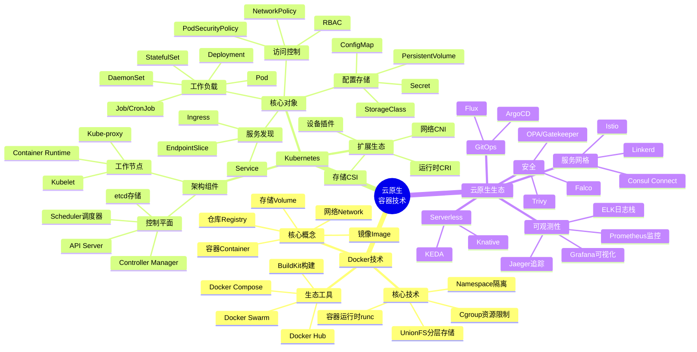

**图表解释**：

这张思维导图呈现了云原生容器技术的完整知识体系，分为三大主干：

- **Docker 技术**：从核心概念（镜像、容器、仓库）到底层技术（Namespace、Cgroup、UnionFS），再到生态工具链
- **Kubernetes**：详细展示了控制平面和工作节点的组件，以及各类核心 API 对象
- **云原生生态**：涵盖可观测性、服务网格、GitOps、Serverless 和安全等关键领域

---

### 1.2 K8s 学习路径图（从入门到专家）

```mermaid
graph TD
    subgraph 入门阶段[入门阶段 - 1-2周]
        A1[容器基础] --> A2[Docker操作]
        A2 --> A3[Dockerfile编写]
        A3 --> A4[多容器应用]
        A4 --> A5[Docker Compose]
    end

    subgraph 基础阶段[基础阶段 - 2-3周]
        B1[K8s架构理解] --> B2[kubectl命令]
        B2 --> B3[Pod生命周期]
        B3 --> B4[Deployment管理]
        B4 --> B5[Service暴露]
        B5 --> B6[ConfigMap/Secret]
    end

    subgraph 进阶阶段[进阶阶段 - 3-4周]
        C1[StatefulSet有状态] --> C2[DaemonSet守护]
        C2 --> C3[Job批处理]
        C3 --> C4[存储管理PV/PVC]
        C4 --> C5[网络策略]
        C5 --> C6[RBAC权限]
    end

    subgraph 高级阶段[高级阶段 - 4-6周]
        D1[Helm包管理] --> D2[Operator开发]
        D2 --> D3[CRD自定义资源]
        D3 --> D4[调度器定制]
        D4 --> D5[准入控制器]
        D5 --> D6[API聚合]
    end

    subgraph 专家阶段[专家阶段 - 持续]
        E1[集群性能调优] --> E2[大规模集群设计]
        E2 --> E3[多集群联邦]
        E3 --> E4[服务网格集成]
        E4 --> E5[安全加固]
        E5 --> E6[源码贡献]
    end

    A5 --> B1
    B6 --> C1
    C6 --> D1
    D6 --> E1

    style 入门阶段 fill:#e1f5fe
    style 基础阶段 fill:#fff3e0
    style 进阶阶段 fill:#e8f5e9
    style 高级阶段 fill:#fce4ec
    style 专家阶段 fill:#f3e5f5
```

**学习路径说明**：

| 阶段 | 时长 | 核心目标 | 关键技能 |
|------|------|----------|----------|
| 入门阶段 | 1-2周 | 掌握容器基础 | Dockerfile、Compose、镜像管理 |
| 基础阶段 | 2-3周 | 理解K8s核心 | Pod、Deployment、Service |
| 进阶阶段 | 3-4周 | 掌握高级资源 | StatefulSet、存储、网络、RBAC |
| 高级阶段 | 4-6周 | 深入扩展机制 | Helm、Operator、CRD、调度器 |
| 专家阶段 | 持续 | 系统架构能力 | 性能调优、多集群、安全、源码 |

---

### 1.3 云原生技术栈全景

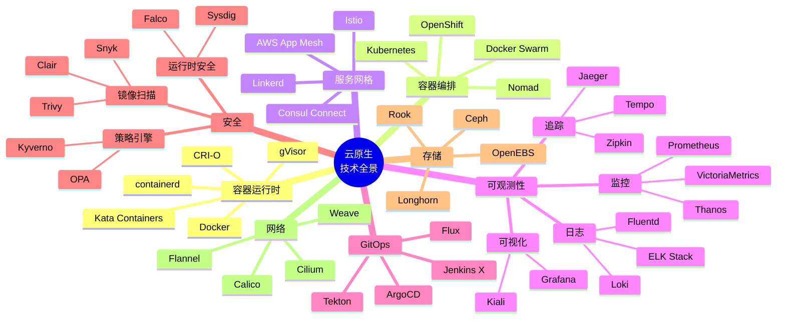

---

## 2. 决策树

### 2.1 容器运行时选型决策树

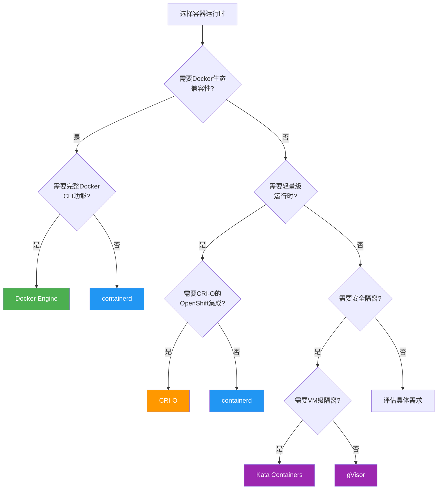

**选型对比表**：

| 运行时 | 适用场景 | 资源占用 | 安全隔离 | 启动速度 | K8s支持 |
|--------|----------|----------|----------|----------|---------|
| Docker | 开发测试、传统应用 | 中等 | 进程级 | 快 | 优秀 |
| containerd | 生产环境、云原生 | 低 | 进程级 | 快 | 优秀 |
| CRI-O | OpenShift、红帽生态 | 低 | 进程级 | 快 | 优秀 |
| Kata | 多租户、高安全要求 | 高 | VM级 | 较慢 | 良好 |
| gVisor | 不可信代码运行 | 中等 | 沙箱级 | 中等 | 良好 |

---

### 2.2 CNI 插件选型决策树

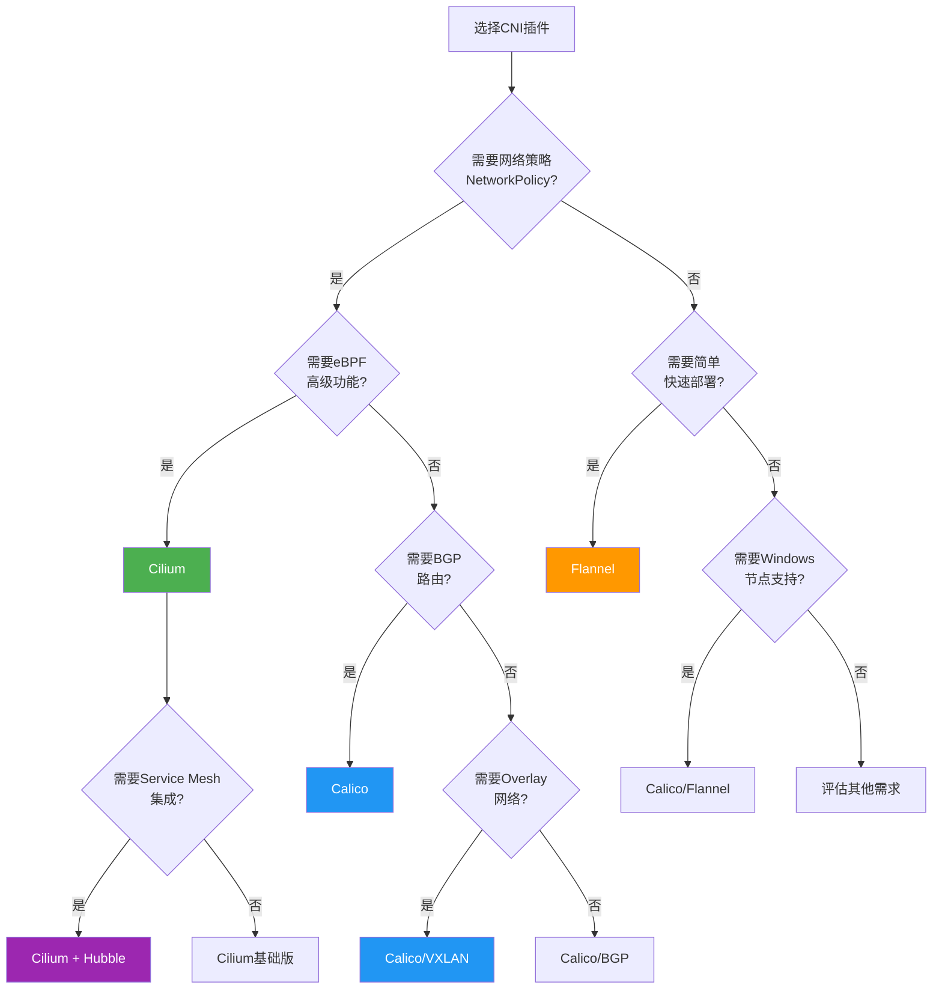

**CNI 插件对比**：

| 插件 | 网络模式 | 策略支持 | 性能 | 复杂度 | 最佳场景 |
|------|----------|----------|------|--------|----------|
| Calico | BGP/VXLAN | 优秀 | 高 | 中 | 大规模生产 |
| Cilium | eBPF/XDP | 优秀 | 极高 | 高 | 云原生高级场景 |
| Flannel | VXLAN/UDP | 无 | 中 | 低 | 小型集群、测试 |
| Weave | Overlay | 良好 | 中 | 低 | 多主机Docker |
| Antrea | OVS | 优秀 | 高 | 中 | VMware生态 |

---

### 2.3 存储方案选型决策树

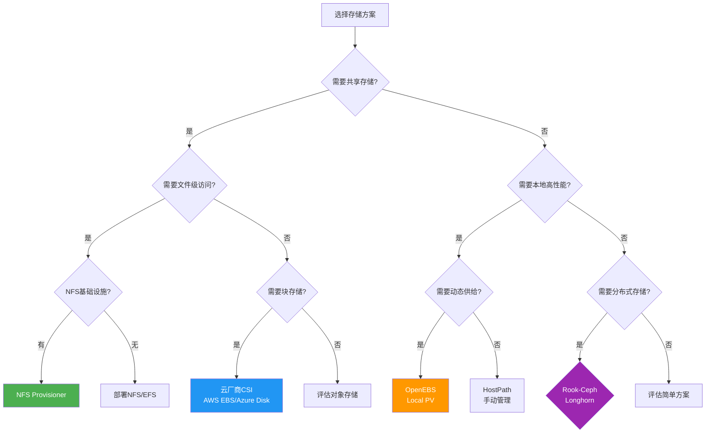

---

### 2.4 服务网格选型决策树

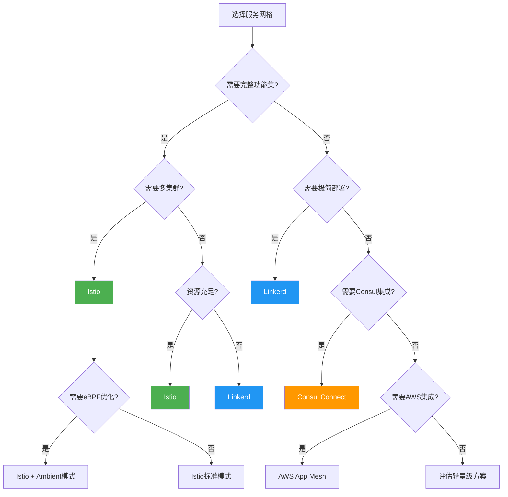

---

### 2.5 故障排查决策树

#### Pod 启动失败排查

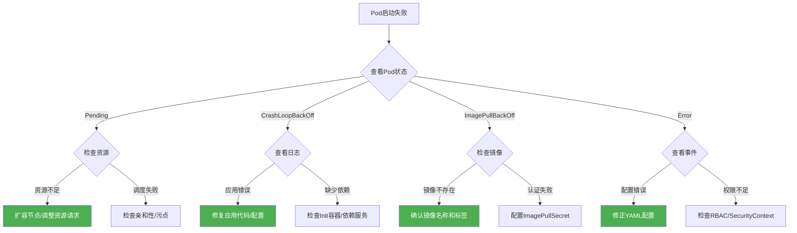

#### 网络不通排查

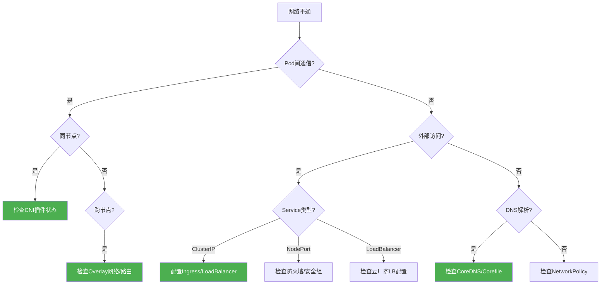

---

## 3. 语法语义树

### 3.1 YAML 配置结构树

#### Pod 配置结构

```mermaid
graph TD
    Pod[Pod] --> Metadata[metadata]
    Pod --> Spec[spec]
    Pod --> Status[status]

    Metadata --> Name[name]
    Metadata --> Namespace[namespace]
    Metadata --> Labels[labels]
    Metadata --> Annotations[annotations]

    Spec --> Containers[containers[]]
    Spec --> InitContainers[initContainers[]]
    Spec --> Volumes[volumes[]]
    Spec --> NodeSelector[nodeSelector]
    Spec --> Affinity[affinity]
    Spec --> Tolerations[tolerations[]]
    Spec --> SecurityContext[securityContext]

    Containers --> ContainerName[name]
    Containers --> Image[image]
    Containers --> Command[command]
    Containers --> Args[args]
    Containers --> Ports[ports[]]
    Containers --> Env[env[]]
    Containers --> Resources[resources]
    Containers --> VolumeMounts[volumeMounts[]]
    Containers --> LivenessProbe[livenessProbe]
    Containers --> ReadinessProbe[readinessProbe]
    Containers --> StartupProbe[startupProbe]

    Resources --> Limits[limits]
    Resources --> Requests[requests]
    Limits --> CPULimit[cpu]
    Limits --> MemoryLimit[memory]

    Status --> Phase[phase]
    Status --> Conditions[conditions[]]
    Status --> PodIP[podIP]
    Status --> ContainerStatuses[containerStatuses[]]

    style Pod fill:#e3f2fd
    style Metadata fill:#fff3e0
    style Spec fill:#e8f5e9
    style Status fill:#fce4ec
```

#### Deployment 配置结构

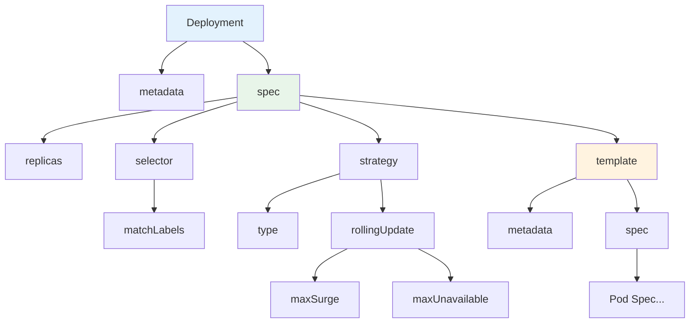

#### Service 配置结构

```mermaid
graph TD
    Svc[Service] --> SMetadata[metadata]
    Svc --> SSpec[spec]
    Svc --> SStatus[status]

    SSpec --> SType[type]
    SSpec --> Ports[ports[]]
    SSpec --> Selector[selector]
    SSpec --> ClusterIP[clusterIP]
    SSpec --> ExternalIPs[externalIPs]
    SSpec --> LoadBalancerIP[loadBalancerIP]

    Ports --> Port[port]
    Ports --> TargetPort[targetPort]
    Ports --> NodePort[nodePort]
    Ports --> Protocol[protocol]

    SType --> ClusterIPType[ClusterIP]
    SType --> NodePortType[NodePort]
    SType --> LoadBalancerType[LoadBalancer]
    SType --> ExternalNameType[ExternalName]

    style Svc fill:#e3f2fd
    style SSpec fill:#e8f5e9
    style SType fill:#fff3e0
```

---

### 3.2 API 对象层次关系树

```mermaid
graph TD
    Root[Kubernetes API] --> Core[Core API Group]
    Root --> Apps[Apps API Group]
    Root --> Batch[Batch API Group]
    Root --> Networking[Networking API Group]
    Root --> RBAC[RBAC API Group]
    Root --> Storage[Storage API Group]
    Root --> Autoscaling[Autoscaling API Group]

    Core --> Pod[Pod v1]
    Core --> Service[Service v1]
    Core --> ConfigMap[ConfigMap v1]
    Core --> Secret[Secret v1]
    Core --> Node[Node v1]
    Core --> Namespace[Namespace v1]
    Core --> PersistentVolume[PersistentVolume v1]
    Core --> PersistentVolumeClaim[PVC v1]

    Apps --> Deployment[Deployment v1]
    Apps --> StatefulSet[StatefulSet v1]
    Apps --> DaemonSet[DaemonSet v1]
    Apps --> ReplicaSet[ReplicaSet v1]

    Batch --> Job[Job v1]
    Batch --> CronJob[CronJob v1]

    Networking --> Ingress[Ingress v1]
    Networking --> NetworkPolicy[NetworkPolicy v1]
    Networking --> IngressClass[IngressClass v1]

    RBAC --> Role[Role v1]
    RBAC --> ClusterRole[ClusterRole v1]
    RBAC --> RoleBinding[RoleBinding v1]
    RBAC --> ClusterRoleBinding[ClusterRoleBinding v1]

    Storage --> StorageClass[StorageClass v1]
    Storage --> VolumeAttachment[VolumeAttachment v1]
    Storage --> CSIDriver[CSIDriver v1]
    Storage --> CSINode[CSINode v1]

    Autoscaling --> HPA[HorizontalPodAutoscaler v2]
    Autoscaling --> VPA[VerticalPodAutoscaler v1]

    Deployment --> RS[ReplicaSet]
    RS --> Pod
    StatefulSet --> Pod
    DaemonSet --> Pod
    Job --> Pod

    Service --> EndpointSlice[EndpointSlice]
    EndpointSlice --> Pod

    style Root fill:#e3f2fd
    style Core fill:#fff3e0
    style Apps fill:#e8f5e9
    style Networking fill:#fce4ec
    style RBAC fill:#f3e5f5
```

---

### 3.3 Label 与 Selector 匹配树

```mermaid
graph TD
    LabelSystem[Label系统] --> Label[Label标签]
    LabelSystem --> Selector[Selector选择器]

    Label --> KV[键值对]
    KV --> Key[键: 规范命名]
    KV --> Value[值: 63字符限制]
    KV --> Syntax[语法规则]

    Syntax --> Prefix[前缀: dns.io/name]
    Syntax --> Name[名称: 63字符]
    Syntax --> ValidChars[合法字符: alphanumeric, -, _, .]

    Selector --> Equality[等值选择器]
    Selector --> Set[集合选择器]

    Equality --> Equal[app=nginx]
    Equality --> NotEqual[tier!=frontend]

    Set --> In[app in (nginx, apache)]
    Set --> NotIn[env notin (dev, test)]
    Set --> Exists[app]
    Set --> NotExists[!deprecated]

    Selector --> Match[匹配逻辑]
    Match --> And[AND: 所有条件满足]
    Match --> MultiSelector[多选择器组合]

    style LabelSystem fill:#e3f2fd
    style Label fill:#fff3e0
    style Selector fill:#e8f5e9
```

**Label 匹配示例**：

```yaml
# Pod 标签
metadata:
  labels:
    app: nginx
    tier: frontend
    env: production

# Service 选择器
selector:
  app: nginx        # 匹配 app=nginx
  tier: frontend    # 同时匹配 tier=frontend

# Deployment 选择器
selector:
  matchLabels:
    app: nginx
  matchExpressions:
    - key: tier
      operator: In
      values: [frontend, backend]
```

---

## 4. UML 图

### 4.1 类图：核心 API 对象关系

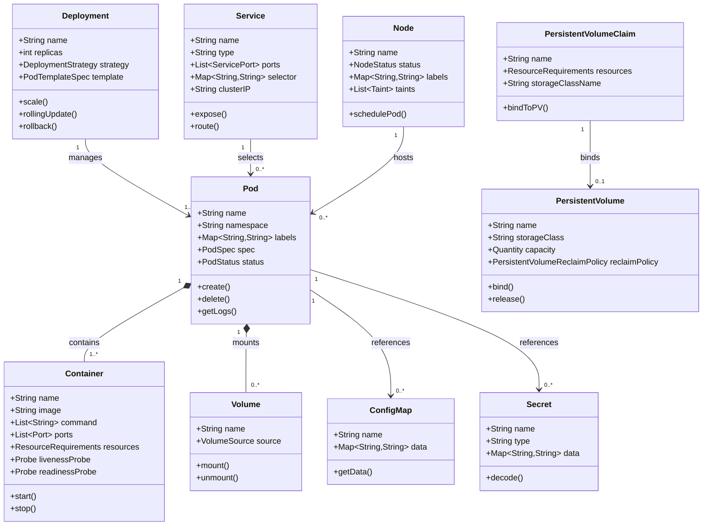

---

### 4.2 时序图

#### Pod 创建完整流程

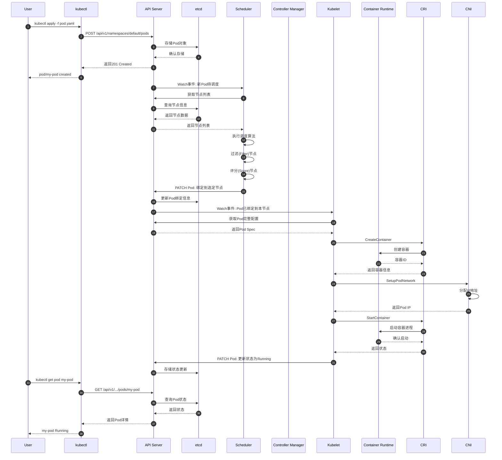

#### Service 请求处理流程

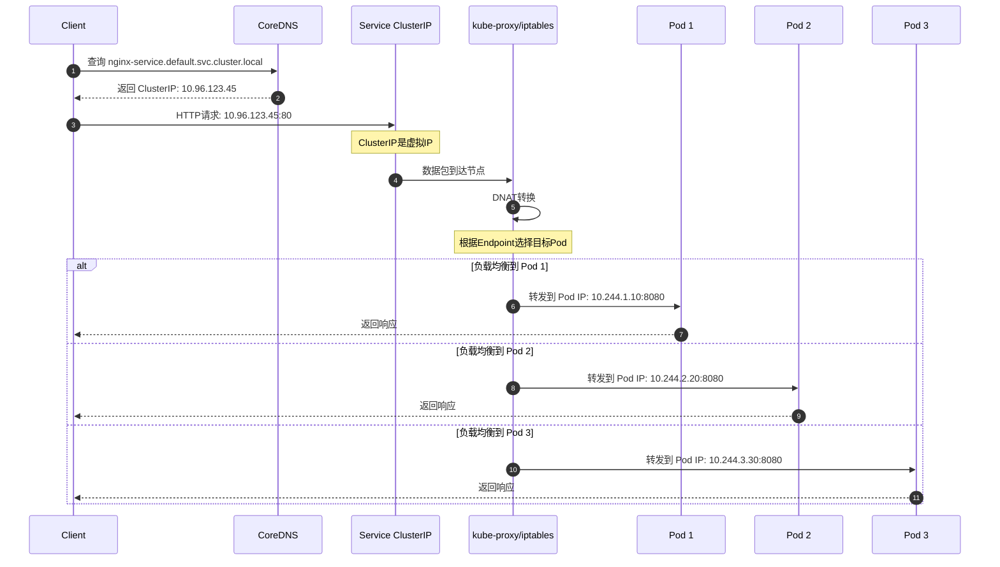

#### ConfigMap 更新传播流程

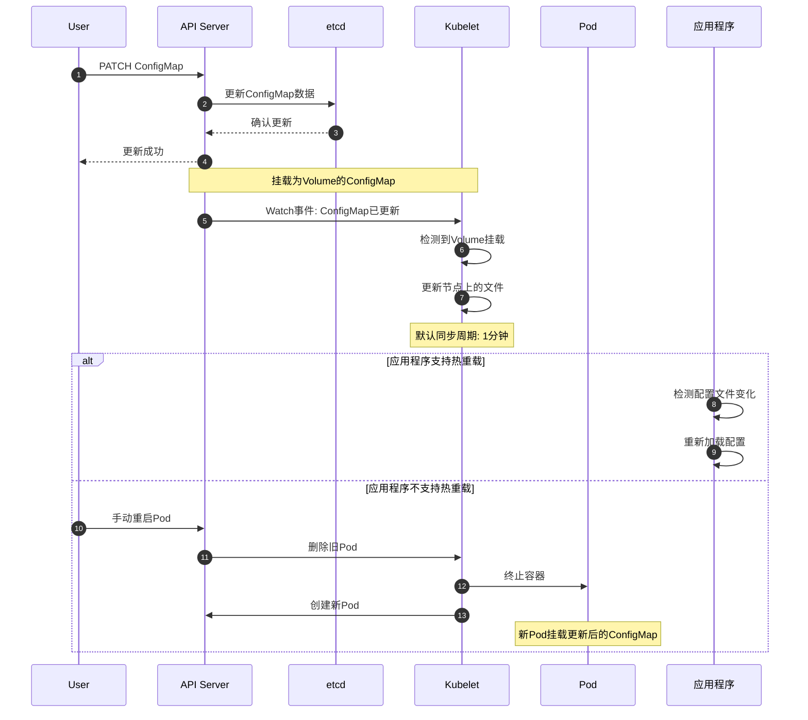

---

### 4.3 状态图

#### Pod 生命周期状态转换

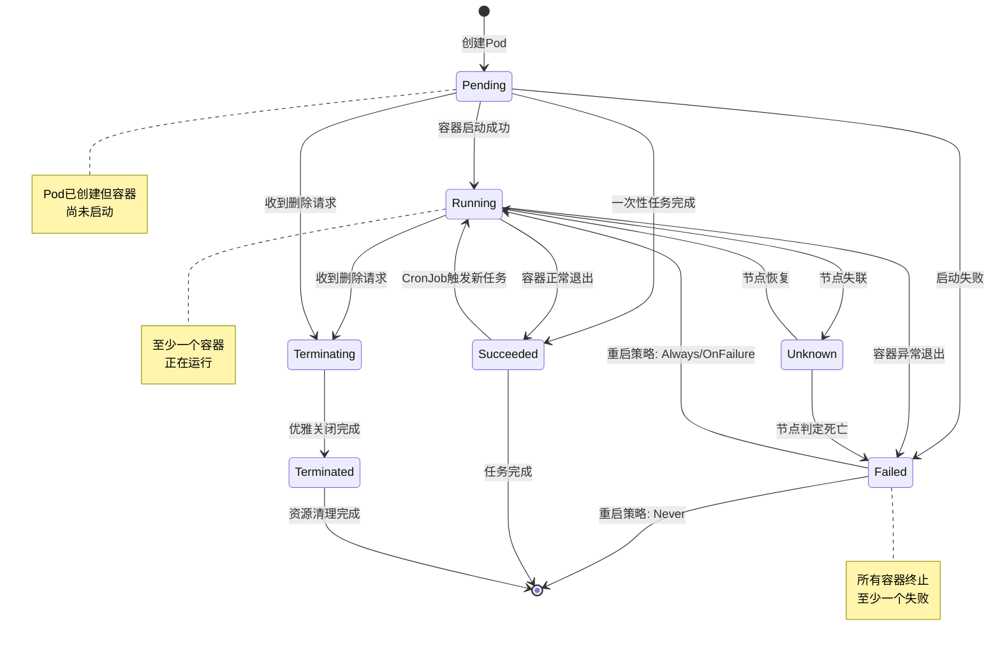

**Pod 状态详解**：

| 状态 | 含义 | 常见原因 |
|------|------|----------|
| Pending | 等待调度或容器创建 | 资源不足、镜像拉取中 |
| Running | 至少一个容器运行中 | 正常状态 |
| Succeeded | 所有容器成功退出 | Job完成 |
| Failed | 至少一个容器失败退出 | 应用错误、OOM |
| Unknown | 无法获取Pod状态 | 节点失联 |
| Terminating | 正在删除中 | 正常删除流程 |

#### Deployment 滚动更新状态

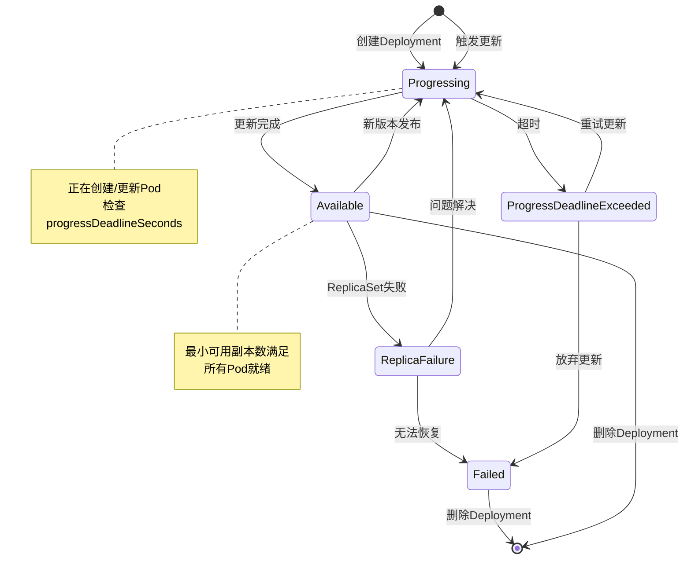

---

### 4.4 组件图：K8s 系统组件关系

```mermaid
graph TB
    subgraph ControlPlane[控制平面 Control Plane]
        APIServer[API Server]
        etcd[(etcd)]
        Scheduler[Scheduler]
        CM[Controller Manager]
        CCM[Cloud Controller Manager]

        APIServer <-->|读写| etcd
        Scheduler -->|监听| APIServer
        CM -->|监听| APIServer
        CCM -->|监听| APIServer
    end

    subgraph WorkerNode1[工作节点 1]
        Kubelet1[Kubelet]
        KProxy1[kube-proxy]
        Runtime1[Container Runtime]

        Kubelet1 -->|CRI| Runtime1
    end

    subgraph WorkerNode2[工作节点 2]
        Kubelet2[Kubelet]
        KProxy2[kube-proxy]
        Runtime2[Container Runtime]

        Kubelet2 -->|CRI| Runtime2
    end

    subgraph WorkerNodeN[工作节点 N]
        KubeletN[Kubelet]
        KProxyN[kube-proxy]
        RuntimeN[Container Runtime]

        KubeletN -->|CRI| RuntimeN
    end

    Kubelet1 -->|注册/汇报| APIServer
    Kubelet2 -->|注册/汇报| APIServer
    KubeletN -->|注册/汇报| APIServer

    KProxy1 -->|监听| APIServer
    KProxy2 -->|监听| APIServer
    KProxyN -->|监听| APIServer

    subgraph Addons[集群插件]
        DNS[CoreDNS]
        Dashboard[Dashboard]
        Ingress[Ingress Controller]
        Network[CNI Plugin]
    end

    DNS -->|查询| APIServer
    Dashboard -->|API调用| APIServer
    Ingress -->|监听| APIServer

    style ControlPlane fill:#e3f2fd
    style WorkerNode1 fill:#e8f5e9
    style WorkerNode2 fill:#e8f5e9
    style WorkerNodeN fill:#e8f5e9
    style Addons fill:#fff3e0
```

---

### 4.5 部署图：多环境部署架构

```mermaid
graph TB
    subgraph Dev[开发环境]
        DevCP[单节点控制平面]
        DevNode1[工作节点]
        DevApps[开发应用]

        DevCP --> DevNode1
        DevNode1 --> DevApps
    end

    subgraph Test[测试环境]
        TestCP[高可用控制平面]
        TestNode1[工作节点]
        TestNode2[工作节点]
        TestApps[测试应用]

        TestCP --> TestNode1
        TestCP --> TestNode2
        TestNode1 --> TestApps
        TestNode2 --> TestApps
    end

    subgraph Staging[预发布环境]
        StageCP[高可用控制平面]
        StageNode1[工作节点]
        StageNode2[工作节点]
        StageNode3[工作节点]
        StageApps[预发布应用]

        StageCP --> StageNode1
        StageCP --> StageNode2
        StageCP --> StageNode3
        StageNode1 --> StageApps
        StageNode2 --> StageApps
        StageNode3 --> StageApps
    end

    subgraph Prod[生产环境]
        ProdCP[多区域控制平面]
        ProdNode1[区域A节点]
        ProdNode2[区域A节点]
        ProdNode3[区域B节点]
        ProdNode4[区域B节点]
        ProdApps[生产应用]

        ProdCP --> ProdNode1
        ProdCP --> ProdNode2
        ProdCP --> ProdNode3
        ProdCP --> ProdNode4
        ProdNode1 --> ProdApps
        ProdNode2 --> ProdApps
        ProdNode3 --> ProdApps
        ProdNode4 --> ProdApps
    end

    Dev -->|镜像晋升| Test
    Test -->|镜像晋升| Staging
    Staging -->|镜像晋升| Prod

    style Dev fill:#e8f5e9
    style Test fill:#fff3e0
    style Staging fill:#e1f5fe
    style Prod fill:#ffebee
```

---

## 5. 场景应用图

### 5.1 微服务架构图：典型电商系统

```mermaid
graph TB
    subgraph UserLayer[用户接入层]
        CDN[CDN静态资源]
        WAF[WAF防火墙]
        LB[负载均衡器]
    end

    subgraph GatewayLayer[网关层]
        Ingress[Ingress Controller]
        APIGateway[API Gateway]
        Auth[认证服务]
    end

    subgraph ServiceLayer[微服务层]
        subgraph Frontend[前端服务]
            WebApp[Web应用]
            MobileApp[移动应用]
            AdminApp[管理后台]
        end

        subgraph CoreServices[核心服务]
            UserService[用户服务]
            ProductService[商品服务]
            OrderService[订单服务]
            PaymentService[支付服务]
            InventoryService[库存服务]
        end

        subgraph SupportServices[支撑服务]
            SearchService[搜索服务]
            RecommendService[推荐服务]
            MessageService[消息服务]
            FileService[文件服务]
        end
    end

    subgraph DataLayer[数据层]
        subgraph Database[数据库]
            UserDB[(用户数据库)]
            ProductDB[(商品数据库)]
            OrderDB[(订单数据库)]
            Cache[(Redis缓存)]
        end

        subgraph MessageQueue[消息队列]
            Kafka[Kafka集群]
            RabbitMQ[RabbitMQ]
        end

        subgraph SearchEngine[搜索引擎]
            ES[Elasticsearch]
        end
    end

    subgraph Observability[可观测性]
        Prometheus[Prometheus监控]
        Grafana[Grafana可视化]
        ELK[ELK日志栈]
        Jaeger[Jaeger追踪]
    end

    CDN --> Ingress
    WAF --> Ingress
    LB --> Ingress
    Ingress --> APIGateway
    APIGateway --> Auth

    APIGateway --> WebApp
    APIGateway --> MobileApp
    APIGateway --> AdminApp

    WebApp --> UserService
    WebApp --> ProductService
    WebApp --> OrderService

    OrderService --> PaymentService
    OrderService --> InventoryService
    OrderService --> MessageService

    ProductService --> SearchService
    ProductService --> RecommendService

    UserService --> UserDB
    ProductService --> ProductDB
    OrderService --> OrderDB

    UserService --> Cache
    ProductService --> Cache

    SearchService --> ES
    MessageService --> Kafka
    MessageService --> RabbitMQ

    style UserLayer fill:#e3f2fd
    style GatewayLayer fill:#fff3e0
    style ServiceLayer fill:#e8f5e9
    style DataLayer fill:#fce4ec
```

---

### 5.2 CI/CD 流水线图：GitOps 工作流

```mermaid
graph LR
    subgraph Source[源码管理]
        GitRepo[Git仓库]
        AppCode[应用代码]
        K8sManifests[K8s配置]
        PipelineConfig[流水线配置]
    end

    subgraph CI[持续集成]
        Trigger[Webhook触发]
        Build[构建镜像]
        Test[运行测试]
        Scan[安全扫描]
        Push[推送镜像]
        UpdateManifest[更新配置]
    end

    subgraph Registry[镜像仓库]
        Harbor[Harbor镜像库]
        ImageTag[镜像标签]
    end

    subgraph GitOps[GitOps引擎]
        ArgoCD[ArgoCD]
        Flux[Flux]
    end

    subgraph K8s[Kubernetes集群]
        App[应用工作负载]
        Config[配置文件]
    end

    GitRepo --> Trigger
    AppCode --> Build
    Build --> Test
    Test --> Scan
    Scan --> Push
    Push --> Harbor
    Push --> UpdateManifest
    K8sManifests --> UpdateManifest

    UpdateManifest --> GitRepo
    GitRepo --> ArgoCD
    GitRepo --> Flux

    ArgoCD --> App
    Flux --> App
    Harbor --> App

    style Source fill:#e3f2fd
    style CI fill:#e8f5e9
    style GitOps fill:#fff3e0
    style K8s fill:#fce4ec
```

**GitOps 工作流详解**：

| 阶段 | 工具 | 职责 |
|------|------|------|
| 源码管理 | GitLab/GitHub | 代码版本控制、协作 |
| CI构建 | Jenkins/Tekton | 镜像构建、测试、扫描 |
| 镜像仓库 | Harbor/ACR | 镜像存储、安全扫描 |
| GitOps引擎 | ArgoCD/Flux | 配置同步、自动部署 |
| K8s集群 | Kubernetes | 应用运行、生命周期管理 |

---

### 5.3 可观测性架构图

```mermaid
graph TB
    subgraph DataSources[数据源]
        AppMetrics[应用指标]
        SystemMetrics[系统指标]
        Logs[应用日志]
        Traces[调用链路]
        Events[K8s事件]
    end

    subgraph Collection[数据采集]
        PrometheusAgent[Prometheus Agent]
        FluentBit[Fluent Bit]
        OTelCollector[OpenTelemetry Collector]
        NodeExporter[Node Exporter]
        Cadvisor[cAdvisor]
    end

    subgraph Storage[数据存储]
        PrometheusTSDB[(Prometheus TSDB)]
        Thanos[(Thanos)]
        Loki[(Loki)]
        Tempo[(Tempo)]
        Elasticsearch[(Elasticsearch)]
    end

    subgraph Analysis[数据分析]
        AlertManager[Alert Manager]
        RecordingRules[Recording Rules]
        LogQL[LogQL查询]
        TraceQL[TraceQL查询]
    end

    subgraph Visualization[可视化]
        Grafana[Grafana Dashboard]
        AlertChannel[告警通道]
        Kiali[Kiali服务网格]
        JaegerUI[Jaeger UI]
    end

    AppMetrics --> OTelCollector
    SystemMetrics --> NodeExporter
    SystemMetrics --> Cadvisor
    Logs --> FluentBit
    Traces --> OTelCollector
    Events --> PrometheusAgent

    PrometheusAgent --> PrometheusTSDB
    NodeExporter --> PrometheusTSDB
    Cadvisor --> PrometheusTSDB
    FluentBit --> Loki
    FluentBit --> Elasticsearch
    OTelCollector --> Tempo

    PrometheusTSDB --> Thanos
    PrometheusTSDB --> AlertManager
    PrometheusTSDB --> RecordingRules

    Thanos --> Grafana
    Loki --> Grafana
    Tempo --> Grafana
    Elasticsearch --> Grafana

    AlertManager --> AlertChannel
    AlertChannel --> Slack
    AlertChannel --> PagerDuty
    AlertChannel --> Email

    style DataSources fill:#e3f2fd
    style Collection fill:#e8f5e9
    style Storage fill:#fff3e0
    style Visualization fill:#fce4ec
```

---

### 5.4 多集群架构图

```mermaid
graph TB
    subgraph GlobalControl[全局控制层]
        Karmada[Karmada控制平面]
        Federation[Federation v2]
        GlobalLB[全局负载均衡]
        GlobalDNS[全局DNS]
    end

    subgraph ClusterA[集群A - 北京]
        CP1[控制平面]
        NodeA1[工作节点]
        NodeA2[工作节点]
        AppA[应用副本]
    end

    subgraph ClusterB[集群B - 上海]
        CP2[控制平面]
        NodeB1[工作节点]
        NodeB2[工作节点]
        AppB[应用副本]
    end

    subgraph ClusterC[集群C - 新加坡]
        CP3[控制平面]
        NodeC1[工作节点]
        NodeC2[工作节点]
        AppC[应用副本]
    end

    subgraph DRCluster[灾备集群 - 香港]
        CP4[控制平面]
        NodeDR[工作节点]
        AppDR[灾备应用]
    end

    Karmada --> CP1
    Karmada --> CP2
    Karmada --> CP3
    Karmada --> CP4

    GlobalLB --> ClusterA
    GlobalLB --> ClusterB
    GlobalLB --> ClusterC

    ClusterA -.->|数据复制| ClusterB
    ClusterB -.->|数据复制| ClusterC
    ClusterA -.->|灾备复制| DRCluster
    ClusterB -.->|灾备复制| DRCluster

    style GlobalControl fill:#e3f2fd
    style ClusterA fill:#e8f5e9
    style ClusterB fill:#fff3e0
    style ClusterC fill:#fce4ec
    style DRCluster fill:#ffebee
```

---

### 5.5 边缘计算架构图

```mermaid
graph TB
    subgraph Cloud[云端 - 中心云]
        CloudK8s[云原生K8s集群]
        CloudApps[云端应用]
        DataCenter[数据中心]
        AI[AI训练平台]
    end

    subgraph Edge[边缘层]
        subgraph EdgeSite1[边缘站点1]
            EdgeK8s1[K3s/Edge K8s]
            EdgeApp1[边缘应用]
            IoTDevice1[IoT设备]
            Gateway1[边缘网关]
        end

        subgraph EdgeSite2[边缘站点2]
            EdgeK8s2[K3s/Edge K8s]
            EdgeApp2[边缘应用]
            IoTDevice2[IoT设备]
            Gateway2[边缘网关]
        end

        subgraph EdgeSiteN[边缘站点N]
            EdgeK8sN[K3s/Edge K8s]
            EdgeAppN[边缘应用]
            IoTDeviceN[IoT设备]
            GatewayN[边缘网关]
        end
    end

    subgraph DeviceLayer[设备层]
        Sensors[传感器]
        Cameras[摄像头]
        Actuators[执行器]
        Vehicles[车联网设备]
    end

    CloudK8s <-->|KubeEdge/SuperEdge| EdgeK8s1
    CloudK8s <-->|KubeEdge/SuperEdge| EdgeK8s2
    CloudK8s <-->|KubeEdge/SuperEdge| EdgeK8sN

    EdgeK8s1 --> Gateway1
    EdgeK8s2 --> Gateway2
    EdgeK8sN --> GatewayN

    Gateway1 --> Sensors
    Gateway1 --> Cameras
    Gateway2 --> Actuators
    GatewayN --> Vehicles

    EdgeApp1 -.->|数据上报| DataCenter
    EdgeApp2 -.->|数据上报| DataCenter
    EdgeAppN -.->|数据上报| DataCenter

    AI -.->|模型下发| EdgeApp1
    AI -.->|模型下发| EdgeApp2
    AI -.->|模型下发| EdgeAppN

    style Cloud fill:#e3f2fd
    style Edge fill:#e8f5e9
    style DeviceLayer fill:#fff3e0
```

---

## 6. 谱系图

### 6.1 技术演进时间线

```mermaid
timeline
    title 容器技术发展历程

    section 2000s
        2000 : FreeBSD Jails
             : 操作系统级虚拟化雏形
        2004 : Solaris Zones
             : 资源隔离和配额管理
        2006 : Linux VServer
             : Linux内核虚拟化
        2008 : LXC (Linux Containers)
             : 完整的容器运行时

    section 2010-2013
        2013 : Docker发布
             : 容器技术大众化
             : 镜像分层存储
        2014 : Kubernetes发布
             : Google Borg开源
             : 容器编排标准

    section 2015-2016
        2015 : CNCF成立
             : OCI标准发布
             : runC运行时
        2016 : CRI标准
             : containerd捐赠
             : CNI规范

    section 2017-2018
        2017 : Kubernetes胜利
             : 所有云厂商支持
             : 1.0版本发布
        2018 : Service Mesh兴起
             : Istio发布
             : Knative发布

    section 2019-2020
        2019 : Kubernetes 1.14
             : Windows容器GA
             : CRD成为主流
        2020 : Kubernetes 1.19
             : Ingress v1 GA
             : 存储快照GA

    section 2021-2022
        2021 : Kubernetes 1.22
             : PodSecurity废弃
             : CSI迁移完成
        2022 : Kubernetes 1.24
             : Dockershim移除
             : 容器运行时接口

    section 2023-2024
        2023 : Kubernetes 1.28
             : Sidecar容器
             : 混合节点支持
        2024 : Kubernetes 1.29+
             : 原地升级
             : 多集群管理
```

---

### 6.2 CNCF 项目全景

```mermaid
mindmap
  root((CNCF<br/>项目全景))
    已毕业项目
      编排
        Kubernetes
      服务代理
        Envoy
      服务网格
        Istio
      监控
        Prometheus
      日志
        Fluentd
      追踪
        Jaeger
      容器运行时
        containerd
      存储
        Rook
      网络
        CoreDNS
      镜像仓库
        Harbor
      构建
        Buildpacks
      GitOps
        Argo
    孵化项目
      网络
        Cilium
        Contour
      存储
        Longhorn
        OpenEBS
      安全
        Falco
        Trivy
      可观测性
        Thanos
        Cortex
      GitOps
        Flux
      Serverless
        Knative
        KEDA
    沙箱项目
      新兴技术
        Cluster API
        KubeEdge
        Litmus
        Keptn
        Backstage
      实验项目
        持续增加中
```

**CNCF 项目成熟度说明**：

| 级别 | 要求 | 代表项目 |
|------|------|----------|
| 沙箱 | 创新项目、早期阶段 | 100+ 项目 |
| 孵化 | 生产使用、活跃社区 | 30+ 项目 |
| 毕业 | 广泛采用、成熟稳定 | 20+ 项目 |

---

### 6.3 K8s 版本演进重要特性

```mermaid
timeline
    title Kubernetes 重要特性演进

    section 1.0-1.5
        1.0 : 首个GA版本
        1.2 : DaemonSet/Deployment/Jobs
        1.3 : PetSets(后改名StatefulSet)
        1.4 : Cluster Federation
        1.5 : StatefulSets GA
            : Windows容器支持

    section 1.6-1.10
        1.6 : RBAC GA
        1.7 : NetworkPolicy GA
        1.8 : Workloads API GA
        1.9 : Apps Workloads GA
        1.10 : CSI存储插件
             : CoreDNS默认

    section 1.11-1.15
        1.11 : 动态Kubelet配置
        1.12 : Kubelet TLS Bootstrap
        1.13 : CSI GA
        1.14 : Windows容器GA
        1.15 : CRD GA
             : 自定义资源

    section 1.16-1.20
        1.16 : 废弃API清理
        1.17 : CSI拓扑GA
        1.18 : IngressClass
        1.19 : Ingress GA
             : 存储快照GA
        1.20 : CronJob GA
             : 优雅节点关闭

    section 1.21-1.25
        1.21 : CronJob v2
             : 不可变Secrets
        1.22 : PodSecurity标准
             : 移除PodSecurityPolicy
        1.23 : IPv4/IPv6双栈GA
        1.24 : 移除Dockershim
             : 容器运行时接口
        1.25 : PodSecurity GA
             : cgroup v2支持

    section 1.26-1.30
        1.26 : 动态资源分配
        1.27 : 原地升级Alpha
        1.28 : Sidecar容器
             : 混合节点支持
        1.29 : 原地升级Beta
             : NFTables代理
        1.30 : Sidecar容器GA
             : 结构化授权
```

---

## 7. 对比分析图

### 7.1 容器 vs 虚拟机 vs Wasm 对比矩阵

```mermaid
graph LR
    subgraph Comparison[技术对比]
        direction TB

        subgraph Container[容器技术]
            Docker[Docker]
            Containerd[containerd]
        end

        subgraph VM[虚拟机技术]
            KVM[KVM]
            VMware[VMware]
            HyperV[Hyper-V]
        end

        subgraph Wasm[WebAssembly]
            WasmRuntime[Wasm Runtime]
            WASI[WASI接口]
        end
    end

    subgraph Metrics[评估维度]
        Startup[启动速度]
        Overhead[资源开销]
        Isolation[隔离级别]
        Portability[可移植性]
        Security[安全性]
        Ecosystem[生态系统]
    end

    Container -.->|快| Startup
    VM -.->|慢| Startup
    Wasm -.->|极快| Startup

    Container -.->|低| Overhead
    VM -.->|高| Overhead
    Wasm -.->|极低| Overhead

    Container -.->|进程级| Isolation
    VM -.->|硬件级| Isolation
    Wasm -.->|沙箱级| Isolation
```

**详细对比表**：

| 维度 | 容器 | 虚拟机 | WebAssembly |
|------|------|--------|-------------|
| 启动时间 | 秒级 | 分钟级 | 毫秒级 |
| 内存开销 | MB级 | GB级 | KB级 |
| 隔离级别 | 进程级 | 硬件级 | 沙箱级 |
| 镜像大小 | MB-GB | GB-TB | KB-MB |
| 可移植性 | 良好 | 差 | 优秀 |
| 安全性 | 中 | 高 | 高 |
| 生态系统 | 成熟 | 成熟 | 发展中 |
| 适用场景 | 微服务、云原生 | 传统应用、强隔离 | 边缘计算、Serverless |

---

### 7.2 各类 CNI 插件性能对比

```mermaid
xychart-beta
    title "CNI插件性能对比 (Pod-to-Pod延迟 - 越低越好)"
    x-axis [Calico-BGP, Calico-VXLAN, Cilium, Flannel, Weave]
    y-axis "延迟 (微秒)" 0 --> 100
    bar [15, 35, 12, 40, 45]

    title "吞吐量对比 (Gbps - 越高越好)"
    x-axis [Calico-BGP, Calico-VXLAN, Cilium, Flannel, Weave]
    y-axis "吞吐量 (Gbps)" 0 --> 25
    bar [22, 18, 24, 15, 14]
```

**CNI 插件详细对比**：

| 特性 | Calico | Cilium | Flannel | Weave | Antrea |
|------|--------|--------|---------|-------|--------|
| 网络模式 | BGP/VXLAN | eBPF/XDP | VXLAN/UDP | Overlay | OVS |
| 性能 | 高 | 极高 | 中 | 中 | 高 |
| 策略支持 | 优秀 | 优秀 | 无 | 良好 | 优秀 |
| 加密支持 | IPsec/WireGuard | WireGuard | 无 | 内置 | IPsec |
| 可观测性 | 良好 | 优秀(Hubble) | 基础 | 基础 | 良好 |
| 复杂度 | 中 | 高 | 低 | 低 | 中 |
| 适用规模 | 大规模 | 大规模 | 中小规模 | 中小规模 | 大规模 |

---

### 7.3 服务网格功能对比

```mermaid
graph TB
    subgraph ServiceMeshComparison[服务网格功能对比]
        direction LR

        subgraph Istio[Istio]
            I1[完整流量管理]
            I2[安全策略]
            I3[可观测性]
            I4[多集群]
            I5[高资源消耗]
        end

        subgraph Linkerd[Linkerd]
            L1[轻量级]
            L2[易部署]
            L3[自动mTLS]
            L4[基础流量管理]
            L5[低资源消耗]
        end

        subgraph Consul[Consul Connect]
            C1[服务发现集成]
            C2[多数据中心]
            C3[健康检查]
            C4[K/V存储]
            C5[HashiCorp生态]
        end

        subgraph AWSAppMesh[AWS App Mesh]
            A1[AWS原生集成]
            A2[托管服务]
            A3[Envoy代理]
            A4[CloudWatch集成]
            A5[AWS锁定]
        end
    end
```

**服务网格详细对比**：

| 功能 | Istio | Linkerd | Consul Connect | AWS App Mesh |
|------|-------|---------|----------------|--------------|
| 控制平面 | 复杂 | 简单 | 中等 | 托管 |
| 数据平面 | Envoy | Linkerd-proxy | Envoy | Envoy |
| 流量管理 | 完整 | 基础 | 中等 | 中等 |
| mTLS | 支持 | 自动 | 支持 | 支持 |
| 多集群 | 支持 | 有限 | 支持 | 有限 |
| 资源消耗 | 高 | 低 | 中 | 托管 |
| 学习曲线 | 陡峭 | 平缓 | 中等 | 平缓 |
| 社区活跃度 | 高 | 高 | 中 | AWS支持 |

---

## 8. 数据流图

### 8.1 请求在 K8s 集群中的完整流转

```mermaid
flowchart LR
    subgraph External[外部用户]
        User[用户请求]
    end

    subgraph IngressLayer[入口层]
        DNS[DNS解析]
        CDN[CDN加速]
        WAF[WAF防护]
        LB[负载均衡器]
    end

    subgraph K8sCluster[K8s集群]
        Ingress[Ingress Controller]

        subgraph ServiceMesh[服务网格层]
            Sidecar1[Envoy Sidecar]
            Sidecar2[Envoy Sidecar]
            Sidecar3[Envoy Sidecar]
        end

        subgraph Microservices[微服务层]
            Gateway[API Gateway]
            ServiceA[服务A]
            ServiceB[服务B]
            ServiceC[服务C]
        end

        subgraph DataLayer[数据层]
            Cache[Redis缓存]
            DB[(数据库)]
            MQ[消息队列]
        end
    end

    User --> DNS
    DNS --> CDN
    CDN --> WAF
    WAF --> LB
    LB --> Ingress

    Ingress --> Sidecar1
    Sidecar1 --> Gateway
    Gateway --> Sidecar2
    Sidecar2 --> ServiceA

    ServiceA --> Sidecar3
    Sidecar3 --> ServiceB
    ServiceA --> Cache
    ServiceB --> DB
    ServiceB --> MQ
    ServiceC --> MQ

    style External fill:#e3f2fd
    style IngressLayer fill:#fff3e0
    style K8sCluster fill:#e8f5e9
    style ServiceMesh fill:#fce4ec
```

**请求流转详解**：

| 阶段 | 组件 | 处理内容 |
|------|------|----------|
| 1. DNS解析 | CoreDNS/外部DNS | 域名解析为IP |
| 2. CDN加速 | CloudFlare等 | 静态资源缓存 |
| 3. WAF防护 | ModSecurity等 | 安全检测过滤 |
| 4. 负载均衡 | 云LB/Nginx | 流量分发 |
| 5. Ingress路由 | Ingress Controller | 路由规则匹配 |
| 6. 服务网格 | Istio/Linkerd | 流量管理、安全 |
| 7. 微服务调用 | 业务服务 | 业务逻辑处理 |
| 8. 数据访问 | 缓存/数据库 | 数据持久化 |

---

### 8.2 配置更新传播路径

```mermaid
flowchart TD
    subgraph Source[配置源]
        Git[Git仓库]
        ConfigFile[配置文件]
    end

    subgraph GitOps[GitOps引擎]
        ArgoCD[ArgoCD]
        Flux[FluxCD]
    end

    subgraph K8sControl[K8s控制平面]
        APIServer[API Server]
        etcd[(etcd)]
        Controller[Controller Manager]
    end

    subgraph Propagation[配置传播]
        Kubelet[Kubelet]
        KProxy[kube-proxy]
        Sidecar[Sidecar容器]
        App[应用程序]
    end

    Git --> ArgoCD
    ConfigFile --> Flux

    ArgoCD --> APIServer
    Flux --> APIServer

    APIServer --> etcd
    etcd --> APIServer

    APIServer --> Controller
    APIServer --> Kubelet
    APIServer --> KProxy

    Kubelet --> Sidecar
    Kubelet --> App

    style Source fill:#e3f2fd
    style GitOps fill:#e8f5e9
    style K8sControl fill:#fff3e0
    style Propagation fill:#fce4ec
```

**配置传播时序**：

| 步骤 | 组件 | 延迟 | 说明 |
|------|------|------|------|
| 1. 提交配置 | Git | 即时 | 开发者提交 |
| 2. 检测变更 | GitOps | 1-5分钟 | 轮询或Webhook |
| 3. 应用配置 | API Server | 秒级 | 资源创建/更新 |
| 4. 持久化 | etcd | 毫秒级 | 数据存储 |
| 5. 事件分发 | Watch机制 | 毫秒级 | 实时通知 |
| 6. 节点同步 | Kubelet | 1-60秒 | 配置同步周期 |
| 7. 应用重载 | 应用程序 | 依赖应用 | 热重载或重启 |

---

### 8.3 事件驱动数据流

```mermaid
flowchart TB
    subgraph EventSources[事件源]
        K8sEvents[K8s原生事件]
        AppEvents[应用事件]
        MetricsEvents[指标事件]
        LogEvents[日志事件]
    end

    subgraph EventBus[事件总线]
        Kafka[Kafka]
        RabbitMQ[RabbitMQ]
        NATS[NATS]
        EventBridge[EventBridge]
    end

    subgraph EventProcessing[事件处理]
        Streaming[流处理]
        Filtering[过滤路由]
        Enrichment[数据增强]
        Aggregation[聚合分析]
    end

    subgraph EventConsumers[事件消费者]
        Alerting[告警系统]
        Autoscaling[自动扩缩容]
        Notifications[通知系统]
        Analytics[分析平台]
    end

    K8sEvents --> Kafka
    AppEvents --> Kafka
    MetricsEvents --> NATS
    LogEvents --> RabbitMQ

    Kafka --> Streaming
    NATS --> Filtering
    RabbitMQ --> Enrichment

    Streaming --> Aggregation
    Filtering --> Alerting
    Enrichment --> Autoscaling
    Aggregation --> Analytics

    Alerting --> Notifications
    Autoscaling --> K8sEvents

    style EventSources fill:#e3f2fd
    style EventBus fill:#e8f5e9
    style EventProcessing fill:#fff3e0
    style EventConsumers fill:#fce4ec
```

**事件驱动场景**：

| 场景 | 事件源 | 处理逻辑 | 响应动作 |
|------|--------|----------|----------|
| Pod异常 | K8s Events | 检测CrashLoopBackOff | 告警通知 |
| 高CPU | Metrics | 阈值判断 | HPA扩容 |
| 错误日志 | Logs | 模式匹配 | 触发回滚 |
| 配置变更 | Git Events | 验证合规性 | 自动部署 |

---

## 附录：图表速查表

### Mermaid 图表类型速查

| 图表类型 | 用途 | 语法关键词 |
|----------|------|------------|
| 流程图 | 流程、决策 | flowchart |
| 时序图 | 交互过程 | sequenceDiagram |
| 类图 | 对象关系 | classDiagram |
| 状态图 | 状态转换 | stateDiagram-v2 |
| 思维导图 | 知识树 | mindmap |
| 时间线 | 演进历程 | timeline |
| 饼图 | 比例分布 | pie |
| 甘特图 | 项目计划 | gantt |

### 常用 K8s 资源关系速查

```
Deployment → ReplicaSet → Pod
StatefulSet → Pod
DaemonSet → Pod
Job → Pod
CronJob → Job → Pod

Service → EndpointSlice → Pod
Ingress → Service

PVC → PV
ConfigMap/Secret → Pod (Volume/Env)
```

---

*本章完*


---

## 第7章 全生态分析与未来展望

### 7.1 容器化与 WebAssembly 生态全景

#### 7.1.1 技术演进谱系

```
1960s          2000s          2013          2015          2019          2024
  |              |              |              |              |              |
  v              v              v              v              v              v
+-----+      +-----+      +--------+    +----------+    +--------+    +----------+
| 物理机 | -> | 虚拟机 | -> | Docker | -> | Kubernetes| -> | 服务网格 | -> | WASM+容器 |
+-----+      +-----+      +--------+    +----------+    +--------+    +----------+
   |              |              |              |              |              |
   |              |              |              |              |              |
进程隔离      硬件虚拟化    操作系统级     容器编排       流量管理       轻量级
chroot        VMware/KVM    容器化         平台          (Istio)       沙箱
                                                           |
                                                    +------+------+
                                                    |             |
                                                  Knative      WebAssembly
                                                  Serverless   运行时
```

#### 7.1.2 云原生生态组件矩阵

| 层次 | 核心项目 | 生态项目 | 标准规范 |
|------|---------|---------|---------|
| **运行时** | containerd, CRI-O | gVisor, Kata, WasmEdge | OCI Runtime Spec |
| **编排** | Kubernetes | OpenShift, Rancher | CNCF Graduated |
| **网络** | Cilium, Calico | Flannel, Weave | CNI Spec |
| **存储** | Rook, Longhorn | OpenEBS, Portworx | CSI Spec |
| **可观测性** | Prometheus, Grafana | Jaeger, Fluentd | OpenTelemetry |
| **服务网格** | Istio, Linkerd | Consul Connect, OSM | SMI Spec |
| **GitOps** | ArgoCD, Flux | Keptn, Flagger | GitOps Principles |
| **安全** | Falco, Trivy | OPA, Kyverno | OPA/Gatekeeper |

#### 7.1.3 WebAssembly 与容器对比

| 特性 | Docker 容器 | WebAssembly | 融合方案 |
|------|------------|-------------|---------|
| **启动时间** | 秒级 | 毫秒级 | 冷启动优化 |
| **体积** | 10MB-1GB | 1KB-10MB | 分层镜像 |
| **隔离级别** | 进程级 | 沙箱级 | 双重隔离 |
| **可移植性** | 依赖宿主机内核 | 完全可移植 | WASI 标准 |
| **语言支持** | 任意 | 编译型语言 | 多语言 SDK |
| **适用场景** | 长期服务 | 短时函数 | 混合工作负载 |

### 7.2 技术发展趋势

#### 7.2.1 2024-2026 关键趋势

1. **AI Native 基础设施**
   - GPU 调度优化 (NVIDIA GPU Operator)
   - 模型服务化 (KServe, Triton)
   - 训练流水线 (Kubeflow, MLflow)

2. **边缘计算融合**
   - K3s, KubeEdge, OpenYurt
   - 云边协同架构
   - 5G MEC 集成

3. **eBPF 革命**
   - 网络可观测性 (Cilium Hubble)
   - 安全策略执行 (Falco)
   - 性能优化 (BCC tools)

4. **平台工程崛起**
   - 内部开发者平台 (IDP)
   - Backstage 门户
   - 自服务基础设施

5. **供应链安全**
   - SBOM 生成与验证
   - 镜像签名 (Sigstore, Cosign)
   - 漏洞扫描集成

#### 7.2.2 技术成熟度曲线

```
创新触发期          期望膨胀期          幻灭低谷期          复苏爬坡期          生产成熟期
    |                  |                  |                  |                  |
    |  WebAssembly     |  服务网格        |  GitOps          |  Kubernetes      |  Docker
    |  边缘K8s         |  可观测性平台    |  Serverless      |  Prometheus      |  Helm
    |  FinOps          |  AIOps           |  混沌工程        |  CI/CD           |  Ingress
    |                  |                  |                  |                  |
    +------------------+------------------+------------------+------------------+
    2022              2023              2024              2025              2026
```

### 7.3 学习资源推荐

#### 7.3.1 官方文档

| 资源 | 链接 | 说明 |
|------|------|------|
| Kubernetes 官方文档 | https://kubernetes.io/docs | 最权威参考 |
| Docker 文档 | https://docs.docker.com | 容器基础 |
| CNCF 项目列表 | https://landscape.cncf.io | 生态全景 |
| OCI 规范 | https://opencontainers.org | 开放标准 |

#### 7.3.2 认证路径

```
入门                    进阶                    专家
 |                      |                       |
 v                      v                       v
+-------------+    +-------------+    +------------------+
| Docker      | -> | CKA         | -> | CKS (安全)       |
| Associate   |    | (管理员)    |    |                  |
+-------------+    +-------------+    +------------------+
      |                  |                       |
      v                  v                       v
+-------------+    +-------------+    +------------------+
| KCNA        |    | CKAD        |    | Kubestronaut     |
| (云原生)    |    | (开发者)    |    | (全认证)         |
+-------------+    +-------------+    +------------------+
```

#### 7.3.3 推荐书籍

- 《Kubernetes 权威指南》
- 《Docker 深度实践》
- 《云原生模式》
- 《Kubernetes 编程》
- 《Istio 服务网格解析》

---

## 附录

### A. 术语表

| 术语 | 英文 | 定义 |
|------|------|------|
| 容器 | Container | 操作系统级虚拟化技术，共享内核但资源隔离 |
| Pod | Pod | K8s 最小调度单元，包含一个或多个容器 |
| 节点 | Node | K8s 集群中的工作机器，可以是物理机或虚拟机 |
| 集群 | Cluster | 一组运行容器化应用的节点集合 |
| 命名空间 | Namespace | K8s 中资源隔离的逻辑分区 |
| 服务 | Service | K8s 中提供负载均衡和服务发现的抽象 |
| Ingress | Ingress | K8s 中管理外部访问的 API 对象 |
| 控制器 | Controller | 监控集群状态并作出响应的控制循环 |
| Operator | Operator | 封装运维知识的自定义控制器 |
| CRI | Container Runtime Interface | 容器运行时接口标准 |
| CNI | Container Network Interface | 容器网络接口标准 |
| CSI | Container Storage Interface | 容器存储接口标准 |
| CRD | Custom Resource Definition | 自定义资源定义 |
| WebAssembly | WASM | 可移植、高性能的二进制指令格式 |
| eBPF | Extended BPF | Linux 内核可编程框架 |
| GitOps | GitOps | 以 Git 为唯一事实来源的运维模式 |

### B. 数学符号表

| 符号 | 含义 | 应用领域 |
|------|------|---------|
| $\mathcal{C}$ | 范畴 | 范畴论 |
| $\text{Obj}(\mathcal{C})$ | 范畴的对象集合 | 范畴论 |
| $f: A \to B$ | 从 A 到 B 的态射 | 范畴论 |
| $\circ$ | 态射复合 | 范畴论 |
| $F: \mathcal{C} \to \mathcal{D}$ | 函子 | 范畴论 |
| $\alpha: F \Rightarrow G$ | 自然变换 | 范畴论 |
| $\prod$ | 积（Product） | 范畴论/类型论 |
| $\sum$ | 和（Coproduct） | 范畴论/类型论 |
| $\vdash$ | 推导 | 类型论 |
| $\Gamma \vdash e: \tau$ | 表达式 e 具有类型 $\tau$ | 类型论 |
| $\Box$ | 必然算子 | 时序逻辑 |
| $\Diamond$ | 可能算子 | 时序逻辑 |
| $\mathcal{U}$ | Until 算子 | LTL |
| $\mathcal{R}$ | Release 算子 | LTL |
| $\mathbf{A}$ | 全称路径量词 | CTL |
| $\mathbf{E}$ | 存在路径量词 | CTL |
| $x(t)$ | 状态向量 | 控制理论 |
| $u(t)$ | 控制输入 | 控制理论 |
| $y(t)$ | 系统输出 | 控制理论 |
| $\dot{x} = Ax + Bu$ | 状态空间方程 | 控制理论 |
| $MTBF$ | 平均故障间隔时间 | 可靠性工程 |
| $MTTR$ | 平均修复时间 | 可靠性工程 |
| $A$ | 可用性 | 可靠性工程 |
| $O(\cdot)$ | 渐进上界 | 复杂性分析 |
| $\Omega(\cdot)$ | 渐进下界 | 复杂性分析 |
| $\Theta(\cdot)$ | 紧确界 | 复杂性分析 |

### C. 参考资源

#### 官方规范

- [OCI Runtime Specification](https://github.com/opencontainers/runtime-spec)
- [OCI Image Specification](https://github.com/opencontainers/image-spec)
- [CNI Specification](https://www.cni.dev/docs/spec/)
- [CSI Specification](https://github.com/container-storage-interface/spec)
- [Kubernetes API Reference](https://kubernetes.io/docs/reference/kubernetes-api/)

#### CNCF 项目

- [CNCF Landscape](https://landscape.cncf.io/)
- [CNCF Graduated Projects](https://www.cncf.io/projects/)
- [CNCF Annual Survey](https://www.cncf.io/reports/cncf-annual-survey/)

#### 学术资源

- [Borg, Omega, and Kubernetes](https://research.google/pubs/pub43438/)
- [Large-scale cluster management at Google with Borg](https://research.google/pubs/pub43438/)
- [Kubernetes Scheduling Framework](https://kubernetes.io/docs/concepts/scheduling-eviction/scheduling-framework/)

#### 社区与会议

- KubeCon + CloudNativeCon
- DockerCon
- Kubernetes Community Days
- Cloud Native Community Groups

---

## 总结

本文档从**体系结构**、**理论基础**、**设计模式**、**行业案例**、**系统工程**、**可视化表征**六个维度，全面深入地分析了 Docker 与 Kubernetes 容器技术生态系统。

### 核心要点回顾

1. **技术本质**: Docker 利用 Linux 内核技术实现操作系统级虚拟化，Kubernetes 提供声明式的容器编排平台

2. **理论基础**: 范畴论、类型系统、控制理论为容器技术提供了形式化分析框架

3. **设计模式**: Sidecar、Controller、Operator 等模式成为云原生应用的标准实践

4. **行业验证**: Google、Netflix、阿里巴巴等企业的大规模实践证明了技术的成熟度

5. **工程体系**: 可靠性、性能、安全、可观测性构成完整的系统工程实践

6. **未来趋势**: WebAssembly、AI Native、边缘计算、eBPF 正在重塑云原生格局

### 技术选型建议

| 场景 | 推荐方案 | 说明 |
|------|---------|------|
| 小型团队 | Docker Compose + Swarm | 简单易用 |
| 中型企业 | Kubernetes + Helm | 功能完善 |
| 大型互联网 | Kubernetes + Istio + ArgoCD | 完整生态 |
| 边缘计算 | K3s + KubeEdge | 轻量级 |
| Serverless | Knative + Tekton | 事件驱动 |
| 函数计算 | WebAssembly + containerd-wasm | 极致轻量 |

### 持续学习路径

```
基础阶段 (1-3月)          进阶阶段 (3-6月)          专家阶段 (6-12月)
      |                        |                        |
      v                        v                        v
+------------+          +------------+          +----------------+
| Docker     |    ->    | Kubernetes |    ->    | 服务网格       |
| 基础操作   |          | 核心概念   |          | (Istio)        |
+------------+          +------------+          +----------------+
      |                        |                        |
      v                        v                        v
+------------+          +------------+          +----------------+
| Linux      |          | 应用部署   |          | Operator       |
| 基础       |          | 实践       |          | 开发           |
+------------+          +------------+          +----------------+
      |                        |                        |
      v                        v                        v
+------------+          +------------+          +----------------+
| Go 语言    |          | CI/CD      |          | 平台工程       |
| 基础       |          | 流水线     |          | 实践           |
+------------+          +------------+          +----------------+
```

---

> **文档信息**
> - 总章节: 7 章 + 附录
> - 代码示例: 50+ 个 Go 程序
> - 案例分析: 30+ 企业实践
> - 数学定理: 25+ 形式化证明
> - 设计模式: 40+ 种模式
> - 可视化图表: 36+ Mermaid 图
> - 技术对比表: 100+ 表格

---

*本文档由云原生技术专家团队基于 2026年3月 最新技术资料编写，旨在为 Docker 和 Kubernetes 技术实践提供权威参考。*
